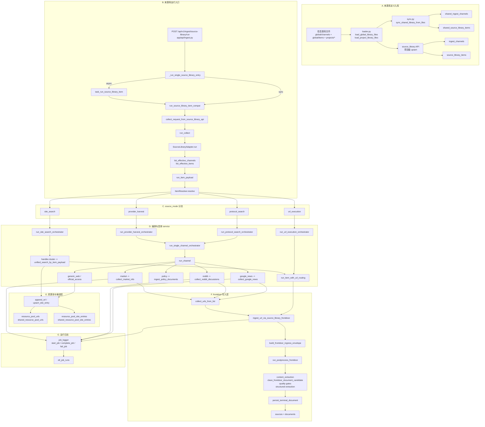
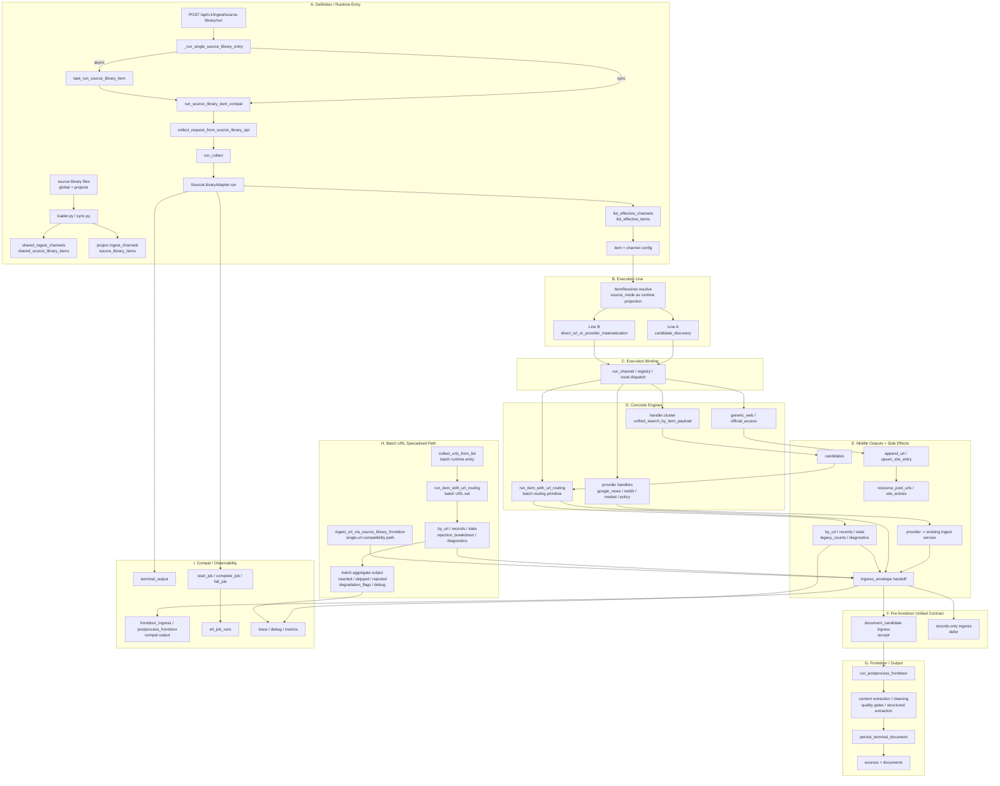
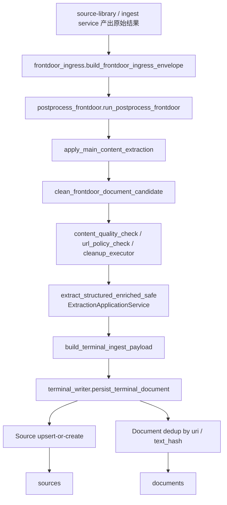

# 来源库到入库 Service 全链路调查（2026-03-25）

## 目的

梳理本项目从“来源库定义 / 来源项执行 / 候选 URL 生成 / frontdoor 清洗抽取 / 数据库写入”这一整条链路上的 service、关键函数、分流点与最终落表。

本调查聚焦：

- 来源库定义如何进入数据库
- 来源库 run 如何进入 collect runtime
- 各 source mode 如何分流到不同 service
- 哪些 service 只产出候选，哪些 service 会真正入库
- 最终写入哪些表

## 配套可视化文件

- 可编辑图：`2026-03-25-source-library-to-db-service-flow.drawio`
- 阅读图：`2026-03-25-source-library-to-db-service-flow.svg`

## 结论摘要

当前主链可拆成两段：

1. 来源库定义入库链
   - 文件定义来自 `信息源库/global` 与 `信息源库/projects/*`
   - 通过 `loader.py` + `sync.py` 写入 `shared_ingest_channels` / `shared_source_library_items`
   - 项目级来源项则通过 API 写入 `ingest_channels` / `source_library_items`

2. 来源库执行入库链
   - 入口是 `/api/v1/ingest/source-library/run`
   - 中间经过 `collect_runtime` 的 `SourceLibraryAdapter`
   - 核心分流点是 `run_item_payload -> ItemResolver.resolve`
   - 最终会走向四种 source mode：
     - `protocol_search`
     - `provider_harvest`
     - `site_search`
     - `url_execution`
   - 真正统一写文档的公共落点是：
     - `build_frontdoor_ingress_envelope`
     - `run_postprocess_frontdoor`
     - `persist_terminal_document`

一个重要事实是：

- 不是所有 source-library adapter 都直接写库
- `handler.cluster` / `url_pool` 更偏向 collect-only，先产生候选 URL 或 terminal records，再由 frontdoor 落库
- `google_news` / `reddit` / `market` 等 adapter 实际会跳转到已有 ingest service，而这些 service 内部又会通过 `collect_urls_from_list` 或 `run_postprocess_frontdoor` 完成写库

## 总体流程图

## 预期总图（兼容结构修改 1 + 结构修改 2）

下面这张图不是“当前代码图”，而是基于
[2026-03-25-ingest-structure-clarification-log.md](./2026-03-25-ingest-structure-clarification-log.md)
里两次结构澄清之后，整理出来的“预期收敛总图”。

它强调的不是某个单点 service，而是：

- definition/runtime entry 要显式保留
- `source_mode` 更适合作为 runtime projection，而不是最终主分层
- `run_item_with_url_routing(...)` 要从“单 URL wrapper 内部细节”提升为可见的 batch routing primitive
- frontdoor 前统一 contract 是 `ingress_envelope`
- `candidates / records / by_url / diagnostics` 与 resource pool side effects 必须保留
- `terminal_output / compat output / job logging / etl_job_runs` 必须作为独立 observability 面存在

## 与当前 draw.io 对照

当前
[2026-03-25-source-library-to-db-service-flow.drawio](./2026-03-25-source-library-to-db-service-flow.drawio)
第一页表达的是“现状代码图”；新增的预期总图应当和它这样对照理解：

1. 当前图里的 `C. source_mode 分流` 仍然保留，但在预期图里被降级为 `runtime projection`，不再被当作最终主架构层。
2. 当前图里的 `D. 编排与具体 service` 在预期图里被拆成 `Execution Binding` 和 `Concrete Engines` 两层，避免把 `run_channel(...)`、`handler.cluster`、`provider handlers` 混成同一层。
3. 当前图里的 `E. 资源池与候选层` 在预期图里扩大为 `Middle Outputs + Side Effects`，显式纳入 `candidates / records / by_url / diagnostics`，不只画资源池写入。
4. 当前图里的 `F. frontdoor 写入层` 在预期图里被拆成两层：
   `Pre-frontdoor Unified Contract`
   和
   `Frontdoor / Output`
   这样能明确 `ingress_envelope` 才是统一 contract，而不是把 `build_frontdoor_ingress_envelope` 当成普通步骤。
5. 当前图把 `collect_urls_from_list -> ingest_url_via_source_library_frontdoor -> run_item_with_url_routing` 画成主路径；预期图则把它改成：
   `collect_urls_from_list -> run_item_with_url_routing -> middle outputs -> ingress_envelope`
   同时把 `ingest_url_via_source_library_frontdoor` 降为 single-url compatibility path。
6. 当前图里的 `G. 运行日志` 只画了 job logging；预期图把它扩成 `Compat / Observability`，把 `terminal_output`、compat output、trace/debug/stats 一并纳入。
7. 当前图里的 `B. 来源库运行入口` 主要表现调用顺序；预期图强调这一层不仅是顺序入口，还是必须保留的 runtime boundary，不能在重构时被抽象掉。

## 细化写入图

## 分阶段 Service 清单

### 1. 来源库定义层

#### 文件加载

- `app/services/source_library/loader.py`
  - `load_global_library_files`
  - `load_project_library_files`

职责：

- 从 `信息源库/global/channels`
- `信息源库/global/items`
- `信息源库/projects/<project_key>/channels`
- `信息源库/projects/<project_key>/items`
  读取 JSON / YAML 定义

#### 定义同步

- `app/services/source_library/sync.py`
  - `sync_shared_library_from_files`

写入表：

- `shared_ingest_channels`
- `shared_source_library_items`

项目级来源项不走这个函数，通常走 `source_library` API 写入：

- `ingest_channels`
- `source_library_items`

### 2. 运行入口层

#### API 入口

- `app/api/ingest.py`
  - `ingest_source_library_run`
  - `_run_single_source_library_entry`
  - `ingest_source_library_sync`

这里完成：

- 校验 `project_key`
- 组装 `override_params`
- 支持单 item、handler cluster、批量 items
- 支持 sync / async

#### 异步任务层

- `app/services/tasks.py`
  - `task_run_source_library_item`
  - `task_ingest_url_via_source_library`
  - `task_ingest_market`
  - `task_collect_policy_regulation`
  - `task_collect_data_api`

这些任务本身不是主要业务逻辑层，更多是 Celery 封装与 project schema 绑定层。

### 3. collect runtime 层

- `app/services/collect_runtime/runtime.py`
  - `run_collect`
  - `collect_request_from_source_library_api`
  - `run_source_library_item_compat`
  - `collect_request_from_market_api`
  - `collect_request_from_policy_api`

职责：

- 把 API payload 标准化成 `CollectRequest`
- 选路到对应 adapter
- 对 `search.market/search.policy` 做 auto-batch
- 保留 legacy / workflow 边界开关

#### source_library collect adapter

- `app/services/collect_runtime/adapters/source_library.py`
  - `SourceLibraryAdapter.run`
  - `to_source_library_response`

职责：

- 起 job log
- 取有效 channel / item
- 调用 `run_item_payload`
- 把运行结果包装成 terminal output / frontdoor ingress / postprocess 兼容结构

注意：

- 这里生成的 `frontdoor_ingress` / `postprocess_frontdoor` 默认是兼容输出，不一定已经真正执行 writer
- 真正的文档写入仍要看下游具体链路是否走 `run_postprocess_frontdoor(..., run_writer=True)`

### 4. item 解析与 source_mode 决策层

- `app/services/source_library/resolver.py`
  - `list_effective_channels`
  - `list_effective_items`
  - `run_item_payload`
  - `run_item_with_url_routing`

- `app/services/source_library/item_resolver.py`
  - `ItemResolver.resolve`

`run_item_payload` 做了几件关键事：

1. 合并参数
   - `item.params`
   - `ingest_config.social_forum`
   - `override_params`
2. 根据 item/channel/urls/site_entries/crawler provider 决定 `source_mode`
3. 分流到不同 orchestrator

`ItemResolver.resolve` 的判定规则大意如下：

- 有 `candidate_urls` -> `url_execution`
- handler cluster 或存在 `site_entries` -> `site_search`
- `provider_type in {scrapy, crawlee, meltano}` -> `provider_harvest`
- 其他默认 `protocol_search`

### 5. orchestrator 层

#### single/protocol/provider

- `app/services/source_library/orchestrators/single_channel.py`
  - `run_single_channel_orchestrator`
- `app/services/source_library/orchestrators/protocol_search.py`
  - `run_protocol_search_orchestrator`
- `app/services/source_library/orchestrators/provider_harvest.py`
  - `run_provider_harvest_orchestrator`

这三条路最终都会落到：

- `run_channel`

并由 channel 的 `(provider, kind)` 找到真实 handler。

#### site_search

- `app/services/source_library/orchestrators/site_search.py`
  - `run_site_search_orchestrator`

这里主要走：

- `handler.cluster`
- `unified_search_by_item_payload`

用于：

- 从 site entry / search template / rss / sitemap / official api 生成候选 URL
- 可选写入 resource pool
- 可选自动触发 URL 入库

#### url_execution

- `app/services/source_library/orchestrators/url_execution.py`
  - `run_url_execution_orchestrator`

这里会走：

- `run_item_with_url_routing`

用于：

- 对单 URL 或 URL 列表按 domain / channel 做路由
- 产出 `records` 或 `by_url`
- 继续交给 frontdoor 执行真正写库

### 6. channel handler 层

注册中心：

- `app/services/source_library/handler_registry.py`

内置 handler：

- `app/services/source_library/adapters/__init__.py`

具体 handler 与下游 service：

| provider/kind | handler | 下游 service | 特征 |
|---|---|---|---|
| `google_news/news` | `handle_google_news` | `collect_google_news` | 新闻结果再转 URL frontdoor |
| `reddit/social` | `handle_reddit` | `collect_reddit_discussions` | Reddit 结果再转 URL frontdoor |
| `market/market` | `handle_market` | `collect_market_info` | 搜索结果可直接 frontdoor 写文档 |
| `policy/policy` | `handle_policy` | `ingest_policy_documents` | 政策类专用路径 |
| `url_pool/urls` | `handle_url_pool` | 原地抓正文预览 | terminal-output-only 候选层 |
| `handler/cluster` | `handle_handler_cluster` | `unified_search_by_item_payload` | 站点发现 / 候选生成 / 可自动 ingest |
| `generic_web/rss` | `handle_generic_web_rss` | `execute_feed_probe` | 候选 URL，可写资源池 |
| `generic_web/sitemap` | `handle_generic_web_sitemap` | `execute_sitemap_probe` | 候选 URL，可写资源池 |
| `generic_web/search_template` | `handle_generic_web_search_template` | `execute_search_template` | 候选 URL，可写资源池 |
| `official_access/api` | `handle_official_access_api` | 官方 API 搜索 | 候选 URL / API 搜索结果 |

### 7. 资源池层

#### URL 池

- `app/services/resource_pool/extract.py`
  - `append_url`
  - `extract_from_documents`

- `app/services/resource_pool/resolver.py`
  - `list_urls`

表：

- `resource_pool_urls`
- `shared_resource_pool_urls`

#### site entry 池

- `app/services/resource_pool/site_entries.py`
  - `list_site_entries`
  - `upsert_site_entry`
  - `get_site_entry_by_url`

表：

- `resource_pool_site_entries`
- `shared_resource_pool_site_entries`

#### site search / candidate 生成

- `app/services/resource_pool/unified_search.py`
  - `unified_search_by_item_payload`

这个 service 在 `handler.cluster` 路径里非常关键，职责包括：

- 读取 item 绑定的 site entries
- 按 entry_type 选择 rss / sitemap / search_template / official api 等策略
- 生成 candidate URLs
- 可选 `write_to_pool`
- 可选 `auto_ingest`

当 `auto_ingest=True` 时，会继续调用：

- `ingest.url_pool.collect_urls_from_list`

也就是说它不仅能“找候选”，也能直接推进到“抓正文+入库”。

### 8. frontdoor 层

#### ingress envelope

- `app/services/ingest/frontdoor_ingress.py`
  - `build_frontdoor_ingress_envelope`
  - `build_source_library_ingress_envelope`
  - `build_raw_import_ingress_envelope`

职责：

- 统一不同来源的输入合同
- 区分 `source_library / raw_import / discovery`
- 记录 `entrypoint / source_mode / source_ref / payload_hash`

#### postprocess

- `app/services/ingest/postprocess_frontdoor.py`
  - `run_postprocess_frontdoor`

这是主入库前门，负责：

- content extraction
- frontdoor cleaning
- quality gate / meaningful gate
- cleanup / retry observability
- structured extraction
- normalized terminal payload
- 调用 writer

#### writer

- `app/services/ingest/terminal_writer.py`
  - `persist_terminal_document`

职责：

- 先 `get_or_create Source`
- 用 `uri` / `text_hash` 去重
- 插入 `Document`

最终写入表：

- `sources`
- `documents`

### 9. 典型入口链路

#### 9.1 `/ingest/source-library/run`

主链：

`ingest_source_library_run`
-> `_run_single_source_library_entry`
-> `run_source_library_item_compat`
-> `run_collect`
-> `SourceLibraryAdapter.run`
-> `run_item_payload`
-> `ItemResolver.resolve`
-> `orchestrator`
-> `handler/service`
-> `frontdoor`
-> `persist_terminal_document`

#### 9.2 `/ingest/market`

主链：

`ingest_market`
-> `collect_request_from_market_api`
-> `run_collect`
-> `SearchMarketAdapter.run`
-> `collect_market_info`
-> `build_frontdoor_ingress_envelope`
-> `run_postprocess_frontdoor`
-> `persist_terminal_document`

另外，当搜索结果只有链接、抓不到正文时：

`collect_market_info`
-> `collect_urls_from_list`
-> `ingest_url_via_source_library_frontdoor`
-> `run_postprocess_frontdoor`
-> `persist_terminal_document`

#### 9.3 `/ingest/policy/regulation`

主链：

`ingest_policy_regulation`
-> `collect_request_from_policy_api`
-> `run_collect`
-> `SearchPolicyAdapter.run`
-> `collect_policy_and_regulation`
-> `run_postprocess_frontdoor`
-> `persist_terminal_document`

#### 9.4 `/ingest/data-api`

主链：

`ingest_data_api`
-> `SocialIngestApplicationService.collect_data_api`
-> `collect_user_social_sentiment`
-> `run_postprocess_frontdoor`
-> `persist_terminal_document`

#### 9.5 新闻 / Reddit / Google News

这里不是直接在 handler 内落库，而是：

`collect_google_news` / `collect_reddit_discussions`
-> `_dispatch_links_via_source_library_frontdoor`
-> `collect_urls_from_list`
-> `ingest_url_via_source_library_frontdoor`
-> `run_postprocess_frontdoor`
-> `persist_terminal_document`

所以这两类入口本质上也被收敛到了：

- `url_routing/source_library_frontdoor`
- `postprocess_frontdoor`

### 10. 运行日志与任务状态

- `app/services/job_logger.py`
  - `start_job`
  - `complete_job`
  - `fail_job`
  - `update_job_tracking`
  - `list_jobs`

表：

- `etl_job_runs`

注意：

- `etl_job_runs` 记录的是运行状态、参数、外部 provider job id 等
- 它不是文档业务数据表，但几乎所有采集 service 都会写它

## 最终落表清单

### 文档主表

- `sources`
- `documents`

### 运行与任务表

- `etl_job_runs`

### 来源库定义表

- `shared_ingest_channels`
- `shared_source_library_items`
- `ingest_channels`
- `source_library_items`
- `ingest_config`

### 资源池表

- `resource_pool_urls`
- `shared_resource_pool_urls`
- `resource_pool_site_entries`
- `shared_resource_pool_site_entries`

## 哪些 service 是“只产出候选”，哪些会“真正写库”

### 只产出候选 / 中间结果

- `handle_url_pool`
- `run_item_with_url_routing` 的 terminal-output-only 路径
- `handle_generic_web_*`
- `handle_official_access_api`
- `unified_search_by_item_payload` 在 `auto_ingest=False` 时
- `SourceLibraryAdapter.to_source_library_response` 里的兼容 `frontdoor_ingress/postprocess_frontdoor`

### 会真正写 `documents`

- `collect_market_info`
- `collect_policy_and_regulation`
- `collect_user_social_sentiment`
- `ingest_url_via_source_library_frontdoor`
- `collect_urls_from_list`
- `collect_urls_from_pool`
- `run_raw_import_documents`
- 上述 service 内部共同依赖的 `run_postprocess_frontdoor + persist_terminal_document`

## 当前架构最值得注意的边界

### 边界 1：source_library 运行层和真正 writer 分离

来源库执行并不等价于“已经写文档”。

很多路径只会先产出：

- terminal output
- records
- candidates
- resource pool side effects

只有继续进入：

- `ingest_url_via_source_library_frontdoor`
- `run_postprocess_frontdoor(run_writer=True)`

才会真正进入 `documents`。

### 边界 2：资源池是中间层，不是最终文档层

`resource_pool_urls` / `resource_pool_site_entries` 存的是：

- 候选 URL
- site template
- source capability

这些表帮助后续抓取与扩充来源，但不等价于最终业务文档。

### 边界 3：frontdoor 是统一写入门

虽然入口很多，但主入库门基本已经收敛到：

- `build_frontdoor_ingress_envelope`
- `run_postprocess_frontdoor`
- `persist_terminal_document`

这也是当前最应该重点维护和观测的链路。

## 关键证据文件

- `main/backend/app/api/ingest.py`
- `main/backend/app/services/tasks.py`
- `main/backend/app/services/collect_runtime/runtime.py`
- `main/backend/app/services/collect_runtime/adapters/source_library.py`
- `main/backend/app/services/source_library/resolver.py`
- `main/backend/app/services/source_library/item_resolver.py`
- `main/backend/app/services/source_library/runner.py`
- `main/backend/app/services/source_library/adapters/*.py`
- `main/backend/app/services/resource_pool/unified_search.py`
- `main/backend/app/services/resource_pool/extract.py`
- `main/backend/app/services/resource_pool/site_entries.py`
- `main/backend/app/services/resource_pool/resolver.py`
- `main/backend/app/services/ingest/frontdoor_ingress.py`
- `main/backend/app/services/ingest/postprocess_frontdoor.py`
- `main/backend/app/services/ingest/terminal_writer.py`
- `main/backend/app/services/ingest/url_pool.py`
- `main/backend/app/services/ingest/market_web.py`
- `main/backend/app/services/ingest/social.py`
- `main/backend/app/services/ingest/news.py`
- `main/backend/app/models/entities.py`

## 建议的后续阅读顺序

1. 先看本文件两张图
2. 再看 `app/api/ingest.py` 的 source-library、market、policy、data-api 入口
3. 再看 `collect_runtime/runtime.py` 和 `collect_runtime/adapters/source_library.py`
4. 再看 `source_library/resolver.py` 的 `run_item_payload`
5. 最后看 `postprocess_frontdoor.py` 和 `terminal_writer.py`

这样能最快把“入口多、写口单”的整体结构看明白。
