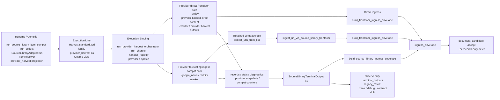

# Source-Library Harvest Chain Expanded

Updated: 2026-03-26 PST

This file is the markdown companion for:

- [2026-03-26-source-library-harvest-chain-expanded.drawio](./2026-03-26-source-library-harvest-chain-expanded.drawio)

## Core Rule

`Harvest` is the peer standardized collection family to `Search`.

It should not be over-flattened into one generic provider box. In current reality, `Harvest` still contains two visible internal execution sub-lines:

1. provider direct-frontdoor path
2. provider to existing-ingest compat path

## Expanded Chain

1. Compile / runtime projection
- `run_source_library_item_compat`
- `run_collect`
- `SourceLibraryAdapter.run`
- `ItemResolver`
- `ExecutionRequest`
- `provider_harvest` as runtime projection

2. Execution line
- `Harvest` standardized family
- runtime-visible view:
  - `provider_harvest`

3. Execution binding
- `run_provider_harvest_orchestrator`
- `run_channel`
- `handler_registry`
- provider dispatch

4. Internal sub-line A: provider direct-frontdoor path
- concrete engines:
  - `policy`
  - provider-backed direct content
  - crawler / provider harvest outputs
- retained direct ingress path:
  - `build_frontdoor_ingress_envelope`

5. Internal sub-line B: provider to existing-ingest compat path
- concrete engines:
  - `google_news`
  - `reddit`
  - `market`
- retained compat chain:
  - `collect_urls_from_list`
  - `ingest_url_via_source_library_frontdoor`
  - `build_frontdoor_ingress_envelope`

6. Middle outputs + side effects
- `records`
- fetch stats / diagnostics
- provider snapshots
- compat counters when retained
- provider to existing ingest-service side paths
- direct frontdoor handoff
- optional resource-pool side paths when applicable

7. Boundary
- `SourceLibraryTerminalOutput v1`
- `build_source_library_ingress_envelope`
- `ingress_envelope`
- legal ingress forms:
  - `document_candidate accept`
  - `records-only defer`

8. Observability
- `terminal_output`
- `legacy_result`
- trace / debug / metrics
- family-level contract drift checks

## Mermaid Copy

