# Source-Library / Ingest Expected Flow v2

Updated: 2026-03-26 PST

## Purpose

This file is the markdown companion for:

- [2026-03-26-source-library-ingest-expected-flow-v2.drawio](./2026-03-26-source-library-ingest-expected-flow-v2.drawio)

This version keeps the call graph granular.
The goal is not to summarize layers into big boxes, but to keep the actual call chain visible while still showing where shared called services converge.

## Core Rule

- `Search` and `Harvest` remain two upstream business chains.
- `protocol_search`, `site_search`, `url_execution`, and `provider_harvest` remain runtime-visible views.
- The real merge target is the shared called-service layer under those views.
- Shared called services should still be shown as individual nodes, not as one summary node.

## Node-level Call Chain

### 1. Definition / Runtime Entry

- `loader.py`
- `sync.py`
- `shared_ingest_channels`
- `shared_source_library_items`
- `POST /api/v1/ingest/source-library/run`
- `_run_single_source_library_entry`
- `task_run_source_library_item`
- `run_source_library_item_compat`
- `collect_request_from_source_library_api`
- `run_collect`
- `SourceLibraryAdapter.run`
- `list_effective_channels`
- `list_effective_items`
- `run_item_payload`
- `ItemResolver.resolve`

### 2. Upstream Runtime Views

Search-side runtime views:

- `protocol_search`
- `site_search`
- `url_execution`

Harvest-side runtime view:

- `provider_harvest`

### 3. Chain-specific Orchestrators

Search-side orchestrators:

- `run_protocol_search_orchestrator`
- `run_site_search_orchestrator`
- `run_url_execution_orchestrator`

Harvest-side orchestrator:

- `run_provider_harvest_orchestrator`

### 4. Shared Orchestration Services

- `run_single_channel_orchestrator`
- `run_channel`
- `handler_registry`
- route dispatch
- provider dispatch

### 5. Concrete Functions And Branches

Provider-backed compat functions:

- `google_news -> collect_google_news`
- `reddit -> collect_reddit_discussions`
- `market -> collect_market_info`

Direct provider function:

- `policy -> ingest_policy_documents`

Search discovery functions:

- `handler.cluster`
- `unified_search_by_item_payload`
- `generic_web.rss`
- `generic_web.sitemap`
- `generic_web.search_template`
- `official_access.api`

Shared materialization helpers:

- `collect_urls_from_list`
- `ingest_url_via_source_library_frontdoor`
- `run_item_with_url_routing`

### 6. Middle Outputs And Side Effects

Search-side outputs:

- `candidates`
- `by_url`
- `records`
- `record_meta.artifact_ref`
- `source_artifacts`
- `stats`
- `legacy_counts`
- `diagnostics`
- `rejection_breakdown`
- `degradation_flags`

Search-side side effects:

- `append_url`
- `upsert_site_entry`
- `resource_pool_urls`
- `resource_pool_site_entries`

Harvest-side outputs:

- `records`
- fetch stats
- provider snapshots
- compat counters

### 7. Shared Convergence Services

- `SourceLibraryTerminalOutput v1`
- `build_source_library_ingress_envelope`
- `build_frontdoor_ingress_envelope`
- `ingress_envelope`

Legal ingress forms:

- `document_candidate accept`
- `records-only defer`

Artifact expectation at the same boundary:

- if a materialized source record has a primary PDF payload, the
  source-library path may attach a local-file artifact before frontdoor
  convergence
- the artifact should remain visible in both
  `records[].record_meta.artifact_ref` and
  `ingress_envelope.collection_payload.source_artifacts`
- the minimum retained fields are `local_path`, `sha256`, `byte_size`,
  `mime_type`, and `source_locator`

Direct frontdoor callers still remain explicit:

- `market_web`
- `social`
- `policy`
- `raw_import`
- `discovery`

### 8. Frontdoor / Output / Observability

- `run_postprocess_frontdoor`
- content extraction
- clean candidate
- quality gates
- structured extraction
- `build_terminal_ingest_payload`
- `apply_terminal_compat`
- `persist_terminal_document`
- `sources`
- `documents`

Observability:

- `job_logger`
- `etl_job_runs`
- `terminal_output`
- `legacy_result`
- trace
- debug
- metrics
- contract drift monitoring

## Mermaid Copy

```mermaid
flowchart LR

  A1["loader.py"] --> A2["sync.py"]
  A2 --> A3["shared_ingest_channels"]
  A2 --> A4["shared_source_library_items"]

  B1["POST /api/v1/ingest/source-library/run"] --> B2["_run_single_source_library_entry"]
  B2 --> B3["task_run_source_library_item"]
  B2 --> B4["run_source_library_item_compat"]
  B3 --> B4
  B4 --> B5["collect_request_from_source_library_api"]
  B5 --> B6["run_collect"]
  B6 --> B7["SourceLibraryAdapter.run"]
  B7 --> B8["list_effective_channels"]
  B7 --> B9["list_effective_items"]
  B8 --> B10["run_item_payload"]
  B9 --> B10
  B10 --> B11["ItemResolver.resolve"]

  B11 --> C1["protocol_search"]
  B11 --> C2["site_search"]
  B11 --> C3["url_execution"]
  B11 --> C4["provider_harvest"]

  C1 --> D1["run_protocol_search_orchestrator"]
  C2 --> D2["run_site_search_orchestrator"]
  C3 --> D3["run_url_execution_orchestrator"]
  C4 --> D4["run_provider_harvest_orchestrator"]

  D1 --> E1["run_single_channel_orchestrator"]
  D4 --> E1
  E1 --> E2["run_channel"]
  E2 --> E3["handler_registry"]
  E3 --> E4["route dispatch"]
  E3 --> E5["provider dispatch"]

  E4 --> F1["google_news -> collect_google_news"]
  E4 --> F2["reddit -> collect_reddit_discussions"]
  E4 --> F3["market -> collect_market_info"]

  E5 --> F4["policy -> ingest_policy_documents"]

  D2 --> G1["handler.cluster"]
  G1 --> G2["unified_search_by_item_payload"]
  G2 --> G3["generic_web.rss"]
  G2 --> G4["generic_web.sitemap"]
  G2 --> G5["generic_web.search_template"]
  G2 --> G6["official_access.api"]
  G2 --> G7["candidates"]

  G3 --> H1["append_url"]
  G4 --> H1
  G5 --> H1
  G6 --> H2["upsert_site_entry"]
  H1 --> H3["resource_pool_urls"]
  H2 --> H4["resource_pool_site_entries"]

  G7 --> I1["run_item_with_url_routing"]
  D3 --> I1
  I1 --> I2["by_url"]
  I1 --> I3["records"]
  I1 --> I4["stats"]
  I1 --> I5["legacy_counts"]
  I1 --> I6["diagnostics"]
  I1 --> I7["rejection_breakdown"]
  I1 --> I8["degradation_flags"]

  F1 --> J1["collect_urls_from_list"]
  F2 --> J1
  F3 --> J1
  J1 --> J2["ingest_url_via_source_library_frontdoor"]

  I3 --> K1["SourceLibraryTerminalOutput v1"]
  K1 --> K2["build_source_library_ingress_envelope"]
  J2 --> K3["build_frontdoor_ingress_envelope"]
  F4 --> K3

  L1["market_web"] --> K3
  L2["social"] --> K3
  L3["policy"] --> K3
  L4["raw_import"] --> K3
  L5["discovery"] --> K3

  K2 --> M1["ingress_envelope"]
  K3 --> M1
  M1 --> M2["document_candidate accept"]
  M1 --> M3["records-only defer"]

  M2 --> N1["run_postprocess_frontdoor"]
  N1 --> N2["content extraction"]
  N2 --> N3["clean candidate"]
  N3 --> N4["quality gates"]
  N4 --> N5["structured extraction"]
  N5 --> N6["build_terminal_ingest_payload"]
  N6 --> N7["apply_terminal_compat"]
  N7 --> N8["persist_terminal_document"]
  N8 --> N9["sources"]
  N8 --> N10["documents"]

  J2 --> O1["job_logger"]
  O1 --> O2["etl_job_runs"]
  K1 --> O3["terminal_output"]
  K1 --> O4["legacy_result"]
  N1 --> O5["trace / debug / metrics"]
  N1 --> O6["contract drift monitoring"]
```

## Rule For Future Files

For this topic, any future flowchart-oriented file should keep:

1. a `.drawio` file
2. a markdown text companion containing the same architecture summary

This is required so the context does not disappear into diagram-only files.
