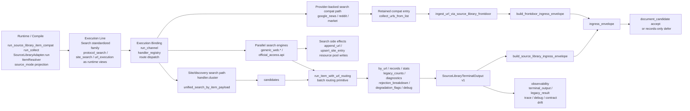

# Source-Library Search Chain Expanded

Updated: 2026-03-26 PST

This file is the markdown companion for:

- [2026-03-26-source-library-search-chain-expanded.drawio](./2026-03-26-source-library-search-chain-expanded.drawio)

## Core Rule

`Search` is one standardized collection family.

`protocol_search`, `site_search`, and `url_execution` remain visible as runtime views inside `Search`, but they are not separate top-level standardized services.

The family should be read as two internal execution sub-lines:

1. provider-backed search compat path
2. site/discovery search plus URL materialization path

## Expanded Chain

1. Compile / runtime projection
- `POST /api/v1/ingest/source-library/run`
- `run_source_library_item_compat`
- `run_collect`
- `SourceLibraryAdapter.run`
- `ItemResolver`
- `ExecutionRequest`
- `source_mode` as runtime projection

2. Execution line
- `Search` standardized family
- runtime-visible views:
  - `protocol_search`
  - `site_search`
  - `url_execution`

3. Execution binding
- `run_channel`
- `handler_registry`
- route dispatch

4. Internal sub-line A: provider-backed search compat path
- concrete engines:
  - `google_news`
  - `reddit`
  - `market`
- retained compat entry:
  - `collect_urls_from_list`
  - `ingest_url_via_source_library_frontdoor`
  - `build_frontdoor_ingress_envelope`

5. Internal sub-line B: site/discovery search + URL materialization
- concrete engines:
  - `handler.cluster`
  - `unified_search_by_item_payload`
  - `generic_web.rss`
  - `generic_web.sitemap`
  - `generic_web.search_template`
  - `official_access.api`
- middle outputs before materialization:
  - `candidates`
- core materialization stage:
  - `run_item_with_url_routing`
  - batch routing primitive
  - per-URL routing / timeout / fallback / crawler fallback

6. Middle outputs + side effects
- `by_url`
- `records`
- `stats / legacy_counts / diagnostics`
- `rejection_breakdown / degradation_flags / debug`
- `append_url / upsert_site_entry`
- `resource_pool_urls / resource_pool_site_entries`

7. Boundary
- `SourceLibraryTerminalOutput v1`
- `build_source_library_ingress_envelope`
- `ingress_envelope`
- legal ingress forms:
  - `document_candidate accept`
  - `records-only defer`

8. Observability
- `terminal_output`
- `legacy_result`
- trace / debug / metrics
- family-level contract drift checks

## Mermaid Copy

