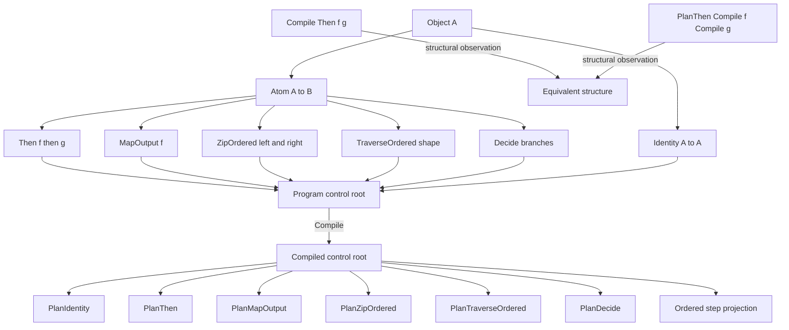
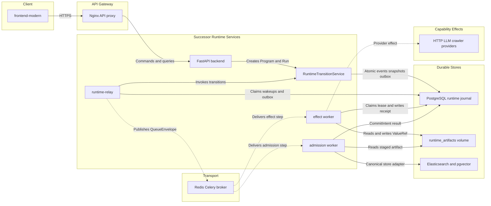
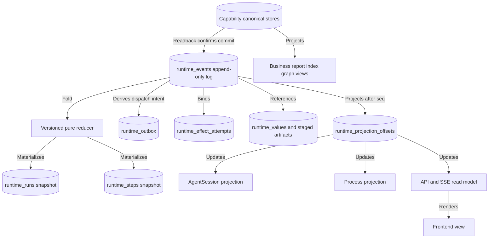
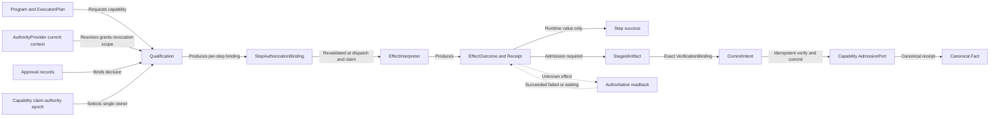
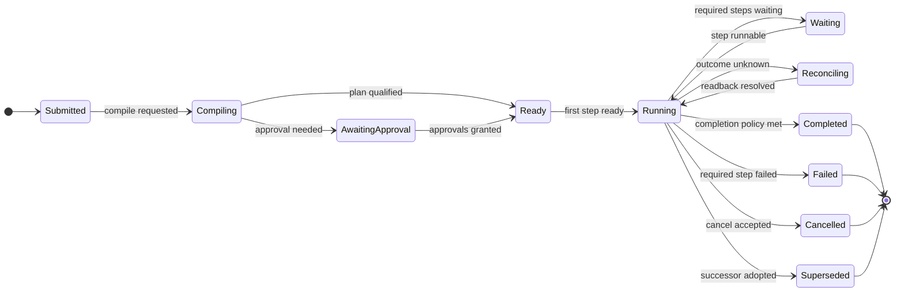
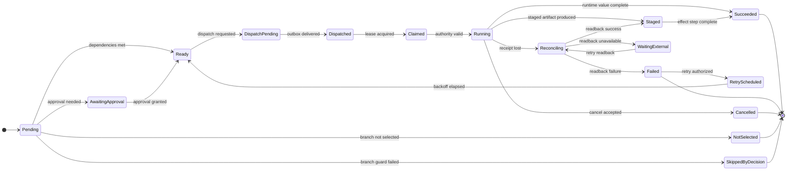

# MRW 函子化后继架构图集（已被替代的历史审阅稿）

Status: `SUPERSEDED_NON_NORMATIVE_EVIDENCE · NOT_FROZEN · MUST_NOT_AUTHORIZE_IMPLEMENTATION`

Source architecture:

`development/latest-dev-docs/development-plans/CURRENT_DEV/2026-08-30-functorial-successor-migration/06_functorial-successor-runtime-architecture-correction.draft.zh-CN.md`

本图集保留为旧 runtime-relay/outbox/fixed-worker 设计的历史证据，已由 `08_symmetric-functorial-architecture-diagram-atlas.draft.zh-CN.md` 替代。其 topology、StepState、synthetic P0-D 和固定 C1-first 顺序均不再具有规范效力；实现、冻结、迁移、canonical write、cutover 或 legacy retirement 均不得引用本文件授权。

## 图 1：最小生成形式

目的：显示新系统从函子化程序对象出发，而不是从 queue、worker 或旧 service 出发。

```mermaid
flowchart LR
    objectTypes["Typed ObjectTypes"] -->|"form"| programAst["Program AST"]
    capabilityAlgebra["Capability Algebra"] -->|"supplies Atoms"| programAst
    programAst -->|"Compile"| executionPlan["ExecutionPlan"]
    executionPlan -->|"Qualify"| qualifiedPlan["QualifiedPlan"]
    qualifiedPlan -->|"Create durable run"| runtimeState["Durable Runtime State"]
    runtimeState -->|"Interpret steps"| effectOutcome["EffectOutcome and ValueRef"]
    effectOutcome -->|"Stage when required"| stagedArtifact["StagedArtifact"]
    stagedArtifact -->|"Verify and admit"| canonicalFact["Capability Canonical Fact"]
    runtimeState -->|"Project"| runtimeViews["Runtime Read Models"]
    canonicalFact -->|"Project"| businessViews["Business Read Models"]
    effectOutcome -.->|"Failure or unknown"| reconciliation["Reconciliation"]
    reconciliation -.->|"Resume or supersede"| runtimeState
```

箭头语义：`form` 构造对象；`Compile` 保持恒等与有序复合；`Qualify` 判断当前执行资格；`Interpret` 实现 effect；`admit` 写入 capability-owned canonical store；`Project` 只产生派生视图。

应保持：typed input/output、Program identity、ordered composition、failure/return、authority、provenance、canonical incarnation。

不声称：runtime success 等于业务正确；Program description 自动授予执行权；所有结果都必须 canonical admission。

## 图 2：函子化 Program AST 与编译保持

目的：审核新架构是否真的以函子式程序构造为基底，而不是通用字典字段。

箭头语义：AST 节点构造 typed morphism；`Compile` 映射到对应 compiled control node；step list 只是 scheduler projection；最后两条路径要求 `NormalizedPlanStructure.v1` 等价。

应保持：`Identity`、`Then` 有序组合、`MapOutput` transform identity、Zip 左右位置、Traverse 形状顺序、Decide 未选分支、ReturnContract 和 source map。

不声称：Zip 默认并行或交换；任意 Python callable 可以持久化；Compile 执行 effect。

## 图 3：Greenfield 包与依赖方向

目的：确保新内核另起炉灶，旧 MRW 代码只能通过包外迁移桥接入。

```mermaid
flowchart TD
    subgraph successorRuntime ["app.successor_runtime"]
        domain["domain: objects AST reducer laws"]
        compiler["compiler: normalize validate compile"]
        application["application: transition qualification admission"]
        runtime["runtime: scheduler lease reconcile"]
        ports["ports: store queue effect authority"]
        nativeInterpreters["successor native interpreters"]
        infrastructure["infrastructure: Postgres Celery blob metrics"]
        projections["projections and API adapters"]

        compiler -->|"imports"| domain
        application -->|"imports"| domain
        application -->|"depends on"| ports
        runtime -->|"imports"| domain
        runtime -->|"depends on"| ports
        nativeInterpreters -->|"implements"| ports
        infrastructure -->|"implements"| ports
        projections -->|"reads DTO"| application
    end

    subgraph migrationBridge ["app.successor_migration"]
        eligibility["FunctorizationEligibility"]
        legacyAdapters["Legacy interpreter adapters"]
        parityHarness["Legacy successor parity harness"]
    end

    subgraph legacySystem ["Existing MRW services"]
        workflowLegacy["workflow_graph"]
        sourceLegacy["source_library and collect_runtime"]
        agentLegacy["agent_batch sessions AgentCore"]
        contentLegacy["ingest knowledge writing report graph"]
    end

    legacyAdapters -->|"implements successor Port"| ports
    legacyAdapters -->|"calls"| workflowLegacy
    legacyAdapters -->|"calls"| sourceLegacy
    legacyAdapters -->|"calls"| agentLegacy
    legacyAdapters -->|"calls"| contentLegacy
    eligibility -->|"classifies"| legacyAdapters
    parityHarness -->|"compares observations"| legacyAdapters
```

箭头语义：新包内部只向纯 domain/Port 收敛；具体基础设施实现 Port；sibling migration adapter 同时连接新 Port 与旧 service。

应保持：`successor_runtime/**` 可在不 import legacy service 时独立 import、compile、测试和运行 synthetic capability。

不声称：旧 service 是新架构 foundation；通过 adapter 即表示能力已经迁移。

## 图 4：生产运行时部署拓扑

目的：显示 PostgreSQL 是 durable runtime authority，Redis/Celery 只是 at-least-once transport。

箭头语义：实线是同步 command/store interaction；虚线是异步 transport 或外部 effect。

应保持：run/step/event/outbox/lease/attempt 事实进入 PostgreSQL；queue duplicate 由 Postgres claim/idempotency 阻断；blob 由 digest 绑定。

不声称：broker ack 是 effect success；Celery result 是 canonical completion；worker 可以直接决定 run completion。

## 图 5：Runtime 真相源、snapshot 与投影

目的：审核是否存在第二真相源或 presentation 反向控制。

箭头语义：event log 经 reducer 产生 operational snapshot；projection offset 驱动可重建视图；canonical store readback 只确认 exact commit。

应保持：snapshot 和 event closure digest 一致；投影可删除重建；runtime facts 与 business canonical facts 分权。

不声称：run snapshot 是第二 event source；AgentSession/Process/UI 可以写回 scheduler；runtime journal拥有业务内容真相。

## 图 6：Authority、Effect 与 Admission 分离

目的：显示 Program、执行权限、effect outcome 和 canonical adoption 是四个不同边界。

箭头语义：qualification 产生当前 step binding；interpreter 只实现 effect；admission 只处理 compiler 已插入的 `CompiledAdmission`；reconciler 不重做 effect。

应保持：project scope digest、grant epoch、claim authority epoch、resource reservation、canonical base incarnation 和 content/event digest。

不声称：旧 qualification 永久有效；effect success 自动进入 canonical store；lease expiry 是 `NOT_STARTED` 证明。

## 图 7：Run 与 Step 状态机

目的：审核 run 聚合状态与 step/effect 状态是否混淆。

### 图 7A：Run 状态

### 图 7B：Step 状态

应保持：Run 只能由 required step/branch/ReturnContract fold；admission 是独立 compiled step；effect disposition 与 Step state 分离。

不声称：每个 Step success 都意味着 canonical admission；未选 branch 被执行或被删除。

## 图 8：第零阶段另起炉灶与后续迁移

目的：审核开发顺序是否从新函子架构出发，而不是先包旧代码。

```mermaid
flowchart LR
    freezeGate["F-1 architecture freeze"] -->|"authorizes"| phaseZeroA["P0-A Functorial kernel"]
    phaseZeroA -->|"typed AST and Compile laws"| phaseZeroB["P0-B Durable substrate"]
    phaseZeroB -->|"Postgres UoW outbox lease values"| phaseZeroC["P0-C Runtime realization"]
    phaseZeroC -->|"relay worker recovery"| phaseZeroD["P0-D Synthetic self-hosted closure"]
    phaseZeroD -->|"greenfield runtime proven"| eligibility["P1 FunctorizationEligibility"]
    eligibility -->|"ADAPT"| adapt["Sibling legacy adapter"]
    eligibility -->|"EXTRACT AND REWRITE"| extract["Extract objects and algebra"]
    eligibility -->|"REIMPLEMENT"| reimplement["New successor implementation"]
    eligibility -->|"REJECT"| reject["Keep out of successor"]
    adapt --> firstCapability["P2 C1 vertical migration"]
    extract --> firstCapability
    reimplement --> firstCapability
    firstCapability -->|"C1 parity and rollback"| middleCapabilities["P3 C2 to C6"]
    middleCapabilities -->|"durable write path stable"| finalCapabilities["P4 C7 to C9"]
    finalCapabilities -->|"canary and review"| assembly["P5 Assembly and cutover"]
```

箭头语义：F-1 只授予第零阶段；P0-A 至 P0-D 构造完全独立的新运行时；P1 才审查旧设施；C1 完成前不并行迁移 C2–C9。

应保持：新内核不 import legacy；迁移资格有证据；legacy/successor 单一 claim authority；rollback 不删除 successor events。

不声称：既有测试自动证明资格；adapter 即迁移完成；所有旧能力都必须进入新系统。

## 审阅问题

请重点确认：

1. 图 1–2 是否准确表达“函子化程序世界先于 runtime realization”？
2. 图 3 的 greenfield 包与 sibling migration bridge 是否符合“另起炉灶”？
3. 图 4 的 `runtime-relay`、普通 effect worker、admission worker 分工是否合理？
4. 图 5 中 runtime event log 与 capability canonical stores 的分权是否清楚？
5. 图 6 的 authority/effect/admission 分离是否过重或仍不够？
6. 图 7 的状态是否需要合并、拆分或增加人工暂停？
7. 图 8 的阶段顺序是否符合“第零阶段铺设新内核，之后逐项抽取迁移”？
