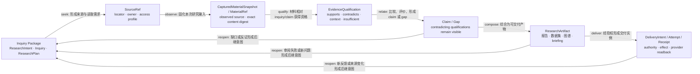
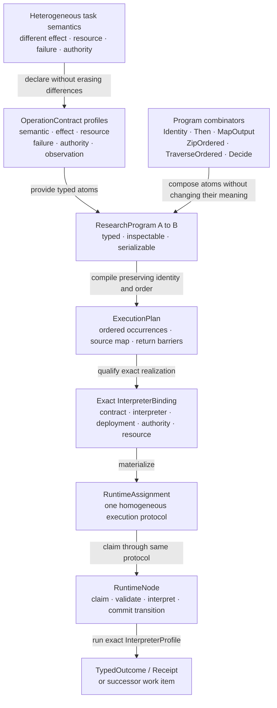
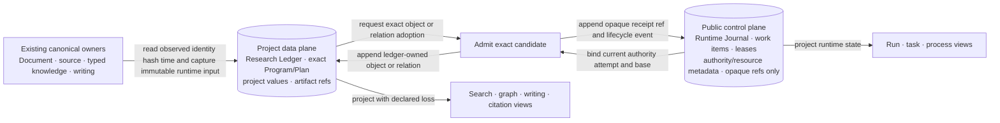
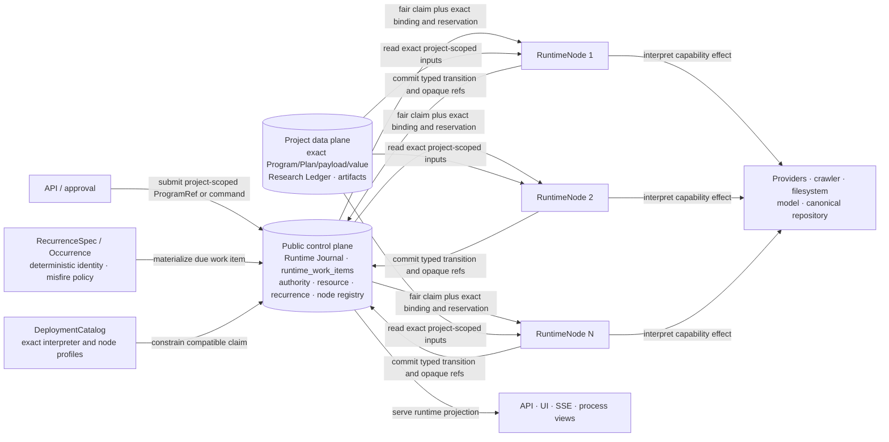
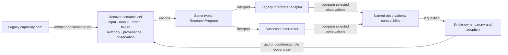

# MRW 综合信息研究后继架构主图集（审阅草稿）

Status: `FROZEN_NORMATIVE_ATLAS · USER_APPROVED_2026-08-30 · HASH_BOUND_BY_02_MANIFEST · DIAGRAMS_DO_NOT_SEPARATELY_AUTHORIZE_IMPLEMENTATION`

Architecture contract:

`06_functorial-successor-runtime-architecture-correction.draft.zh-CN.md`

Detailed implementation atlas:

`07_functorial-successor-architecture-diagram-atlas.draft.zh-CN.md`

本图集化简的是系统本身，而不是图的画法。MRW 的稳定定义不是“市场研究后台”或“任务编排平台”，而是：在项目作用域内，把研究意图通过可组合的信息发现、获取、结构化、判断和综合，转化为有来源、有不确定性记录、可继续修正的研究产物。

市场、政策、社交、商品、电商、报告等只是来源域；`source_library`、`ingest`、`workflow_graph`、`agent_core`、`writing`、`graph` 等是这一研究运动的现有实现或投影，不是后继架构的第一性模块。

## 图 1：综合信息研究的最小生成运动

目的：先说明项目在做什么，再派生程序、运行时和部署。



最小类型按三组组织：inquiry objects 是 `ResearchIntent/Inquiry/ResearchPlan`；research objects/relations 是 `SourceRef/MaterialRef/EvidenceQualification/Claim/Gap`；product/effect objects 是 `ResearchArtifact/DeliveryIntent/DeliveryAttempt/DeliveryReceiptRef`。`CounterEvidence` 是 contradicting qualification 的 bounded projection，`Finding/Insight` 只是 API/UI union projection；三者都不建立 canonical object identity。

八个基本运动：

- `frame`：把需求形成 inquiry、约束、计划、预算与停止条件；
- `seek`：从问题和计划形成来源、查询、读取或采集需求；
- `observe`：把外部或内部材料变成指向 canonical owner 的 `MaterialRef`；
- `qualify`：把材料相对于 inquiry/claim 的支持、反驳、语境或不足冻结为 `EvidenceQualification`；
- `relate`：比较、分类、抽取、验证、排序并形成 claim/gap/conflict；
- `compose`：把 findings 与 evidence 组合成报告、图谱、数据集或其他产物；
- `deliver`：在受众、格式、权限和不可逆行为约束下形成 intent、runtime attempt 和 provider-witnessed receipt；
- `reopen`：把缺口、反证、审阅意见或新问题变成显式 successor intent。

这不是固定流水线。任一运动可以是 `Identity`、有序复合、有限遍历、显式分支或后继程序；但 evidence provenance、project scope、失败、负结果和有序依赖不能消失。

## 图 2：研究语言如何生成现有能力

目的：用少数研究操作和组合子派生现有子系统，避免为每种来源、Agent 或报告再建一套工作流。



这里被消解的是异构任务的控制复杂性，不是内容差异。新增任务若只需新增 contract、codec、interpreter/profile 与测试，而无需修改 AST、compiler、reducer 或 work-item 根 schema，元语言扩展性才算成立。

现有模块的地位因此改变：

| 现有模块族 | 后继中的地位 |
| --- | --- |
| `resource_pool`、`source_library`、`discovery`、`search` | `seek` 的目录、查询和来源解释器 |
| `collect_runtime`、`crawlers`、`ingest`、provider adapters | `observe` 的 effect interpreters |
| `extraction`、`indexer`、`typed_knowledge`、`graph` | `EvidenceQualification/Claim` interpreter、admission 或 declared-loss projection |
| `workflow_graph`、`agent_batch`、`agent_core` | `ResearchProgram` 的构造、选择或解释策略 |
| `agent_sessions`、Process 页面 | runtime journal 的 read model，不是第二工作流真相 |
| `writing`、reports、exports | `compose`、artifact admission 与 delivery interpreter |
| API、frontend | command adapter 与 bounded projection |
| automation、timer、retry | canonical `RecurrenceSpec/Occurrence` 到同一 Program/assignment 的 materializer |

新增一种来源、模型、分析器或交付格式，只增加一个 atom/interpreter/codec/observation profile；不增加新的中央 manager、专用工作流栈或两两协议。

## 图 3：一个 Research Space，多种无控制权投影

目的：把来源、材料、证据、判断和产物收敛到一个项目级 identity/provenance substrate，同时保留运行事实与业务事实的权威边界。



`Project Research Space` 的基础关系是 `derived_from`、`supports`、`contradicts`、`answers`、`opens`、`cites`、`supersedes`。持久化层称为 `Research Ledger`；它只拥有 owner matrix 声明为 `CANONICAL_OWNED` 的对象与关系。对于 existing Document 等对象只保存 immutable ref，不复制内容。

`Runtime Journal` 只拥有执行生命周期事实。public control plane 不保存 Program/Plan/payload/value bytes，只保存 project-scoped opaque refs 与 digests。Elasticsearch、pgvector、graph、API、UI、AgentSession 和 dashboard 都是可重建投影，不得反向成为隐藏控制面。

## 图 4：由同构 RuntimeNode 实现的最小运行架构

目的：让高级程序语言真正减少进程角色、队列协议和运维成本。



所有 `RuntimeNode` 运行同一个循环，处理同一个 `RuntimeAssignment` 代数：

```text
COMPILE | QUALIFY | INTERPRET | VERIFY_ADMIT
PROJECT | RECONCILE | MATERIALIZE_SUCCESSOR
```

差异由 exact operation/interpreter binding、assignment type、current grant、effect/resource/failure profile 和 canonical authority 表达，不再由 `transition service`、`runtime-relay`、`effect worker`、`admission worker` 等固定进程类别表达。

`runtime_work_items` 通过 PostgreSQL `SELECT ... FOR UPDATE SKIP LOCKED` claim，但还必须实行 project/capability fair share、aging/starvation bound、claim-time resource reservation 和 interpreter/node-profile compatibility。相同协议的节点可水平扩容；节点可以使用不同 dependency/resource/security profile，但不形成新的状态机或完成语义。rolling deploy 中 `DRAINING` 节点停止新 claim，旧 profile 保留到 backlog/reconcile 完成。

Redis/Celery 不再是 greenfield core 的必需依赖。它们只作为 legacy/migration transport interpreter 或在容量证据要求外部 broker 时接入；接入后仍不得拥有完成、取消或 admission 事实。

以下能力仍完整保留在 substrate/assignment 语义中：CAS、lease、heartbeat、cancel、deadline、retry、backpressure、resource reservation、`OUTCOME_UNKNOWN`、authoritative readback、reconciliation、idempotent admission、projection rebuild 和 canonical ABA protection。

## 图 5：能力无损迁移不是模块搬家

目的：把旧系统当作能力供体和 parity oracle；每次只迁移一个可观察研究变换。



迁移单位优先按研究运动划分，而不是按旧目录划分：

- 来源发现与读取；
- 材料获取、MaterialRef 与 EvidenceQualification；
- 抽取、去重、关系与判断；
- 综合、引用和交付；
- successor intent、长期刷新与恢复；
- authority、admission、projection 等跨切面。

旧 `C1–C9` 清单继续作为代码定位和 parity inventory，但不再决定新架构的模块边界。处置仍为 `ADAPT`、`EXTRACT_AND_REWRITE`、`REIMPLEMENT`、`REJECT`；`successor_runtime/**` 不 import legacy services，唯一桥接位于 sibling `successor_migration/**`。

## 能力无损覆盖矩阵

| 现有能力 | 新架构承载位置 | 不得丢失的观察 |
| --- | --- | --- |
| 多来源目录、项目覆盖、channel routing | `seek` + source interpreter | source identity、项目覆盖次序、路由依据、失败 |
| 搜索、发现、关键词、批量查询 | `seek` + `TraverseOrdered/ZipOrdered` | query identity、branch order、dedupe/rank、零结果不等于不存在 |
| crawler/API/文件/LLM 获取 | `observe` effect interpreter | receipt、credential/permission、timeout、cancel、`OUTCOME_UNKNOWN` |
| ingest、Document、source-library terminal output | `MaterialRef` + external-owner binding | provenance、content digest、去重、canonical owner、degraded qualifier |
| extraction、typed knowledge、graph relation | `EvidenceQualification/Claim` + Research Ledger relation | source closure、support/conflict、uncertainty、declared loss、project scope |
| Agent、workflow、batch、retry | Program construction/interpretation | typed IO、有序复合、分支、budget、failure、successor identity |
| writing、citation、report/export | `compose` + artifact admission + Delivery intent/attempt/receipt | evidence binding、citation、version、human approval、provider readback、export identity |
| AgentSession、Process、Dashboard | runtime projection | observed/derived/inferred 区分、rebuild、无反向控制 |
| automation、长期刷新、定时与恢复 | `RecurrenceSpec/Occurrence` + `reopen` | timezone、misfire/catch-up、occurrence identity、lease、cancel、replay、failure owner |
| 多 provider/backend 替换 | interpreter family | 具名 observational compatibility，不伪称全局 naturality |
| legacy/successor cutover | migration adapter + authority epoch | 单一 claim/write owner、canary、rollback、不删除历史事件 |

## 审阅时真正需要判断的五件事

1. `Inquiry Package → SourceRef/MaterialRef → EvidenceQualification → Claim/Gap → ResearchArtifact → DeliveryIntent/Attempt/Receipt` 是否抓住了“综合信息研究”的稳定语义，而没有被当前目录结构绑架？
2. `frame/seek/observe/qualify/relate/compose/deliver/reopen` 是否足以生成现有能力；若不足，缺的是新的领域运动还是只是一个 contract/interpreter？
3. `Project Research Space` 是否只保存 identity、关系和 provenance，而没有变成万能业务数据库或中央 Agent？
4. 同构 `RuntimeNode + PostgreSQL work items` 是否在保留恢复、权限和 admission 的同时，真正移除了 relay/broker/多 worker-role 的核心复杂度？
5. 迁移是否按可观察语义 cell 验证能力无损，而不是按旧模块逐包复制？
