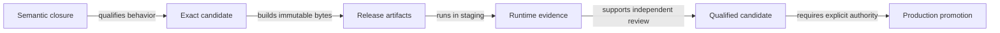
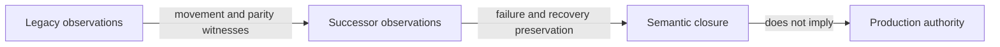
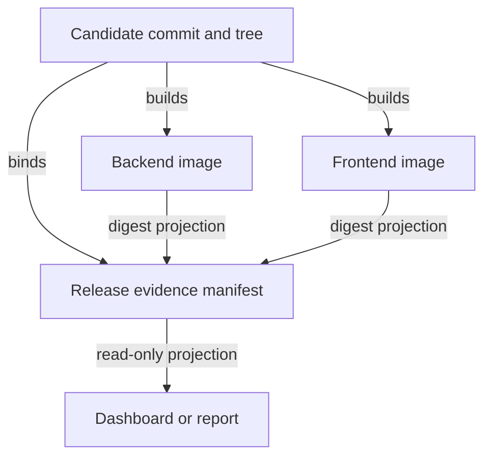
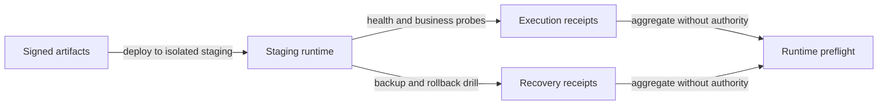
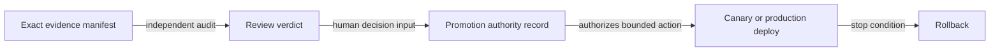

# MRW Formal Production Release Development Plan (v1)

- Status: `FROZEN_FOR_IMPLEMENTATION_V1 · REMEDIATION_INCLUSIVE_RELEASE · NOT_RELEASE_AUTHORITY`
- Date: `2026-09-04`
- Source task: `01a069dd-d6ad-70d2-af42-72a155b0cc9d`
- Source task title: `用函子编程的方法论审视一下项目，可以调用子agent并行调查`
- Scope: close the gap from the current local-only successor and structural-debt work to a reproducible formal-production release candidate and a separately authorized production release.
- Authority ceiling: this plan does not authorize a live provider, production canonical write, external delivery, candidate promotion, cutover, authority transfer, credential creation, deployment, or legacy retirement.
- Mutable execution state belongs only in `03_formal-production-release-progress.v1.md` after this plan is frozen.

## 1. Evidence boundary

This plan separates current direct observations from historical or documentary claims.

### Current observations

- The source task is active and owns the functorial structural-debt work under S3-S8.
- `docs/governance/functorial-structural-debt-remediation-progress.v1.md` currently records S0-S2 complete, S3-S5 in progress, and S6-S8 not started.
- The current checkout is not a releasable candidate tree. It contains a large, mixed dirty-worktree surface and must not be packaged directly.
- The checkout is 21 commits behind the locally known `origin/main`; its tracked diff and untracked files are changing while concurrent work continues.
- The root functorial-kit ratchet covers Python source and tests, but it is not a business, frontend, live-provider, database, deployment, or production-authority gate.
- A fresh pre-freeze architecture run is red because the baseline contains six stale keys. The stale set belongs to the source task and must be reviewed there; this release task must not edit `arch-baseline.json`.
- The current production-readiness documents describe startup, security, monitoring, canary, backup, and rollback, but their own statuses remain documentary or unexecuted.
- Existing exact-candidate review evidence authorizes neither promotion nor production authority.

### Controlling references

| Reference | Role in this plan | Ceiling retained |
| --- | --- | --- |
| `docs/governance/functorial-project-review-2026-09-04.v1.md` | Frozen architecture evidence | Not a promotion gate |
| `docs/governance/functorial-structural-debt-remediation-plan.v1.md` | Frozen S0-S8 repair program | No production/live/cutover authority |
| `docs/governance/functorial-structural-debt-remediation-progress.v1.md` | Mutable source-task progress | Not authority |
| `.../00_functorial-successor-migration-development-contract.draft.md` | Migration completion contract | Code closure is not production readiness |
| `.../evidence/reviews/I2ExactCandidateFinalReview.v4.json` | Historical exact-candidate review | `promotion=false`; all authority flags false |
| `.../evidence/reviews/P4C7C9AdoptionReview.v1.json` | Capability-spec readiness evidence | Ready for adoption decision only |
| `.../production-readiness/production-runbook.md` | Startup and operations procedure | `DOCUMENTED_NOT_EXECUTED` |
| `.../production-readiness/security-checklist.md` | Security gap inventory | `CHECKLIST_DOCUMENTED` |
| `.../production-readiness/monitoring-and-rollback.md` | Monitoring/canary/rollback proposal | `RECOMMENDATION_NOT_IMPLEMENTED` |

The `...` prefix above denotes:

```text
development/latest-dev-docs/development-plans/CURRENT_DEV/
2026-08-30-functorial-successor-migration
```

## 2. Release object and ordered transformations

The domain object is not a Git tag. It is a qualified release candidate whose semantic behavior, bytes, runtime realization, recovery, and authorization are separately evidenced.

The required ordered transformations are:

```text
working checkout
  -> isolate owned changes
  -> close declared semantic and structural obligations
  -> create a clean exact candidate
  -> build immutable artifacts
  -> validate deterministic and environment-dependent gates
  -> perform independent exact-candidate review
  -> obtain an explicit human/authority promotion record
  -> deploy by a reversible procedure
```

These transformations do not commute by default. In particular, production validation cannot precede exact-candidate identity, and a successful runtime probe cannot substitute for promotion authority.

## 3. Minimal generative view



Text fallback: semantic closure qualifies behavior; a clean candidate fixes identity; immutable artifacts realize that identity; staging produces runtime evidence; independent review qualifies the candidate; only an explicit authority record may promote it.

## 4. Separate release views

### 4.1 Semantic movement



The preserved observations include ordered composition, declared losses, failure families, recovery/readback behavior, and the retained legacy route. `K -> X` is explicitly not an implication.

### 4.2 Artifact identity and projections



The candidate commit/tree and immutable artifact digests are identity sources. Reports and dashboards are read-only projections and cannot become a second release authority.

### 4.5 Candidate strategy decision

Two candidate strategies are possible but their evidence cannot be mixed:

| Strategy | Candidate source | Evidence consequence |
| --- | --- | --- |
| Production-main stabilization | A clean `origin/main` candidate excluding the current remediation tranche | Fastest production route, but excludes the source task's new work |
| Remediation-inclusive release | A new clean commit/tree produced after the source task and this first release wave converge | All semantic, test, build, runtime, and review evidence must be rebound to the new candidate bytes |

This plan freezes `REMEDIATION_INCLUSIVE_RELEASE` because the user explicitly requested the production gap after the source task's covered work. Historical exact-candidate and runtime receipts are inputs for test selection only; they are not evidence for the new candidate until rerun or exact-byte equivalence is independently established.

### 4.3 Runtime realization



Runtime success is evidence about execution. It is not semantic admission or production authorization.

### 4.4 Authority and qualification



Only the promotion authority record may authorize deployment. Checkers, generated manifests, green tests, and model consensus remain non-authoritative.

## 5. Coverage already supplied by the source task

| Surface | Current evidence | Production meaning |
| --- | --- | --- |
| Functorial architecture census and ratchet | Full Python architecture ratchet with an explicit baseline | Prevents new structural drift; does not clear existing debt |
| C7 semantic registration | Closed alternatives, input/content vocabularies, terminal outcomes, terminal failure registry, ports, codecs, and witnesses | Strong local semantic structure; runtime contract closure remains exact-byte constrained |
| Lightweight functorial projection | One stored-program interpreter, ordered data flow, typed status/error/retry, domain writers | Removes a second interpreter/authority risk; not a production runtime |
| Adapter/core separation | Collect/resource/ingest/discovery ports and composition roots, with remaining graph/LLM/subproject debt | Improves substitutability; live providers remain unvalidated |
| Derived authority | Initial non-authoritative preflight markers and a map | Partial; generated evidence and C9 views remain |
| Failure families | C7 registry, typed-knowledge boundary, C2 registration/AST coverage | Partial; C2/C7 runtime typed closure is exact-byte blocked |
| C8/C9 and remaining families | Planned | Not started in the source task at this snapshot |

## 6. Formal-production gaps

| Gap | State at freeze preparation | Required closure | Blocking scope |
| --- | --- | --- | --- |
| G0 Source-task completion | `IN_PROGRESS` | S3-S8 complete or an independently frozen scope reduction | Formal candidate creation |
| G1 Clean candidate identity | `BLOCKED_BY_MIXED_DIRTY_WORKTREE` | Owned changes isolated into reviewable commits; clean checkout; exact commit/tree | Any packaging or release claim |
| G2 Reproducible artifacts | `UNEXECUTED` | Deterministic backend/frontend image builds; immutable digests; dependency locks; artifact manifest | Formal RC |
| G3 Release evidence contract | `MISSING` | One closed manifest schema with unique gate IDs, exact refs/digests, status vocabulary, and non-authoritative marker | Formal RC review |
| G4 Business and cross-surface validation | `PARTIAL_UNEXECUTED` | Backend business/integration/contract suites, frontend build/tests, migration checks, and explicit skip accounting | Formal RC |
| G5 Security and supply chain | `PARTIAL` | Auth/rate/body/CORS/TLS boundary, strong credentials, secret/dependency/image scans, pinned images, SBOM/signing | Production promotion |
| G6 Production runtime realization | `MISSING_OR_LOCAL_ONLY` | Production project resolver, authority binding, provider configuration, canonical-write policy, isolated staging | Live/canonical capability |
| G7 Monitoring and canary control | `RECOMMENDATION_NOT_IMPLEMENTED` | Successor domain metrics, alerting, route/version metric, reversible enable flag or isolated ingress, stop conditions | Canary and production rollout |
| G8 Backup, schema, and rollback evidence | `DOCUMENTED_NOT_DRILLED` | Restore verification, migration downgrade/forward drill, image rollback, RPO/RTO evidence | Production promotion |
| G9 Independent qualification and authority | `NOT_AUTHORIZED` | Fresh exact-candidate review plus explicit human promotion record with bounded scope and rollback owner | Production release |

### Current release-engineering red lights

The following observations are part of the frozen gap, not work for the source task to hide:

- `arch-baseline.json` currently has 849 entries while the progress summary reports 850.
- A fresh architecture run produced `268 passed, 1 failed`; the failure lists six stale baseline keys: four import-direction keys and two no-throw keys. Stale does not mean safe to delete without the source task's ownership review.
- Root `pyproject.toml` uses version `0.0.0` and an absolute local dependency on `file:///Users/wangyiliang/Desktop/functorial-kit/python`; the frontend reports `0.1.8-rc1`.
- The locally known `origin/main` is 21 commits ahead of the current checkout.
- Repository branch-protection metadata requires only `gateplus-required-check`; its current convergence does not establish that all backend, successor, frontend, Docker, security, and release-artifact gates are required remotely.
- The security checklist says dependency and secret scans are missing, while the current workflow contains Bandit, `pip-audit`, and gitleaks steps. This is documentary projection drift: source and current execution evidence must decide the gate, not an older checklist sentence.
- The compose file contains floating `latest` images and development defaults; this is static gap evidence, not proof about any external production environment.

## 7. Frozen release evidence contract

The release evidence manifest is a derived preflight object. It must include exactly one record for each required family:

```text
semantic_closure
candidate_identity
artifact_build
business_validation
security_supply_chain
runtime_staging
observability_canary
backup_recovery
independent_review
promotion_authority
```

Each record contains:

```text
gate_id
family
status = PASS | FAIL | BLOCKED | UNEXECUTED
required
evidence_refs[]
evidence_sha256[]
observed_at
owner
notes[]
```

Manifest invariants:

1. `schema_version` is exactly `mrw.formal-production-release-evidence.v1`.
2. `authoritative` is always `false`; `derived_as` is `preflight`.
3. Gate IDs are unique and every required family occurs exactly once.
4. A SHA-256 entry is a 64-character lowercase hex digest and is positionally paired with its evidence reference.
5. `PASS` without at least one exact evidence ref and digest is invalid.
6. `formal_rc_ready` is true only when every family except `promotion_authority` is `PASS` and the candidate identity is exact.
7. `formal_production_ready` is true only when every family is `PASS` and a separately authored promotion-authority record is referenced by exact digest.
8. A checker may compute readiness but may never create, sign, or amend promotion authority.
9. `BLOCKED` and `UNEXECUTED` remain visible and cannot be normalized to `PASS` or omitted.
10. Re-running a checker over the same bytes produces the same result apart from explicitly excluded observation timestamps.

All first-wave tools use one shared report envelope:

```text
schema_version = mrw.formal-release-preflight.v1
checker
authoritative = false
derived_as = preflight
status = PASS | FAIL | BLOCKED | UNEXECUTED
findings[]
```

The shared envelope is owned by `scripts/formal_release/model.py`. Individual checkers contribute findings and must not implement competing status aggregation or authority semantics.

## 8. Development packages

### R0 Freeze and concurrency fence

- Goal: freeze this plan and the gap ledger while reserving non-overlapping paths.
- Writes: this directory only.
- Acceptance: JSON parses; plan and ledger SHA-256/bytes/lines are bound in `02_formal-production-release-development.freeze.v1.json`; `git diff --check` passes.

### R0-B Shared preflight substrate

- Goal: provide one immutable in-process representation for checker results and one deterministic JSON projection.
- Writes: `scripts/formal_release/model.py`; `tests/formal_release/test_model.py`.
- Operations: construct a finding, aggregate severity without erasing `BLOCKED` or `UNEXECUTED`, and serialize with sorted keys.
- Acceptance: identity/determinism tests, closed status validation, and proof that all outputs carry `authoritative=false` and `derived_as=preflight`.

### R1 Candidate identity preflight

- Goal: deterministically reject dirty, mismatched, or non-exact candidate checkouts.
- Writes: `scripts/formal_release/check_candidate_identity.py`; its focused test file only.
- Reads: Git metadata and user-supplied expected commit/tree.
- Non-goals: no checkout, reset, clean, tag, commit, or artifact creation.
- Acceptance: tests cover exact clean match, commit mismatch, tree mismatch, dirty tracked file, and untracked file; output is a non-authoritative preflight.

### R2 Release evidence manifest validator

- Goal: validate the frozen evidence contract and compute derived RC/production readiness without granting authority.
- Writes: `scripts/formal_release/check_release_evidence.py`; its focused test file only.
- Acceptance: tests cover duplicate IDs, missing families, invalid digest, PASS without evidence, blocked/unexecuted preservation, RC-ready, and production-ready with an external authority record reference.

### R3 Static production contract preflight

- Goal: turn known security/supply-chain/runtime configuration gaps into deterministic findings.
- Writes: `scripts/formal_release/check_static_production_contract.py`; its focused test file only.
- Reads: compose, env example, workflows, package/version metadata.
- Acceptance: tests cover floating image tags, default database credentials, disabled Elasticsearch security, broad port exposure, missing security scans, and absent immutable artifact metadata.
- Ceiling: passing this preflight does not prove runtime security.

R1-R3 are mutually exclusive with the source task and with one another. They may run in parallel only after R0 freezes their inputs and write sets and R0-B fixes their shared output contract.

### R4-R9 Later gated packages

| Package | Work | Prerequisite | Why not started in the first parallel wave |
| --- | --- | --- | --- |
| R4 CI/release gate wiring | Wire R1-R3 and full test/build evidence into required checks | Stable checker outputs; ownership of current `.github` changes | Existing branch-protection file is already modified |
| R5 Reproducible image build | Pin images, produce SBOM/provenance, publish immutable digests | Clean exact candidate and registry decision | Requires artifact registry and release authority choices |
| R6 Production authority/runtime | Resolver, auth, rate/body limits, provider and canonical-write policy | New frozen authority milestone | Overlaps successor runtime semantics and carries authority risk |
| R7 Observability/canary | Domain metrics, alerts, route flag/isolated ingress, stop rules | Stable runtime and deployment topology | Requires environment and traffic policy |
| R8 Recovery drill | Backup/restore, migration forward/backward, image rollback | Staging environment and immutable images | Effectful and potentially destructive if mis-scoped |
| R9 Qualification/promotion | Fresh exact-candidate review and human decision record | G0-G8 evidence complete | Cannot be generated by implementation code |

## 9. Concurrency and ownership contract

The source task exclusively owns:

```text
docs/governance/functorial-structural-debt-*
docs/governance/adapter-boundary-map.v1.json
docs/governance/derived-authority-map.v1.json
docs/governance/failure-family-map.v1.json
functorial-kit.json
arch-baseline.json
registries/
sketches.json
src/mrw_functorial_kit/
main/backend application files used by S3-S8
existing registration and port-law tests
```

This release task exclusively owns:

```text
development/latest-dev-docs/development-plans/CURRENT_DEV/2026-09-04-formal-production-release/
scripts/formal_release/
tests/formal_release/
```

First-wave agents must not edit outside their assigned single script and test file. They are not authorized to edit existing deploy scripts, workflows, Dockerfiles, compose files, package metadata, backend/frontend runtime code, frozen migration evidence, registries, or the architecture baseline.

## 10. Acceptance and claim ceilings

### Plan complete

This planning task is complete when R0 is frozen and R1-R3 pass focused tests. This means only:

```text
FORMAL_RELEASE_GAP_MODEL_FROZEN
DETERMINISTIC_PREFLIGHT_FIRST_WAVE_IMPLEMENTED
PRODUCTION_RELEASE_NOT_AUTHORIZED
```

### Formal RC ready

Formal RC readiness requires G0-G8 evidence against one clean exact candidate. It does not require `promotion_authority=PASS` and cannot be called a production release.

### Formal production ready

Formal production readiness additionally requires G9, a bounded promotion scope, an identified rollback owner, and a verified stop path. The derived manifest may report these inputs; it cannot create them.

### Explicit non-claims

Neither this plan nor first-wave implementation claims:

- completion of the source task;
- semantic parity outside witnessed observations;
- production credentials or provider availability;
- current Docker, database, Elasticsearch, Redis, or browser health;
- successful backup/restore or migration rollback;
- live traffic, canonical write, external delivery, cutover, promotion, or authority transfer.
