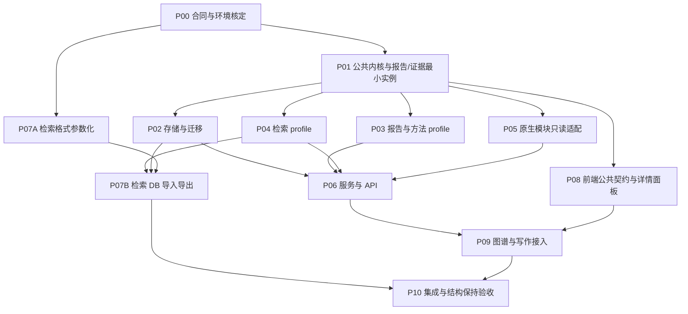

# MRW 信息拓扑层：实现框架与阶段串并行工作包

- 合同标识：`mrw.information-topology.implementation.v1`
- 日期：2026-09-24
- 状态：`DESIGN_AND_IMPLEMENTATION_CONTRACT`。本文件固定本轮实现范围与分发边界，不是已实现、测试通过、运行完成或发布授权的证明。
- 方案整理：Astra；集成与任务分发：当前主线 Agent。
- 工作目录：`/Users/wangyiliang/market-research-workflow`。
- 直接权威输入：[PLAN (1).md](</Users/wangyiliang/Downloads/PLAN (1).md>)、[PLAN (2).md](</Users/wangyiliang/Downloads/PLAN (2).md>)及用户本轮澄清。
- 执行规则：沿用项目 `AGENTS.md`、[19 号流程缩减规则](../2026-09-04-formal-production-release/19_direct-testing-batch-freeze-amendment.v1.md)。现有生产阶段已验收记录不替代本功能验证；本合同不启动 Stage 7–9 或发布。

## 1. 输入取舍与范围

用户所说的“两份参考文件”就是 Downloads 中上述两份附件。用户随后再次明确两个方法库也须实际读取。本合同已读取桌面“科学”下的实存目录`信息搜索框架`与`项目/05-案例、原型与验证/开放域函数式薄核`，并将其直接相关边界转译如下；目录名称按现场记录，不宣称历史简称与实存名称天然同一。旧路径不存在不构成本任务阻塞。

两份附件互补：`PLAN (2)`提供主要工程范围和接口；`PLAN (1)`补足数学定义、观察版本、映射保真与事务边界。以下差异固定为本轮合同：

| 问题 | 采用的定义 |
|---|---|
| 映射保真 | `lossless / lossy / unverified`；缺少见证不能默认无损 |
| 引用端点 | 稳定 `ElementRef` 与版本绑定 `BoundRef` 分开；持久化关联和具体视图必须保留实际观察版本 |
| 关系表达 | 带角色及可选位置的多重端点，支持重复目标、多元关系、关系指向关系 |
| 批量写入 | 比较全部实际受影响记录的基础版本，并保护用于约束判断的读集；状态和跨模块关联在同一数据库事务提交 |
| 局部合法性 | 各 profile 定义；不全局强制树、DAG或单一图形 |
| 版本向量 | 说明实际读取版本，不自动宣称跨原生模块的全局同步快照 |
| Agent 分发 | 用户明确要求的开发协作方式；不把调度能力建设为拓扑产品功能 |

交付是一个可持久化、查询、编辑、转换的抽象信息结构层，覆盖检索、结构化信息、图谱视图、报告大纲及方法描述。拓扑在此指信息关联结构；没有开集、连续性或距离公理，不宣称它已经是数学拓扑空间。

产品范围不包含检索执行、任务编排、自动运行方法、自动生成正文及触发策略。开发 Agent 可以并行工作；这与产品不实现 Agent 调度并不矛盾。

### 1.1 两个方法库的实际依据与转译

薄核来源位于`/Users/wangyiliang/Desktop/科学/项目/05-案例、原型与验证/开放域函数式薄核/`。本次读取`README.md`、`00-总计划.md`、`02-函子化界面与双拓扑.md`、`05-开放域函数式薄核架构视图.md`，并按 README 路由读取`06-理论信息技术与政治行动的中介设施_定位稿.md`相关定位。`00`明确为`PLAN_ONLY`，不包含真实 Runtime、数据库、UI 或 Agent loop；`02`是局部协议，`05`明确为旧局部视图，不能穷尽总体设施。

采用的具体约束是：局部结构与同一标准可有差异；新域通过开放声明扩展，不修改全局枚举；有限快照不等于完整理论对象；断连、循环、未决、不可翻译分支必须允许保留；结构验证不产生理论资格、采纳权或事实成立。语义关系与执行依赖分离，本次只实现信息结构，不从语义边生成执行边。登记协议只限制选定编码的持久化投影，不能把不符合此 profile 的材料判为无研究价值；原材料仍由原 owner 保存。编码自身可以版本化变更，损失明确声明，不因共享字段声称函子或自然性已成立。

检索来源位于`/Users/wangyiliang/Desktop/科学/信息搜索框架/`。本次读取`README.md`、`图.schema.json`、`域.py`、`总纲提取接口.md`、`来源与检索启动约定.md`、`证据与问题回写契约.md`，并定位`校验图.py`、`读图.py`、`建索引.py`及三个聚焦测试。落实以下接入规则：

1. 域总纲正文是词表抽取事实源；front-matter 是语义抽取声明，`域.json`是程序派生的七字段分类词表。DB主存储只改变接入后结构记录的存放位置，不赋予词表记录改写总纲或上游思想稿的权限。导入保留正文、抽取声明、词表之间的来源关系；词表调整经其声明的来源修订路径，不由图谱或查询结果自动覆盖。
2. 七字段为域名、节点类型、边类型、问题意识视角、大纲节、池、档；节点类型必须含框架保留的`现场`。MRW profile允许域实例精确绑定这些词表，核心不硬编码各域值。
3. `图.schema.json`的正式格式为证据口径2；节点、边、证据、线索和逻辑依赖分别保持。边的判断、范围、判断版本及`修订自`；证据的原文定位、原文摘录、适用范围、推论说明、证明对象、来源角色、独立组及冲突引用均须保留。来源档位不是事实真实性等级，入证据网不等于结论成立。
4. 同一判断新增证据可保持边ID；判断内容或范围实质变化须新边ID并以`修订自`关联旧边。该语义 successor 不同于存储 revision，不能用原ID新revision抹掉框架要求的新判断身份。
5. 来源路线、关键词/检索式计划、具体源登记、真实尝试记录互不替代。导入已有记录不制造执行事实；空表头不是数据；未执行不变成未命中；访问失败不变成对象不存在。真实调查缺口与格式缺项分别表达，原记录只读导入或按其 owner 约束维护。
6. 旧图无口径2时保留材料/线索及待复核状态，不补造原文或自动升格为正式证据。导出原格式不能写 schema 不认识的 MRW 字段；附加映射另存。
7. 框架统一`读图.py --root`为只读投影，`建索引.py`为可重建索引；二者都不作为 MRW 导入的原始事实源。目录报告原文保留，跨链综合沿原总纲关系引用，不因导入另造可互相覆盖的分析总纲。

这些来源约束已纳入 P03/P04/P05/P07 的验收。检索框架的启动授权、运行端口、循环拉取、Agent 分工属于原工作流，本次只保留其输入输出结构与 owner 边界，不移植其运行机制。

## 2. 抽象定义及数学解释

### 2.1 身份、版本与所有权

稳定元素身份由项目、模块、命名空间、类型、原生标识组成：

$$
u=(p,m,n,k,\ell)\in\mathcal U.
$$

实现为 `ElementRef(project_key, module_id, namespace, type_id, local_id)`。拓扑成员资格、页面和修订号不进入身份；相同标题不建立身份等价。

版本绑定引用为：

$$
\widehat u=(u,\nu)\in\widehat{\mathcal U}.
$$

实现为 `BoundRef(ref, observed_revision, content_digest?)`。原生模块不能读取指定历史版本时，返回 `stale` 或 `unresolvable`；禁止读取当前版本冒充旧版本。当前版本查询属于显式读取操作，响应仍绑定实际观察版本。

每项事实有唯一 owner。新增结构由拓扑存储持有；Document、typed knowledge、writing 正文和原生图谱记录由现有模块持有。适配器只解析原生事实，不复制可编辑的第二份事实。

### 2.2 Profile 与局部状态

一个 profile 是：

$$
\Sigma=(K,K_{\mathrm{rel}},\mathcal A,\mathcal B,\mathcal C).
$$

`K` 是局部类型集，`K_rel` 是关系类型子集，`A` 定义各类型属性，`B` 定义端点角色、目标类型、基数及顺序，`C` 定义局部约束。profile 的标识与版本是显式数据；具体调查域词表不进入核心封闭枚举。

局部状态的抽象读取形式为：

$$
T=(E,R,\tau,a,\partial),\qquad R\subseteq E\subseteq\widehat{\mathcal U}.
$$

$$
\tau:E\to K,\qquad R=\tau^{-1}(K_{\mathrm{rel}}),\qquad a(e)\in\mathcal A_{\tau(e)}.
$$

端点是有限多重集：

$$
\partial:R\to\mathcal M_{\mathrm{fin}}\bigl(\mathrm{Role}\times\widehat{\mathcal U}\times(\mathbb N\cup\{\bot\})\bigr).
$$

多重集保留重复出现；位置表达声明的次序，空位置表示无顺序。关系自身也是元素，因此可以被其他关系引用。端点可以位于其他局部结构，由 profile 声明是否允许外部引用。循环按有限引用解析，不能递归无限展开。

$$
\mathsf{State}(\Sigma)=\{T\mid T\text{满足类型、端点签名、引用要求及}\mathcal C\}.
$$

合法状态仅证明结构符合约束，不证明证据真实、判断正确或论证充分。该形式是公共读取与校验语义，不要求每个局部 payload 全部改写为同一种端点数组。

### 2.3 异构拓扑的必要实例

报告采用单根有序章节树。用稳定的合成 outline 根容纳多个顶层章节；该根可不显示。章节集合有限，每个非根恰有一个父亲，无环，因此每个章节可达根：

$$
\deg^-_P(r_0)=0,\qquad\forall s\ne r_0,\ \deg^-_P(s)=1,\qquad\forall s,\ (s,s)\notin P^+.
$$

同级顺序必须唯一且明确。空大纲只包含合成根。首期以一份 outline 为原子结构单元，避免跨行树约束写偏差；不把整个项目封成一个大 JSON。

检索线索采用有序引用序列：

$$
L=(x_1,\ldots,x_n),\qquad x_i\in\widehat{\mathcal U}.
$$

同一元素可在多个位置出现；相邻位置不自动成为因果或逻辑依赖。逻辑依赖另以明确关系保存。判断可作为关系，证据作用再指向判断：

$$
\partial(J)=\{(\mathrm{subject},A,\bot),(\mathrm{object},B,\bot)\},
\qquad
\partial(Q)=\{(\mathrm{material},M,\bot),(\mathrm{judgment},J,\bot)\}.
$$

支持、反驳、限定保留为独立语义。方法结构保存输入输出角色、条件、假设及组合；组合合法性由方法 profile 判断，不能从图可达性推断可执行性。

### 2.4 总体层与视图

$$
\mathfrak T=\bigl(\{T_i^{\nu_i}\}_{i\in I},\mathcal L_{\mathrm{cross}},\mathcal M\bigr),
\qquad\boldsymbol\nu=(\nu_i)_{i\in I}.
$$

总体层是局部状态族、跨结构关系和映射的组合。模块可提供多个视图，同一元素可属于多个视图。`input_revisions`记录版本向量。

$$
\pi_q:\mathsf{State}(\Sigma)\rightharpoonup\mathsf{View}_q.
$$

视图是具有输入条件的派生投影。`TopologyView`保存定义标识、版本、输入版本、成员、关系及局部组织形式。图谱坐标、选择和展开状态属于 UI。证据视图将判断显示为节点、关系视图将它显示为边时，二者的来源必须一致：

$$
\operatorname{origin}(v_J)=\operatorname{origin}(e_J)=\widehat J.
$$

`RelationView`和`TopologyView`均无独立事实写权限；编辑路由回所属 profile 或原生模块。

### 2.5 映射、覆盖与保真

$$
F_m:D_m\subseteq\mathsf{State}(\Sigma_A)\to\mathsf{State}(\Sigma_B),
\qquad C_{m,T}\subseteq S_T\times E_{F_m(T)}.
$$

`S_T`为明确承诺处理的源范围，`C`为实际对应，可一对多或多对一。完整覆盖的定义是：

$$
\operatorname{dom}(C_{m,T})=S_T.
$$

未映射项必须单独返回。覆盖只针对声明范围；不得先过滤未映射项再宣称完整。

对单值结构映射，类型、角色及端点结构保持要求：

$$
\tau_B\circ f_E=\theta\circ\tau_A,
\qquad
\partial_B(f_R(r))=(\eta_r\times\widehat f_E\times\omega_r)_*\partial_A(r).
$$

两式分别检查类型相容、端点转换与关系转换相容。声称保持相对顺序时，位置映射须保序；声称保持原序号时采用恒等位置映射。多对多聚合不直接套用此等式，须给自己的观察与损失规则。

无损是相对于明确观察函数的性质：

$$
O_{\Sigma_A}(d_m(F_m(T)))=O_{\Sigma_A}(T),\qquad T\in D_m.
$$

观察项至少覆盖当前消费者依赖的身份、版本、属性、端点角色、重复次数、线索次序、判断范围和材料定位。`coverage`为`total / partial`；`fidelity`为`lossless / lossy / unverified`。有类型证明或实际往返测试见证才使用`lossless`。

规则只允许显式对应表或注册的纯转换函数。首期不引入表达式语言。组合域为：

$$
D_{G\circ F}=\{T\in D_F\mid F(T)\in D_G\}.
$$

只有中间 profile、版本及引用边界匹配时组合。普通支持、引用和相关关系不自动传递，不产生新领域事实。

### 2.6 编辑与序列化

$$
\delta:\mathsf{State}(\Sigma)\rightharpoonup\mathsf{State}(\Sigma).
$$

编辑是合法状态之间的部分函数。观察版本相符且候选合法时才提交；否则保留旧状态。空编辑的语义内容保持恒等；是否新建审计版本由服务明确约定，不能声称产生内容变化。

$$
\operatorname{decode}_{\Sigma}(\operatorname{encode}_{\Sigma}(T))\cong_{\Sigma}T.
$$

等价保留声明语义，忽略 JSON 键顺序等无语义差别；外部文件导入导出另行验证，不由内部 codec 往返推导外部无损。

## 3. 实现框架与具体接缝

### 3.1 实际已核查的项目入口

以下为现场代码位置，不宣称现有代码已支持新拓扑层：

| 职责 | 已有入口 |
|---|---|
| 后端服务 | `main/backend/app/services/` |
| API 注册 | `main/backend/app/api/__init__.py` |
| 响应与路由惯例 | `main/backend/app/contracts/`、`main/backend/app/api/writing.py` |
| 数据模型与迁移 | `main/backend/app/models/`、`main/backend/migrations/versions/` |
| 项目上下文与建表 | `main/backend/app/services/projects/context.py`、`bootstrap.py`、`schema_initialization.py` |
| 原生写作 | `main/backend/app/models/writing_entities.py`、`services/writing/document_service.py` |
| 原生结构知识 | `main/backend/app/models/typed_knowledge_entities.py`、`services/typed_knowledge/` |
| 原生线索 | `main/backend/app/services/clue_chains/contracts.py`、`service.py`、`store.py` |
| 图谱 | `main/backend/app/services/graph/`、`services/graph/persistence/` |
| 前端 | `main/frontend-modern/src/pages/GraphPage.tsx`、`WritingWorkbenchPage.tsx` |
| 图谱组件 | `main/frontend-modern/src/pages/graph/GraphWorkspace.tsx`、`domain/topology.ts`、renderers |
| 写作组件 | `main/frontend-modern/src/components/writing/` |
| contribution 与规则 | `functorial-kit.json`、`registries/`、`sketches.json`、现有 `functorial_kit.native_contribution` 使用点 |

旧文档中的`main/frontend`路径已经不适用。本功能在`frontend-modern`接入。不能因现有 UI 也叫 topology 就将其图形模型升级为共同事实模型。

### 3.2 代码责任划分

新增领域包为`main/backend/app/services/information_topology/`，最小分工为：

- `contracts.py`：公共引用、状态、关系、视图、映射、结果与失败类型。
- `profiles.py`、`mapping.py`：profile 声明协议、结构校验与纯转换。
- `modules/`：报告、检索、方法、图谱视图的精确模型与约束。
- `adapters/`：Document、typed knowledge、writing、原生线索和图谱的只读解析。
- `repository.py`、`service.py`：事务持久化、协调解析和编辑。
- `io/`：检索框架导入导出，隔离文件 I/O 与纯格式处理。
- `catalog.py`：唯一模块声明清单，驱动公共登记、Schema 获取、视图发现和编辑分发。

每个模块仅声明一次类型、约束、投影和编辑规则。复用现有 contribution 原语；拓扑不是执行 capability，不塞入 C8 执行清单。若现有 contribution API 不能表达纯 profile，由内核 owner 在 P01 中补最小项目规则；不让各模块各写一个注册器。共享清单、注册和派生同步由集成 owner 维护。

局部 payload 使用精确模型。公共外壳可以承载 JSON，但未知 profile、版本或未校验 payload 必须拒绝。结构编辑是 profile 定义的操作联合类型，禁止任意 JSON Pointer 写穿原生模块。

### 3.3 两张表及事务

`information_topology_states`保存项目、模块、命名空间、state_id、profile 标识与版本、revision、payload、来源、摘要、is_current、deleted。状态粒度是领域一致性单元：一份 outline、一条线索、一项方法或明确的判断/证据单元。

`information_topology_links`保存 project_key、link_id、revision、is_current、record_kind、type_or_rule_ref、角色端点、payload、provenance、digest、deleted。`record_kind`区分 relation 和 mapping；两种精确校验不因共用表而合并。

两表都保留历史行；以复合唯一约束保证版本身份，以部分唯一索引保证同一逻辑对象至多一个 current。失效采用 tombstone，新建对象不能重新占用旧身份。不能靠先读后写的应用检查代替数据库并发保护。

`apply_patch`内部规范化为编辑批次，含每个写目标的`expected_revision`及约束读集。单目标公开签名继续保留；涉及多个状态和 links 时必须携带全部基础版本。读取 current 行、校验和提交在同一事务内；锁定顺序稳定，创建竞争由唯一约束裁决，冲突转换为 409。跨行约束必须由聚合行锁或明确保护的读集防止写偏差。

来源文件读取不参与分布式事务：导入先形成固定字节包和摘要，再校验，再单一 DB 提交。核对实际消费文件集合在读取前后未变；任一变动、解析错误或冲突均不提交。原生模块的历史能力按实际情况声明。

### 3.4 服务与 HTTP

保持附件的八个服务入口：

```python
describe_profiles()
resolve(refs)
read_topology(topology_ref, filters)
find_relations(ref, relation_types, direction)
preview_mapping(mapping_ref, input_refs)
apply_patch(target, base_revision, patch)
import_structure(module_id, source)
export_structure(target, format)
```

HTTP base 为`/api/v1/information-topology`；方法与路径固定如下，均采用现有 ApiEnvelope、项目上下文和错误封装。请求模型由 P06 从上述八项操作派生，不修改服务语义：`GET /profiles`，`POST /resolve`，`POST /topologies/read`，`POST /relations/find`，`POST /mappings/preview`，`POST /patches`，`POST /imports`，`POST /exports`。至少区分非法结构、版本冲突、未找到、引用过期、未知 profile/version、映射不适用、来源变化、导入身份冲突。错误不得返回 HTTP 200。

所有入口检查项目作用域，包括端点、映射对应、导入 payload 和原生解析；不能仅靠 URL 或数据库 search_path 隔离。`find_relations`返回已声明关系；如输出路径，每一步均来自已声明关系，不提升为推理事实。

### 3.5 模块接入

| 模块 | 拓扑层新增事实 | 既有事实入口与边界 |
|---|---|---|
| 报告 | 大纲、稳定 section_id、顺序、论证引用、正文观察位置绑定 | writing 持有正文；body version/digest 不匹配只提示漂移 |
| 检索 | 派生域词表、来源路线、关键词/检索式计划、源登记、尝试记录形状、材料、判断/证据、线索/依赖、候选、缺口及报告原文引用 | 外部格式转入 DB；候选不自动成为正式证据；具体报告正文仍由原 owner 持有 |
| 结构化信息 | 字段来源、分类/成员视图、跨结构关联 | typed knowledge 和材料原值由原模块持有 |
| 方法 | 方法定义、输入输出角色、条件、假设、组合关系及实现引用 | 仅描述，不调用实现 |
| 图谱 | 视图定义、成员选择、分组和表达映射 | 原事实只读引用；节点/边均保留 origin_ref |
| 原生 clue_chains | 结构投影与显式映射 | 不把其运行状态迁入共同层；与外部检索 profile 保持不同 module_id |

检索接入必须实现：参数化解析/域校验/证据规则/合并；连续读取两个调查域互不污染；原 ID、判断版本、材料定位与线索顺序保持；相同来源和内容重复导入幂等；原 ID 内容冲突显式报告；导出到新目录；原说明文字和正文原样保留；MRW 扩展映射写附加文件。不能用展示投影代替原始结构。

## 4. 串并行阶段与资源约束



P01 先用报告树和允许环的证据网打通一份声明到实际消费者的最小路径，稳定引用、profile、patch和错误类型；这是依赖准备，不是新增用户审批。P07A 可独立进行格式整理。P01 完成后 P02/P03/P04/P05/P08 可并行；P06 可提前做路由外壳，但验收依赖其输入包完成。P09 内图谱与写作可以两个 owner 并行，不共同编辑公共客户端。

代码文件无交叉不代表测试资源独立：纯结构测试可并行；同一 PostgreSQL schema 的 migration 与并发写测试串行；前端 build 写同一 dist，统一执行一次；浏览器共享项目数据需隔离项目与运行目录。主线分配本轮专属测试 DB/schema，禁止清理已有用户项目。

## 5. 可分派工作包

下列路径均相对本仓库，另行注明除外。每包均须保留他人改动、不得再派 Agent；发现合同未定义的共享接缝回报主线，由既定 owner 修改权威声明，不自行造旁路。推荐主线/复杂设计使用 Astra 或 Sol，明确实现按当前可用模型路由分发；模型偏好不改变验收。

### P00 — 集成 owner：合同、环境与共享写面

- 目标：固定本文件，核验 dirty 文件和测试入口，落实独占写面与解释器，确保真正可执行的分派。
- 权威输入/现成接口：两附件、本合同、项目 19 号规则；`functorial-kit.json`与现有 registries；`scripts/test-standardize.sh`。
- 输出：本文件执行记录、各包 owner 和实际验证命令；不创建第二套进度平台。
- 独占写面：本合同；信息拓扑唯一 profile/module catalog 与所需可推导注册项；`main/backend/app/startup_hooks.py`；`services/projects/bootstrap.py`；`api/projects.py` 中创建新项目的 `TENANT_TABLES` / `INITIAL_PROJECT_TABLES`；`api/__init__.py`；前端公共装配。仓库中不存在`models/__init__.py`，不创建平行模型聚合入口。局部包通过交接提出所需改动。
- 验证：`git status --short`；核验`main/backend/.venv311/bin/python`，不存在时按项目脚本既有回退选择；读取 Docker 可用性并指定测试 schema。禁止打印秘密配置。
- 依赖/并行：起点；后续作为集成职责持续存在。
- 完成条件：包的写面和测试资源无冲突；缺失依赖有具体身份及恢复办法，不把未执行记为通过。

### P01 — 公共内核、声明协议与两个最小实例

- 目标：实现第 2 节结构、开放 profile、纯视图/映射及 profile patch 协议，建立声明到消费者的首个真实路径。
- 权威输入/接口：本合同第 2、3 节；现有 contribution 原语；现有精确类型和 ApiEnvelope 惯例。
- 输出：公共类型、失败族、codec、profile 校验、mapping 核心；报告树与证据网最小测试实例；明确公共 Python 导出及类型签名供下游消费。
- 独占写面：新包`contracts.py`、`profiles.py`、`mapping.py`；`tests/unit/test_information_topology_core.py`；模块最小实例放测试 fixture，不占用 P03/P04 正式模块文件。共享 catalog 由 P00 接入。
- 验证命令（cwd=`main/backend`）：`.venv311/bin/python -m pytest tests/unit/test_information_topology_core.py -q`。从仓库根执行该相对导入布局会因`app`不在`sys.path`导致收集失败；P01 的第一次尝试确实遇到此问题，经过修正后同一精确测试入口当前8项通过。解释器可由 P00 替换为核验过的等效路径，实际尝试见第7节。
- 依赖/并行：P00 后；与 P07A 独立。依赖此协议的实现不得自建另一套引用结构。
- 完成条件：重复端点、关系指向关系、有限环、树拒环/多父、版本引用、codec 往返、映射 coverage/fidelity 独立性、未知 profile 拒绝；新增测试 profile 不改核心枚举。

### P02 — 两表持久化、并发与项目迁移

- 目标：实现真实 PostgreSQL 存储及新旧项目建表，兑现批次原子性与版本比较。
- 权威输入/接口：P01 导出；`models/base.py`；`services/projects/`；`migrations/versions/`现行单 head。
- 输出：ORM、repository、一个接在真实当前 head 后的新迁移；建表注册交接；历史/current/tombstone及复合索引。
- 独占写面：`models/information_topology_entities.py`、新包`repository.py`、专属 migration、`tests/integration/test_information_topology_repository.py`。共享模型注册和 bootstrap 改动交 P00。
- 验证：迁移图脚本位于仓库根` scripts/check_backend_migration_graph.py`；从仓库根用`main/backend/.venv311/bin/python scripts/check_backend_migration_graph.py --versions-dir /Users/wangyiliang/market-research-workflow/main/backend/migrations/versions --expect-single-head --expect-head 20260905_000001`核定基线，迁移后保留`--expect-single-head`并去掉旧head参数。`alembic heads`的cwd=`main/backend`，命令`./.venv311/bin/python -m alembic -c alembic.ini heads`须显示P02新迁移为唯一head。repository pytest 的cwd=`main/backend`，命令`.venv311/bin/python -m pytest tests/integration/test_information_topology_repository.py -q`；另在专属 PostgreSQL schema 执行真实升级、新项目建表读回和连接 search_path 核验，实际连接配置由 P00 固定。
- 依赖/并行：P01 后，可与 P03/P04/P05/P08 并行；数据库测试与 migration runner 共用 schema 时串行。
- 完成条件：两个并发客户端同 base revision 仅一方提交；任一目标冲突整批回滚；旧版可读；current 唯一；多项目隔离；既有数据保留；新旧项目均有表。SQLite或假 repository 不证明 PostgreSQL并发性质。

### P03 — 报告与方法局部结构

- 目标：完成有序报告树、论证引用、正文观察绑定、方法签名及组合约束。
- 权威输入/接口：P01；`writing_entities.py`中`head_version`、`etag`、`body_md`；第 3.5 节所有权表。
- 输出：两个正式 module 声明与 patch/视图函数；正文漂移判定；catalog 登记条目交 P00。
- 独占写面：新包`modules/report.py`、`modules/method.py`；`tests/unit/test_information_topology_report_method.py`。
- 验证（cwd=`main/backend`）：`.venv311/bin/python -m pytest tests/unit/test_information_topology_report_method.py -q`。
- 依赖/并行：P01 后；与 P02/P04/P05/P08 并行。
- 完成条件：空大纲、重排、移动章节、重复引用正确；多父/环拒绝；正文变化只报告漂移；方法定义可描述不可执行对象；全部编辑经 profile 校验。

### P04 — 检索结构 profile

- 目标：实现检索全域的精确记录形状，包括域词表、来源路线、关键词/检索式计划、源登记、实际尝试记录、材料、判断及版本、证据作用、线索、逻辑依赖、候选、缺口，以及报告原文引用。该包定义/校验这些结构，不生成具体检索尝试或调查内容。
- 权威输入/接口：P01；两附件的检索定义；P07A 读回的实际格式记录供细化，不从展示 JSON 猜语义。
- 额外来源约束：第1.1节为必需字段/权威关系；语义 successor 与存储 revision 分离；域词表保留派生身份；旧口径不得自动升格。
- 输出：覆盖上述记录形状的正式检索声明、结构编辑、关系读取与证据/线索视图；保持来源计划/候选/真实尝试/正式证据分离，报告正文仅建立带版本的外部引用。
- 独占写面：新包`modules/retrieval.py`及其专属子目录（若拆分）；`tests/unit/test_information_topology_retrieval.py`。
- 验证（cwd=`main/backend`）：`.venv311/bin/python -m pytest tests/unit/test_information_topology_retrieval.py -q`。
- 依赖/并行：P01 后，可与 P02/P03/P05/P08 并行；真实格式差异由 P04/P07A 同步到唯一 profile 声明。
- 完成条件：hand-off列举的所有图与旁表字段均可被 profile 保留和校验，包含节点可选字段及边的全部正式/可选字段；来源、关键词、查询计划、源记录、attempt、material、candidate、gap、report-ref 各自身份/状态/owner不混淆；判断可被证据引用且支持/反驳/限定不合并；线索保序及重复；两个域词表隔离；允许循环关系仍合法；候选未自动升级；本包只定义结构，不产生真实检索运行事实。

### P05 — 原生模块解析与图谱视图 profile

- 目标：让既有材料、typed knowledge、writing、clue_chains和图谱通过公共引用接入；实现视图选择/分组结构。
- 权威输入/接口：P01；现有 Document 读接口、typed knowledge persistence boundary、writing service、clue_chains store、graph reader。P05 开始时核对真实 canonical reader，不能绕过现行读取边界直读旧影子表。
- 输出：只读 adapters、明确的版本能力、结构详情、字段引用、图谱成员/分组 profile；原生 clue 与外部检索的显式对应接口。
- 独占写面：新包`adapters/`、`modules/graph_view.py`；`tests/unit/test_information_topology_native_adapters.py`。
- 验证（cwd=`main/backend`）：`.venv311/bin/python -m pytest tests/unit/test_information_topology_native_adapters.py -q`；相关原生回归统一由 P10 执行。
- 依赖/并行：P01 后；与其他模块包并行，不改原生 owner 服务。
- 完成条件：同一材料跨视图身份不变；跨项目解析拒绝；不可读历史明确过期；页面布局不变成事实；原生运行状态不触发执行。

### P06 — 服务协调与公共 API

- 目标：将八个操作接入真实服务与 HTTP，所有消费者共用同一权限/项目/版本校验路径。
- 权威输入/接口：P01–P05；现有 API 错误封装、项目绑定与依赖注入惯例。
- 输出：service、API 请求响应 schema、路由；P07B 导入导出接口使用预定依赖注入接缝。
- 独占写面：新包`service.py`；`api/information_topology.py`；`contracts/schemas/information_topology.py`；`tests/integration/test_information_topology_api.py`。路由根注册交 P00。
- 验证（cwd=`main/backend`）：`.venv311/bin/python -m pytest tests/integration/test_information_topology_api.py -q`。
- 依赖/并行：P01 后可写外壳，正式完成依赖 P02–P05；不得以临时内存 store 冒充持久化闭环。
- 完成条件：八项服务可调用，HTTP envelope 正确，旧版写返回409，错误无部分写，引用结果带实际版本；项目隔离覆盖所有嵌套 refs；结构路径不调用检索/写作生成。

### P07A — 外部检索格式与参数化代码

- 目标：读取实际框架源代码，提取纯结构解析、域校验、证据规则和合并，消除隐式全局调查根。
- 权威输入/接口：两附件及第1.1节已读方法库；实际目录已核验为`/Users/wangyiliang/Desktop/科学/信息搜索框架`。现有`域.py:load_domain(here=None)`已可传目录，但`校验图.py`的`_D = load_domain()`和`建索引.py`的`_DOMAIN = load_domain()`仍在导入时读固定域；需消除这两处及相关全局状态的结构依赖。
- 输出：参数化库及兼容 CLI；实际原始格式清单、与 MRW 检索 profile 的字段对应；复用原框架现有测试。
- 独占写面：框架根下`域.py`、`证据规则.py`、`校验图.py`、`读图.py`、`建索引.py`及新参数化库目录、专属隔离测试；既有`测试证据口径.py`、`测试索引合并.py`、`测试实时投影.py`仅按真实接口变更修正。不得改调查目录、图谱HTML布局或框架启动器。新增包路径与MRW依赖接法由P00统一记录。
- 验证：cwd为上述框架根，运行`python3 测试证据口径.py`、`python3 测试索引合并.py`、`python3 测试实时投影.py`；入口均已只读核验，未在合同整理中执行。参数化库补连续两个调查域隔离测试。
- 依赖/并行：与 P01/P02 等独立；P07B 依赖其结果。路径问题只阻塞该包的源代码提取，不阻塞内核和其他模块。
- 完成条件：包导入不读固定域文件；调用显式接收源根或域对象；原 CLI 行为保留；连续两域不污染；记录真实格式，不按附件示例猜全部字段。

### P07B — MRW 检索导入、导出与冲突

- 目标：在 DB 主存储前提下贯通原始文件与 MRW 结构，保证幂等和声明的往返观察项。
- 权威输入/接口：P02 repository、P04 profile、P07A 参数化包、P06 服务接缝。
- 输出：导入批次、来源绑定、摘要与 ID 冲突检查；新目录导出、扩展附加文件、原文保留；有效与损失结果。
- 独占写面：新包`io/`；`tests/integration/test_information_topology_retrieval_io.py`及专属 fixtures。依赖声明改动交 P00。
- 验证：后端 pytest 的 cwd=`main/backend`，命令`.venv311/bin/python -m pytest tests/integration/test_information_topology_retrieval_io.py -q`；导出目录再由 P07A 原格式校验器读取。
- 依赖/并行：P02/P04/P07A 后；与 UI 接入可并行，独立使用测试目录和 schema。
- 完成条件：真实小型结构导入—DB编辑—导出—原校验读回；原 ID、版本、来源路线/查询计划/尝试记录、线索顺序、证据类型、材料定位保持；报告正文引用保持且正文不伪造/覆盖；重复导入不新增副本；内容冲突或来源变化整批无写；来源目录无覆盖。

**Rapid 后续接入定位（2026-09-26）：** P04/P07A/P07B 交付的是项目语义及历史记录的结构接入，不改变本合同第 1 节“不包含检索执行”的范围，也不把历史 57 个状态当作新轮次。依据用户提供的《MRW 信息采集：局部语义、流程范畴与高阶表示》，后续可执行路径已在 `main/backend/docs/INFORMATION_RETRIEVAL_FRAMEWORK_DESIGN.md` 的 2.4（Rapid 身份）、4.5（检索—再生产循环）、6.4（局部工具绑定）、9（原代码接缝）、10.R（开发依赖与写面）、11（两轮验收）中固定。P07B 的原格式往返仍负责历史身份与来源映射；项目检索服务负责新轮的搜索和 attempt，新增的 digest／frontier 只生成有根据的扩张提案，正式证据另经原口径校验。该接续不追认 P07B 已实现 Rapid 运行闭环，也不追改本包历史验收。

### P08 — 前端公共类型、客户端与结构详情

- 目标：提供统一结构 API 客户端与详情面板，承接异构视图且不建立第二结构事实源。
- 权威输入/接口：P01 公共类型、P06 API 请求响应契约、现有 frontend-modern API 客户端惯例。
- 输出：前端类型、请求封装、结构详情和 stale/loss/unmapped 展示组件。
- 独占写面：`main/frontend-modern/src/features/information-topology/`及专属测试；不修改图谱/写作页面入口。
- 验证：在`main/frontend-modern`运行`npx tsc -b --pretty false`；主线协调共享 tsbuildinfo；组件行为由新增`tests/e2e/information-topology.spec.ts`在 P10 统一执行。
- 依赖/并行：P01 后可先按契约开发；P06 完成后核对真实响应。与后端包并行。
- 完成条件：详情显示来源与版本、失效引用、角色及映射损失；无任意 JSON 编辑；客户端通过原有 transport，不硬编码后端地址。

### P09-G / P09-W — 图谱与写作页面接入

- 目标：用户在现有页面查看和编辑抽象结构，刷新后可读回。
- 权威输入/接口：P06 API、P08客户端、P03/P05视图。
- 输出：G 为图谱拓扑入口、关系节点展开与来源详情；W 为大纲树编辑、章节顺序和判断/证据/方法绑定、正文漂移提示。
- 独占写面：G 使用`GraphPage.tsx`、`pages/graph/`相关文件与`tests/e2e/information-topology-graph.spec.ts`；W 使用`WritingWorkbenchPage.tsx`、`components/writing/`相关文件与`tests/e2e/information-topology-writing.spec.ts`。P08 公共目录不可由二者同时修改。
- 验证：G 运行`npm run check:graph-force3d-frontend-contract`；W 运行`npm run check:writing-workbench-contract`和`npm run check:writing-workbench-typed-fetch`；typecheck/build和新 Playwright 场景在 P10 统一执行。
- 依赖/并行：P06/P08 完成后 G/W 可并行；若已由其他 Agent 修改同一具体文件，主线先分配补丁 owner。
- 完成条件：多元关系和关系指向关系保留 origin_ref；实际大纲保存刷新读回；旧版编辑显示冲突；正文与大纲互不自动覆盖；既有图谱和写作链仍可用。

### P10 — 集成、结构性质与实际交付验证

- 目标：验证完整语义变化，汇总实际证据、缺口与成本，形成可交付结果。
- 权威输入/接口：各包产物、当前实际代码、原生 consumer 测试、项目贡献与架构规则。
- 输出：在本文件执行记录中汇总改动、验证范围、实际命令与状态；仅在真实交付需要时封存一次。
- 独占写面：共享注册和派生同步；必要集成 fixture；执行记录。局部缺陷回原 owner 修复。
- 验证命令：
  - 后端（cwd=`main/backend`）：`.venv311/bin/python -m pytest tests/unit/test_information_topology_core.py tests/unit/test_information_topology_report_method.py tests/unit/test_information_topology_retrieval.py tests/unit/test_information_topology_native_adapters.py tests/integration/test_information_topology_repository.py tests/integration/test_information_topology_api.py tests/integration/test_information_topology_retrieval_io.py -q`。
  - 原生回归（cwd=`main/backend`）：`.venv311/bin/python -m pytest tests/integration/test_writing_api_unittest.py tests/integration/test_typed_knowledge_api_route_unittest.py tests/integration/test_clue_chains_api_unittest.py tests/unit/test_graph_projection_unittest.py tests/integration/test_project_schema_guard_unittest.py -q`。
  - 前端构建 cwd=`main/frontend-modern`：`npm run build`。
  - 图谱 E2E cwd=`main/frontend-modern`：`FRONTEND_E2E_PORT=4191 npx playwright test tests/e2e/information-topology-graph.spec.ts --workers=1 --reporter=line`（API 由用例 mock）。
  - 写作 E2E cwd=`main/frontend-modern`：需先在专属测试数据库启动后端，再运行`VITE_API_PROXY_TARGET=http://127.0.0.1:<isolated-api-port> FRONTEND_E2E_PORT=<isolated-frontend-port> npx playwright test tests/e2e/information-topology-writing.spec.ts --workers=1 --reporter=line`；禁止将 fixture 指向用户业务数据库。
  - 贡献/架构门禁：P00核验当前项目既有 runner 后按真实影响统一执行，不能手改派生文件或豁免失败。本文件不凭历史 runner 名字虚构已核验命令。
- 依赖/并行：收敛所有包；DB与浏览器依赖按实际测试资源串行，其余纯测试可并行。
- 完成条件：第 6 节全部满足；本轮未执行、环境阻塞、已通过和复用结果分别记录。只通过 typecheck 或 mock API 不算完整交付。

## 6. 验收场景与未决点

| ID | 必须看到的行为 | 责任包 |
|---|---|---|
| A01 | 同一材料进入两线索、三章节仍是同一身份，可反查全部关联 | P01/P05/P06 |
| A02 | 证据指向判断关系，多角色、重复端点和次序往返不丢 | P01/P04/P07B |
| A03 | 报告拒绝多父/环，证据网允许的循环不被全局规则误拒 | P01/P03/P04 |
| A04 | 部分覆盖、损失和未验证保真独立返回；不推导新关系 | P01/P06 |
| A05 | 同 base revision 并发只一方成功；多目标冲突全回滚 | P02/P06 |
| A06 | 真实检索格式导入、编辑、导出，原规则校验及观察项保持 | P07A/P07B |
| A07 | 两域连续加载无词表污染；重复导入幂等，变更冲突明确 | P04/P07A/P07B |
| A08 | 新 profile 通过声明接入，无核心类型枚举修改 | P01/P00 |
| A09 | 新项目和已有项目建表、跨项目隔离、旧 API 回归 | P02/P06/P10 |
| A10 | 图谱保留来源，写作大纲真实持久化、正文漂移可见 | P08/P09/P10 |

派发前仍需核定的工程事实只有：当前可用解释器/依赖、专属 PostgreSQL 测试环境、实际 migration head、contribution 原语和 gate 的准确调用、外部检索源码文件白名单及现有测试命令。它们由 P00/P01/P02/P07A 分别核验，不是要求用户重新设计。若某一项缺失，只标出其真正依赖包。

以上命名的新测试文件是实现包的应交付入口，当前尚未存在或尚未执行；列出命令不构成 PASS。现有命令入口已通过只读核查，当前依赖可运行性尚须 P00确认。

## 7. 执行记录（由主线维护）

| 日期 | 包/事项 | 记录 |
|---|---|---|
| 2026-09-24 | 合同整理 | Astra 已读取两份 Downloads 附件，并有限核查 MRW 服务、模型、迁移目录、前端路径、测试入口及强制规则；本文件为设计与分派依据，代码与测试未在本次整理任务中执行。 |
| 2026-09-24 | 来源澄清 | 两份附件在 Downloads；用户随后明确方法库也须实际读取。已读取桌面科学中的信息搜索框架和开放域函数式薄核，将其权威关系、结构差异、PLAN_ONLY边界与实际格式并入第1.1节；不存在旧目录不作为本任务阻塞。 |

| 2026-09-24 | 首批派发 | 主线核验 MRW Python 为 3.11.14、Docker Server 为 29.8.0；当前 Alembic head 为 `20260905_000001`（从 `main/backend` 读取）。根工作树已有 57 个 tracked dirty 文件；两个实现包只写新增路径，外部检索框架目录不是 Git 仓库。P01 由 `/root/p01_topology_core` 执行；P07A 由 `/root/p07a_retrieval_param` 执行。P02 专属 PostgreSQL schema 尚未指定，须在其测试前单独核定，不得碰共享项目库。 |
| 2026-09-24 | P01 公共内核 | 写入公共引用、profile、结构校验、批量patch、codec、纯视图投影和映射预览；稳定导出已供P02/P03/P04/P05消费。精确命令 cwd=`main/backend`：`.venv311/bin/python -m pytest tests/unit/test_information_topology_core.py -q`，8 passed。第一次从仓库根执行旧命令收集失败（`app`不在`sys.path`），已改正合同命令；这一失败保留为本轮实际尝试。保真只对声明观察范围有见证，不宣称普遍无损或组合律。 |
| 2026-09-24 | P07A 检索结构参数化 | 在非独立Git目录`/Users/wangyiliang/Desktop/科学/信息搜索框架`新增参数化入口`信息结构/`，并修改域/图校验、索引和投影接口去除固定域导入状态；新增A→B→A隔离测试及格式交接文档。原三组共46项与新增隔离测试1项通过；索引合并测试保留既存`ResourceWarning`。交接文件`p07a-retrieval-format-handoff.v1.md`为P04/P07B权威输入。本包未运行真实调查或导入MRW数据库。 |
| 2026-09-24 | 合同补充A1 | P04对照P07A真实格式交接后发现：检索模块还须声明来源路线、关键词/query计划、源登记、尝试记录结构、材料/候选/缺口及报告原文引用；正式图节点/边的可选及必需字段需逐项保留。A1据此补全P04与P07B结构范围；不改变“不执行检索或生成调查内容”、report正文原owner和DB导入边界。已通知P04，此项对P07B生效。 |
| 2026-09-24 | 合同补充A2 | 固定P06/P08共享的八个HTTP path与method：GET `/profiles`；其余为POST `/resolve`、`/topologies/read`、`/relations/find`、`/mappings/preview`、`/patches`、`/imports`、`/exports`。统一挂载`/api/v1/information-topology`，所有响应沿用ApiEnvelope和项目上下文。已通知P06与P08。 |
| 2026-09-24 | P03/P05/P08 | P03报告/方法 profile：定向测试4 passed；P05 canonical-only adapters与图视图：定向测试3 passed，`git diff --check`通过；P08前端类型/client/detail模块仅在feature新目录改动，`npx tsc -b --pretty false`退出码0。P08尚待P06精确API schema适配，P09页面入口接入/E2E尚未执行。 |
| 2026-09-24 | P04 检索结构profile | handoff逐字段核对并按A1补入所有检索结构形状；专属测试6 passed，`git diff --check`通过。未产生调查尝试或运行事实；P07B导入导出尚未执行。 |
| 2026-09-24 | P02 存储实现 | 新增ORM、repository、单一head迁移`20260924_000001`及PG集成测试。静态编译、迁移图单head和Alembic head检查通过；PG集成用例2项因缺专属测试URL/schema跳过，真实升级、并发和新项目读回未通过验证。模型启动导入、两条新项目建表路径及最终API路由由P00接线。 |
| 2026-09-24 | P00/P06–P09 集成接线 | P00 已注册信息拓扑 router/catalog/service 与检索 IO，迁移唯一 head 为`20260924_000001`；新项目初始化空拓扑表，不复制模板拓扑记录。P06 八条 API 路径支持多状态/link 批次读写及读集。P07B 可由持久 payload 重建 profile；P08/P09 页面均通过真实 client/service 接入。上述为代码状态，不替代下列本轮集成验证。 |
| 2026-09-24 | P10 后端集成 | `main/backend` cwd，设置`PYTHONPATH=../../src`及专属`INFORMATION_TOPOLOGY_TEST_DATABASE_URL=postgresql+psycopg2://postgres@127.0.0.1:55432/topology_test`、`INFORMATION_TOPOLOGY_TEST_SCHEMA=information_topology_test`后执行合同所列七个信息拓扑测试文件：**42 passed**；原生写作/typed-knowledge/clue-chain/graph/project-schema 回归五文件：**30 passed，14 subtests passed**。第一次集成收集缺`mrw_functorial_kit`导入路径；补齐既有`src`路径后测试运行。repository 测试使用固定身份，重跑前仅清理任务专属 schema 中`project_key=topology-test`、`module_id=test-module`、`namespace=test`的测试行，之后两项 PostgreSQL 并发/回滚用例通过。E2E 实际写入测试项目和大纲后由用例清理；隔离 API 已停止，临时 PG 容器在停止时自动移除。 |
| 2026-09-24 | P10 前端及 E2E | `main/frontend-modern`：P09-G/W 布局修复后的 `npm run build`通过；写作 workbench 合同检查器已从旧 renderer 文本断言改为 AST 检查 module renderer binding，写作合同、typed-fetch 与 graph-force3d 合同检查均通过。图谱命令`FRONTEND_E2E_PORT=4191 npx playwright test tests/e2e/information-topology-graph.spec.ts --workers=1 --reporter=line`通过（1 passed）。写作命令`VITE_API_PROXY_TARGET=http://127.0.0.1:8001 FRONTEND_E2E_PORT=4192 npx playwright test tests/e2e/information-topology-writing.spec.ts --workers=1 --reporter=line`通过（1 passed），后端和数据库均为本任务隔离实例。两项首轮均发现浮动控件遮挡真实操作；P09-G 修正 stacking layer，P09-W 修正 margin collapse/面板留白；没有使用 force click。 |
| 2026-09-24 | P10 收敛 | 按当前实现与所列测试完成本轮功能集成；第6节 A01–A10 的结构约束、映射/保真、并发事务、检索往返与隔离、原生项目隔离、页面持久化/冲突均有对应测试或 E2E 证据。总体层仍然只持有抽象结构；没有接入检索运行、任务编排或正文生成。证据边界：原生图谱现有 consumer 只提供二元边，因而页面 E2E 未证明原生 n 元关系/关系指向关系的投影；其公共数据结构与结构合法性由 P01 核心测试覆盖。 |

后续追加实际 owner、源文件白名单、执行命令、改动文件、验证结果和真实 blocked_by；不在无新事实时重复生成合同版本。共同接口发生语义变化时先修改此合同并通知受影响包，再调整实现；普通局部修复直接推进，不新增审批。
