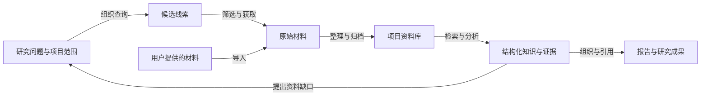

# MRW 项目能力清单

> 用途：寻找、比较和组合成熟产品，覆盖 MRW 的业务能力。整理日期：2026-10-02。
>
> 本文依据当前项目的功能入口、业务定义和已有实现整理，描述能力范围与业务交接要求。它用于选型需求对照；实际可用程度应通过业务样例确认，文末列出需要单独核验的范围。

相关文档：[MRW 实现清简方案](/Users/wangyiliang/market-research-workflow/docs/development/MRW实现清简方案.md)。

## 1. 产品目标与能力全景

MRW 围绕一个研究项目，把分散的信息来源转化为可检索的资料、可追溯的证据、可分析的关系和可交付的报告，并管理完成这些工作的任务与过程。

核心工作包括两种进入方式：围绕问题主动发现资料，以及接收用户已经持有的材料。两者进入同一个项目资料范围，供检索、分析、知识整理和写作反复使用。

| 编号 | 能力域 | 用户获得的结果 |
| --- | --- | --- |
| A | 项目空间与研究口径 | 独立的研究范围、材料、方法和成果 |
| B | 来源发现与来源资产管理 | 可反复使用的信息来源目录与候选资源池 |
| C | 多来源采集与材料接入 | 带来源信息的原始材料 |
| D | 资料整理与质量控制 | 去重、归类、可追溯的可用资料 |
| E | 项目资料库与检索 | 能定位原文的搜索结果与检索历史 |
| F | 专题调查与迭代检索 | 按研究方法组织的调查结果、缺口与续查方向 |
| G | 内容理解与结构化提取 | 摘要、要点、实体、指标和关系候选 |
| H | 知识组织与关系探索 | 可浏览、可追溯的专题知识与关系图谱 |
| I | 专题分析与数据展示 | 按时间、地区、主题等维度组织的分析视图 |
| J | 证据与引用管理 | 判断、原文、出处和报告之间的关联 |
| K | 研究写作与报告交付 | 可编辑、可复用、带引用的研究成果 |
| L | 智能助手与流程协同 | 从自然语言目标到多步任务的执行协助 |
| M | 任务管理与业务治理 | 可观察、可干预、可追查的工作过程 |

### 关键业务对象

这些对象决定了替代产品之间需要交接什么。

| 对象 | 含义 | 需要保留的关联 |
| --- | --- | --- |
| 项目 | 一组具有共同目标和范围的研究工作 | 研究口径、资料、任务、知识和成果的归属 |
| 来源 | 信息发布方、站点、栏目或可持续访问的信息入口 | 来源身份、适用主题、访问方式与历史使用情况 |
| 候选线索 | 检索或发现过程中遇到的潜在资料 | 发现问题、查询、轮次、位置与筛选决定 |
| 原始材料 | 已实际取得或由用户提供的内容 | 原始出处、取得时间、内容版本与正文 |
| 结构化知识 | 从材料中整理出的对象、属性、指标和关系 | 类型、项目语境及对应原始材料 |
| 证据与判断 | 用于支持或限定某个结论的材料片段及其解释 | 原文位置、引文、判断范围、冲突和不足 |
| 研究成果 | 写作草稿、专题报告或数据汇总 | 使用的资料、证据、引用与成果版本 |
| 任务与运行记录 | 一次实际工作的目标、过程和结果 | 使用的计划、输入、输出、失败原因和人工操作 |

## 2. 能力目录

下列编号可直接用于候选产品对照。一个产品可以覆盖多个能力域，同一能力域也可以由多个产品协作完成。

### A. 项目空间与研究口径

**目的：让不同研究项目分别维护自己的资料、方法和成果。**

| 编号 | 能力 | 可观察的业务结果 |
| --- | --- | --- |
| A1 | 项目创建与切换 | 创建、命名、启用和切换项目，进入对应工作空间 |
| A2 | 项目资料归属 | 检索、任务、来源、知识和写作结果关联到指定项目 |
| A3 | 初始内容与模板复用 | 从已有项目模板建立新项目，复用选定的初始内容与配置 |
| A4 | 项目研究口径 | 在已配置项目中使用主题、词表、分析视角、来源路线和检索规则 |
| A5 | 项目生命周期 | 归档、恢复和管理不再活跃的项目 |

**主要交接：** 项目名称与范围、研究口径、项目所属资料和成果。复用模板时，应明确哪些内容被复制，哪些结果属于新项目。

### B. 来源发现与来源资产管理

**目的：持续积累“到哪里找资料、哪些来源适合当前问题”的知识。**

| 编号 | 能力 | 可观察的业务结果 |
| --- | --- | --- |
| B1 | 信息入口发现 | 按主题、关键词、查询语言或已有页面发现候选站点、栏目和资源链接 |
| B2 | 来源目录维护 | 登记来源名称、地址、类别、用途、标签与启用状态 |
| B3 | 来源访问方式管理 | 为同一来源维护适用的查询或获取方式，以及必要的使用条件 |
| B4 | 候选资源池 | 保存、筛选、去重和批量选择待处理链接与资源 |
| B5 | 来源与资源转化 | 将候选资源整理为可复用来源条目，并继续发起获取任务 |
| B6 | 来源筛选与推荐 | 按项目、主题、标签和已有使用信息查找或推荐来源 |
| B7 | 共享来源与项目来源 | 分别维护共享目录和项目专属来源，在项目中合并查看适用条目 |
| B8 | 来源审核与生命周期 | 对候选入口作出采用、拒绝、待复核或停用决定，保留处理状态 |

**主要交接：** 来源目录、候选资源、来源与项目的关系、选择记录。应分别表达来源已登记、链接已发现和内容已取得。

### C. 多来源采集与材料接入

**目的：把外部信息和用户已有材料带入项目。**

| 编号 | 能力 | 可观察的业务结果 |
| --- | --- | --- |
| C1 | 指定链接获取 | 从单个或一组指定链接获取可处理的正文与来源信息 |
| C2 | 面向主题的批量采集 | 按关键词、时间范围、来源范围和数量限制取得一批材料 |
| C3 | 多类信息接入 | 接入已支持来源中的市场信息、新闻、政策、报告、社交内容和结构化数据 |
| C4 | 现有材料导入 | 接收文本、链接及入口支持的文件或结构化记录，保留用户给定的来源说明 |
| C5 | 来源库驱动的采集 | 从已经维护的来源条目直接发起采集，复用来源条件 |
| C6 | 批量结果与异常反馈 | 分别呈现取得、跳过、重复和失败的材料，以及失败原因 |

**主要交接：** 原始内容、来源、标题、发布时间或取得时间、所属项目和获取结果。具体平台及文件类型属于能力覆盖范围，需要逐项核验。

### D. 资料整理与质量控制

**目的：将杂乱材料整理为后续工作可以使用的资料。**

| 编号 | 能力 | 可观察的业务结果 |
| --- | --- | --- |
| D1 | 正文与元信息整理 | 从支持的材料中提取正文、标题、日期及来源信息 |
| D2 | 重复识别 | 识别相同地址或相同内容，减少重复资料和重复处理 |
| D3 | 基础规范化 | 统一材料类别、日期等基础信息的表达，保留原始来源 |
| D4 | 分类与标记 | 按市场、政策、社交等资料类别及项目所需标签组织材料 |
| D5 | 处理状态与不足记录 | 标识待处理、已处理、无法解析、内容不足等情况 |
| D6 | 后续处理衔接 | 将整理后的资料继续交给检索、摘要、结构化提取或分析任务 |
| D7 | 资料纠正与重新处理 | 单条或批量补充、合并、替换结构化内容，重新提取或删除指定资料 |

**主要交接：** 整理后的正文、基础属性、重复判断、处理状态和原材料关联。缺失日期、空正文和解析失败需要保持可见。

### E. 项目资料库与检索

**目的：快速找到已有资料，定位原文，并复用既往检索工作。**

| 编号 | 能力 | 可观察的业务结果 |
| --- | --- | --- |
| E1 | 资料列表与详情 | 浏览项目资料，查看正文、来源、时间和结构化内容 |
| E2 | 关键词检索 | 按词语、短语或查询条件查找已有资料 |
| E3 | 语义相关检索 | 按问题或语义相关性检索资料，在相应检索能力可用时返回相关内容 |
| E4 | 多条件筛选与排序 | 按资料类别、时间、主题及来源等条件缩小结果范围 |
| E5 | 检索历史 | 保存与查看查询历史，追溯此前搜过什么、得到什么 |
| E6 | 检索结果的后续使用 | 从结果进入原文、继续处理资料，或选入分析和写作上下文 |

**主要交接：** 查询条件、匹配资料、命中内容与原文位置。外部发现结果和项目内已保存资料应保留各自状态。

### F. 专题调查与迭代检索

**目的：围绕研究问题开展有范围、有步骤、可续查的调查。**

| 编号 | 能力 | 可观察的业务结果 |
| --- | --- | --- |
| F1 | 项目方法绑定 | 让查询、分析侧面和来源路线对应项目的研究总纲与版本 |
| F2 | 检索计划预览 | 在执行前查看本轮路线、查询范围、数量限制和不可执行项 |
| F3 | 有限范围执行 | 按选定计划开展检索，控制查询数、材料数和续查次数 |
| F4 | 调查过程留痕 | 保存每次搜索尝试、命中候选、评审结果和实际取得的材料 |
| F5 | 分面整理与缺口识别 | 按研究侧面归纳已有候选，记录尚缺资料或证据不足的位置 |
| F6 | 续查建议与继续执行 | 保存后续查询或线索扩展建议，并在既定范围内继续调查 |
| F7 | 部分成果交付 | 同时交付已经取得的结果、未完成部分及其原因 |
| F8 | 新信息发现 | 在支持的发现入口中排除已收录资料，寻找相对于已有资料的新候选 |

**主要交接：** 研究问题、方法版本、查询计划、逐次结果、材料、缺口和续查方向。采用替代方案时，应能从一份材料回到它所回答的问题，也能从一个问题找到已经取得和仍然缺少的材料。

### G. 内容理解与结构化提取

**目的：从长文本和分散资料中提取可复用的内容单元。**

| 编号 | 能力 | 可观察的业务结果 |
| --- | --- | --- |
| G1 | 摘要与要点提炼 | 将正文整理为摘要、核心要点和关键词 |
| G2 | 研究对象识别 | 从支持的资料中识别企业、产品、机构、地点等对象 |
| G3 | 专题字段提取 | 按已定义的专题口径提取政策属性、市场指标或社交内容属性 |
| G4 | 关系与判断候选 | 提取对象之间的关系及有材料支持的判断候选 |
| G5 | 引文与依据定位 | 把提取内容关联到原文片段与资料出处 |
| G6 | 不确定性表达 | 对证据不足、字段缺失或无法形成判断的材料记录缺口 |

**主要交接：** 提取内容、所属对象、原文依据、适用范围及不足。自动提取内容应保留其候选或待确认状态。

### H. 知识组织与关系探索

**目的：把多份资料中的对象、关系与线索组织为可探索的知识。**

| 编号 | 能力 | 可观察的业务结果 |
| --- | --- | --- |
| H1 | 专题知识条目 | 组织具有明确类型、项目归属和审核状态的知识条目 |
| H2 | 对象与关系组织 | 表达对象之间的关系、参与角色和来源关联 |
| H3 | 多主题图谱视图 | 查看市场、政策、社交，以及企业、产品、经营等专题关系 |
| H4 | 图谱交互探索 | 搜索、筛选、选择对象，查看邻近关系、对象详情和关联资料 |
| H5 | 分析结构与资料覆盖 | 在已配置项目中按研究侧面或分析位置查看关联信息 |
| H6 | 线索链管理 | 创建、扩展、评估和关闭研究线索链，保留线索之间的联系 |

**主要交接：** 知识对象、关系、参与角色、线索链、审核状态和证据引用。图中显示的来源线索、候选判断和正式知识需要保持区分。

### I. 专题分析与数据展示

**目的：观察资料与指标的分布、变化和关联，支持专题判断。**

| 编号 | 能力 | 可观察的业务结果 |
| --- | --- | --- |
| I1 | 项目与资料概览 | 查看资料量、类别分布、任务情况和近期变化 |
| I2 | 市场指标分析 | 在已支持业务口径下，按时间、地区或产品类别查看指标与趋势 |
| I3 | 政策分析 | 按地区、政策类型、状态和发布时间筛选政策并查看统计分布 |
| I4 | 社交内容分析 | 在已接入来源与提取口径下查看主题、内容互动和情感相关信息 |
| I5 | 采集覆盖分析 | 查看资料新增密度、重复程度、时间分布与优先补充方向 |
| I6 | 筛选结果追溯与交付 | 从统计视图查看对应资料，并以选定范围组织报告输入 |

**主要交接：** 指标定义、筛选条件、时间范围、原始资料和统计结果。不同领域的指标含义由具体项目规定。

### J. 证据与引用管理

**目的：让研究判断和报告内容有明确出处，能够被复核。**

| 编号 | 能力 | 可观察的业务结果 |
| --- | --- | --- |
| J1 | 来源溯源 | 保留材料出处、标题、发布或取得时间及原始位置 |
| J2 | 判断与证据关联 | 记录哪段原文支持、限定或关联到哪个判断 |
| J3 | 证据状态 | 在相应调查与知识流程中表达材料是否足以支持判断，以及冲突与缺口 |
| J4 | 引用收集与整理 | 将资料和证据选入写作引用集合，维护引用信息 |
| J5 | 正文与出处衔接 | 在稿件和导出内容中保留引用标记与来源列表 |
| J6 | 内容与引用质量检查 | 检查报告结构、引用覆盖和相关质量项，提示问题或按规则限制交付 |

**主要交接：** 原文片段、原始位置、材料身份、判断范围、引用信息和检查结果。来源已列出、证据已取得、判断已获得支持应分别表达。

### K. 研究写作与报告交付

**目的：把资料与分析组织为可编辑、可复用的研究成果。**

| 编号 | 能力 | 可观察的业务结果 |
| --- | --- | --- |
| K1 | 稿件管理与编辑 | 创建、查看、修改和删除项目稿件，预览正文效果 |
| K2 | 草稿保存与冲突提示 | 保存编辑中内容，提示与较新稿件之间的保存冲突 |
| K3 | 模板与章节组织 | 复用写作模板，按题目、章节和指定资料组织内容 |
| K4 | 大纲与摘录辅助 | 根据已有标题整理大纲，摘取选定内容的片段，并保留操作记录 |
| K5 | 资料卡片与引用协作 | 在写作时使用关键词卡片、信息卡片和引用集合 |
| K6 | 模板化专题报告 | 根据主题、来源材料及章节要求组织报告，并呈现质量检查结果 |
| K7 | 成果导出 | 导出可继续编辑或分享的稿件、报告和部分专题数据；不同成果入口具有各自的导出范围 |

**主要交接：** 稿件正文、章节结构、草稿状态、引用、采用的资料及交付文件。修改正文后应保持引用对应关系可检查。

### L. 智能助手与流程协同

**目的：让用户通过自然语言组织研究工作，并复用常见工作步骤。**

| 编号 | 能力 | 可观察的业务结果 |
| --- | --- | --- |
| L1 | 项目内对话协助 | 在当前项目上下文中提问、下达工作目标并查看结果 |
| L2 | 多步任务组织 | 在已开放能力范围内，把目标组织为采集、检索、处理、分析或写作等工作 |
| L3 | 工具与方法复用 | 查阅能力目录，复用已登记且可执行的工具与工作方法 |
| L4 | 流程编辑与模板 | 组合工作节点、连接步骤、配置参数，保存和复用流程模板 |
| L5 | 流程版本管理 | 查看模板版本、比较变更、启用或回退已有版本 |
| L6 | 人工介入 | 在规定环节查看请求、作出决定、取消工作或重试任务 |
| L7 | 会话与成果连续性 | 关联对话、任务、事件和生成物，继续已有工作并查找历史结果 |

**主要交接：** 用户目标、项目上下文、任务计划、过程记录、人工决定和结果。助手能够调用的能力、可执行的操作与当次授权范围需要保持清楚。

### M. 任务管理与业务治理

**目的：让工作过程可观察，失败可定位，重要操作可追查。**

| 编号 | 能力 | 可观察的业务结果 |
| --- | --- | --- |
| M1 | 任务总览与详情 | 查看等待、执行中、完成、部分完成、失败和取消等状态 |
| M2 | 任务过程与结果读回 | 查看任务输入、阶段、事件、产物和失败原因 |
| M3 | 异常干预与继续工作 | 在相应任务类型支持的范围内取消、重试或回收过期任务 |
| M4 | 执行范围限制 | 对资料数量、查询次数、续查范围及需要人工决定的动作设置边界 |
| M5 | 操作记录与责任追踪 | 记录重要修改、审批、流程版本变更和导出行为 |
| M6 | 业务可用性与质量观察 | 查看能力异常、任务失败、质量变化和影响范围 |
| M7 | 资料生命周期管理 | 按保留期限清理适用的历史资料、指标和任务记录，维护项目归档状态 |

**主要交接：** 任务状态、阶段结果、失败原因、操作历史和保留规则。重新执行时，应能辨认既有结果与本次新增结果。

## 3. 可以分别寻找替代产品的能力组合

以下分组用于组织候选清单。同一候选产品覆盖多个分组时，仍逐项比较其输入、输出和业务深度。

| 替代单元 | 覆盖能力 | 向下游交付什么 | 可使用的产品类别检索词 |
| --- | --- | --- | --- |
| 来源与信息获取 | B、C，以及部分 D | 来源目录、候选链接、原始材料、获取记录 | 信息采集、网页采集、媒体监测、社交聆听、来源管理 |
| 项目资料与检索 | A、D、E | 项目资料、搜索结果、原文位置、资料属性 | 研究资料管理、文档管理、知识库、企业搜索 |
| 专题调查与知识分析 | F、G、H，以及部分 J | 调查过程、结构化知识、关系、判断、证据、缺口 | 研究助手、情报分析、关系调查、知识图谱、质性分析 |
| 数据分析与展示 | I | 指标、趋势、筛选结果、关联资料 | 商业分析、数据看板、市场情报、政策监测 |
| 证据写作与成果交付 | J、K | 正文、章节、引用、报告及交付文件 | 文献与引用管理、研究写作、报告生成、内容工作台 |
| 工作协调与管理 | L、M | 工作计划、执行记录、人工决定、成果关联 | 智能助手、流程自动化、任务编排、研究工作管理 |

### 组合替代时需要保持的关系

1. **项目连续性：** 一项资料、一次任务和一份成果始终能定位到所属项目及研究范围。
2. **来源连续性：** 搜索命中、取得的正文、提取内容和报告引用之间保留可查询的出处关系。
3. **对象连续性：** 同一对象在资料、知识和报告中可以对应起来，重名对象保留区分依据。
4. **状态连续性：** 候选、已取得材料、待确认知识、已采用证据和已交付成果具有明确状态。
5. **版本连续性：** 本轮使用的方法、材料内容、流程和稿件可以确定，不因后续修改失去历史解释。
6. **过程连续性：** 可以看到部分成功、失败原因、人工决定和继续工作的依据。
7. **成果可带走：** 迁移时能够带走正文、必要属性、来源、引用及关键关系，迁出范围应在选型时验证。

## 4. 用四条业务样例比较候选方案

| 样例 | 连续操作 | 检查结果 |
| --- | --- | --- |
| 从问题到报告 | 建立项目 → 选择来源 → 检索和采集 → 整理资料 → 形成判断 → 撰写并导出报告 | 报告中的关键判断能找到对应原文与出处；资料不足的位置可见 |
| 从已有材料到专题知识 | 导入一批材料 → 去重归类 → 摘要与字段提取 → 组织对象关系 → 检索和浏览 | 原材料保留，提取内容有出处，关系中的对象可区分 |
| 从调查缺口到补充材料 | 查看已有调查 → 找到未覆盖侧面 → 形成续查计划 → 执行 → 对照新增结果 | 新旧轮次可辨认，新增材料对应具体问题，未完成部分仍可追踪 |
| 从异常到继续工作 | 发起多步任务 → 遇到部分失败 → 查看原因和已完成结果 → 人工干预或重试 | 已有成果可查，重试范围清楚，最终能看到实际完成与剩余缺口 |

对每个能力编号，可将候选方案记录为：**直接支持、配置后支持、扩展后支持、依赖人工、不支持、尚未确认**。附上实际完成的样例及得到的业务结果，便于区分名称相近但覆盖深度不同的产品。

## 5. 需要单独核验的范围

这些范围影响替代方案的匹配程度，也限定本文对现有项目的描述。

| 范围 | 当前整理口径 |
| --- | --- |
| 新领域适用性 | 已有部分领域和项目专用口径；迁入新行业时需核验来源、词表、字段、指标与报告结构的适配能力 |
| 完整调查到报告的衔接 | 项目已有检索计划、候选、材料、证据和报告相关能力；纯自动发现一路形成合格证据、正式知识和报告引用的完整业务路径仍需专项验证 |
| 来源与格式覆盖 | 每个平台、站点和文件类型的可访问性、正文提取及完整性需分别验证 |
| 图谱与知识质量 | 来源关系、调查结构、候选知识和已确认判断的展示含义需要分别核验 |
| 辅助写作与报告生成深度 | 当前确认的写作辅助主要是大纲整理、内容摘录和动作记录，专题报告以模板化组织为主；实质扩写、改写和综合论证能力尚需验证 |
| 智能助手的自主程度 | 已有对话、能力调用、任务与人工介入入口；复杂任务的完整自主拆解、持续调查和跨步骤成果衔接需专项验证 |
| 定期跟踪与主动通知 | 来源中有调度相关配置；面向用户的完整定期订阅、变化预警和通知能力尚需确认 |
| 团队协作与权限 | 项目隔离、人工决定和操作记录已有对应能力；多人实时共同编辑及完整组织权限体系尚需确认 |
| 数据迁出与成果导出 | 已有稿件、报告和部分数据的导出能力；全部项目资料及关系的一次性完整迁出尚需确认 |
