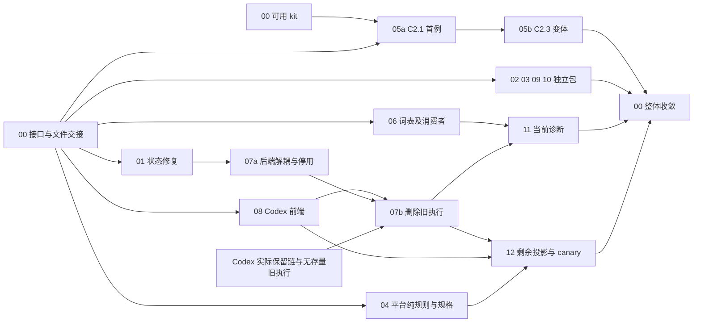

# MRW 清简分阶段实施分发包

> 后续结构整理：[MRW结构整理方案与分发包](MRW结构整理方案与分发包.md)（2026-10-04，实施结果见该文 §8）。最高优先退役现用产品、API身份和当前文档中的开发编号语义，统一为真实业务名称；本文原编号仅保留实施与证据追溯，不作为后续操作入口。既有结果及事实归属保持原义。

> 日期：2026-10-03。状态：S0–S3 已完成；SIMP-00–12 全部收口，统一门禁与真实保留链通过，最终验证记录见 §7.3。彩票与旧 Agent Core/C6 当前执行面已退役，structured batch、共享工具/session 和历史持久数据按真实消费者保留。本文中的包号表示职责，不表示系统组件。
>
> 设计与证据统一引用 [MRW 实现清简方案](/Users/wangyiliang/market-research-workflow/docs/development/MRW实现清简方案.md)：§3 的 Q1–Q6 定义业务变化，§7 的 A1–A12 给出审查证据，§8 定义现有设施复用，§9 定义实施框架。本文是清简任务的阶段、分发与共享写面入口。

> 清简实施结果入口为 §7.3；2026-10-04 全量上线就绪核查见 §7.4。§7、§7.1、§7.2 保留过程快照，旧 blocker 和当时状态不覆盖最终收口。

## 1. 下发公共合同

下发时同时提供本节、所选包、其依赖交付和验证入口。代码作者不必重读全部历史。

- **工作根：** `/Users/wangyiliang/market-research-workflow`。下文 `B` 为 `main/backend`，`A` 为 `main/backend/app`，`F` 为 `main/frontend-modern`，`S` 为 `src/mrw_functorial_kit`，均相对此根。这是文档路径缩写，不是待设置的环境变量。
- **目的：** 保留通用平台；只保留 Codex Core/Codex WebUI；消除已确认的重复规则、派生状态回写、失效兼容及历史诊断。供应商替换、发布、迁库与新 runtime 不属于本轮实施。
- **修改约定：** 你不是唯一作者。先看目标文件当前 diff；保留用户、现有检索任务与其他作者的修改，不 reset、stash、批量格式化或覆盖。分发前由 SIMP-00 交接明确文件；交接未解决只阻断该写面。
- **职责：** 只写本包列明文件。新增文件限于本包已有模块内确需的公共函数或测试，并在首次回传注明确切路径。共享文件交给 SIMP-00 合入；不要另写一套注册、解析或投影绕过规则缺口。
- **语义：** 领域定义、特殊内核与独立见证由作者给出；确定的合同、引用、注册和检查接线由已有规则派生。保留身份、顺序、权限、失败、持久化和历史版本边界。纯函数复用不新增贡献协议。
- **推进：** 子 Agent 默认不再分派。普通返工留在原包；共享规则失败回到其 owner，其他无依赖包继续。包内步骤无需逐次用户确认，也不逐修冻结。
- **验证：** 使用 §4 的原 runner；执行前确认被测文件稳定和资源已交接。`skip/blocked/not_run` 不计通过；真实业务读回、mock、静态检查分别记录。有效结果在输入与环境未变时复用。
- **回传：** `结果 / 实际改动文件 / 验证命令与原退出码 / 已删除副本及保留适配 / 风险和具体 blocked_by`。不要宣称未运行的集成或发布通过。
- **模型建议：** 主线保留结构判断、公共接缝和最终集成；契约明确的小包可用 GLM Flash/low，跨文件迁移可用 GLM/high。实际派发按当时工具目录选择，不向工具提交未提供的型号；主线不以模型偏好阻断工作。

遵守 [19 号流程缩减规则](/Users/wangyiliang/market-research-workflow/development/latest-dev-docs/development-plans/CURRENT_DEV/2026-09-04-formal-production-release/19_direct-testing-batch-freeze-amendment.v1.md)。清简阶段用 S0–S3 命名，与已停止的生产 Stage 4–6 分开；不改变其验收历史和延后发布状态。

## 2. 阶段与依赖

### 2.1 四阶段推进

| 阶段 | 主要工作 | 可并行内容 | 进入后继的实际条件 |
|---|---|---|---|
| S0 固定边界 | SIMP-00 固定接口、owner、kit 版本选择和测试资源；完成三条代表链的职责核对 | 各包只读准备；不依赖新公共规则的包拿到文件交接即可开始 | 相应包的接口与文件交接完成；kit 环境未就绪只阻断需要它的分支 |
| S1 局部收敛 | SIMP-01–06、08–10；SIMP-07a 在 01 交接后进行 | 状态修复、写作、抽取、平台纯函数、词表、前端、launcher、来源聚合的独立写面 | 每包原消费者与局部验证成立；05 内先完成首例再迁第二例 |
| S2 消费者迁移与退役 | SIMP-07b、11、12 | 07b 后，11 与 12 在各自接口和文件交接完成时并行；S1 未完成的无冲突包继续 | 旧执行不能启动，存量执行已按原接口结束；诊断与会话消费者迁移闭合 |
| S3 整体收敛 | SIMP-00 统一同步、构建、适用 gates、真实用户链及删除清单核对 | 只读证据汇总可并行；共享 build、服务和数据库验证排队 | §6 的完成条件满足，所有未验证范围明确；不以包级通过代替整组完成 |

阶段表示依赖层次，不设置“上一整批全绿才能开始下一包”的总屏障。准备、编码、共享接线、运行验证分别按真实依赖启动。

### 2.2 分发矩阵

`SIMP-00.C` 是本包所需接口/文件交接，`SIMP-00.K` 是可用 kit 与依赖环境，`SIMP-00.R` 是所需测试资源；三者是同一集成职责的交付，不创建额外审批任务。表中省略各包共有的 C 和验证前所需的 R。

| 包 | 对应范围 | 硬依赖与包内顺序 | 独占写面摘要 | 开发时可并行 |
|---|---|---|---|---|
| SIMP-00 | 框架、层级职责、共享接线、整组集成 | 持续职责；S3 消费全部包 | 两份清简文档、依赖声明、全局 catalog/registry、全局 API/配置/组合入口、共享前端类型 | 与独立包；修改共享输入时暂停对应消费者验证 |
| SIMP-01 | A1；Q4 的即时行为修复 | 无业务前置；先于 07a 和 12 的同文件写入 | agent_sessions/service、agent_batch 投影及相关测试 | 02–06、08–10 |
| SIMP-02 | Q5/A2 | writing v2 接缝由 00.C 固定 | writing action/API/schema、前端 writing domain 与专属检查 | 01、03–10 的不相交写面 |
| SIMP-03 | Q1/A8 | 复用现有 HTML 正文抽取核 | ingest 三个抽取文件与抽取专属测试 | 其他独立包；不改来源 resolver；彩票 adapter 已随整体退役退出 |
| SIMP-04 | A3/A5 | AST 与 P1 两个局部共同规则分别验证 | language/program、三个 AST 消费者、shared generator、七个规格模块 | 05；不写任何能力 assembly 或历史证据 |
| SIMP-05 | A4、§8.2/8.4 | 00.K → 05a C2.1 首例 → 05b C2.3 外部效果变体 | C2 能力构造、native rule、c2_assembly、专属测试 | 03/04/06；全局贡献装配由 00 合入 |
| SIMP-06 | A12、§8.3 | 先轻量原生词表和一个脚本首例，再迁其他消费者；先于 11 | 词表新模块、C9/API 中词表引用、列明的 15 脚本及对应测试 | 01–05、07–10；business_lines 文件在 11 前交接 |
| SIMP-07 | Q2 后端 | 01 → 07a 解耦与停用入口；07a + 08 + Codex 实际保留链 + 无存量旧执行 → 07b 删除 | 旧 Core/runtime、native binding、MCP 工具入口、旧 NL 后端接缝 | 08 前端开发可提前；session/service 始终不属于本包 |
| SIMP-08 | Q2 前端、§8.6 | 00.C 的 native/退役合同；真实联调等 07a | Codex/旧聊天页面、kernel manifest/renderers、采集 NL 控件、专属客户端与 e2e | 07a 及其他页面包；全局 types 交 00 |
| SIMP-09 | A10 | launcher 端点合同保持；如 07 需改端点，由 00 先统一 | launcher-ui 两份 JS、共同模块和必要 HTML 加载入口 | 其余包；同一 launcher 页面运行验证串行 |
| SIMP-10 | Q3/A9 | 已确认的候选聚合接缝；独立于 HTML 改动 | source_library/resolver、handler_cluster、公共纯函数与专属测试 | 03；资源池/frontdoor 保持原消费者 |
| SIMP-11 | Q6/A11 | 06 释放词表消费文件；最终当前能力字段依赖 07b；页面准备可提前 | business_lines API、Ops/Dashboard、诊断脚本和相关测试 | 12；共享前端类型由 00 单写 |
| SIMP-12 | Q4 剩余删除、A6 | batch/session 投影收尾依赖 01 + 07b + 08；C6 consumer/证据分类可先并行准备，C6 组合或 canary 退役依赖 07b + 08 及 C6 专属消费者交接；C6 规格/生成链改动由 00 协调 | batch/session 剩余投影、C6 组合/canary 的范围判定与适用收尾、确需保留时的 C2/C6 共同纯规则 | 11；不反向补回旧聊天消费者 |

以下图只表达硬依赖；独占文件与测试资源约束见 §3，不由图中的并列节点推定互不影响。



图中的编号均对应本节同一个包。SIMP-07b 的运行条件由 SIMP-00 在实际环境核对；离线准备可继续，条件未知时保留具体未完成项。

## 3. 写面和测试资源如何串行

| 共享面 | 唯一写入与交接次序 | 消费规则 |
|---|---|---|
| `A/api/agent_batch.py` 与对应测试 | 01 → 07 → 12 | 07 不写 session service；12 只在旧消费者退出后删投影，保留 01 的重复读取见证 |
| `A/services/agent_sessions/service.py` 与 session 测试 | 01 → 12 | 07/08 只读使用；所需合同变化经 00 协调后由当前 owner 实现 |
| `A/api/business_lines.py`、15 个脚本及相应 checker 测试 | 06 → 11 | 06 只收敛词表；11 再改诊断结构，不同包不同时改同文件 |
| `A/services/agent_core/project_tools.py`、MCP bridge | 07 获既有检索任务明确交接后单写；00 维护交接 | 只改退役需要的接缝；候选/检索能力当前改动保留 |
| 被 C6 恢复/复核引用的旧模块，包括 `A/successor_migration/legacy_agent_core.py` | 07 先断开在线执行；12 确定余留消费者后，由 07 向 00 交接最终删除 | 07b 不提前破坏仍保留模块的 import；00 在 S3 删除已解除依赖的余留文件，不新增旧执行入口 |
| `A/composition/`、`A/api/__init__.py`、共享 settings/startup、`contributions/`、`S/contributions/`、registry/sketches | 00 单写/同步 | 05/06/07 提供原生定义和所需接入；不手改生成物，局部作者不运行 sync |
| `F/src/lib/types.ts`、API 聚合入口及其他全局导出 | 00 单写 | 02/08/11 分别提供已定 writing/native/diagnostic 形状；各自 domain 文件仍归原包 |
| `F/src/app/kernel/{moduleManifest,moduleContributionRule,types}.ts` | 08 单写 | 02/11 不借功能迁移重新维护模块清单或改 kernel 类型 |
| kit checkout、依赖文件和安装环境 | 00 单写 | 固定版本更新与安装期间，暂停使用该环境的检查；本轮不扩展 kit 本体 |

既有 [检索分发计划](/Users/wangyiliang/market-research-workflow/main/backend/docs/INFORMATION_RETRIEVAL_IMPLEMENTATION_DISPATCH_PLAN.md) 当前使用 R0–R6。清简包不会自动接管其文件；SIMP-00 核对实际在途作者并完成文件交接后再下发，不能从旧 M 编号或历史完成声明猜 owner。

| 测试资源端口 | 读写与默认并发规则 | owner 必须确认的内容 |
|---|---|---|
| 当前源码输入 | 测试读取；作者修改为写入 | 同一被测依赖修改时不运行/复用该测试；无依赖的只读检查可并行 |
| 后端 mock/tmp fixture | 每包独立临时目录；固定目录则串行 | 先读 fixture，确认没有真实 DB、队列、provider、缓存或共享结果文件写入 |
| 前端 build 与 TypeScript 输出 | 写 `F/dist`、构建缓存；统一串行 | 02/08/11 成组稳定后由 00 运行；不同时 build/storybook |
| Playwright | 开发服务、端口、report/test-results 有写入，默认串行 | 拟用 4196 先查占用；显式绑定隔离 API/Codex target，不能借用户服务做写测试 |
| DB/Redis/Celery/项目数据 | 有写入的同实例/队列串行 | 独立数据库、队列和 project key 不足以自动证明隔离；确认 reset、锁和固定 fixture 影响范围 |
| C7/Postgres canary | 某些测试重建固定测试库，独占整个测试服务 | 00 分配专属服务器；不连接共享数据库；仅受影响路径才运行 |
| Codex/WebUI/launcher/provider | 认证、session、进程与外部调用有可观察效果 | 同一宿主/账户/会话串行；保留项目范围和原授权，端口不同不代表 provider 独立 |
| sync/check/gates 的派生输入 | sync 写共享 registry/sketches，check/gates 读一致产物 | 00 统一执行；只冻结该依赖面的写入窗口，不停止整个仓库开发 |

未确认隔离的测试默认排队。代码开发可并行，验证并发需要独立证据；主机并发上限由资源实际情况决定，不按包数量直接开满。

## 4. 统一验证入口

后端命令复用主方案 §5.1 的 `bk_test`，由 SIMP-00 一次核对 Docker 测试入口、只读源码挂载、kit 导入来源和 fixture。其参数是相对 `B` 的 `tests/...`。Docker 不适用时统一切换到同节 `m_test`，不让每个包重新摸索环境；本地 Python 为 `B/.venv311/bin/python`。命令必须在取得 §3 的测试资源后运行。

主方案 §5.2 的 V1–V6 是成组验证范围；下面包内命令先定位受影响行为，成组稳定后补齐适用 V 范围。新增有效用例写入既有相关测试；删除测试先迁移其仍有效的断言。

根目录 checker 使用现有 pytest 环境，示例入口如下。运行该命令只选择测试，不启动脚本中的 live runner：

```bash
cd /Users/wangyiliang/market-research-workflow
PYTHONPATH=/Users/wangyiliang/market-research-workflow:/Users/wangyiliang/market-research-workflow/src:/Users/wangyiliang/market-research-workflow/main/backend:/Users/wangyiliang/Desktop/functorial-kit/python \
PYTHONDONTWRITEBYTECODE=1 main/backend/.venv311/bin/python -m pytest -p no:cacheprovider -q -rs \
  tests/checkers/test_check_business_line_batch_coverage_unittest.py \
  tests/checkers/test_check_business_line_task_readback_manifest_unittest.py \
  tests/checkers/test_build_business_line_async_task_readback_artifact_unittest.py
```

共享前端检查由 00 在对应包稳定后执行，使用现有依赖，不临时安装或改 lockfile：

```bash
cd /Users/wangyiliang/market-research-workflow/main/frontend-modern
npm run check:topology-platform
npm run check:writing-workbench-contract
npm run build
```

每条命令单独保留退出码；前一条失败不因后续命令成功变成通过。真实 Codex、材料读回与 provider 场景沿主方案 §5.2–5.3 的原入口，由 00 选定实际隔离资源后执行；mock 结果不代替这些场景。

## 5. 可直接下发的工作包

### SIMP-00 — 框架、共享接缝与整组集成

- **目标/输入：** 以主方案 §2/§9 固定唯一事实源和层级职责；读取既有 R 计划的当前写面。依据 S0 的三条链核对，把每层判定为有独立职责、可由现有规则派生、可合并或需保留有消费者的适配。
- **输出：** 本文 §7 中更新实际 owner、接口交接、资源与局部缺口；每个发现落回下属包或本 owner 的共享写面。固定 kit 版本、writing v2、native/retired 请求、诊断 v2、词表导出五个接缝。不给每个小变化新建合同。
- **独占写面：** §3 的公共文件；两份清简文档；依赖文件；必要共同验证接线。真实 kit API 已存在时只更新依赖，不把项目精简升级为 kit 新功能开发。
- **验证命令：** `main/backend/.venv311/bin/python scripts/dev.py inspect --id mrw.successor.c8.c8-2.writing.v1`；有实际声明变化后执行主方案 §5.3 的 sync/check/gates。固定依赖安装的干净测试环境也须能导入所用 API，本地 editable 成功不代替该结果。
- **完成：** 包状态与真实交付相符、共享物一致、受影响原消费者通过、§6 满足。若必要公共接缝未定，只暂停依赖它的包。

### SIMP-01 — batch 重复读取的状态修复

- **目标/输入：** Q4/A1；`_project_agent_session_from_job_state` 与 `AgentSessionService` 现有 writer。此包先修复重复写事件，不等旧 UI 退役。
- **输出：** 相同终态 snapshot 重读不追加 `task.completed`、不刷新 `completed_at`；真实任务转换仍产生一次正确记录。核对实际 storage 写入入口，不能只改一个返回字段。
- **独占写面：** `A/services/agent_sessions/service.py`、`A/api/agent_batch.py` 的投影片段，`B/tests/unit/test_agent_sessions_service_unittest.py`、`test_agent_batch_api_unittest.py`；确有 store 缺陷时通过 00 交接原 store。完成后交 07/12。
- **验证命令：** `bk_test tests/unit/test_agent_sessions_service_unittest.py tests/unit/test_agent_batch_api_unittest.py tests/integration/test_agent_sessions_api_unittest.py`；在这些文件补同 snapshot 两次读取和一次真实转换见证。
- **完成：** 事件数量、完成时间及原业务状态读回符合约定；有数据写入的验证按 R 资源执行，不改 batch 存储方案。

### SIMP-02 — 写作结果与状态一致

- **目标/输入：** Q5/A2；现有模板动作和 job history。保留内容、权限、审计和原错误语义，按主方案 writing v2 明确同步执行。
- **输出：** 删除伪排队分支；response/job/readback 一致；`requested_async/execution_mode/async_honored` 与 warning 表达真实请求和执行情况。前端正确消费完成结果。
- **独占写面：** `A/services/writing/llm_action_service.py`、`A/api/writing.py`、`A/contracts/schemas/writing.py`、`F/src/lib/api/domains/writing.ts`、写作专属 mock 与 `F/scripts/check_writing_workbench_contract.mjs`；全局 types 由 00 合入。
- **验证命令：** `bk_test tests/unit/test_writing_llm_action_service_unittest.py tests/integration/test_writing_llm_actions_api_unittest.py`；前端 `npm run check:writing-workbench-contract` 在 `F` 执行；成组补 V5。
- **完成：** async true/false 的实际正文可取得，当前同步行为有明确版本身份，历史读取仍有效；没有新队列或新 worker。

### SIMP-03 — 正文定位共用规则

- **目标/输入：** Q1/A8。复用现有正文定位核，收敛 `raw_import` 与 `url_pool` 中的重复定位循环。
- **输出：** 两份正文定位副本使用既有抽取核；保持选择器、120 阈值、清洗/截断、空输入和异常行为。
- **独占写面：** `A/services/ingest/{content_extraction,raw_import,url_pool}.py` 及抽取专属测试。先与既有检索 R3/R4 交接这些文件。
- **验证命令：** `bk_test tests/unit/test_content_extraction_unittest.py tests/unit/test_raw_import_structuring_unittest.py tests/unit/test_source_library_url_pool_adapter_unittest.py`；成组补 V1。
- **完成：** 使用固定 HTML fixture 比较原入口输出、正文/hash；given/PDF 路径保留，不以访问外站代替解析回归。彩票 adapter/handler 已按整体退役边界退出，不属于本包改动；MarketStat ORM/schema 保持 persistence-only 保全用途。

### SIMP-04 — 平台纯遍历与规格资料读取

- **目标/输入：** A3/A5；现有 Program AST 与 shared family generator。分别在原语言层和规格层收敛公共函数，不把两种规则合并成新框架。
- **输出：** 一份全部静态分支的有序 atom 遍历；一份有 root、编码、缺 cell/重复 cell 合同的 P1 读取/摘要规则。先接一名真实消费者，再迁其同形副本。
- **独占写面：** `A/successor_runtime/language/program.py`；`substrate/postgres/{captured_values,first_specimen_handlers,first_specimen_delivery_handler}.py`；`specification/shared_family_generator.py`、`c2_p3.py`、`c3_p3.py`、`c4_p3.py`、`c5_p3.py`、`c6_p3.py`、`c8_p4.py`、`c9_p4.py`，均在 `A/successor_runtime/`；相应原测试。能力 assembly 和冻结证据只读。
- **验证命令：** `bk_test tests/successor_runtime/test_program_ast.py tests/successor_runtime/test_p0c_first_specimen_handlers.py tests/successor_runtime/test_p0c_first_specimen_delivery_handler.py tests/successor_runtime/test_shared_family_generator_all.py`。
- **完成：** 三个 AST 消费者与七个规格消费者使用公共规则，顺序和失败保持；不使用会重新排序的 `fold_ordered`。需新字节证据时由 00 按真实交付合同处理，不能覆盖历史绑定。

### SIMP-05 — C2 共同构造规则及实际复用

- **目标/输入：** A4/§8.2；kit `NativeContributionRule`、C2 原 profile 工厂/codec/失败定义、原 c2 assembly。00.K 是使用这些 API 的环境前置。
- **输出与顺序：** 05a 在现有 capability 层把 C2.1 的 profile→ref/OperationContract/codec/map 拼装收敛到一处，走通原 assembly；05b 再接 C2.3 provider effect，删除第二份拼装。verification 接回既有槽；需要公共规则补丁时仍由本 owner 修改。
- **独占写面：** `A/successor_runtime/capabilities/{source_library_c2_1,source_library_c2_3,source_library_c2_native_contribution}.py`、确需的 C2 公共构造模块、`assembly/c2_assembly.py` 与专属测试。`S/contributions/c2.py` 和生成注册由 00 接入，不各自生成第二套 catalog。
- **验证命令：** `bk_test tests/successor_runtime/test_p2_c2_1_contracts.py tests/successor_runtime/test_p3_c2_3_contracts.py tests/successor_runtime/test_c2_native_catalog.py tests/successor_runtime/test_i1_live_provider_wiring.py`；provider wiring fixture 通过仅证明绑定，实际外部效果按受影响范围另验。
- **完成：** 两类原消费者、一个有意义的非默认声明通过；权限、codec identity、ref/digest 和失败保持。新增 wrapper 而旧 builder 全部保留不算完成；不把 C8 pure 默认值套到 C2.3。

### SIMP-06 — 业务线词表单源与脚本消费者

- **目标/输入：** A12；当前 C9/API 的七条业务线、四条 worker 子集及 §5.1 列表。历史 checker 保持版本身份，独立 oracle 保留。
- **输出：** 计划把轻量原生定义放在 `S/business_line_vocabulary.py`，只用标准库表达 literal/成员与子集，避免导入聚合了其他模块的 `core/__init__.py` 或 `app/contracts/__init__.py`；正常贡献路径引用它派生 Vocabulary/registry。先 C9、API 和一个独立脚本打通，再迁其余适用消费者。脚本统一复用现有 bootstrap/导出入口，不复制加载协议。
- **独占写面：** 上述计划新文件；`A/successor_runtime/capabilities/c9_evidence_matrix.py`、`A/api/business_lines.py` 的词表声明/import；§5.1 的 15 文件，必要的 `scripts/_automation_runtime.py` 共享导入接缝和相应 checker 测试。C9 native 注册接线交 00。完成后向 11 交接 API、脚本与测试。
- **验证命令：** `bk_test tests/successor_runtime/test_s2b_c9_evidence_matrix.py tests/core_business/test_business_line_evidence_contract.py`；运行 §4 的根 checker 命令，并覆盖实际修改到的其余 checker；独立脚本从仓库根和绝对路径调用的导入行为均须验证。
- **完成：** 当前版本的成员只维护一份；API/C9/脚本不加载业务执行器就能读取；15 文件中的每处重复分别记为迁移或有版本依据的保留，不强制历史语义随当前词表变化。

#### 5.1 SIMP-06 的脚本写面

本表由本轮 AST 字面量检查得到，15 文件、19 处成员集合；SIMP-11 后续只修改其中实际依赖诊断结构的消费者。

| 根目录相对文件 | 重复集合 |
|---|---|
| `scripts/build_business_line_async_readiness_artifact.py` | 全集 |
| `scripts/build_business_line_async_task_readback_artifact.py` | 全集、worker 子集 |
| `scripts/build_business_line_real_backend_browser_artifact.py` | 全集 |
| `scripts/build_business_line_task_readback_manifest_from_runtime.py` | 全集、worker 子集 |
| `scripts/check_business_line_async_readiness_artifact.py` | 全集 |
| `scripts/check_business_line_async_task_readback_artifact.py` | 全集、worker 子集 |
| `scripts/check_business_line_batch_coverage.py` | 全集 |
| `scripts/check_business_line_real_backend_browser_artifact.py` | 全集 |
| `scripts/check_business_line_task_readback_manifest.py` | worker 子集 |
| `scripts/check_business_line_trace_baseline_artifact.py` | 全集 |
| `scripts/check_business_line_user_flow_smoke_artifact.py` | 全集 |
| `scripts/run_business_line_async_task_readback_live_samples.py` | 全集、worker 子集 |
| `scripts/run_business_line_trace_baseline_live.py` | 全集 |
| `scripts/run_business_line_user_flow_smoke.py` | 全集 |
| `scripts/run_business_line_worker_readback_smoke_triggers.py` | worker 子集 |

### SIMP-07 — 后端 Codex 单一执行与旧内核退役

- **目标/输入：** Q2 的完整保留/删除表、既有 native binding 和 MCP 工具合同。共享能力按实际依赖判断，目录名不构成整目录删除授权。
- **07a 输出：** 接收 01 的 agent_batch 文件后，解除共享 registry/contracts 对旧循环的自动导入；保留结构化 jobs；旧 runtime/NL/审批续接请求在执行前返回明确退役错误；缺少 native 选择不再默认旧 Core。先确认两条现有保留链：`/codex/` iframe WebUI 自身的认证/turn/thread 生命周期，以及 MRW `agent_macro_native` 的只读工具和 project-scope 读回。两者是不同宿主、thread 和 store；没有实际 host registration/bridge 证据时不拼接为一个工具调用链。
- **07b 输出：** 08 接入、保留链实际验证、旧存量任务自然结束或经原取消接口结束后，删除无消费者的旧 loop/provider 专属包装、旧 runtime/NL fallback 和配置。C6 恢复/复核仍引用的文件具名交给 12 判断，保持余留导入有效；07b 的交付是旧运行路径退出，最后一批文件删除由 00 消费 12 结果收口。历史消息/任务数据保留，不能重放旧待批准动作。
- **独占写面：** `A/api/agent_chat.py`；`A/services/agent_core/` 与 `agent_runtime/` 中逐项确认的退役及共享解耦文件；`services/llm/{codex_app_server,codex_macro_binding}.py` 必要接缝；`B/scripts/mrw_mcp_server.py`；`A/api/agent_batch.py` 与 `services/agent_batch/agent_loop.py` 的旧 NL 部分；`A/successor_migration/legacy_agent_core.py` 及相关专属测试。C6 canary 留给 12；session/service 留给 01/12；全局配置/路由/注册交 00。
- **验证命令：** `bk_test tests/unit/test_codex_native_macro_binding.py tests/integration/test_agent_macro_entry.py tests/integration/test_agent_chat_api_unittest.py tests/integration/test_codex_auth_agent_guard_unittest.py tests/unit/test_agent_batch_api_unittest.py`；同步更新退役语义后补 V2/V4。用 00 分配的宿主分别验收 WebUI auth/turn/thread 的 continue/stop，和 native turn→`project_retrieval.read_run`→`binding.project_key/scope_id`/run 读回。只有实际宿主证明 MRW tool 已注册进 WebUI，才在 WebUI 同一 thread 验证该 tool/scope；native API 的结果不抵扣 WebUI 工具验收。WebUI iframe stop 不证明 native endpoint 支持 stop。
- **完成：** 旧入口不可启动且无自动回退；必要工具、权限、session 与错误继续可用；不能用 mock 或页面项目标签证明真实 project scope。

### SIMP-08 — Codex 唯一 Agent 页面与模块映射

- **目标/输入：** Q2、§8.6；保留当前 CodexAgentPage 与 `/codex/` proxy。07a 的协议由 00.C 提前固定，前端开发不等后端全部删除。
- **输出：** compat hash 导航到 Codex；旧聊天页/hooks/styles/stories 与采集 NL 控件退出；原直接采集保留。`defineModule(moduleKey,...)` 直接构造固定前缀 title/nav key，保留翻译、排序、分组和明确例外。
- **入口认证收尾：** 实际 WebUI 位于独立工作树 `/Users/wangyiliang/.codex/manual-worktrees/mrw-functorial-successor-p0/main/ops/codex-webui`，不是 MRW 根下的普通目录。手工 API-key 页面已退出，缺 token 时调用现有 bootstrap，旧 `/login` 导向首页，过期时重新引导；WebUI session 退出控件已同步删除，Codex account 登录保持。后续须核对公开 bootstrap 与 wildcard listener 的可信访问边界；API/WS 要求 JWT 不单独证明 JWT 签发安全，Origin/Fetch Metadata 也不作为远端客户端身份。以实际 localhost 与 MRW proxy 来源决定最小修复，不能为便于自动进入放宽 API/WS guard。
- **独占写面：** `F/src/pages/{AgentChatPage,CodexAgentPage,IngestPage}.tsx`、旧聊天专属 hooks/style/story、`hooks/useIngestActions.ts`、`app/kernel/{moduleManifest,moduleContributionRule,types}.ts`、相关路由与专属 API domain、对应 e2e。`F/src/lib/{api.ts,types.ts}` 等全局聚合文件交 00；不改 writing/Ops 页面。
- **验证命令：** 在 `F` 执行 `npm run check:topology-platform`；`FRONTEND_E2E_PORT=4196 npx --no-install playwright test tests/e2e/agent-chat.spec.ts tests/e2e/ingest-single-url.spec.ts --workers=1 --reporter=line`；成组补主方案 Q2 前端范围。
- **完成：** 无旧页面/旧 NL 控件可触发执行，旧 hash 不重放消息；Core 不可用明确呈现；真实 WebUI 生命周期证据与 07 共用一次有效运行结果。MRW native tool/scope 作为另一链单独验收；除非宿主真实注册，不声称它运行于 iframe thread。

### SIMP-09 — launcher 两页共用状态与登录显示

- **目标/输入：** A10；两页现有 `/api/launcher/codex/status` 与 bootstrap 行为。
- **输出：** 一个 launcher 内公共 JS 模块，保留首页启停与设置页保存。按当前 script 加载方式接入，不引入构建框架或 kit。
- **独占写面：** `main/ops/launcher-ui/{app.js,settings.js,index.html,settings.html}` 和确需的新公共模块；Dockerfile 仅在发布新静态文件需要时改动。
- **验证命令：** `node --check main/ops/launcher-ui/app.js` 与 `node --check main/ops/launcher-ui/settings.js`；对实际新增公共 JS 同样执行 `node --check`。静态语法通过后，在 00 的 launcher 环境核对两页加载、status 失败呈现、设备码/登录显示和原启停/保存行为。
- **完成：** 两页消费同一状态/登录显示逻辑；首页和设置职责保持；MRW token 与外部 WebUI JWT 仍按宿主分别维护。语法检查不计 UI 验收通过。

### SIMP-10 — 来源候选聚合的共同纯规则

- **目标/输入：** Q3/A9；两个 handler 已有 `unified_search_by_item_payload` 与 ItemResolver，不改来源 mode/handler owner。
- **输出：** 只共用已确认相同的关键词/限额/URL 去重/统计计算；错误去重差异、先到顺序、并发、terminal-output、auto-ingest 明确保留。逐原入口比较重构前后，不要求两个入口互相等价。
- **独占写面：** `A/services/source_library/resolver.py`、`adapters/handler_cluster.py`、同模块公共纯函数和专属测试。原 collect_runtime、资源池、frontdoor、project_tools 默认只读；真实接线变化交 00 与既有 R5 协调。
- **验证命令：** `bk_test tests/unit/test_source_library_handler_cluster_unittest.py tests/unit/test_source_library_handler_cluster_frontdoor_unittest.py tests/unit/test_source_library_item_resolver_unittest.py tests/unit/test_source_library_terminal_output_unittest.py`；成组补 V3。
- **完成：** 两入口使用共同规则且 query/limit/candidate/ingest 含义保持；候选不误作入库，授权写入只发生一次；真实物化样例沿原资源池和材料入口读回。

### SIMP-11 — 当前诊断 v2 与全部有效消费者

- **目标/输入：** Q6/A11；06 的词表及明确版本，07b 的实际退役结果。审查历史树每个仍有效字段的消费者，不只看两个页面。
- **输出：** 当前能力描述与实际观测分开，失效批次叙述退出；有效 readiness、worker/readback、恢复、reset telemetry 字段迁入当前合同。历史 v1 按原版本解释，v2 消费者同步切换。
- **独占写面：** 接收 06 释放的 `A/api/business_lines.py`、诊断相关脚本与 checker；`F/src/pages/{OpsPage,DashboardPage}.tsx`、其专属类型/fixture 和 e2e；相关 V6 后端测试。全局前端 types 仍由 00 合入。
- **验证命令：** `bk_test tests/core_business/test_business_line_evidence_contract.py tests/successor_runtime/test_s2b_c9_evidence_matrix.py tests/unit/test_admin_dashboard_consumer_boundary_unittest.py`；根 checker 入口见 §4，覆盖实际迁移脚本；在 `F` 执行 `FRONTEND_E2E_PORT=4196 npx --no-install playwright test tests/e2e/business-line-browser-actions.spec.ts tests/e2e/runtime-smoke.spec.ts --workers=1 --reporter=line`；成组补 V6。
- **完成：** 所有原有效断言有去向；当前响应不靠历史 installed/PASS 断言就绪；页面、脚本与真实诊断读回一致。外部旧消费者若确实存在，具名保留最小边界适配及解除条件，不宣称已全删。

### SIMP-12 — 剩余会话投影与 C6 范围收尾

- **目标/输入：** Q4/A6；batch/session 子项使用 01 的正确性修复与 07b/08 的消费者退出证明；C6 子项独立核对 successor 组合、运行/恢复/复核消费者、canary 重复规则及 04 的受影响规格交接。
- **输出：** 停写旧聊天专属 session/task/event 投影和可再生 phase 回写；保留 Codex/MRW 业务关联、历史读取及原身份。C6 若无运行、恢复、历史复核消费者且不属于保留的平台能力则连同 consumer 退役；若明确与 C2 共存，仅共享已确认同义的纯 `authority_digest`/owner-selection 规则，保持 family 身份和事务边界。
- **可并行准备：** 只读分类 C6 在线 API/production registry、successor assembly、legacy shadow/PostgreSQL canary、规格/generator 与冻结历史证据；准备结果标明每个消费者和退役/保留条件。该准备不改代码或历史证据，也不运行 PostgreSQL canary。C6 组合进入 `assemble_successor_runtime()`，因此 C6 不能按孤立的 `agent_core_c6_canary.py` 删除。C6 与 C2.1 canary 的 `authority_digest()`、`select_future_owner()`、来源/绑定校验及事务步骤高度重复；数据库查询、approval、CAS、锁顺序和 UoW 边界保持在各自家族。若 C6 退役，不先抽公共事务层；若 C6 保留，只评估纯规则复用。先完成 Codex/旧执行交接及 C6 消费者决定，再实施退役或纯规则收敛。
- **独占写面：** 接收的 `A/api/agent_batch.py`、`A/services/agent_sessions/service.py` 及实际 projection adapter、相关 V4 测试；`A/successor_runtime/substrate/postgres/{agent_core_c6_canary,source_library_c2_1_canary}.py` 的适用公共纯规则及其测试。共享 C6 声明/assembly 由 00 合入，历史证据不改写。
- **验证命令：** `bk_test tests/unit/test_agent_batch_api_unittest.py tests/unit/test_agent_sessions_service_unittest.py tests/integration/test_agent_batch_workflow_closure_unittest.py`。C2/C6 保留路径改变时，00 分配专属 Postgres、核定 `SUCCESSOR_TEST_DATABASE_URL` 并复用已确认能访问它的原 runner；本地入口为 `m_test tests/successor_runtime/test_p2_c2_1_canary_postgres.py tests/successor_runtime/test_p3_c6_runtime_canary_postgres.py`。只运行仍需保留且受影响的文件；C2 fixture 会创建/删除 public schema，C6 fixture 会创建/删除专用 schema，必须独占测试服务。未配置导致的 skip 不通过，已退役用例不为凑数量恢复。
- **完成：** 保留用户链能读回必要状态，旧投影不再写，01 的重复读取性质保持；所有留下的 canary 有具体消费者，未为待退役实现先造公共事务框架。

## 6. 整组验收与停止条件

SIMP-00 沿三组代表链核对：C2 定义→合同→贡献/装配→原执行者；Codex WebUI 认证→WebUI turn/thread 生命周期，以及 MRW native binding→只读工具→batch/必要 session→project-scope/readback（除非宿主有实证 bridge，否则两条分开验收）；C9/检查结果→diagnostic v2→脚本/Ops/Dashboard。每层都说明独立的身份、组合、权限、效果、恢复、版本转换或实际替换职责。单纯转发、重复填字段或同信任边界的重复校验，修复在原 owner；不能只改文档把它解释成必要。

完成需要同时满足：

1. Q1–Q6、A1–A12 均有实际处置；保留项列出消费者、行为差异和理由。A6 的条件式保留合法，未处理的已确认重复不以“平台需要”结案。
2. 原消费者已接公共规则，旧副本退出；C2 的首例与变体、词表独立脚本、前端声明关系均有实际验证。生成表示允许存在，独立事实副本不再手改。
3. 旧 Agent 的运行、界面、NL 自动回退、专属配置/诊断和测试同步退出；共享工具/session 与历史数据不丢失。
4. 局部验证、受影响原用户链和必要 gates 完成；未发生变化的有效结果可复用，真实未观察项仍明确列出。缺少必要 live 证据时报告精确剩余项，不宣布整组完成。
5. 所有具名的层级重复完成合并/删除，或经消费者和边界证据判定应保留；新增同形能力不再要求人工重复录入已能派生的事实。

满足后停止扩测和继续抽象。后续无证据的潜在冗余不扩成新框架任务；性能与削减比例只按实际测量报告。

## 7. 分发过程与回传记录（历史快照）

2026-10-03：SIMP-00–12 已完成分包并按真实依赖推进；S1 持续收敛，SIMP-11 的不依赖旧 Core 退役结果的诊断接口迁移已提前启动，07b已完成第一批不可达路径清理，12已解除当前C6组合；余留物理删除按具体存量缺口继续约束。彩票退役代码面已收敛，活动 registry 中的 unmanaged orphan 另受 kit retirement 能力约束。下表记录已收到的包回传及本轮复测；局部通过不代替 §6 整组验收。

| 包 | 当前状态与证据 | 具体 `blocked_by` / 下一步 |
|---|---|---|
| SIMP-00 | 集成中；负责共享声明、全局投影、包状态与整组核对。route lane 已按 handler/service 实际效果补齐 15 条 topology/retrieval bindings、移除 stale `GET /api/v1/agent-chat/models`；registry 现有 307 条。exact coverage 1 项、route-effect 合同 21 项与 authority selector 1 项合计 `23 passed`，exit 0；删除了错误的全局“无 canonical writer”断言，唯一 `rebuild_projection` writer 仍由原精确测试保护。C2 composition 已修复，`scripts/dev.py sync/check/inspect` 均通过。彩票 failure orphan 已由 exact ownership → 正式 `sync` 路径删除，generated registry 中无残留。项目公开依赖已与 `NativeContributionRule` 所需的 kit commit `6dbae536…` 对齐；用该干净提交源码运行 C2 selectors `39 passed`，exit 0。 | 路由与 kit pin 接缝已闭合。全局前端 API/types/endpoints/i18n 由 00 收口；继续完成整组组合验证与 Codex/WebUI 用户链。`uv.lock` 仍按既有开发配置指向本地 editable kit；未改外部 kit checkout。 |
| SIMP-01 | 07a 改动后在 `main/backend/.venv311` 重跑原 service + batch + session API selector：`71 passed, 13 skipped`，exit 0；13 个 skip 均标记为 SIMP-07a 退役 NL command dispatch。该选择器使用内存 session store/mock，不连接数据库或 provider。 | 共享 batch 消费者已按 07a 新语义复测；向 12 的共享投影交接仍待整组确认。 |
| SIMP-02 | 按 §4 的 `bk_test` Docker runner 复跑 service + API selectors：`8 passed, 14 warnings`，exit 0；前端 `npm run check:writing-workbench-contract` exit 0。另在专属 Compose DB 上完成真实 action → DB row → `/history` → detail 读回，四处同为 `job_id=2`；正文及 `requested_async=true / execution_mode=inline / async_honored=false` 一致。API 结果为 completed；DB `external_provider/external_job_id=NULL`、`real_model_path=false`，provider no-call。最小修复使成功正文持久化并投影到 history 顶层；专属容器/卷/网络已清理、镜像保留。 | 无包级 blocker；实际同步执行语义及持久 readback 已闭合，没有引入队列或 worker。 |
| SIMP-03 | 本轮在 §4 的 `bk_test` Docker runner、按最新 oracle 改动复跑三个原消费者：`23 passed, 2 warnings, 2 subtests passed`，exit 0。仅剩测试文件既有 Ruff `E402`（该 lint 命令 exit 1），不影响本次行为 selector。 | 无包级行为 blocker；整组验证时复用当前 selector，除非依赖或输入变化。 |
| SIMP-04 | 原消费者测试 `68 passed`，exit 0；公共 AST 与 P1 规则已接入。 | 无包级 blocker；00 按真实交付需要处理冻结见证，不覆盖旧 hash。 |
| SIMP-05 | C2.1/C2.3 共同构造与 composition 修复完成。根 `pyproject.toml` 与 backend requirements 已 pin 到包含 `NativeContributionRule` 的 kit commit `6dbae536…`；在该精确 commit 的干净源码快照上运行四个 C2 selectors，`39 passed`，exit 0。`scripts/dev.py sync/check/inspect` 也通过；开发环境 `.venv311` 仍按原 `uv` 配置使用本地 editable checkout。 | 无包级 blocker；clean snapshot 的 39 项覆盖包含 shared-root witness。外部 Desktop kit checkout 有不相关未提交文件，本轮未改。 |
| SIMP-06 | 本轮 C9/API `20 passed`；根 checker `24 passed, 12 subtests`；exit 0。 | 06 已释放 API/脚本给 11；无包级 blocker。 |
| SIMP-07a | 入口停用及 route coverage 的既有证据保留；07b 后当前四个 pure/mock selectors `26 passed, 14 warnings, 3 subtests passed`。native API 已真实调用 Codex 和 `project_retrieval.read_run`，project/scope一致，持久读回 queued 输入且外项目404。 | native 只读保留链已观察；Rapid实际执行不由此证明，WebUI生命周期单独验证。 |
| SIMP-07b | 第一批已实现：agent_chat只保留native/rapid执行，retired别名410；删除旧provider/context/tool-window/approval/SSE执行分支与NL工具注册，capabilities改读现有registry。当前API文件585行，四个selectors `26 passed, 14 warnings, 3 subtests passed`，exit0；未动C6 donor、session和agent_batch loop。第二批已清tool_pool失效NL显示常量，补充selector合计`27 passed, 14 warnings, 3 subtests passed`，exit0。 | 剩余底层物理删除依赖broker/DB存量判定及WebUI链。已仅恢复既有ops-db-1并只读查询：32 sessions（native14、显式retired0、缺失variant18），39 tasks（native15、缺失24），approvals0；其中1个缺失顶层variant的session/task由initial_context与task_spec.context确认为retired v3，原service取消后均canceled、消息保留；当前已知retired pending为0。Redis/backend未启动，broker active/reserved仍UNKNOWN；不得把专用fixture空表当零存量。 |
| SIMP-08 | Q2页面与旧login入口退出；外部WebUI auth修复focused15 passed、build exit0。隔离真实thread创建/续聊completed、中断interrupted，重启后resume201、3turn持久读回及runtime ready。8172确认active/loaded0后安全重载，loopback bootstrap200/no-store、非loopback伪造头401。证据`/tmp/mrw-simp07-webui-20261003/simp08-final-summary.v1.json`。 | WebUI认证和生命周期已实测。Docker nginx /codex未运行，未认证非loopback gateway会fail closed；无MRW tool bridge注册证据。interrupt脚本因socket句柄手动停止exit130，成功状态单独记录；resume脚本直接exit0。 |
| SIMP-09 | 原UI→agent→隔离Compose启停证据保留。新真实config链已通过：settings→launcher-agent→实际FastAPI config API→专属.env，3保存为8，reload/整页刷新/backend GET/agent GET/落盘均为8。证据 `/tmp/mrw-simp09-realcfg-20261003-a1/artifacts/browser-result.json`，产品代码未改，任务端口已清理，宿主.env未改。 | 包级持久化缺口关闭。浏览器原runner经tee运行，只捕获pipeline exit0；结构化成功分支证明断言通过，未单独捕获Node原退出码，不冒充原始exit。真实设备认证维持原边界。 |
| SIMP-10 | 四个原消费者测试由 §4 的 `bk_test` Docker runner 执行：`26 passed, 2 subtests`，exit 0；有 2 条 Pydantic `max_items` deprecation warnings。 | 无包级 blocker；V3/整组同步由 00 按交付边界确定。 |
| SIMP-11 | 后端 evidence matrix v2 已实现；06 诊断边界更新后，在当前 `.venv311` 重跑 V6 原 selector：`22 passed`，exit 0，含 `/api/v1/business-lines/evidence-matrix` v2 response contract。Ops/Dashboard 与两份 fixture 已迁到 v2；00 更新全局类型。相关 ESLint、`npx --no-install tsc -b`、diff check 均 exit 0。原 Playwright 六个 selector 曾汇总 `6 collected / 3 passed / 3 failed`；三个失败项已分别复验通过：mocked batch-58 rail 在补齐空拓扑 discovery 与 `NOT_FOUND` fixture 后 `1 passed`；首页真实后端 smoke `1 passed`；Graph live-endpoint selector 在专属 `mrw-simp11-graph-20261003` 空数据 fixture 下两次 `1 passed`。Graph UI 中拓扑 discovery、market graph response、图表挂载及 `0/0` 节点/边读回成立；两个 topology read 404 被页面作为“尚无已保存结构”处理。专属容器、网络、卷已清理；临时后端镜像 tag 保留。 | fixture blocker 已解除。真实 Graph 证据仅覆盖空图链路，不覆盖非空市场数据；live scheduled/worker readback 仍按既有证据边界记录，07b 完成前 Codex 退役状态不得写成完成。 |
| SIMP-12 | 当前组合已非破坏性解绑C6：FamilyAssemblyOptions去掉c6，successor composition只保留精确27 cells；六个组合/API selectors `55 passed, 4 warnings`，exit0。修正前轮判断：app_assembly只消费C9 facade，未找到assemble_successor_runtime的应用调用；通用v2路由不等于在线C6执行。 | 独立C6 assembly/type/contribution/canary/规格及历史证据保留；物理退役依赖保留链和存量确认。batch/session剩余投影另按01/07交接，不因解绑宣称全部关闭。 |
| 彩票整体退役 | 产品路由、NL preset、活动样例、source preset 与彩票业务模块已裁剪；`MarketStat` 仅作 persistence-only 保全。功能 selector `50 passed, 4 subtests`；当前 source-family registration selector `49 passed`，exit 0。`online_lottery.compatibility.failure` 已通过 exact ownership → `scripts/dev.py sync` 正式删除，临时 ownership 未残留；随后 `scripts/dev.py check` clean，`git diff --check` exit 0。 | 彩票代码与 registry 项均已退役。另有 5 个 legacy health 断言失败，属于 runtime-health 合同，不由彩票包修改；kit 尚无可持久声明的 retirement manifest，未来 unmanaged orphan 仍需由 owner 显式接管再运行 sync。 |

本轮后端局部证据按各包报告的原 runner 记录；SIMP-10 四个消费者 selector 使用 §4 的 `bk_test` Docker runner，`26 passed, 2 subtests`，exit 0。SIMP-05 C2 selectors 使用 `.venv311`，并将干净 kit commit `6dbae536…` 的归档源码置于 `PYTHONPATH` 首位；该 commit 与公开 pin 一致，`39 passed` 可作为该版本的行为证据。`scripts/dev.py sync/check/inspect` 则通过项目既有本地 editable checkout，二者来源不同。SIMP-02 的真实持久读回已通过，专属测试资源已清理。SIMP-09 的隔离 launcher UI→agent→Compose 浏览器链保留；新一轮实际backend配置API与专属.env持久读回通过，未写宿主配置。SIMP-11 Graph 的完整浏览器请求链已在 `business_survey` 专属空数据 fixture 下通过，读回为 0 节点/0 边；非空业务数据仍未验证。SIMP-07b/12 的native只读保留链与C6组合解绑已取得证据，WebUI生命周期已读回；broker存量UNKNOWN继续具名约束物理删除，不因局部测试通过而解除。其他验证继续按 §3 的共享资源约束串行。

SIMP-00 从已有任务日志汇总实际完成/派发数、首次共同验收耗时、失败/返工次数、残留手写机械接线及可取得的调用/token。共同规则建设、主线补修和等待成本计入；不可取得的成本标为缺失，文档准备和只读审查不计为产品包验收。不额外要求作者填性能表，不以并行时间重叠直接宣布提速。

### 7.1 剩余工作续派记录（2026-10-03）

复用上面的工作包合同，不另建计划。Docker server `29.8.0` 已重新探测可用；表中早先的 daemon 不可用与 8172 无监听是历史预检，不再作为当前 blocker。实际 WebUI 已重新加载构建，浏览器从旧 `/login?redirect=%2F` 进入 `/` 并显示会话首页；`pnpm --dir web build` 与目标 `git diff --check` 通过，浏览器未观察到 console error。这仅关闭手工入口页面，不证明完整执行生命周期或 bootstrap 访问控制已完成。

| 现有包 / owner | 本轮输出和写面 | 当前执行边界 / 后续依赖 |
|---|---|---|
| SIMP-08 / `simp08_auth_boundary` | auth controller已改：仅真实loopback socket免凭据，其他来源复用既有Bearer认证，no-store；focused15 passed，build exit0。18172真实创建/续聊completed、中断interrupted及3条历史读回成立。8172无active/loaded后kickstart，当前入口200/nonloopback伪造头401、runtime ready | 隔离WebUI重启后resume201，3条历史及idle读回通过，attempt2 runtime ready。Docker nginx /codex宿主未运行，未认证非loopback proxy会fail closed；不把native工具链冒充WebUI工具注册 |
| SIMP-07b / `simp07b_deletion_frontier` | 第一批旧API分支/NL注册与第二批tool_pool显示元数据已清，27 passed；保留共享registry/工具及C6 donor | 后续物理删除仍依赖broker存量判定与消费者交接；不可达分支清理不冒充全部旧实现退役 |
| SIMP-09 / `simp09_persistent_config` | 实际backend配置API与专属.env链通过，3→8，reload与整页刷新读回8；host配置未改 | 已关闭持久化缺口，证据及原runner退出码限制见上表；任务端口已清理 |
| SIMP-12 / `simp12_c6_boundary`（复用原 owner） | C6已从当前组合解绑，精确27 cells，55 passed | 独立assembly、canary、catalog、规格与历史保留，物理退役仍受存量边界约束；batch/session后续单独交接 |
| SIMP-00 / 主线 | 接收以上精确接口与消费者清单，交接认证写面和测试资源，分别验证WebUI与MRW native保留链，核对存量旧执行；统一改共享装配/配置/注册与最终门禁 | 第一波准备可并行；认证修复→WebUI live probe、native live probe与存量核对→07b/12适用删除→整组同步与检查按真实依赖推进。非空Graph缺口继续留在11，由00按实际集成需要安排 |

本轮四个子包已回传第一批结果，整组验收仍未完成。SIMP-09持久配置读回关闭；07b与12的实际改动见上表。继续复用08 owner验证隔离18172的新认证及真实thread生命周期，8172仅在确认无在途turn后安全重载；07b续清失效NL显示元数据。存量owner仅恢复既有`ops-db-1`作只读读取，不启动Redis/backend或控制worker；broker UNKNOWN保留。各子包禁止递归分派。

native保留链证据为`/tmp/mrw-simp07-native-live-20261003.result.summary.json`：实际FastAPI router→Codex进程→mounted只读tool→PostgreSQL输入读回，project/scope一致，外项目404。输入明确为queued/receipt为空，不登记研究完成。首轮provider/tool成功后因测试fixture缺少外项目schema失败；补fixture后复用原provider结果为`kept`，新的GET读回和404检查passed，最终runner exit0。该证据不代替Rapid采集、WebUI工具注册或生产验收。

当前贡献清单复核：`PYTHONDONTWRITEBYTECODE=1 main/backend/.venv311/bin/python scripts/dev.py check` exit0，clean=true，无changed_paths。该检查不等于全部七项gate或整组用户链通过。

本轮V2集成十一selectors：`146 passed, 13 failed, 12 subtests passed`，原exit1。13个失败同源于main.py未将已验证OAuth身份接入request state，不是JWT trust校验绕过；原服务aud/iss/exp/source拒绝探针通过。已交接`main.py`给`simp00_oauth_v2_gap`修复实际身份接线，保持全部安全断言，修复后重验受影响V2；该项未关闭前不宣称V2通过。

旧pending任务收尾：`as-a5a87c7f30554924` / `task-0305331ff98e46f2`在无lease/claim/start且显式v3上下文核验后，由原`cancel_session`取消，持久读回均canceled；保留1条历史消息，新增原服务取消事件，未改metadata。native专用Postgres容器已按精确ID停止并由--rm回收；默认ops-db-1保留healthy供后续读取，未控制Redis/backend/worker。

WebUI补充：首个resume attempt正确读回历史但runtime unavailable；主线发现core helper home前缀使其janitor清理失主目录，属于隔离harness owner冲突。保留session数据到WebUI独立目录并通过原helper恢复认证配置后，attempt2同DB/thread的resume、历史与ready均通过，未重做provider turn；原attempt1事实保留。隔离18172服务与独立home已清理，SQLite fixture、脚本及脱敏summary保留。正式8172保留运行。

V2发现的OAuth身份接线已修复：main.py复用request_identity构造器，验证session claims/token-sink claims后写request state，静态token用hash identity，CLI fallback不传播claims/profile metadata。protected认证改为单resolver路径，消除重复session/sink查询；原OAuth selector `51 passed, 15 subtests passed`，request identity `5 passed`，原exit均0。

主线进一步接回已有统一生产权限守卫：api聚合只对business router挂`require_production_policy`一次，原三条bootstrap路由保持公开。生产bootstrap/policy/successor wiring组合`37 passed`，exit0；此前缺guard引发的3个失败已修复，不再进入业务DB查询。该发现的首轮selector确曾访问默认Postgres，保留为测试隔离偏差，不将它记作纯mock执行。

本轮V2最终一致输入复验（main.py身份接线、business router统一guard、native显式helper参数与tool_pool第二批全部就绪）：十一selectors `155 passed, 18 warnings, 18 subtests passed`，原exit0。它替代本轮早先146/13的失败状态，早先失败仍作为修复记录保留。SIMP-07a/native接口已不再用helper默认v3身份，新调用必须显式给出runtime_variant。目标tracked diff检查与本文未跟踪文件的行尾空白检查均exit0。

路由聚合改动后的exact production coverage + route-effect selector：`22 passed, 13 warnings`，原exit0。未新增生产能力、未修改冻结证据或部署候选。

下一可执行前沿：00先安全取得broker active/reserved及队列存量；已确认v3 pending已由原service取消，DB本身不再是读取blocker。07b随后处理无消费者loop/provider与C4纯helper搬迁；12接收后完成C6独立声明/canary/规格及余留session投影的适用退役，00同步catalog/配置并执行受影响检查。11非空Graph证据和Docker gateway /codex真实宿主链各保留原包身份，不能用空图或localhost结果抵扣。当前不宣称整组清简完成。

### 7.2 整组持续收尾（2026-10-03）

用户明确要求持续完成整组。broker blocker已解除：原worker停止前只有bash/sleep，无Celery子进程；暂停消费后恢复既有Redis，全部队列list为空、unacked/index为0；重启原worker前后仍为空。worker配置/image未改，恢复原运行状态后在原entrypoint等待原本缺席的ES，无Celery消费者。这个进程观察与完整broker读取共同确认无旧在途任务，不冒充Celery inspect返回0。默认DB与Redis保留运行，历史数据保留。

当前独占交接：07负责旧core/runtime/NL loop物理退役与C4纯helper迁入现task_contract；12负责C6当前能力/spec/canary/test退役和旧NL聊天投影退出，structured batch由Ops真实消费的投影保留；00处理共享catalog/settings/dispatch/bindings与sync/gates。C6已退出project_catalog和当前generator分发，不重新生成或改写冻结历史。SIMP04单owner进一步将7个重复family generators收为现CONFIG/shared rule的兼容薄入口，保留实际CLI/API合同与独立原spec/oracle见证，不以双委托输出充当独立语义证明。

SIMP11非空Graph缺口关闭：专属Postgres持久输入2条market_info→真实admin/market-graph→浏览器5节点/4边，identity一致，选中41101并读回IN_STATE/HAS_SEGMENT。固定fixture身份仅在显式FRONTEND_E2E_GRAPH_FIXTURE=simp11_nonempty时要求；generic smoke仍比较动态API/browser identity与数量。原runner exit0，证据/tmp/mrw-simp11-graph-nonempty-20261003/summary.json。任务容器/网络/卷与端口已清理。

SIMP08接回真实Docker入口的最小认证链：受保护MRW POST exchange只接受有效OAuth cookie或现配置static bearer，禁止global CLI/token-sink替代用户身份；后端按固定server配置调用WebUI原login。机器凭据只存在后端SecretStr/环境，不进入浏览器/nginx。WebUI iframe拥有JWT，外层CodexPage退出重复JWT读写。默认prefix精确保护新POST，三条公开MRW bootstrap保持原边界；00已合入单条external_auth binding及必要Docker内部URL/server-key环境。端到端浏览器验证进行中，未把未认证proxy注key作为完成。


### 7.3 整组最终收口（2026-10-03，当前结果入口）

S0–S3 与 SIMP-00–12 在本轮清简范围全部完成，彩票整体退役完成，没有剩余清简 blocker。本节替代上方过程快照中的 broker UNKNOWN、C6 待物理退役、非空 Graph 未验证、Docker gateway 未验证及五个 legacy health 失败状态；失败尝试与原证据保留。实现、原消费者、声明/注册和必要见证已经同步。整组完成指当前可写工作树的清简交付，生产部署阶段仍保持原停止状态。

| 包 | 最终处置与保留理由 |
|---|---|
| SIMP-00 | 共享接缝、身份接线、生产 guard 与启动装配、API inventory、production bindings、贡献声明与门禁收口。当前 production bindings 为 308 条，API v1 inventory 为 310 operations（router 307、app 3），request body 144、untyped 0。复用原 runtime ports 和 composition validator，未另建调度或审批层。 |
| SIMP-01 | 必要 session/batch 事实由原 owner 管理，同 snapshot 重读不重复执行；重复 phase 回写退出。Codex/MRW 关联、历史记录和实际 batch 消费者保留。 |
| SIMP-02 | 写作动作按实际 inline 执行并持久保存成功正文，history/detail 与 action 读回同一结果；requested_async 与未采用异步的事实明确表达。没有为同步动作保留假 queued 状态。 |
| SIMP-03 | 正文定位、清洗与材料交接复用已有纯规则，原抽取、raw import 与 URL pool 消费者已验证；保留其输入和错误差异。 |
| SIMP-04 | AST/P1 规则与七个 family generator 收敛。C2/C3/C4/C5/C7/C8/C9 旧 CLI/API 仅消费当前 CONFIG 和 shared_family_generator，共用 run_legacy_cli；实际 flags、缺输入 exit 2、readonly check 与 metadata API 保持，独立原 domain oracle 保留。 |
| SIMP-05 | C2.1/C2.3 构造、贡献与装配共用已存在规则；精确公开 kit pin 的干净源码见证保留，开发 editable 来源单独记录。 |
| SIMP-06 | 词表/诊断导出由现有声明派生，当前检查器与真实消费者接回，失效批次叙述退出当前合同。 |
| SIMP-07 | 旧 Agent Core 的 loop/provider/context、interactive runtime、NL planner/loop 与旧 API 执行分支物理退役，仅保留 native/rapid Codex 执行。C4 必需纯 helper 迁入现有 agent_batch/task_contract.py，旧 donor 删除。共享 registry/project_tools/functorial/macro、实际 task_bus/tool_status 使用的 failures 和必要 session 继续服务保留消费者。 |
| SIMP-08 | 旧聊天页、NL 控件与 WebUI 手工入口认证页退出；旧 /login 导向首页。Codex iframe 管理自身 JWT，外层页面退出重复 bootstrap/JWT/remount。受保护 MRW exchange 与真实 Docker proxy 浏览器链已通过。 |
| SIMP-09 | launcher 两页共用状态与登录显示；原启停链与实际配置 API→专属 .env→reload/页面刷新读回通过。配置样例 3→8 的证据保留。 |
| SIMP-10 | 来源候选聚合共用已确认相同的纯规则，原 query/limit/顺序、并发、授权入库与 terminal-output 差异保留；原消费者与 V3 已覆盖。 |
| SIMP-11 | diagnostic v2、脚本、Ops/Dashboard 和 fixture 一致；真实 Postgres 非空输入→API→浏览器图读回通过，空图仍是合法结果。 |
| SIMP-12 | C6 当前 assembly/type/contribution/spec/canary/worker/script/test 全部退出，当前组合精确 27 cells。历史 30-cell spec、candidate/manifest 与 C6 bindings 按原版本只读保留，历史 parser 不授权当前 C6 binding。旧 NL 聊天专属投影退出；structured batch/session 因 Ops 实际消费 source=agent_batch 保留。 |
| 彩票整体退役 | 彩票产品路由、模块、preset/样例与活动 registry 已裁剪；MarketStat 仅保全历史持久数据，不构成现行彩票功能。 |

旧 Agent 的挂载兼容路由继续明确返回 410，并保留对应 production binding 和 endpoint-owned project context。这些拒绝入口具有实际 exact coverage 与 scope 隔离职责，不执行旧 Core。删掉它们会使旧请求失去原权限/上下文约束，因此保留最小拒绝边界。当前测试导入和 MCP 清单已不加载退役执行实现：原 MCP server 导入及工具清单读取成功，当前 registry 有 95 个工具、无旧 NL 工具；此项没有工具调用或业务写入。

**验证结果与复用归属。** 以下是不同 selector 的实际原 runner 结果，覆盖有交集，不相加为唯一测试总数。旧 `skipped/not_run` 不计通过；本节明确复用的先前结果记作 `kept`，不冒充最终候选的新执行。

| 验证面 | 结果与失败闭合 |
|---|---|
| 七项 gates | `PYTHONDONTWRITEBYTECODE=1 main/backend/.venv311/bin/python scripts/dev.py gates`：280 passed，exit 0。原 4 个失败已在权威声明、真实 witness、derived-return metadata 和 sketch 中修复；未加 baseline 豁免。日志 `/tmp/mrw-simp-final-gates.log`。 |
| 贡献工具 | 正式 sync 后 check clean、inspect writing contribution 正常；`scripts/dev.py test`：140 passed，exit 0。最终只有测试 fixture 与文档变动，不重新生成冻结证据。 |
| V2/V4/V6 Docker 成组 | 19 selectors：261 passed、2 failed、20 subtests，exit 1。两项同源于 dashboard fixture 未隔离真实 topology 服务；只修测试 fixture，完整受影响文件复验 36 passed、exit 0，其余 261 项为 kept。 |
| V1/V3/V5 Docker 成组 | 24 selectors：273 passed、1 failed、8 subtests，exit 1。最后一项 ingest history 测试未隔离 registry DB；明确 reserve/completion/list 的 DB fixture，使用原内存 registry 合并，不伪造 history row。完整 ingest 文件复验 27 passed、exit 0，保留幂等、历史身份、queued/feedback 与单次派发断言，并验证 memory/degraded 标记；其余 273 项为 kept。日志 `/tmp/mrw-simp-final-ingest-contract.log`。 |
| 清简专项 | 七个薄 generator 原合同 53 passed；shared-family/historical/direct/W05 54 passed；Q4 batch/session 53 passed 加 2 retirement subtests、无 skip；混合 shadow/W08a 3 passed；pre-release quick gate 85 passed 加 20 subtests，均 exit 0。旧 selector 和 Bash 空数组问题已在原 runner 修复。 |
| 生产/原生接线 | schema、production binding/effect、C2 与 native/macro/rapid 的受影响组合复验 59 passed，exit 0；native 构造及 RPC failure lift 专项 25 passed，exit 0。 |
| 健康合同 | 原五个 legacy health 失败已关闭：按现行 shallow no-probe 与 deep DB SELECT 1/ES ping/pool exhaustion 契约验证，18 passed、6 subtests，exit 0。未恢复无消费者的旧 prediction/TCP helper 框架。 |
| 根 checker | 原三个 selectors：24 passed、12 subtests，exit 0。 |
| 前端 | topology-platform、writing-workbench-contract 与根前端 build 通过；外部 WebUI build 通过。最终根 build 日志 `/tmp/mrw-simp-final-frontend-build.log`。mock 浏览器 11 passed；其中混入真实后端场景导致的 3 failures/3 not-run 未记通过，专属 Postgres 下另行执行真实 crossflow 两项、首页 health、Graph 共 4 passed、exit 0，关闭实际依赖缺口。 |

Docker 成组测试使用主方案 §5.1 更新的原 runner：只读挂载整个仓库至 `/workspace`，工作目录 `/workspace/main/backend`，kit 至 `/opt/functorial-kit`；DB/Redis/ES 默认指向容器内不可用端口，避免访问用户数据。早先仅挂载 `/app` 导致仓库根辅助函数 IndexError 是测试路径问题，已修 runner；未因此修改产品 root 发现逻辑。持久读回使用独占专属数据库。

**真实保留链。**

- MRW native：实际 API→Codex 进程→mounted `project_retrieval.read_run`→Postgres queued 输入读回，project/scope 一致、外项目 404。证据 `/tmp/mrw-simp07-native-live-20261003.result.summary.json`。provider/tool 原成功结果 kept，修正 fixture 后新的 readback/404 passed；receipt 为空，不登记研究完成或 Rapid 外部采集完成。
- WebUI：真实 create/continue completed、interrupt interrupted、3 条历史 turn；同 DB/thread 重启后 resume 201、idle/ready。证据 `/tmp/mrw-simp07-webui-20261003/simp08-final-summary.v1.json`。interrupt harness 因 socket 句柄手动停止 exit 130，不写成 exit 0；resume 原 exit 0。第一轮重启因隔离 home owner 被 janitor 清理而 unavailable，修正 fixture 归属后的第二轮通过，未重做已成功 provider turn。
- Docker 认证桥：nginx 18724→MRW backend 18720→WebUI 18172→浏览器 iframe，1 passed、exit 0；匿名 exchange 401、认证 exchange 200/no-store、WebUI status 200、公开 `/codex/api/auth/bootstrap` 401。证据 `/tmp/mrw-simp08-final-summary.json`。macOS Docker→host 的 socket 可能呈现 loopback，因此 nginx 对公开 bootstrap 的精确拒绝不可移除。cookie exchange 检查 same-Origin/Fetch Metadata；仅有效 OAuth cookie 或配置 static bearer 可换取 JWT，global CLI/token sink 不可替代用户身份，机器 key 不进浏览器。
- 当前宿主配置：8172 在 loaded/active 0 后安全 reload，runtime ready。后端 `.env` 的 server key 从已有 launchd WebUI 配置在内存中复制，文件 mode 600；Compose 不再用空 environment 覆盖 env_file，内部 URL 与 host-gateway 保持原配置，脱敏 readback 确认 key 已配置。隔离认证桥 fixture 因空 provider config 未运行 turn；WebUI 生命周期由上一条独立真实链证明。默认完整 Docker 栈未启动或部署。
- launcher：`/tmp/mrw-simp09-realcfg-20261003-a1/artifacts/browser-result.json` 保留实际 API/专属 .env 的 3→8 与刷新读回。原脚本经 tee 仅捕获 pipeline exit 0，没有单独 Node 原退出码；结构化断言结果保留，不冒充原始退出码。该 launcher 样例没有改宿主配置；上述 server-only 认证配置是后续独立改动。
- 非空图：`/tmp/mrw-simp11-graph-nonempty-20261003/summary.json`；2 条持久输入→API/browser 5 nodes/4 edges，选中 41101 后 IN_STATE/HAS_SEGMENT 一致，1 passed、exit 0。专属 fixture flag 只约束该样例，generic 图仍允许 0/0。后续真实 crossflow 保存/读回与首页/Graph 四项另在同一隔离环境通过。

两条 Codex 链分别证明 native mounted tool/scope 与 WebUI auth/thread 生命周期；未观察到 MRW 工具注册进 WebUI thread，不将两条合写为同一个 tool bridge。旧 Core 的 long-task live 测试随功能退役，不属于当前验收项。

**存量与资源。** 原 v3 pending session/task 已通过原 cancel service 持久取消，历史消息保留；native 14 sessions/15 tasks 与其他历史保留。原 worker 暂停前无 Celery 进程，Redis 队列/unacked/index 均为 0，恢复原 worker 配置/image 后仍为空；实际 worker 继续在原 entrypoint 等待缺席的 ES。这关闭旧在途工作删除边界，不等于当前完整采集 worker ready。

专属 Graph 容器、网络与两卷、认证桥两个精确容器、18172 隔离 WebUI 进程和任务专用 home/key/session-id 已清理；18172/18720/18724/4196/41960 不再监听。SQLite fixture、脱敏 summary 与测试日志保留。默认 ops-db/redis/原 waiting worker 及正式 8172 保留。未执行全局 prune，未删除冻结候选、历史证据或用户数据，未宣称磁盘释放量。

**分发与成本口径。** SIMP-00–12 共 13 个主包完成/13 个主包分发，07a/07b 与补修 owner 属于原包续接，不计新产品包；彩票退役是附加范围，单独完成。规则建设 04/05、规则使用与主线集成/故障等待均纳入本轮，已有 owner 04/07/08/09/11/12 复用。GLM 两次 429 后 bounded native gate/health 补修由继承父模型的 fallback owner 完成，未声称 GLM 执行成功。首次共同验收耗时、全量调用/token/金额缺少一致日志，标为缺失，不记零，不报告提速比例。首次 gates 4 failures、成组 2+1 fixture failures 与此前 OAuth/provider/home 尝试保留为返工；重叠失败不累加成唯一缺陷数。机械注册、family 装配及导出沿原工具派生；实际用户身份/生产 guard/bootstrap 的特殊接线与主线补修仍存在，未宣称手写接线为零。

本轮必要门禁和受影响用户链已完成，停止扩测。仍有既有 SIMP-03 测试 E402 lint 失败记录与 deprecation/build warnings；未宣称全仓 lint 或无选择全量 suite 全绿。这些记录、未注册 WebUI tool bridge、默认 worker 等待 ES 及生产发布未进行均具有上述明确边界，不恢复为本轮已退役功能的完成条件。

最终只读核对：根仓库及实际外部 Codex WebUI 的 `git diff --check` 均 exit 0；两份清简文档行尾检查通过；正式 `scripts/dev.py check` exit 0、clean=true、issues/changed_paths 为空。各 owner 已结束或失败后由主线完成剩余写面，没有在途清简作者。


### 7.4 全量上线就绪核查（2026-10-04）

用户要求全量核查。结论为 **NOT_READY_FOR_FULL_OPERATION**：清简范围完成与完整运行环境就绪是两个结论。本轮已扫描全部后端 nonexternal 测试、根目录测试入口和全部前端浏览器测试，并建立专属完整运行栈验证实际服务与业务读回。没有将 mock、skip、测试脚本 exit 0 或端口可达替代业务完成。正式生产发布流程仍未启动。

证据目录 `/tmp/mrw-readiness-20261004/`，总摘要 `audit-summary.json`；本节是其人类可读结果，原失败日志保留。现有默认服务不被替换，测试业务数据写入新建 `readiness_audit` 项目所在的专属数据库。基础 compose 与当前源码、dist、nginx 配置通过 `compose.audit.yml` 接入专属项目 `mrw-readiness-20261004`；测试 runner 使用另一项目/容器与只读源树。没有执行原脚本对默认项目的 `down -v` 清理分支。

**实际运行核查。**

| 能力面 | 本轮结果 | 完成边界/缺口 |
|---|---|---|
| DB、迁移、ES、Redis、后端、worker | 专属 DB 从空库运行现有 Alembic 到 `20260926_000001`；8 项服务（含 frontend/launcher）启动。DB/ES/backend/worker healthy | 默认用户栈原本只有 DB/Redis 和等待 ES 的 worker；专属栈通过不等于默认栈已经启动 |
| 网关/主前端 | 15134 首页/API/`/codex/` 均 200；精确公开 bootstrap 401 | 完整浏览器合同仍有失败，见下表 |
| worker 传输 | 原 `task_worker_observability_noop` 经真实 Redis→独立 Celery→result backend 完成，身份保持、无业务 effect sink | 证据 `worker-noop.json`，不独立证明采集完成 |
| 原始材料持久化 | 原 `/admin/documents/raw-import` 接受 async 后，经原 Celery task SUCCESS，项目内实际 Document id=3 读回，恰好 1 条 | `raw-import-submit.json`、`raw-import-worker-readback.json`。输入明确是 synthetic local audit material，关闭结构化抽取；不作为研究材料/外部采集效果 |
| 搜索 provider | 实际 Serper HTTP 200，得到 5 个候选并写入专属 URL pool | `source-keyword-live-attempt2.log`。候选不等于正文；相关性 review 条件未满足，自动入库明确跳过，有效正文为 0，原 smoke exit 1；没有绕过 review 或降低阈值 |
| 检索索引 | 初始 Search 503，实际 ES healthy，异常为缺少索引 `NotFoundError`；执行正式 `POST /search/_init` 后 Search 200 | `search-init-readback.json`。初始化缺口已关闭；尚未证明非空真实材料的 lexical/vector/hybrid 命中，不能把空结果 200 写成完整检索链 |
| 模型 embedding | 按原 `app.celery_app` composition 注册后，实际 configured provider 返回非空 3072 维向量 | `embedding-live-attempt2.log`。第一次直接导入 provider 缺 port 是 CLI harness 没有注册 composition，不能列为在线产品 port 故障 |
| 写作/报告 | 原 API smoke 中 report、template validate、writing action 通过；真实 crossflow 持久读回通过 | 保留实现明确为 `structured_template_report`/`rule_template_action`；规则写作不是模型生成，真实 LLM Agent/节点另验，不把能力边界自动升级为故障 |
| Graph、项目、Ops、资源/来源 | 正确项目作用域下的 7 个实际业务线浏览器用例有 5 个通过；根网关实际 Graph 标题可见 | Search 缺索引已按正式入口关闭；项目页面标题/导航合同仍待对齐；新 topology 测试仍要求在明确只读面上出现“创建”按钮，属于角色/测试期望冲突，未回退用户页面设计 |
| Codex WebUI | 宿主 8172 原服务保留，入口可达，7.3 已有独立真实生命周期证据；本轮 gateway bootstrap 精确拒绝成立 | 按当前用户上下文调用 MRW exchange 为 401：没有有效 MRW 用户会话或配置 static bearer；server-only key 不建立用户身份。容器实际 Settings：OAuth enabled=true，static auth/tokens=false；以实际运行读回为准，早先只读 `.env` 线索不代替该事实 |
| Codex native（容器） | 实际 `codex`/`node` 不在镜像 PATH，CLI auth file 不存在 | 原 `auto` bootstrap 支持 release 二进制安装，不需要为此新建 npm/Node 框架；但本轮容器 CLI 初始化和账号登录未完成，未声称容器 native provider turn 已通过。7.3 的宿主 native 证据保留原环境归属 |
| launcher | 首页、settings、status、Codex status、config env 均 200 | `launcher-readiness.json`；本轮只读查询，未让 launcher 的默认 `-f` 启停逻辑控制专属 overlay 栈，未保存/覆盖用户配置 |
| 可选来源/provider | Azure/Google/SerpAPI/部分社媒等未配置；SearXNG/YaCy/Scrapyd 需其 profile/端点及部署条件 | 独立列为对应能力不可用或未核验，不作为所有业务的总 blocker。Scrapyd 还需 spider/project 部署和可达服务地址；不以 daemon healthy 抵扣 |

**完整扫描与受影响复验。** 结果各自保留原退出码；下面不相加为唯一用例数。

| 扫描 | 原始结果 | 后续判定 |
|---|---|---|
| backend `tests` 全部 `not external` | 精确收集 4230；首段 871 passed/20 failed/4 skipped、exit 1；触发原 20-failure 停止后，按收集序号 895 续跑剩余 3335，2981 passed/58 failed/296 skipped、exit 1。合计 **3852 passed/78 failed/300 skipped** | `backend-test-inventory.log`、`backend-full-tests.log`、`backend-full-tests-remaining.log`；895 边界核对最后 nodeid，未重复首段。78 个失败 ID 保存在 `backend-failure-nodeids.json` |
| source-location/根路径复验 | 同源树按宿主等价绝对路径挂载，`PYTHONPYCACHEPREFIX` 指独立临时目录，10 个受影响失败 **10 passed，exit 0** | `backend-source-location-recheck.log`；说明 host bytecode 的 co_filename 与 `/workspace` 的 source 定位、根目录名断言是环境原因。原全量失败不抹去，其他失败未凭该复验宣称关闭 |
| 根目录 `tests` | 第一次收集有 6 errors：现 kit 未导出旧 `Idempotent` API，测试镜像缺 Hypothesis。六个具名模块保留失败状态，再对其余测试继续扫描：**1392 passed/71 failed，exit 1**，另有 53 subtests passed | `root-full-tests.log`、`root-checkers-remaining.log`。六个 collection error 不计 skip/pass。大量失败在历史 formal_release 检查；未更改冻结 bytes/hash 或全面 rebind 来改绿 |
| 全部前端 E2E | **95 passed/17 failed/5 skipped，exit 1**（117 项） | `frontend-full-e2e.log`；两项 live crossflow 已通过。指定已创建项目后 7 个业务线加 topology 用例复验 **5 passed/3 failed**；Search 后续索引初始化 HTTP 复验通过，其他失败未宣称全关闭 |
| 前端全量 lint/build | 原 lint 12 errors；精确修正后 **lint exit 0、build exit 0** | `frontend-lint-final.log`、`frontend-build.log`；没有全局关闭规则 |
| API broad smoke | 第一次 compile 400；补正式 project_key 后 health/deep/projects、workflow compile→run→events/compiled、report、writing、market submission、source sync、graph structured-search 均通过；最终因 source items 没有可用 item_key 退出 1 | `api-runtime-smoke.log`、`api-runtime-smoke-attempt2.log`。Fresh DB/项目所需来源 item 是真实运行前置；不添加临时领域执行系统替代 |

78 项后端失败按共同原因初步归类：测试全局 route 污染 7；源码/host bytecode 10；只读写 fixture 2；根目录名 1；把 donor 字符串当 import 的扫描 3；冻结 artifact/旧路径/派生字节期望 20；shared-root/C9 digest 4；旧 patch owner/版本标签 13；worker Redis fixture 1；workflow store DB fixture 1；API inventory 2；release version 1；migration graph 2；ingest mock boundary 2；W03/W06 名单/witness 2；envelope metadata 1；退役 NL 期望 1；retained retrieval version 2；URL 解包 3。这是日志诊断分组，不是 78 个已确认产品缺陷，也不以存在 test 名称证明行为成立。

其中 production route coverage 正确拒绝被早先测试追加且未恢复的 9 个路由，不能扩白名单修测试；历史 artifact 组不能把新实现 hash 抄回冻结文件；NL 已退役返回 410，不能恢复旧 400/执行路径。Envelope metadata 有具体实现/合同差异：already-envelope 分支原样返回，meta.trace_id/project_key 可仍为 null；需由原响应合同 owner 收敛。URL 解包 3 项仍需单独定位，不放松 SSRF 边界。300 个 skip 多为未提供专属 PostgreSQL fixture/URL，以及 Ruby/显式运行条件未满足，均未记为通过；可用服务探针与独立业务证明不抵扣这些未执行见证。

**本轮有限修复。**

- `main/ops/docker-compose.yml` 去掉覆盖 `.env` 的硬编码 `OPENAI_API_BASE`，沿 Settings 默认和既有 env_file；实际 backend/worker 生效 base 相同、key 配置非空，`config-readback.json`。不输出凭据。
- 原 `main/backend/scripts/repo_runtime_smoke.py` compile/run 请求显式携带 project_key，保留错误与断言，不用另一个 smoke 替代正式入口。
- `TopologyDetail.tsx` 将普通领域引用 prop 从 React 特殊名 `ref` 改为 `reference`；topology E2E 复用真实 wire types 替代 any，保留用户已有拓扑代码和行为。Lint/build 通过，旧创建期望仍按失败记录。
- Search 在专属项目按正式 `_init` 操作完成索引初始化。原 Serper/embedding/worker/入库流程均使用已存在的注册、composition 与执行者。

全平台工作尚缺的收敛面是：用户认证会话与容器 native 初始化；必要来源 item 与 relevance review→正文→索引/非空检索读回；浏览器合同/项目导航准确对齐；测试 fixture、kit API、历史/当前 artifact 与具体实现差异按 owner 修复。完整生产发布资格不由本轮本地核查建立。无需新增一套审批、缓存或发布框架；下一步沿这些具体缺口修复，不重跑不受影响的已通过组。

模型路由：首个 GLM 只读审计因 429 结束，复用继承父模型的审计 owner 完成能力依赖及失败分类；主线负责启动、业务核验与有限补修。未将失败 GLM 请求计为已完成工作，调用/token/成本与精确总耗时缺失，不报告提速。

**核查环境收尾。** 专属 compose 项目 `mrw-readiness-20261004` 的容器、三个已核对 project ownership 的 DB/ES/auth volumes 及网络已清理，命令 exit 0；18004/15134/15136/4194 端口已释放。默认 `ops-db`、`ops-redis`、`ops-celery-worker` 保留，宿主 WebUI 8172 收尾读回 HTTP 200。原 compose 继承的 `main/logs` 挂载曾接收核查 worker 诊断日志，这些日志保留；测试证据与镜像保留，未执行全局 prune。

### 7.5 全量核查修复框架与分发（2026-10-04）

执行框架和阶段串并行契约见 [MRW全量核查修复分发包](MRW全量核查修复分发包.md)。该修复组承接§7.4的实际失败、收集错误、未执行条件及真实运行缺口，§7.3清简结果与§7.4原核查字节保留。当前为 `LOCAL_DAILY_FULL_CHAIN_VERIFIED / LOCAL_DEVELOPMENT_ONLY`。

阶段A并行开展：主线R0统一测试/专属环境，R1诊断身份与容器native，R2先核对当前kit导出并验证一个案例，R3定位17浏览器失败，R4修全局envelope，R4U定位3个URL解包失败，R5分类78后端/71root失败及未执行条件。阶段B按独占文件实施，五个同形模块的验证等R2单案例；独立产品实现不等待账号登录。阶段C由主线集中准备专属DB/schema/index，再依实际资源串行运行R1身份/native、R6来源→检索、R3真后端浏览器。阶段D统一核对inventory和完整适用原suite、lint/build及机械检查。

共享app/main.py只有R4写；compose/test镜像/端口/DB/日志/清单由R0持有；历史冻结artifact/bytes/hash无包可写。登录条件、原review材料不足和可选provider配置均保留精确blocked_by，不能通过伪造session、receipt、降低审核阈值或恢复退休lottery/AgentCore/NL路径来闭合。所有失败含环境和旧合同分类，不能一概称产品缺陷。

用户指定Astra；当前可用spawn目录未列Astra，主线已告知并采用继承模型设计，如实保留路由限制。实际派发、包结果和成本缺失沿本节及详细包更新，不将设计完成记为整组完成；生产release维持停止状态。

首波已实际派发R1/R2/R3/R4/R4U/R5与R6材料链诊断，GLM/Flash实际路线及回传见详细包§7。R2已读回当前kit存在原API，六模块无改动20PASS，主线新测试镜像正式复验亦20PASS；不为计划硬造API迁移。R1先固定当前默认宿主/容器native的实际消费者，仅要求所需运行形态。主线已构建直接读取根pyproject.toml dev依赖的统一测试镜像并通过R2复验，原3852等核查PASS保持baseline归属。

R2收集条件已在正式镜像闭合，状态FULL_LOCAL_PASS，证据 `/tmp/mrw-repair-r2-final.log`；main/backend/Dockerfile.test依赖直接由根pyproject的dev声明派生，六测试源码未改。旧6ERROR维持审计baseline，不计当前未闭合，也不抹去原错误。

R4U正式复验12PASS/8subtests、exit0（`/tmp/mrw-repair-r4u-final.log`），仅修三个正向测试的公共DNS隔离，原SSRF runtime不改；状态FULL_LOCAL_PASS，其他包继续推进。


7.5本轮收敛更新（2026-10-04）：Docker重启获用户授权并恢复专属栈，状态 `LOCAL_REPAIR_COMPLETE_READINESS_CONDITIONAL`。root1481PASS；frontend112PASS/5SKIP，最后真实消费者7PASS；backend完整4258PASS/4FAIL/2SKIP保持exit1，4节点经合法fixture/独立PG runner复验闭合，最终inventory4265；检索39PASS、七gate280PASS、贡献check clean=true。专属18004本地合成材料的raw import→worker→持久读回→索引→BM25及pgvector非空检索实际走通。日常8000尚未加载最后源码、未观察到项目worker，浏览器OAuth未验证；Qdrant旧point迁移与HK历史材料条件保持。详细修复、原始失败和证据有效性见[全量修复包§8](MRW全量核查修复分发包.md)最后收敛段及 `.data/readiness-repair/20261004-recovery/recovery-state.json`。旧/tmp日志缺失未重构，生产发布仍延后。


7.5日常整链最终更新（2026-10-04）：宿主OAuth通过现有auth.json符号链接同步，localhost入口实际iframe→WebUI→Native Codex已走通，无需重复浏览器授权。日常backend8000、frontend5173、host worker与ES9200持久运行并重载最后源码；5173正式API→worker→policy持久读回→索引→BM25/pgvector走通。公开RFC首次69chars裁剪已修，正式overwrite同doc2读回502906chars、resource/text/plain，材料35PASS/2subtests、frontdoor13PASS/3subtests；索引失败状态13PASS、auth89PASS/19subtests、日常前端7PASS、最后Docker七gate280PASS与贡献check clean=true。状态 `LOCAL_DAILY_FULL_CHAIN_VERIFIED`，详细证据、尝试失败、外部WebUI归属与容量/可选条件见全量修复包§8末段和 `.data/readiness-repair/20261004-daily-chain/daily-chain-state.json`。旧全量exit1及历史bytes保持原义；生产发布仍延后。
