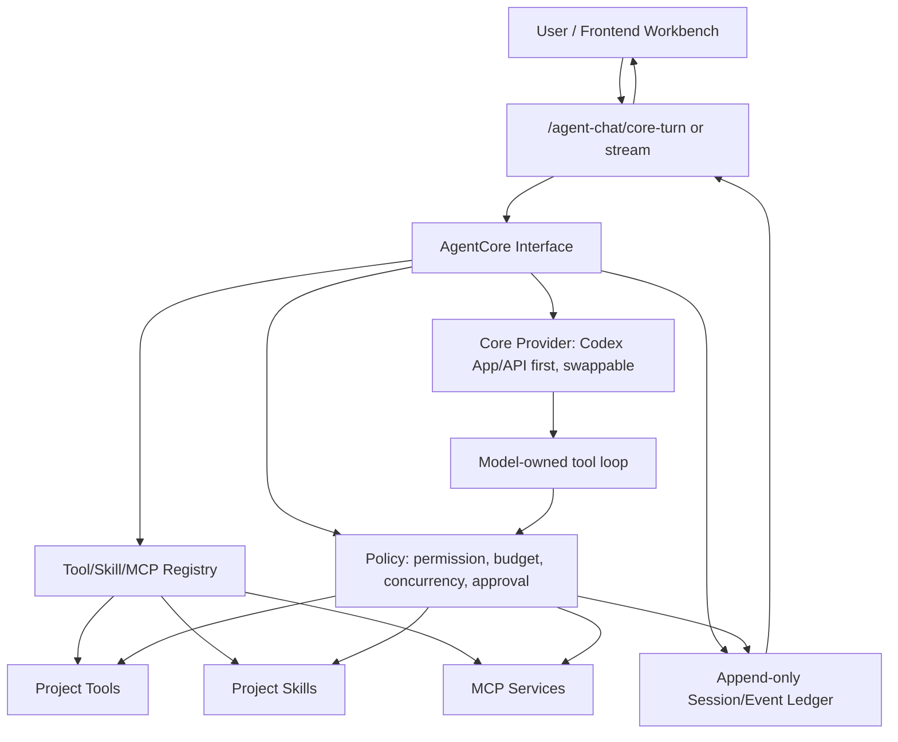

<!-- docs-root-migration: content moved -->
> Status: content moved; target authoritative after Wave31 archive-closed batch.
> Previous compatibility source: `development/latest-dev-docs/development-plans/ARCHIVE_CLOSED/2026-04-02-claude-agent-high-fidelity-migration/17_claude-code-core-reconstruction-spec-2026-05-11.md`
> Authoritative target: `docs/development/development-plans/ARCHIVE_CLOSED/2026-04-02-claude-agent-high-fidelity-migration/17_claude-code-core-reconstruction-spec-2026-05-11.md`
> Migration batch: `development-plans-archive-closed-wave31-batch`
> Date: 2026-05-23

# Claude Code Core Reconstruction Spec

日期：2026-05-11

状态：主线重构规范。本文覆盖并修正 `02_claude-code-level-agent-interaction-todo-2026-05-10.md` 中已经过早勾选的 model-first / tool-loop / frontend 验收项。后续开发按本文执行，旧文档只保留历史任务拆分价值。

## 当前落地状态

更新时间：2026-05-13 PT

- 2026-05-11 审批冻结：`AgentCoreRequest.approval_policy` 默认改为 `frozen`，主线 AgentChat 和前端不再把写入/外部工具前置暂停为审批卡；`ask` / `explicit_user_request` 在模型可见工具表里按可执行工具呈现，工具自身继续负责 schema、版本锁、预算、来源范围和硬性 deny 边界。既有 approval event、approval store、continue route、前端 approval card 作为兼容层保留，但不再是交互成熟度主路径。
- 主线 `/api/v1/agent-chat/turn` 与 `/api/v1/agent-chat/turn/stream` 默认已切换到 `agent_core_v3`；`agent_runtime_v2` 与 `legacy_batch` 只保留为显式 `runtime_variant` 兼容入口。
- 默认路径不再受 `agent_runtime_v2_enabled` 等旧配置影响，不会在无声明请求中退回 `FastModelFirstTurnDecisionPlanner`、`GuardedModelTurnDecisionPlanner` 或 `agent_batch.nl_command.submit`。
- `main/backend/app/services/agent_core/` 已落地 core contracts、event loop、fake provider、JSON/Codex/OpenAI adapter、tool registry、project tool projection、skill projection、MCP service catalog。
- 普通自由问答默认只输出自然 assistant message；项目事实问题由模型选择只读工具；执行型来源库请求由模型发起 `ingest.source_library.run` 并直接进入工具执行边界。
- `JsonCoreProvider` 已增加协议修复与窄 guardrail：当模型违反 JSON tool-call 协议并试图把项目数据/来源库执行请求当自然语言回答时，先重试 JSON；仍失败时转换为必要的 project tool call，避免把幻觉作为最终项目事实。
- 主线已增加 per-turn tool window：普通对话暴露 0 个工具 schema；项目数据问题暴露 4 个只读工具；明确来源库 item key 的执行请求只暴露 `ingest.source_library.run`，避免每轮把 51 个完整工具塞进模型上下文。
- 已增加 `NativeToolCallingCoreProvider`：当后端配置真实 OpenAI/LiteLLM provider 且模型支持 `bind_tools` 时走原生 tool-calling；当前无 API key 的本机运行仍自动回落到 Codex CLI + JSON protocol adapter。
- 已增加 persistent Codex app-server core：首次 Codex fallback 调用时启动独立 `codex app-server` WebSocket core；后续请求复用同一进程；无活跃 turn 且空闲超过 `300s` 后自动关闭。`/api/v1/codex-auth/status` 暴露 `persistent_core.mounted/process_id/idle_seconds/idle_ttl_seconds`。
- `ingest.source_library.run` 已不是占位 deferred tool；默认直接通过现有 `ingest.dispatch.source_library_item` skill 派发来源库任务。
- 2026-05-13 形式化能力清理：AgentCore 不再把未接线 legacy capability 注册成 `deferred` 假工具；`workflow_graph.run`、`report.generate`、`agent_batch.nl_command.submit` 均补为真实 handler，另新增标准入口 `agent_batch.submit`、`skill.search`、`skill.load`、`mcp.tools.list`、`mcp.tool.call`。`tool_pool` 增加 `implemented` / `implementation_state`，用户端能力目录不再混淆“已实现”与“未挂载”。
- 2026-05-13 前端形式化清理：`AgentChatPage` 后端失败时写入 retryable `system` 错误态，不再追加正常 assistant fallback；默认会话不再用演示历史伪装真实对话；capabilities 目录项改为只读卡片，不再渲染无动作按钮。
- 2026-05-13 交互边界收紧：`AgentChatPage` 清空当前会话时会同步清除后端 session/task/phase/compat 绑定、stream events、草稿和 artifact 选择；retry 绑定原始前端 session；普通用户默认不再看到 `backend/mode/session_id/phase` 等调试 metadata，只有 `agent_debug=1` / `debug_agent=1` 才展示。
- 2026-05-13 审批冻结对齐：前端主线 turn payload 明确发送 `require_high_risk_approval=false`，来源库执行验证改为“工具执行路径无审批暂停”，不再把兼容 approval card 当默认交互。
- 2026-05-13 能力目录收紧：前端能力目录只展示 `enabled != false` 且 `implemented != false` 且 `implementation_state` 不是 `disabled/not_mounted/unimplemented` 的工具，避免把未挂载能力包装成可用功能。
- 2026-05-13 stream 可观测性修复：`/agent-chat/turn/stream` 在进入较重的 core/session/tool-window/provider 设置前先发 `agent_core.stream_opened`，避免模型或 provider 慢时前端表现为“无返回”。
- 2026-05-13 tool-window 声明式化：`tool_window.py` 从长 `if/elif` 分支改为 profile definitions + signal extraction，仍只负责上下文预算窗口；模型仍拥有最终工具选择权。
- 2026-05-13 backend 工具闭环补强：新增 mounted MCP-compatible tool 注册边界，`mcp.tools.list -> mcp.tool.call` 已覆盖成功和 not-configured 结构化失败；`skill.search -> skill.load -> skill.<id>` 已覆盖发现、加载、执行和 transcript 反馈；`agent_task.plan.append -> partial completion -> agent_session.resume_bundle` 已覆盖长任务恢复，resume task 摘要包含 `result_summary/result_payload`。
- 2026-05-13 source/writing crossflow 补强：新增 `source.discovery.plan -> agent_investigation.leads.append -> writing.document.insert_paragraph -> agent_session.resume_bundle` 端到端单测；写作工具允许已批准且带明确 `title` 的无 `doc_id` 调用创建新草稿，并保留 source refs/provenance 到 Agent 写作 metadata。
- 2026-05-13 AgentChat 长任务/渐进事件补强：当前 turn 的 SSE 事件会固化到 assistant message，避免 backend session 重新绑定后丢失；运行 workbench 新增 `tasks` tab、分拆任务卡、progressive tool event、source quality card 和 writing diff card。
- 2026-05-13 写作工作台 diff review：Agent 写回卡新增可展开 diff-review 面板，展示版本、定位、插入文本、source refs、provenance keys 和 call id，再由用户定位、采纳或撤回。
- 2026-05-13 external boundary 可见化：未挂载/禁用/未实现能力不再作为可执行 capability 出现，但会在 AgentChat 的 `external boundary` 区域显示 `implementation_state` 和 disabled reason。
- 2026-05-13 R17 多跳调查与外部状态矩阵：新增 `agent_investigation.trace.read`，模型可从 session artifact 读取 bounded multi-hop clue trace，再把 source discovery / leads / trace / writing / resume 串成同一轮工具链；新增 `agent_runtime.external_tool_status`，`mcp.service.catalog`、`mcp.tools.list`、`mcp.tool.call`、`tool_pool` 和 AgentChat external boundary 共享 `configured/reachable/auth_ok/server_error/mounted_tool_count/service_status/implementation_state`，不再各自硬编码外部 browser/search/MCP 状态。
- 2026-05-13 R18 trace UX：AgentChat 会从 streamed tool results 与 final capability calls 中提取 `agent_investigation.trace.v1`，在 tools workbench 显示 focus node、节点/边数、trace summary 和未解问题，避免多跳调查只出现在通用工具行里。
- 2026-05-13 R31 写作协作深化：写作工作台现在在编辑器旁显示 Agent 写回段落锚点，包含状态、行号、预览、source refs 和 call id，并提供定位、采纳、撤回、diff 操作；对应 E2E 通过。
- 2026-05-13 反形式化回答门禁：新增 `agent_core_contentfulness_gate`，要求真实 post-tool 回答必须包含具体对象/数据、可用计数/片段/result ID 和下一步可检查状态。初版门禁抓出 source-library continue 与 writing writeback 回答过短；修复 provider 指令和工具摘要后，live rerun 的 `r29_contentfulness_gate_after_fix.json` 通过。
- 2026-05-13 R33 数据质量审计通道：新增 `project.structured_data.quality_audit` 与窄 `data-quality-audit` tool window。真实质量清理审计请求会调用该工具，扫描 stored `documents` / `graph_nodes` 的脚本、CSS、导航壳噪声并返回数量、分布、样本和建议动作；原始证据不自动删除。
- 前端 `AgentChatPage` 已按事件流更新：普通对话隐藏内部 metadata，项目工具轨迹显示为折叠工具调用，审批兼容层仅在历史/显式启用时进入右侧 workbench/操作区，旧 `Plan/Dispatch/Execute/Observe/Report` 文案替换为 `上下文/工具/回答`。
- 验收证据：
  - R18 trace UX slice: `npm run test:e2e -- tests/e2e/agent-chat.spec.ts --reporter=line` -> `7 passed`；`npm run lint -- src/pages/AgentChatPage.tsx src/pages/agent-chat.css src/lib/types.ts tests/e2e/agent-chat.spec.ts` -> passed with existing CSS ignored warning。
  - Anti-formal contentfulness slice: live gate `development/latest-dev-docs/automation-runs/agent-core-live-user-audit-2026-05-13/r29_contentfulness_gate_after_fix.json` -> `overall_status=pass`；backend adjacent tests `PYTHONPATH=main/backend ./main/backend/.venv311/bin/python -m pytest main/backend/tests/unit/test_agent_core_unittest.py main/backend/tests/unit/test_structured_data_search_unittest.py main/backend/tests/integration/test_agent_chat_api_unittest.py -q` -> `62 passed, 11 warnings`。
  - R33 data-quality lane: live artifact `development/latest-dev-docs/automation-runs/agent-core-live-user-audit-2026-05-13/r33_data_quality_audit/summary_after_tool_window_fix.json` -> called `project.structured_data.quality_audit`, scanned `documents 201` / `graph_nodes 3942`, found `303` noisy records；backend adjacent tests -> `64 passed, 11 warnings`。
  - R31 writing side-rail slice: `npm run lint -- src/pages/WritingWorkbenchPage.tsx src/components/writing/writing-workbench.css tests/e2e/writing-workbench.spec.ts` -> passed with existing CSS ignored warning；`npm run test:e2e -- tests/e2e/writing-workbench.spec.ts --reporter=line` -> `3 passed`。
  - R17/R19 investigation/external status slice: `PYTHONPATH=main/backend python3.11 -m py_compile main/backend/app/services/agent_runtime/external_tool_status.py main/backend/app/services/agent_runtime/tool_pool.py main/backend/app/services/agent_core/project_tools.py main/backend/app/services/agent_core/tool_window.py main/backend/tests/unit/test_agent_core_unittest.py main/backend/tests/integration/test_agent_chat_api_unittest.py` -> passed；`PYTHONPATH=main/backend pytest main/backend/tests/unit/test_agent_core_unittest.py -q` -> `32 passed, 3 warnings`；`PYTHONPATH=main/backend pytest main/backend/tests/integration/test_agent_chat_api_unittest.py -q` -> `20 passed, 11 warnings`；`npm run test:e2e -- tests/e2e/agent-chat.spec.ts --reporter=line` -> `7 passed`。
  - Frontend boundary visibility slice: `npm run lint -- src/pages/AgentChatPage.tsx tests/e2e/agent-chat.spec.ts` -> passed；`npm run test:e2e -- tests/e2e/agent-chat.spec.ts --reporter=line` -> `7 passed`。
  - Writing diff-review slice: `npm run lint -- src/pages/WritingWorkbenchPage.tsx src/components/writing/writing-workbench.css tests/e2e/writing-workbench.spec.ts` -> passed with existing CSS ignored warning；`VITE_API_PROXY_TARGET=http://127.0.0.1:8017 npm run test:e2e -- tests/e2e/writing-workbench.spec.ts --reporter=line` -> `3 passed`。
  - Frontend long-task/progressive slice: `npm run lint -- src/pages/AgentChatPage.tsx tests/e2e/agent-chat.spec.ts` -> passed；`npm run test:e2e -- tests/e2e/agent-chat.spec.ts --reporter=line` -> `7 passed`。
  - Backend source/writing crossflow: `PYTHONPATH=main/backend pytest main/backend/tests/unit/test_agent_core_unittest.py -q` -> `30 passed, 3 warnings`。
  - Backend adjacent source/writing/chat closure: `PYTHONPATH=main/backend pytest main/backend/tests/unit/test_source_candidate_trust_unittest.py main/backend/tests/integration/test_writing_api_unittest.py main/backend/tests/integration/test_agent_chat_api_unittest.py -q` -> `29 passed, 11 warnings`。
  - Backend tool-loop closure: `PYTHONPATH=main/backend pytest main/backend/tests/unit/test_agent_core_unittest.py -q` -> `29 passed, 3 warnings`。
  - Backend source/chat closure: `PYTHONPATH=main/backend pytest main/backend/tests/unit/test_source_candidate_trust_unittest.py main/backend/tests/integration/test_agent_chat_api_unittest.py -q` -> `21 passed, 11 warnings`。
  - Backend skill/codex closure: `PYTHONPATH=main/backend pytest main/backend/tests/unit/test_skill_runtime_unittest.py main/backend/tests/unit/test_codex_cli_llm_fallback_unittest.py -q` -> `20 passed`。
  - Backend latest slice: `PYTHONPATH=main/backend pytest main/backend/tests/unit/test_agent_core_unittest.py main/backend/tests/unit/test_source_candidate_trust_unittest.py -q` -> `28 passed, 3 warnings`。
  - Backend latest stream/API slice: `PYTHONPATH=main/backend pytest main/backend/tests/integration/test_agent_chat_api_unittest.py -q` -> `19 passed, 11 warnings`。
  - Frontend latest slice: `npm run lint -- src/pages/AgentChatPage.tsx tests/e2e/agent-chat.spec.ts` -> passed。
  - Frontend latest E2E slice: `npm run test:e2e -- tests/e2e/agent-chat.spec.ts --reporter=line` -> `6 passed`。
  - Backend current slice: `PYTHONPATH=main/backend pytest main/backend/tests/unit/test_agent_core_unittest.py main/backend/tests/integration/test_agent_chat_api_unittest.py` -> `45 passed, 11 warnings`。
  - Frontend current slice: `npm run lint -- tests/e2e/agent-chat.spec.ts tests/e2e/agent-chat-writing-crossflow.spec.ts src/pages/AgentChatPage.tsx src/lib/types.ts` -> passed。
  - Frontend E2E current slice: `npm run test:e2e -- tests/e2e/agent-chat.spec.ts tests/e2e/agent-chat-writing-crossflow.spec.ts --reporter=line` -> `7 passed`。
  - Backend: `PYTHONPATH=$PWD .venv311/bin/pytest tests/unit/test_agent_core_unittest.py tests/integration/test_agent_chat_api_unittest.py tests/unit/test_skill_runtime_unittest.py tests/unit/test_codex_cli_llm_fallback_unittest.py -q` -> `37 passed, 11 warnings`。
  - Frontend build: `npm run build` -> passed。
  - Frontend E2E: `npm run test:e2e -- tests/e2e/agent-chat.spec.ts --workers=1` -> `4 passed`。
- Live default stream: `你好` emits `agent_core.stream_started` and `agent_core.final_answer` without legacy event.
- Live performance probe after tool-window acceleration:
  - `你好`: first SSE `0.092s`, total `4.047s`, `7.9KB`, `tool_count=0/51`。
  - `解释一下 CAPM 的核心假设`: first SSE `0.062s`, total `5.496s`, `20.3KB`, `tool_count=0/51`。
  - `项目里有什么数据`: first SSE `0.043s`, total `11.544s`, `56.2KB`, `tool_count=4/51`。
  - `用来源库 market.general.baseline 补一轮证据`: first SSE `0.043s`, total `4.159s`, `29.7KB`, `tool_count=1/51`，旧基线直接进入审批；冻结后目标为同一工具路径直接执行并返回工具结果。
  - Persistent Codex core probe: first mounted free-chat call starts `codex app-server` and returns in `28.612s`; second call reuses the same PID and returns in `8.64s` with first SSE `0.65s`; status shows `mounted=true`, `idle_ttl_seconds=300`。
  - Frontend QA screenshots/report: `development/latest-dev-docs/automation-runs/agent-core-frontend-qa-2026-05-11/`，`frontend-qa-report.json` 三项场景均 `ok=true`。

剩余边界：旧 `agent_runtime_v2`、`turn_decision.py`、`run_loop.py`、`capability_registry.py` 仍作为显式兼容路径保留，已不在主线默认链路。后续若要彻底删除，需要同步清理显式兼容 API 与旧测试。

## 当前性能基线

测试时间：2026-05-11 06:05 PT；加速复测时间：2026-05-11 06:38 PT

测试方式：直接请求当前本地后端 `/api/v1/agent-chat/turn/stream`，`project_key=demo_proj`，记录 `curl` 的 `time_starttransfer`、`time_total`、下载体积和 SSE 事件。

| 场景 | 首个 SSE | 完整返回 | 下载体积 | 工具行为 |
| --- | ---: | ---: | ---: | --- |
| `你好` | 0.009s | 3.19s | 7.6KB | 0 个工具，直接 `agent_core.final_answer` |
| `解释一下 CAPM 的核心假设` | 0.006s | 9.53s | 22.2KB | 0 个工具，普通自由回答 |
| `项目里有什么数据` | 0.006s | 11.98s | 82.2KB | 6 个只读工具：`agent_session.context.read`、`project.summary.read`、`source_library.item.list`、`ingest.status.read`、`workflow_graph.list`、`mcp.service.catalog` |
| `用来源库 market.general.baseline 补一轮证据` | 0.008s | 27.59s | 46.2KB | 3 个只读工具后进入 `ingest.source_library.run` 审批 |

加速落地后复测：

| 场景 | 首个 SSE | 完整返回 | 下载体积 | 工具窗口 |
| --- | ---: | ---: | ---: | --- |
| `你好` | 0.092s | 4.047s | 7.9KB | `conversation`，0/51 工具 |
| `解释一下 CAPM 的核心假设` | 0.062s | 5.496s | 20.3KB | `conversation`，0/51 工具 |
| `项目里有什么数据` | 0.043s | 11.544s | 56.2KB | `project-context`，4/51 工具：`project.summary.read`、`agent_session.context.read`、`source_library.item.list`、`ingest.status.read` |
| `用来源库 market.general.baseline 补一轮证据` | 0.043s | 4.159s | 29.7KB | `source-library-execute-explicit`，1/51 工具：`ingest.source_library.run` |

结论：

- 首包速度已经足够快，复测在本机 Python streaming client 下仍能在 100ms 内出现 `agent_core.stream_started`。
- 完整交互已明显改善：普通事实问答进入 `< 6s` 目标，明确来源库审批从约 `27.59s` 降到约 `4.159s`；项目工具问答仍约 `11.544s`，后续主要优化点是 read-only 工具并发与工具结果二次总结。
- 当前剩余慢点主要不在 HTTP 或前端，而在无 API key 时的 Codex CLI fallback 模型调用、项目 read-only 工具串行执行和多轮 JSON tool-call adapter。
- 当前运行态为 `LLM_PROVIDER=openai`，但 `OPENAI_API_KEY` 为空；`codex-auth/status` 显示 `token_sink_authenticated=true`，且 Codex CLI 存在于 `/Applications/Codex.app/Contents/Resources/codex`。因此实际模型调用很可能通过 `openai` 分支落到 Codex CLI fallback，存在每轮 `codex exec` 冷启动成本。
- 当前代码已经具备 OpenAI/LiteLLM 原生 tool-calling provider 路径；本机如果继续没有 `OPENAI_API_KEY`/LiteLLM key，仍会使用 Codex CLI fallback，无法彻底消除 CLI 子进程冷启动。
- Codex fallback 已从每轮 `codex exec` 子进程改为 lazy-mounted `codex app-server` WebSocket core；该 core 进程在第一次 fallback 调用后常驻，空闲超过 5 分钟自动关闭。

加速要求：

- P0：为后端配置真实 OpenAI API key，或实现持久 Codex core/provider，避免每轮 CLI 子进程冷启动。代码侧已支持真实 OpenAI/LiteLLM 原生 provider；Codex fallback 已实现 lazy-mounted app-server core，避免每轮重新启动 `codex exec`。
- P0：把 tool schema 从“每轮 51 个完整工具”改成分层/延迟加载；普通对话不应携带完整项目工具目录。已落地 per-turn tool window。
- P1：将 `JsonCoreProvider` 的 JSON 协议适配替换为原生 tool-calling provider，减少解析修复和额外模型轮次。已落地 `NativeToolCallingCoreProvider`，无 native tool support 时自动 fallback。
- P1：压缩项目只读工具结果，尤其是 `project.summary.read` 与 `source_library.item.list` 的 SSE 聚合体积。已落地更严格的 result compaction。
- P1：执行型来源库请求在 item key 明确时，允许模型直接发起执行工具，避免先读过多上下文工具。已落地，复测总时长从 `27.59s` 降到 `4.159s`；审批冻结后不再把这一步作为默认停顿点。

## 一句话目标

把当前 agent 从“机械分类 + capability 选择 + agent_batch 兜底”的交互外壳，重构为可替换但稳定的 Claude Code 式核心：

`AgentCore(provider=Codex/OpenAI first) -> session/event ledger -> model-owned tool loop -> project tools + skills + MCP services -> frontend workbench`

其中模型拥有普通对话、是否需要工具、调用哪个工具、拿到工具结果后如何继续推理的主导权；规则层只做 schema、预算、来源范围、并发、版本锁和硬性阻断。审批兼容层暂时冻结，不作为主路径。

## 参考基线

### 本地 Claude Code 源码观察

- `/Users/wangyiliang/Desktop/Claude/Claude-Code-main/src/Tool.ts`
  - 关键点：工具不是简单函数表，而是 `ToolUseContext` 承载 session 状态、权限上下文、MCP clients/resources、skills、abort、UI JSX、文件状态、动态工具刷新和 compaction progress。
- `/Users/wangyiliang/Desktop/Claude/Claude-Code-main/src/types/message.ts`
  - 关键点：消息账本区分 user/assistant/progress/system/hook/tool-summary/stream-event，并且 tool use 和 tool result 是可重放事件，而不是一次 HTTP 返回里的附属字段。
- `/Users/wangyiliang/Desktop/Claude/Claude-Code-main/src/entrypoints/sdk/coreTypes.ts`
  - 关键点：hook 事件覆盖 `PreToolUse`、`PostToolUse`、`PermissionRequest`、`SubagentStart/Stop`、`PreCompact/PostCompact`、`SessionStart/End`、`WorktreeCreate/Remove` 等生命周期。
- `/Users/wangyiliang/Desktop/Claude/Claude-Code-main/src/remote/RemoteSessionManager.ts`
  - 关键点：远程/SDK 桥接把用户消息、工具权限请求、取消、中断、恢复拆成独立控制面，不把 agent 内核绑死在 CLI 子进程。
- `/Users/wangyiliang/Desktop/Claude/Claude-Code-main/src/remote/sdkMessageAdapter.ts`
  - 关键点：SDK message 被适配为 UI 可消费的 assistant/user/tool_result/stream_event/system/tool_progress/auth_status/rate_limit 等事件。
- `/Users/wangyiliang/Desktop/Claude/claude-code/README.zh-CN.md`
  - 关键点：Claude Code 的能力面不是一个 classifier，而是 tools、commands、services、bridge、permissions、features、skills、MCP 的组合。

### 在线主流框架事实

- Anthropic Claude Code hooks 支持命令、HTTP、MCP tool、prompt、agent hook；匹配 hook 可并发执行，`PreToolUse`/`PostToolUse` 可阻断或补充上下文。来源：[Claude Code Hooks](https://code.claude.com/docs/en/hooks)。
- Anthropic Claude Code MCP 支持本地/HTTP server、resources、elicitation、prompt-as-command、tool search/deferred loading 和 alwaysLoad。来源：[Claude Code MCP](https://code.claude.com/docs/en/mcp)。
- Claude Code skills 已合并 custom slash commands，`SKILL.md` 可自动发现、热更新、按目录层级加载，并支持动态上下文注入。来源：[Claude Code Slash Commands / Skills](https://code.claude.com/docs/en/slash-commands)。
- OpenAI Agents SDK 把 agent 定义为 instructions + tools + guardrails + handoffs，内置 sessions、tracing 和 human-in-the-loop。来源：[OpenAI Agents JS README](https://github.com/openai/openai-agents-js) 与 [Human in the loop](https://openai.github.io/openai-agents-js/guides/human-in-the-loop/)。
- OpenCode 把工具直接暴露给 LLM，并通过 permissions 控制 allow/ask/deny；MCP tools 自动进入 LLM 可用工具集，skills 从 `.opencode/`、`.claude/skills/`、`.agents/skills/` 自动发现。来源：[OpenCode Tools](https://opencode.ai/docs/tools)、[OpenCode MCP](https://opencode.ai/docs/mcp-servers/)、[OpenCode Skills](https://opencode.ai/docs/skills)。
- 独立架构研究总结 Claude Code 的核心价值不在单个 loop，而在权限模式、上下文压缩、MCP/plugins/skills/hooks、subagent/worktree、append-only session storage。来源：[Dive into Claude Code](https://arxiv.org/abs/2604.14228)。

## 当前系统差距

### 已经确认的问题

- `main/backend/app/services/agent_runtime/capability_registry.py`
  - `classify_goal()` 和 `select_capabilities_for_goal()` 仍然把语义路由写成关键词表。
  - 结果是普通对话、项目事实、执行请求在进入模型前就被固定到 conversation/read_only/execute。
- `main/backend/app/services/agent_runtime/turn_decision.py`
  - `FastModelFirstTurnDecisionPlanner` 是大段机械分类；`GuardedModelTurnDecisionPlanner` 只是在部分路径调用模型。
  - `agent_batch.nl_command.submit` 仍是 execution 默认重心。
- `main/backend/app/services/agent_runtime/run_loop.py`
  - 当前 run loop 仍要求外部先给 `selected_capability_ids`，模型不能真正看到完整工具 schema 后自由选择。
  - `HeuristicAgentRunLoopPlanner` 会把选择结果机械转换成工具调用。
- `main/backend/app/services/agent_runtime/interactive_agent.py`
  - plan/execute/final 三任务结构还在压普通对话；轻问答不应强制生成 plan/execute/final task。
  - 高风险审批已存在，但不是 Claude Code 式“模型请求工具 -> permission hook/approval interruption -> resume same run state”。
- `main/backend/app/api/agent_chat.py`
  - `enable_model_tool_loop` 仍是可选参数，主入口没有强制进入模型拥有的 core。
  - `/turn/stream` 只是同步执行后的事件回放，不是真正边模型边工具边输出。
- `main/frontend-modern/src/pages/AgentChatPage.tsx`
  - UI 仍显露 backend/mode/session_id/phase/capability 等内部标签。
  - 普通回答、工具轨迹、审批、产物没有完全按照同一个事件流自然组织。

### 不能再接受的兼容策略

- 不能继续把 `classify_goal` 包装成 “hint-only” 但实际仍作为 planner 主路径。
- 不能通过增加关键词修补 “你好 / 项目里有什么数据 / 首都是什么”。
- 不能把 `agent_batch` 当作 unknown intent fallback。
- 不能让前端直接暴露内部路由 metadata 来解释为什么没有自然回答。

## 目标架构



### Core Provider

`AgentCore` 是稳定接口，provider 可替换：

- `CodexCoreProvider`：第一优先，使用本地 Codex App/API/持久 app-server 或 OpenAI auth，不再每轮冷启动 CLI。
- `OpenAIApiCoreProvider`：直接用 OpenAI Responses/Agents tool loop，作为稳定 API provider。
- `ClaudeCodeCoreProvider`：未来可接 Claude Code SDK/remote session bridge。
- `FakeCoreProvider`：测试用，可完全 deterministic。

Core provider 负责：

- 接收 session/context/tools/policies/user message。
- 产出标准 `CoreEvent` 流。
- 支持 pause/resume/cancel/approval。
- 不理解项目业务细节；业务能力只通过 tool/skill/MCP 注入。

### Core Event Contract

所有后端与前端只认事件流：

- `session_started`
- `user_message`
- `assistant_delta`
- `assistant_message`
- `tool_call_requested`
- `permission_requested`
- `tool_call_started`
- `tool_progress`
- `tool_result`
- `artifact_created`
- `approval_resolved`
- `run_interrupted`
- `run_resumed`
- `run_compacted`
- `final_answer`
- `error`

事件必须可追加、可重放、可筛选、可恢复。同步 `/turn` 只能是事件流执行后的兼容聚合视图。

### Tool Contract

每个工具必须是模型可见的 schema，而不是 capability token：

```text
CoreToolSpec
  name
  title
  description_for_model
  input_schema
  output_schema
  source: builtin | project | skill | mcp | legacy_adapter
  risk: read_only | write_shared | write_external | privileged
  permission: allow | ask | deny | explicit_user_request
  concurrency: parallel | serial | exclusive
  timeout_seconds
  result_budget
  mcp_server / skill_id / project_service_id
```

工具执行结果同时给模型和 UI：

```text
CoreToolResult
  call_id
  tool_name
  status: completed | failed | canceled | needs_approval | deferred
  model_summary
  ui_summary
  structured_content
  artifact_refs
  error
  retry_hint
```

### Skill Layer

Skill 不是 API wrapper，而是可发现的任务工作流说明：

- 适合：市场研究、来源库补证据、workflow debug、报告生成、项目数据审计、前端调试。
- 形态：`.agents/skills/<skill>/SKILL.md` 或项目内 `main/backend/app/services/agent_skills/` manifest。
- 载入规则：模型通过 `skill.search/load` 工具按需发现；少量核心技能 always load。
- 权限：skill loading 本身可 allow/ask/deny，skill 内部工具仍走工具权限。

### MCP Layer

MCP 只用于“服务边界明显”的能力：

- 外部连接器：GitHub、Gmail、Drive、浏览器、搜索、数据库代理。
- 长生命周期服务：crawler/search daemon、embedding/vector store、source-library service、workflow runner。
- 跨项目复用能力：source-library catalog、artifact store、knowledge graph。

不应把简单本地函数硬包装为 MCP；本地纯函数先做 project tool，稳定后再服务化。

### Project Tool Layer

项目已有能力按契合度拆成工具：

- `project.summary.read`：project/session/source/workflow/artifact 概览。
- `source_library.items.list/search/inspect`：只读来源库。
- `source_library.run`：执行采集，高风险审批。
- `ingest.status.read` / `ingest.run`：采集状态与执行。
- `workflow_graph.list/inspect/run`：图谱检查与运行。
- `artifact.search/read/write`：产物读写。
- `report.generate`：报告生成。
- `agent_batch.submit`：legacy 兼容工具，只能 ask，不再 fallback。

## 迁移阶段

### R0 文档与硬性验收重置

- [x] 建立本文。
- [x] 把 `02` 中过早完成的项标注为“需要 core v3 复验”，避免误认为已封口。
- [x] 新增 `.autonomous/claude-code-core-reconstruction/` 任务清单与进度。

### R1 Core 契约落地

- [x] 新增 `main/backend/app/services/agent_core/`。
- [x] 定义 `AgentCore`、`AgentCoreRequest`、`CoreEvent`、`CoreToolSpec`、`CoreToolResult`、approval resume/request 聚合与 run output state。
- [x] 建立 `FakeCoreProvider` 单元测试，证明自由对话、工具调用、审批中断、恢复都不依赖关键词分类。
- [x] 建立 provider registry/selector，支持 Codex fallback、OpenAI/LiteLLM native tool-calling、JSON adapter 与 fake。

### R2 Tool Registry 替换 capability router

- [x] 把现有 `capability_registry` 投影成 AgentCore `CoreToolRegistry`；未接线 capability 不再进入模型可见工具表。
- [x] `classify_goal` / `select_capabilities_for_goal` 从主路径移除，只保留 compatibility import 或测试用 deprecated wrapper。
- [x] `ReadOnlyAgentToolRuntime` 通过 adapter 进入 CoreTool executor contract。
- [x] `AgentControlToolRuntime` 改成 control tools，不参与语义分类。
- [x] `agent_batch.nl_command.submit` 投影为真实 legacy handler，并新增 `agent_batch.submit` 标准 legacy tool，permission=`ask`。

### R3 Model-owned Tool Loop

- [x] `/agent-chat/turn` 默认走 `AgentCore.run()`。
- [x] 模型一次看到按 turn window 裁剪后的核心工具 schema、项目/session 摘要与风险策略。
- [x] 模型直接返回 final answer 或 tool call；tool result 回灌模型后继续。
- [x] 移除 `FastModelFirstTurnDecisionPlanner` 和 `HeuristicAgentRunLoopPlanner` 主路径。
- [x] JSON planner 仅作为 `CodexCli` 临时 tool-call adapter，不再拥有语义规则。

### R4 Persistent Codex/OpenAI Core 加速

- [x] 不再每轮启动 `/Applications/Codex.app/.../codex exec`；Codex fallback 默认 lazy-mounted app-server core，5 分钟 idle 自动关闭。
- [x] 优先使用 OpenAI/LiteLLM native tool-calling provider；无 API key 或无 `bind_tools` 时回退到 JSON/Codex provider。
- [x] 对 CLI provider 设为 fallback，并清楚标记 cold-start penalty。
- [x] 首事件目标：`< 1000ms`；普通 facts/free chat final answer 目标：`< 6s` 已在本机复测通过。

### R5 Skills + MCP 投影

- [x] 新增 `skill.search`、`skill.load`、`mcp.tools.list`、`mcp.tool.call`。
- [x] 为 market-research 项目投影核心 skills：
  - `project-data-query`
  - `source-library-evidence-collection`
  - `workflow-runner-debug`
  - `report-draft-generation`
  - `frontend-agent-ux-debug`
- [x] 明确 source-library/ingest/workflow 哪些保留 project tool，哪些服务化为 MCP；当前 external MCP 未配置项只返回明确 `not_configured`，不伪装执行。

### R6 Frontend Workbench 事件化

- [x] 前端主入口改用真实 stream，不等完整 `/turn` 聚合。
- [x] 普通对话默认只显示自然 assistant message。
- [x] 工具/审批/产物进右侧 workbench 或消息内折叠 timeline。
- [x] 隐藏 backend/mode/session_id/phase/capability chips，除非打开 debug。
- [x] approval card 支持 approve/deny/edit/resume。

### R7 验收与旧路径清理

- [x] 删除或降级旧 classifier tests，新增 core behavior tests。
- [x] 保留 legacy batch runtime_variant，但不作为默认。
- [x] 回放场景全部 green 后，在默认 `agent_core_v3` 路径中无效化 `enable_model_tool_loop`，该参数仅保留给显式 legacy runtime 兼容测试。

## 必须通过的用户端验收

### 自由对话

- `你好`
  - 无 tool。
  - 无 approval。
  - 无 backend/mode/capability chips。
  - 自然回答。
- `中国的首都是哪里？`
  - 无项目工具，模型直接回答。
  - 不能显示“请补充执行任务”。
- `你现在能做什么？`
  - 可以调用 capability/tool catalog，也可以直接总结。
  - 不提交 agent_batch。

### 项目能力

- `项目里有什么数据`
  - 模型应选择 `project.summary.read` 和/或 `source_library.items.list`。
  - 工具结果回灌模型后自然解释。
  - 不因为 Codex CLI 超时而退化为模板错误。
- `当前有哪些来源库 item 可以用`
  - 只读工具。
  - 返回数量、示例、下一步可执行边界。
- `帮我用来源库补一轮证据`
  - 先列候选、范围、预算。
  - 生成 approval request。
  - 用户批准后从同一 run state 继续。

### 速度

- stream connection 建立后 1 秒内必须有 `assistant_delta` 或 `tool_call_requested`。
- 普通问答不应触发 subprocess cold start。
- 项目只读问题若需要模型，优先用 persistent provider；CLI fallback 超时只影响 fallback，不应暴露绝对路径或内部命令。

## 推倒重构边界

允许大改：

- `turn_decision.py`
- `run_loop.py`
- `interactive_agent.py`
- `/agent-chat/turn` 默认主路径
- `AgentChatPage.tsx` 消息/事件渲染

必须保留兼容：

- session/task/artifact/approval store 数据结构可读。
- 旧 `/agent-chat/turn` 返回 `ok(data)` envelope。
- 高风险执行仍受审批。
- 现有 source_library/ingest/workflow 业务服务不因 agent core 重构被删除。

## 当前阶段的实现原则

1. 先引入新 `agent_core` 包，不在旧 runtime 里继续加规则。
2. 新代码以 core event + tool schema 为第一事实源。
3. 旧 runtime 只做 adapter，逐步把主入口切到新 core。
4. 对自由对话，模型直接回答；对项目数据，模型用工具；对执行任务，模型请求工具但 policy 决定是否审批。
5. 每完成一阶段都跑后端单元/集成、前端 build、关键 E2E，并用用户端问题实测。
