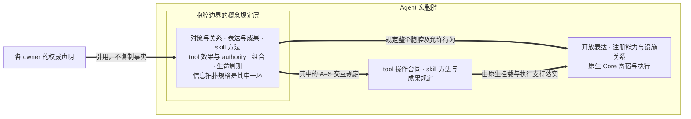
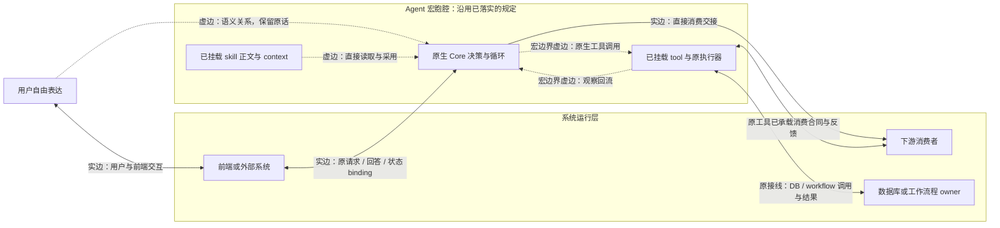
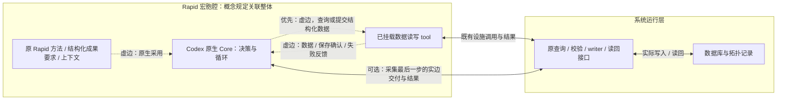

# Agent 宏观架构：宏胞腔、双向中介与原生 Core

状态：架构设计与当前实现边界说明；2026-10-05 按 `agent_chat.py`、Codex native binding 和主仓 WebUI README 核对。本文将通用 Agent 宏定义为胞腔结构，接续[信息检索架构](INFORMATION_RETRIEVAL_FRAMEWORK_DESIGN.md) §4.3–4.5、§9、§10 P2/P3，保留既有执行与数据权威。本文中的拟议类型和完整胞腔注册不表示已实现。

2026-10-02 目标修订：按用户决定，Agent 执行仅保留当前 Codex Core，界面仅保留对应 Codex WebUI；旧 MRW AgentCore、旧 runtime 和兼容聊天页进入退役范围。实施范围见 [清简方案 Q2/Q4](../../../docs/development/MRW实现清简方案.md)，原分发计划继续维护 owner 和实际结果。当前 `/api/v1/agent-chat` 要求显式选择 `agent_macro_native` 或 `agent_macro_rapid_native`；旧 runtime 变体返回 410，五个旧控制字段返回 400。

开发入口：[细节开发框架 §13](INFORMATION_RETRIEVAL_FRAMEWORK_DESIGN.md#13-agent-宏胞腔开发框架)说明跨包接口、原生挂载、数据读写和迁移顺序；[M 系列分发计划](INFORMATION_RETRIEVAL_IMPLEMENTATION_DISPATCH_PLAN.md)维护各包的文件归属、串并行依赖、验证入口和当前状态。

## 1. 设计主张

**Agent 宏本身就是一个胞腔结构。** 注册在其边界上的概念规定层作用于整个胞腔，关联对象与身份、表达与成果意义、skill 的局部方法、tool／设施的效果与 authority、组合及生命周期。信息拓扑规格是其中表达关系与结构的一环。开放对话、上下文、已注册并接入的 skills/tools 与设施绑定构成胞腔的中介关系，原生 Agent Core 寄宿于其内部并持有模型决策与循环。

**胞腔边界是加法规定层，不是封闭式能力控制层。** 胞腔在原生 Core 已有的输入、工具、文件、网络和命令能力之上，增加新的 skill 方法、tool 合同、上下文关联、成果要求和读回关系；它不因为某项能力尚未在胞腔声明中逐项列出，就把该能力从 Core 的可用空间排除。能力是否可用、是否需要批准、是否允许访问某个系统资源，仍由原生宿主、系统运行层及其事实 owner 按实际权限和效果合同决定。胞腔只对新增规定产生中介作用，并把这些规定与原生能力组合起来。只有用户、宿主或系统运行层明确要求封闭能力集合时，才建立显式 capability profile；这属于具体运行合同，不是胞腔概念的默认含义。

**Tool／skill spec 的整体架构作用之一，就是将基本的 Agent–System（A–S）交互虚边化。** 系统的读取、写入、查询、工作流接续和成果消费，经 tool 的操作合同与 skill 的方法规定组织，并通过实际注册、挂载和原执行器接线，成为 Agent 可直接使用的原生能力。胞腔边界的规定由此进入交互本身：Core 按原生机制使用能力，系统继续执行真实操作，宏侧无需为这些已落实的关系追加一次接口交接。

胞腔以规定、关联和必要调控实现中介，不要求每次交互再次经过一个宏代理接口。对具体关系，在指定观察边界上可用虚边或实边实现：已经由 Core 环境及原执行器充分落实的规定可以直接使用，确有调用或消费交接需要的关系复用已有 API／binding。虚边同样真实运行并遵守权限、效果和失败合同；这一区分不把概念边界扩张为重中间层。

用户提交自由表达，例如从网页端输入，对话经胞腔外边界送入已有 Core，最终返回回答、产物或明确停止结果。入口只记录输入来源、会话和必要承载边界，不预先规定用户要表达哪类业务意图，也不要求穷举或封闭所有输入通道。用户无需命中意图枚举、提交业务 JSON、填写业务必填字段，或先选择 skill 与输出类型。Agent 可以在理解对话后导出工作参数；这些参数应保留与原始表达的关联，不能覆盖或替代原话。

数据库、工作流程、界面和结果消费者在系统运行层承担具体职责。概念规定通过已挂载 skill 内容、tool spec、设施及会话绑定进入 Core 的实际环境；完成接入后，正常读取、采用和调用不必再穿过额外宏接口。前端传输、外部系统请求和直接下游消费仍保留各自真实交接。对内供给能力、对外提供 Agent 宏能力这两个方向构成本文所说的“双向 MCP”；MCP client/server 或原生 binding 由实际支持决定，两个方向不要求两个新服务，也不证明现有代码已完整实现双向协议。

一般输出保持开放；用户在自由表达中提出的要求、实际适用的 skill 和真实下游消费者，都能为本次工作增加局部内容要求；具体工具和系统交接承载精确合同。系统规格可以规定开放消息怎样承载、操作怎样授权、结果怎样交接，而不先规定自由表达的全部业务语义。胞腔的中介调控依托已有 Core、工具执行器和设施 owner，模型如何推理、组织工作项和调整行动仍由原生 Agent 框架承载。

当前执行核心是 `CodexAppServerCore.invoke_native`。`agent_chat.py` 提供两个显式业务入口：`agent_macro_native` 挂载只读检索读回 skill/tool，`agent_macro_rapid_native` 挂载 Rapid skill 和普通项目工具面；工具 handler、项目权限和持久读回仍由原 owner 执行。旧 MRW `AgentCore.run` 不再是执行路径；其合同类型只在历史消费者或工具投影需要处保留，不重新实现第二套决策循环。

这里保留准确的宿主边界：`CodexAppServerCore` 的 model-only provider 调用与 `invoke_native` 是两种调用合同。当前 native binding 已支持精确 skill roots、动态工具、同进程续接和 turn interrupt；跨进程 thread 恢复与审批请求不支持，离线装配也不证明某个具体业务成果已完成。Codex WebUI 通过自己的代理宿主接入，其 thread/store 不自动等于 MRW 原生绑定的 session；当前包装页没有建立两者的统一会话或项目绑定。

胞腔中注册并可供 Core 使用的 skills/tools 及其组合环境具有两个同时成立的地位。对调用而言，它们是广义输入和结构参数，包括 skill 的内容、方法、适用情境、成果要求，以及 tool 的 schema、版本、权限和可访问设施。对胞腔内部而言，它们提供把自由表达转化为回答与行动的中介通路。撰写或修改一个 skill，能够在特定输入范围和情境中进一步规定工作内容及输出，因而部分改变或创建胞腔的局部 I/O 关系；这不限于选择已有 handler 或修改注册元数据。

Rapid 的方法、上下文与工具按已核定的来源和 skill 保留，决策循环及继续／停止由胞腔内的 Codex 原生 Core 承载。这里的 Core 不是已退役的 MRW `AgentCore.run`。采集任务本来就要求结构化成果，入库直接承接该工作的最后一步；项目读写已按普通原生工具面挂载，也可在最终交付处以实边接入原 writer，详见 §8.2。Rapid 的 skill 可以在适用情境中要求 digest、frontier 或 proposal；候选检索、资料解读也可以通过自己的 skill 形成局部规定。用户的其他表达仍可正常进入对话，通用宏不把局部交付类型提升为所有回答的固定终点。

## 2. 概念规定层与同一次调用的两种观察

概念规定层说明胞腔是什么、哪些关系有意义、允许怎样变化及这些变化由谁负责。它以相互引用的现有权威声明承载当前需要的完整语义，不新增注册中心、统一配置平台或每层一个服务，也不是每次用户输入必须填写或通过的审查表。各项规定按实际情境取用，直接约束整个胞腔的结构和行为。

| 概念职责 | 规定的意义与关系 | 现有权威来源与关联 |
| --- | --- | --- |
| 对象、身份与组成 | 哪些对象相同，来源／版本怎样识别，胞腔与能力怎样组成；信息拓扑规格表达其中的关系、端点和投影 | 原领域类型、项目／系统规格、胞腔声明及 topology profile；不由图视图取得事实 owner |
| 开放表达与成果 | 自由表达及上下文如何保留意义，回答、产物、部分结果与停止分别承诺什么 | 用户表达、原会话合同及具体消费者要求；不把自然语言预先分成封闭业务类型 |
| Skill 的局部规定 | 正文、方法、适用情境、引用要求与局部成果条件如何组织本次工作 | 权威 skill 内容及版本、用户本轮要求；关联可用 tools，不以 metadata 代替正文 |
| Tool／设施效果与 authority | 允许何种读取、写入、启动和续接，权限／项目范围／资格及事实 owner 是谁 | 原 tool spec、执行器、设施与 writer 合同；skill 内容不授予额外权限 |
| 交接与组合 | 哪些结果可被何种消费者使用，重复 occurrence、有序组合和支持边界如何保持 | 原输入／输出合同、`FlowOperation`、贡献规则与实际 binding；不推断可交换性 |
| 生命周期、失败与读回 | 会话续接、预算、停止、取消、失败及必要读回如何影响后续工作 | 原 Core、工作流程及效果 owner 的生命周期／失败合同；不另建状态或调度平台 |

这些职责交叉引用：成果意义决定某项 writer 的资格要求，skill 方法引用工具能力，工具失败影响 continuation，信息拓扑规格记录这些对象与关系的适用结构。信息拓扑规格不独占其他职责的权威；规定的完整性体现为必要关系不丢失，不要求把所有语义复制进一个总规格。

宏观观察关心胞腔外边界收到什么表达、返回什么内容及如何与系统交接；中介观察关心其内部的 skill、设施和 Core 怎样共同形成工作与反馈。两种观察指向同一个宏胞腔及其调用。外部 I/O 是胞腔的一种行为观察，不能用一个箭头或不透明包装代替其完整的内部结构。这里的“同一次”不意味着不同工具路径会得到相同答案。

以 `U` 表示保持自由表达的用户对话，`C` 表示被允许读取的会话／项目／续接上下文，`E` 表示包含 skills、tool specs 和设施绑定的能力环境，`O` 表示开放的回答／产物／停止外壳。给定环境的 Agent 宏可以记为：

$$
A_E : (U,C) \rightsquigarrow O,
\qquad
\operatorname{Invoke}(U,C,E) \rightsquigarrow O.
$$

这两种写法分别把 `E` 看作结构参数或显式调用输入，表达宏胞腔的同一个外部行为边界，并非胞腔本身的完整定义。波浪箭头表示可能包含外部效应、等待与非确定结果的执行关系，没有断言纯函数性、必然终止或重复调用产生同一答案。`E` 受宿主支持范围、设施端点和真实权限约束；一般调用不要求预先给定业务输出类型。

对某个 skill `s`，其适用关系 `Applicable_s` 描述输入与上下文何时具有使用该方法的意义，其结果条件 `Q_s` 描述适用且采用该 skill 时应满足的局部承诺：

$$
\operatorname{Applicable}_s \subseteq U\times C,
\qquad Q_s(u,c,o).
$$

这里的关系是语义情境，未要求它可由一套总分类器判定，也未要求所有 skills 的适用域覆盖或划分 `U`。实际采用 skill 时，它的内容和方法连同这些条件参与 Agent 的工作；`Q_s` 是设计承诺与验收要求，不是从 prompt 存在就推出结果正确的定理。域外输入继续正常对话，不能强制套用该 skill 的模板。

修改 skill 可以精化胞腔中已有方法的要求，也可以声明新的局部能力、引入此前没有的成果形态。前者可能加强结果条件，后者可能扩展胞腔可以做的工作；两者都需保留现有事实 owner 和权限，不能统一解释为对一个预先固定的业务输出集合做收缩。概念规定层关联这些变化对 skill/tool、Core 寄宿及组合关系的影响。已接入的 skill 可在原生环境中直接使用；若变化触及能力或边界含义，只修订对应权威规定及受影响绑定。

宏的定义身份与版本标识其承载边界与接入合同，invocation／turn 身份标识本次调用，实际采用的 skill 与工具记录说明本次做了什么。同一个 skill 或 tool 可以在一次工作中出现多次：定义身份可复用，调用身份和出现位置必须区分。第二次调用可能使用第一次的结果、另一组参数或不同上下文，不能被名称去重掉。

同一句自由表达，在允许读取项目资料的环境中可以形成解释，在检索 skill 适用且网络工具可用时可以进一步形成带来源的候选回答；入口不因此改变为两套表单。Rapid 的下一跳提案与正式材料交付则具有不同的局部成果条件和交接规则。能力环境及适用 skill 解释这些差异，而不由入口 mode 字符串提前替用户决定全部业务含义。

## 3. Skills/tools 的横向组合与有序反馈

这里的横向组合指 Agent 与 skills、tools 和设施之间的接入与交接。Tool spec 规定系统操作的输入／输出、效果、权限、失败和结果含义，并关联原执行入口；skill 的内容与规格组织这些交互的适用情境、方法、工具使用及局部成果要求。两者共同将基本 A–S 关系构造成原生能力与可采用的方法，改变输入到成果的中介路径。它既可以使用复合 skill，也可以在若干工具间自适应选择；不要求把工具集合依次执行成固定流水线。

这些规定经实际挂载和执行支持落实后，基本 A–S 交互便可在宏边界上虚边化。规格撰写、声明注册、原生装配和本次执行各有自己的作用：规格给出关系的意义与合同，注册使其可定位，装配使能力可用，执行产生真实效果与反馈。Skill 的方法要求由 Agent 在原生循环中采用，操作权限与效果由原执行器落实；仅有规格文本或注册元数据尚不能形成可运行的虚边。

一次被选中的调用有明确次序：Agent 发出 tool request，原 runtime 按具体 schema、项目范围和权限校验并执行，返回 observation/result，Agent 在保留关联身份的上下文中继续。数据库读回、拓扑查询、提案保存、工作流启动或续接均可以发生在循环中；写入冲突、失败、待审批或新的材料会影响下一步。设施既提供输入也接收输出，不只在最终回答之后提供一个统一保存动作。

概念规定与运行期关系分开观察。第一图的粗箭头只表示规定和引用，不表示请求路由；其中的信息拓扑规格只是完整规定层的一环。



第二图表达关系充分落实后的可用实现方式，当前 Core 接入仍以 §7 的支持范围为准。虚线表示在所标明的宏／语义观察边界上的虚边：规定已进入现有环境或执行器，直接运行，不新增宏接口。实线表示该观察下实际的传输、调用或消费交接，仍可复用原有接线。它不与第一图的概念规定箭头混用。



图中 `F` 到 Core 的传输与 `U` 到 Core 的语义关系可以属于同一次用户交互；虚边不使前端传输消失。Tool 到数据库／网络／工作流程的真实效果也不因宏观察下采用虚边而消失。直接下游交接与工具内消费是两种可选实现，不要求同一成果重复经过两条路径。

这里的虚边化作用于完整的 A–S 关系：系统能力通过 tool／skill 规定进入 Agent 环境，Agent 的动作与成果沿原执行器作用于系统，结果再回到原生循环。图中的 Core–tool 虚边是这条关系在宏侧的承载，真实系统端点、效果和 authority 保留在原接线中。

虚边／实边是同一语义关系在指定观察边界上的实现方式，不是 skill、tool 或用户的永久类别。虚边表示无需为该关系增加一层宏接口，并不表示未执行、未授权、不可观察或仅为 metadata。实边表示有明确调用／消费端点，不等于必须新写 API、建立新服务或绕过原执行器。

| 具体关系与观察边界 | 可采用的实现方式 | 必须保持的事实 |
| --- | --- | --- |
| 已挂载 skill／tool 对 Core 的能力关系，在宏边界观察 | 虚边：规定已进入 Core，按原生机制直接读取、采用或调用 | 正文／handler 真正可用；版本、权限和结果规则仍有效，仅登记 metadata 不够 |
| 用户自由表达与 Agent 的语义关系 | 虚边：保留开放表达，不再增加业务接口或意图分类 | 用户原话、会话／上下文与后续派生参数的关联 |
| 同次交互中的前端与 Core 传输关系 | 实边：原消息 API、transport 或 session binding | 身份、认证、传输及续接规则；可与上一行同时成立 |
| 外部系统发起 Agent 请求 | 实边：可定位的请求／返回或异步读回合同 | 请求身份、能力范围、状态、失败和结果意义 |
| Agent 产物直接交给下游消费接口 | 实边：复用该消费者的既有入口 | 类型／版本、资格、效果、权限和失败；开放回答不自动合格 |
| 同一消费关系已完整承载在 tool 中，在宏边界观察 | 虚边：Core 调用原生 tool，由原执行器完成消费，无额外宏接口 | Tool 到实际消费者的 API／DB／network 效果仍存在，结果和读回语义不变 |

采用最后一种方式须满足：消费对象的身份、版本、类型和来源有明确对应；tool contract 已包含消费要求与效果范围；项目权限、审批和资格由原执行器／owner 落实；失败、暂停或部分结果能够按原含义返回；所需产物与读回可关联。满足这些条件时直接复用原工具接线。若存在缺口，在原合同或接线处补齐；只有真实的生命周期、权限或消费者差异需要独立边界时才增加实体接口，不靠删除检查把实边改称虚边。

这两图都不要求拆分进程或创建两个 MCP 服务。反馈由原生 Core 及执行器继续承担，不给外部方法图增加任意环的执行语义。能力若允许并行，仍须按真实依赖、资源、权限和失败处理执行；横向组合与虚边都不证明可交换或可并发。写入次序、失败后的动作、取消前已完成的效应必须保留。

这个模型中的 skill 首先包含可撰写的方法与内容规定。MRW 当前 `SkillSpec` 则是运行时入口声明，已有 owner、角色／权限、产物及并发政策，可以承载复合业务能力，也可以只是读取或启动的薄入口。它为执行接线提供依据，但本身不穷尽 skill 的内容、适用情境和成果要求。后续接入需让 Core 获得实际 skill 内容及必要版本引用，并关联它要求的现有能力，不能只传一个 handler ID 就宣称完成了这种中介化。

`CoreToolSpec` 描述 Agent 可选择的具体操作及其执行合同；`skill.<skill_id>` 又把运行时 skill 暴露为 tool。因此两者可以在同一次调用中同时成立，不能由名称推导“所有 skill 都是宏”或“所有 tool 都是不可分原子”。Codex 的文件型 skill、MRW 的 `SkillSpec` 和 MCP primitives 保留各自语义，通过明确引用接合，不强建所有项目通用的 taxonomy。

同一次执行可以采用多个适用 skill，也可能遇到方法或成果要求冲突。适用关系不授予指令优先级；原生宿主按已有指令层级、用户意图和权限处理并用与冲突，必要时保留无法满足的局部要求。此处不增加 skill scheduler、总意图分类器或全局 ontology，也不假定 skills 的采用顺序可交换。

组合要求保留输入／输出类型、调用出现位置、允许效果、可观察失败和上下文引用。适配器可以完成已声明的表示转换；候选变正文、提案变合格证据等语义变化必须有自己的操作和判断。凡依赖完整结果的后继步骤，在上游失败、待审批或未完成时均不能默认继续。

## 4. 胞腔的双向能力关系、系统规格与内部循环

完整概念规定层关联胞腔内外关系的意义与责任。向外，系统请求和必要消费交接保持输入／输出的身份、版本、状态及效果合同，实边复用现有请求、返回或异步读回入口。向内，skill 内容、tool spec、context 和设施在接入后构成 Core 的寄宿环境，通过原生能力承载基本 A–S 交互的虚边化；Core 使用这些能力时，其动作已经按相应规定与系统接合。若 tool 已充分承载一个外向消费关系，同样可在宏观察下使用虚边。

胞腔的中介调控在实际负责的地方生效：方法规定由 skill 内容参与，能力范围与权限由原生环境和执行器落实，状态变化由已有 Core／workflow 接口承载。Pause/resume/cancel、预算和事件按实际支持接合；缺失项如实记录。不因称作“概念层”而新建统一 runtime，也不因采用虚边而删去既有动态授权、取消或失败检查。

“双向 MCP”是本项目对这两个能力供给方向的设计表达。设施能力供给 Core 时，采用 MCP 的部分遵循实际 host/client/server 分工；宏能力供给外部调用者时，采用对应的服务或原生调用绑定。MCP 规定上下文交换协议，应用如何使用 LLM 和管理上下文仍由应用决定。[MCP 架构说明](https://modelcontextprotocol.io/docs/2026-07-28/learn/architecture) 因此胞腔定义、运行中介及生命周期接合由本项目声明与现有 Core 共同承载。两个方向可以在同一进程／框架内实现，MCP-compatible 标签也不能替代真实协议接线和执行证据。

宏的通用边界规定输入来源的记录、会话承载、必要上下文引用，以及设施接入的权限、效果、失败与停止规则。它接收“用户输入了什么”，网页端只是一个来源例子；它保留自由表达，不先判定输入属于何种业务再决定是否接受。会话认证、必要传输约束和项目访问范围仍然有效，但不能借这些承载要求添加业务意图门禁。

一般输出只规定回答、产物引用和停止信息的可观察外壳，不预先要求所有调用都有某种业务成果。适用 skill 可以进一步提出局部成果要求；数据库 writer、拓扑 writer 或工作流入口作为真实消费者时，还要求其精确的类型、版本、资格和 schema。这些要求在对应操作被选择、结果准备交接时生效，不倒灌为所有自然语言输入的必填结构。宏可暴露进度、工具事件和续接入口，但不要求把隐藏推理、内部待办或 token 生成变成外部 flow ports。

注册信息声明允许的能力范围和效果上限；实际可用能力由宿主按权限、配置和挂载状态解析。技能可发现、工具 schema 存在、handler 已绑定、当前请求已获授权是不同事实。绑定时不能只复制 `required_permissions` 就把它们解释为调用者已经拥有的权限，也不能因目录里存在 MCP service 就认定其工具已经挂载。执行时的最终检查继续由现有执行入口完成。

以下类型草图区分胞腔声明、一次调用和返回外壳。名称与布局均为示意，不是新增 DTO 或 wire schema；概念规定引用原 owner，关系的 realization 指向已挂载环境／原执行器或真实交接端点，不要求每一项生成实体接口。胞腔声明不能被 invocation envelope 代替：

```text
AgentMacroCell = {
  conceptual_rules: ApplicableRulesAndRelationsFromExistingOwners,
  environment: RegisteredSkillsToolsContextAndFacilities,
  relation_realizations: NativeUseOrExplicitHandoffAtNamedBoundary,
  core_binding: ExistingNativeCoreBinding,
  mediation: CapabilityEffectAuthorityAndLifecycleRules
}

Invocation = {
  conversation: U,
  session: NativeSessionRef,
  context: ContextRefs<C>,
  capabilities: BoundEnvironment<E>,
  continuation: NativeContinuationRef?
}

MacroResult = {
  response: OpenResponse?,
  outcome: Answered | Paused<NativeContinuationRef>
           | Stopped<Reason> | Failed<DeclaredFailure>,
  artifact_refs: ExplicitArtifactRef[],
  receipt_refs: NativeExecutionReceiptRef[]
}
```

必要语义是：`conceptual_rules` 对应 §2 的相关职责及其关联，不是每次调用重新提交的完整配置。`relation_realizations` 标明具体关系、观察边界及已有承载，不能把一个 tool 永久标成虚或实。`conversation` 保留原始表达，`session` 和 `continuation` 保持原宿主身份，`context` 引用允许的材料与历史，`capabilities` 关联可用 skill／tool／设施。它们是广义输入及已有环境的表示，不是用户必须填写的 JSON，也不要求为内部直接使用额外包一层 envelope。派生工作参数保留来源，不能取代原话。

能力环境的引用需能识别行为相关变化，特别是 skill 内容、方法和设施合同变化。现有 `SkillSpec` 没有独立 `version` 字段，不能虚构已有全局能力快照机制；实际采用何种引用或版本标识，由首个 consumer 的身份要求决定。局部适用关系与结果条件可关联到相应 skill 的权威内容，不必在全局 `Invocation` 中预填业务输出类型 `D`。

`Answered` 只说明 Agent 已形成回答，不声明局部成果合同全部满足。`OpenResponse` 允许回答内容保持开放，产物可以用引用交付；机器消费者需要精确结果时，由其接口和实际适用 skill 建立局部类型及检查。`artifact_refs` 只包含明确产生并对外交付的对象，持久化范围依局部 skill／设施合同决定；`receipt_refs` 只能引用原执行器真实记录。停止或失败可带部分回答和已产生的产物，不能包装成完整领域交付。隐藏推理不因输出外壳存在而成为产物。

这套草图复用宿主已有失败和停止含义，不预设所有宿主实现相同的取消语义。当前 `NativeAgentBinding` 的能力状态是：动态工具、skill extra roots、同进程续接和 turn interrupt 为 supported；跨进程 thread 恢复与审批请求为 not supported。工具层取消不当然证明模型请求、所有在途外部效应和整个宏都可立即取消；无法保证的部分在调用合同中保持为当前实现限制。

胞腔内部的原生 Core 可以持续循环直到产出结果、暂停或停止；已进入环境和原执行器的规定在此过程中有效，必要实体交接也在各自位置执行。外层方法可把胞腔作为整体调用，不必展开内部决策或重复已落实的中介。外层若再次调用，须显式提供新的用户／续接输入及对应上下文引用；frontier 或图上回边不会自行产生下一次 invocation。显式续接关系可以直接使用原生会话能力，不等于新增宏 API。

### 4.1 产物循环与审查的经济性调度

胞腔中的默认经济策略是先让 Agent 在已接入的原生能力中形成可闭合的产物循环，再让系统审查以旁路观察的方式逐步介入。这里的“闭合”指一次 tool request 能在原生 Core 与原执行器之间得到 observation/result，并继续使用同一上下文形成下一步；它不要求成果已经满足所有外部消费资格。审查不应把每个中间结果都变成一次同步门禁，否则固定审查成本会随工具调用数线性累积，反而降低有效产出。

审查按 effect 风险、不可逆程度、资源消耗和结果消费者优先级分层：

| 审查层级 | 触发对象 | 对 Agent 循环的关系 | 典型处理 |
| --- | --- | --- | --- |
| `observe` | 只读查询、候选整理、可重放的局部产物 | 不阻断；异步记录 | 等待循环结束后汇总，或在发现明显异常时升级 |
| `qualify` | 快照完整性、材料结构、来源资格、拓扑闭合 | 默认不阻断当前可逆步骤 | 在产物进入下游 writer／正式交付前完成；缺口回写为待处理状态 |
| `guard` | 外部写入、权限提升、不可逆工作流启动、跨项目作用 | 可以阻断对应 effect | 仅暂停该调用或请求审批，不冻结无关的本地产物循环 |
| `interrupt` | 安全、权限或数据完整性风险已被确认 | 立即停止相关 turn／effect | 保留已完成产物、原始 receipt 和停止原因 |

审查任务拥有自己的 `review_id`、优先级、依赖、观察窗口和状态；`paused` 表示当前审查没有足够的边际收益或缺少其依赖，不等于 Agent 失败。系统可以在 Agent 继续循环时并行运行高优先级审查，也可以在结果未改变且风险不升高时复用已观察结论。审查完成后，以事件或 readback 的方式回写到产物、会话和交付记录，不把旁路观察伪装成 Agent 已经执行的 tool call。

这种调度不取消权限、失败和读回合同，而是改变它们的时机：高风险 effect 仍在执行前检查；低风险审查延迟到更有信息量的产物边界；最终对外交付仍须满足对应消费者的资格和读回条件。对 Rapid 而言，搜索、fetch、快照和材料整理可以在虚边循环中连续推进，来源资格和材料完整性审查可以随产物增长并行进行，只有写入正式成果、跨项目消费或不可逆工作流启动才提升为阻断性检查。

### 4.2 通用宏策略与虚运行时策略

上述安排不是 Rapid 的专用流程，而是一种适用于所有下游消费者的宏策略，也是一种虚运行时策略。它不新建一个包揽执行、审查和调度的重型 runtime；它规定已有原生 Core、tool、skill、workflow 和消费者怎样在同一次 Agent 工作中组织时间、效果和读回。

设 `P` 为 Agent 当前形成的产物集合，`K` 为已接入 Core 的能力环境，`D` 为一个或多个下游消费者，`R_D` 为消费者要求的资格、版本、权限和读回条件。虚运行时首先让原生循环在 `K` 中构造并修订 `P`：

$$
P_0 \xrightarrow{\;A_K\;} P_1 \xrightarrow{\;A_K\;} \cdots \xrightarrow{\;A_K\;} P_n.
$$

系统同时对每个消费者建立旁路审查观察：

$$
\rho_D(P_i) \in
\{\operatorname{observe},\operatorname{qualify},\operatorname{guard},\operatorname{interrupt}\}.
$$

`A_K` 是 Agent 在原生能力环境中的实际循环，`ρ_D` 不是第二个 Agent 循环，而是消费者 owner 对产物状态的投影和审查。它可以读取当前产物、tool receipt、快照、版本和错误状态，也可以把缺口、待审批或需要补充的要求回写到会话和交付状态；它不能把尚未发生的消费、写入或 readback 伪造成已经完成。

虚运行时的终止条件由消费者关系决定，而不是由每个中间工具调用决定：

| 产物与消费者关系 | 虚运行时动作 | 是否结束 Agent 循环 |
| --- | --- | --- |
| 只需继续积累可逆产物 | 保持 Core 循环，审查旁路观察 | 否 |
| 产物已有足够信息但资格不足 | 记录 `qualify` 缺口，允许无冲突工作继续 | 通常否 |
| 当前动作将触发外部写入或不可逆 effect | 在该 effect 前运行 `guard`，必要时只暂停该调用 | 只暂停相关 effect |
| 产物满足消费者资格并完成 readback | 形成交付 receipt，结束对应消费者关系 | 可结束该工作段 |
| 发现确认的安全、权限或完整性风险 | 发出 `interrupt`，保留已有产物与 receipt | 是，停止相关 turn |

一个 Agent 工作可以同时面向多个消费者。例如同一份来源快照可能同时面向材料库、信息拓扑、写作草稿和后续工作流。各消费者拥有独立的审查状态和交付条件，但共享同一产物身份、版本和 effect receipt；一个消费者的低优先级审查暂停，不应冻结其他消费者已经满足条件的可逆工作。只有共享写面、权限或不可逆 effect 的真实冲突，才把阻断提升到共同上游。

这使宏策略具有三个经济性质：

1. **边际审查成本递延。** 审查可以等待产物更完整后再运行，减少对每一步中间结果的重复检查。
2. **失败局部化。** 一个消费者的资格缺口只阻断它的交付边，不抹掉 Agent 已经形成的其他产物。
3. **effect 对齐。** 审查优先级由写入、不可逆性、权限和消费者价值决定，而不是由工具名称或调用次数决定。

因此，“虚边”在此不表示没有系统效果，而表示 Agent 与系统能力之间不再增加一层宏代理；“虚运行时”也不表示没有状态或审查，而表示状态、审查和效果沿已有 Core、tool、workflow 和消费者 owner 分布式发生。宏策略只提供统一的组合和时序解释。

## 5. 宏胞腔声明、方法图与原生执行装配

宏胞腔声明关联完整概念规定层中的适用内容、Core 寄宿环境与具体关系的实现。对象和关系可引用信息拓扑规格，方法和成果引用 skill／用户要求，效果与失败引用原执行 owner；不把这些权威统一搬入拓扑规格。已有原生环境直接承载的关系保留直用路径，实际接口只补真实缺口。贡献规则派生确定的目录、结构投影和装配表示，不能从每一条概念关系机械生成一个 wrapper。

方法图中，一个 `FlowOccurrence` 可以表示宏胞腔的一次出现；胞腔自身及其内部结构不等于该节点或一次工具调用。投影可以标明某关系在何种观察边界采用虚边或实边，但它只解释已有声明与接线，不选择新的执行 owner。运行轨迹记录真实调用；实际走过的虚边不能因“虚”而被记为未执行，已登记却未调用的能力也不能计作执行。实边同样不能因有节点就被计为已执行。

现有 [CapabilityCellSpec](../app/successor_runtime/specification/capability_cell_spec.py) 已包含输入／输出、操作、有序组合、interpreter、effect、resource、readback 和 authority 等引用；[CellBinding](../app/successor_runtime/assembly/base.py) 记录胞腔装配状态和具体接线事实。前者提供可复用的胞腔声明接点，后者是宏胞腔的一种执行装配表示，都不能单独证明本文要求的 skill 内容、双向环境与 Core 中介已经接通。`CapabilityCellSpec` 同时含旧迁移的固定证据与 adoption 字段，本轮不据此恢复整套冻结流程；必要的新关联通过现有贡献入口表达，不能伪造历史证据来填满结构。

MRW 的 `FlowOperation` 已能记录 `operation_id`、`version`、typed inputs/outputs，以及 effects、failures、authority、stop 和 entrypoint 引用，`control_kind="macro"` 用于标识这个边界。通用宏可以用表达开放输入／输出外壳的类型承载；typed port 不意味着用户必须提交类型化业务表单。某项 skill 的局部成果进入结构化方法时，再绑定对应消费者的具体类型。需新增的 skill 内容／适用关系、设施合同及版本关联应由现有原生声明／贡献规则承载，不分别在 skill、catalog 和图投影手写同一份词表。

注册使定义和能力可定位；装配确认 skill 正文／handler 实际挂载、原生直用关系及必要接口的接线；运行按这些规定沿用 Core 决策和原 owner 效应。当前接入核心是 `CodexAppServerCore`，两个 `agent_chat` 业务入口都以显式 `NativeAgentBinding` 挂载所需环境。尚未接入的能力仍不能以“虚边”代替实现；旧 `AgentCore` 只保留历史读取或确定后的合同投影，不作为兼容执行路径。

操作定义和出现位置继续分开：一个宏定义可在受支持的有序组合中被引用多次，但每次 occurrence 有独立身份。开放对话允许直接续接；若前一产物要交给 typed consumer，则在那条交接边显式满足语义类型与消费条件。identity 保留外部接口，ordered composition 保留顺序与失败边界；只有在这些观察下有实际见证，才能声称换一种组装或投影保持了原合同。类型名相同、图形相似或能编译都不构成行为等价证据。

当前 typed flow 可以通过外边界引用整个宏胞腔，将一次调用作为线性组合中的操作，无需把内部动态循环展开为该 flow 的静态图。这是外层解释器的观察范围，不抹去胞腔内的注册环境、设施关系和中介规则。相应 binding 必须真实存在，并满足同步／异步、暂停及失败交接要求；异步 accepted receipt 不能冒充最终成果。等待与读回复用原 consumer 生命周期，不以一般递归 DSL 或新 scheduler 补位。

## 6. 系统运行层的接入与事实权威

数据库、拓扑记录服务、工作流程和结果消费者在系统运行层承担具体职责，保留各自的事实 owner。概念层对其操作及关系的规定，经现有工具或实际交接落实；工具已充分承载消费合同时，无需再附加一个宏边界接口。信息拓扑规格是概念规定的一环，其存储、查询与展示分别保持权威来源和表示身份。读取、写入、启动及续接均可发生在循环中，真实效果与结果回流保持原义。获得上下文或 skill 要求不授予写入权限。

数据库 read/write 保留查询／变更 schema、项目范围、版本或并发条件及原 writer；拓扑 query、proposal 与 qualified write 保持不同操作和资格要求；workflow start/read/continue 继续调用拥有运行状态的原流程入口。对这些工具的结构校验发生在具体调用处，用户可以用自然语言提出请求，由 Agent 解释并准备参数。Tool spec 严格不会使对话入口变成 schema 表单。

例如 Agent 先读项目绑定，再按适用 skill 查询拓扑、生成提案，调用原 writer 保存后读取冲突或保存结果，随后解释结果或准备下一次工作流调用。这条路径的每一步都可能影响 continuation，不能只在最后回答后连一条“保存”边。Skill 规定提案内容和方法，tool spec 规定设施调用与效果边界，原 owner 判断资格并执行写入；三者共同形成这段局部 I/O。

| 对象或事实 | 权威位置与接入关系 |
| --- | --- |
| 完整概念规定层 | 关联 §2 六项职责的原权威声明，作用于整个胞腔；自身不成为新的数据 writer、统一注册中心或必经调用入口 |
| 信息拓扑规格 | 提供相关对象、身份、组成关系及投影规定，是概念层的一环；不取代 skill 方法、权限、效果或生命周期的原 owner |
| Codex Core 进程、thread 与模型调用 | [CodexAppServerCore](../app/services/llm/codex_app_server.py) 经 Codex app-server 挂载；`agent_chat.py` 用 `invoke_native` 调用两个显式项目 binding |
| Codex 原生工具观察与续接 | `NativeAgentBinding` 支持 skill roots、动态工具、同进程续接和 turn interrupt；跨进程 thread 恢复与审批请求不支持 |
| 旧 MRW AgentCore 的回合与工具结果 | 旧 runtime 变体在 `agent_chat.py` 返回 410；仅历史读取或已确定的合同投影可继续引用其类型 |
| 项目检索计划、run 和 attempt | `ProjectRetrievalService` 与 `execute_retrieval_run` 等原执行 owner；Agent skill 调用正式入口 |
| Rapid digest、frontier、分类／关系提案 | 输出合同限定为提案；由项目检索 owner 经既有拓扑写面落地，不取得正式证据资格 |
| 材料、正式关系和规范数据 | 原有资格判断及 canonical writer；Agent 成果按类型进入交接，C7 路径保留真实 closure 要求 |
| 方法图、能力目录、界面展示 | 从权威声明或事实读回派生；无独立事实写权限 |

Rapid skill 的 `claim_ceiling=expansion_proposal` 是局部交付限制，不能反过来限制所有 Agent 成果。保存哪些 result、artifact 和引用，由实际采用的局部成果要求及设施操作合同明确；自由回答不必自动写入 canonical store。候选、材料、报告可以分别交给现有消费者，不需统一成一种 store 对象。隐藏推理不因宏有输出而自动持久化；原生宿主保留的会话状态仍归宿主管理。

需要保存的结果写入后须通过原接口读回，确认身份、版本、来源关联和实际内容。失败或版本冲突可以在当前循环内返回，供 Agent 在既有权限内决定后续；也可能在已形成回答之后才暴露。两者都需区分生成状态与保存状态，不能重新运行整个 Agent 来假定补偿。重试继续遵循原 owner 的幂等和恢复合同。

## 7. 当前 MRW 构件与精确缺口

下表记录本地代码中可确认的支持范围，不引用历史 PASS 作为本次执行证据。

| 构件 | 当前支持 | 接入 Agent 宏仍需补齐的内容 |
| --- | --- | --- |
| [CapabilityCellSpec](../app/successor_runtime/specification/capability_cell_spec.py) 与 [CellBinding](../app/successor_runtime/assembly/base.py) | 前者声明胞腔相关合同／解释器／效果／资源／读回／权威引用；后者记录装配状态与接线事实 | 尚未提供本文完整 Agent 宏胞腔定义及其内外接口绑定；`CellBinding` 只是装配表示，不等于胞腔本身，旧迁移证据字段不成为本轮新流程 |
| [SkillRuntime / SkillSpec](../app/services/skill_runtime.py) | skill 注册、handler 及角色／权限、owner、并发、审批和产物元数据；已有 `project_retrieval.current`、`preview`、`start`、`read_run`、`formalize_document` | 当前无 skill 正文或方法指令字段；可调用 handler 不证明可撰写 skill 的内容已进入 Core，需要权威内容、适用情境和设施引用的实际接入 |
| [CoreToolRegistry 组装](../app/services/agent_core/project_tools.py) | 将原项目能力、`skill.<skill_id>` 及 MCP-compatible 入口装入工具目录；`skill.search`／`skill.load` 发现和读取元数据 | `skill.load` 返回 metadata 和调用提示，不加载任意自然语言 skill 正文；既有工具桥接也不是 registered macro 的通用 binding，MCP 目录与实际挂载须分开 |
| [宏胞腔注册包](../app/services/agent_core/macro_registration.py) 与 `macro_tools.py` | Agent 可生成、校验、持久化并读回候选 `agent_macro.registration_package.v1`；注册包包含 cell、skill content、tool/facility/readback 引用及虚／实边 | 当前只创建候选包 artifact；`activation.status=candidate`，实际安装、授权和激活仍由宿主执行 |
| [AgentCore contracts](../app/services/agent_core/contracts.py) | 历史请求、工具调用和结果合同类型；Rapid native binding 在客户端工具投影处复用它调用普通项目工具 handler | 不再提供旧 runtime 执行入口；进一步生命周期映射只在真实消费者需要时补齐，不把该包整体恢复为当前核心 |
| [CodexAppServerCore](../app/services/llm/codex_app_server.py) 与 [native binding](../app/services/llm/codex_macro_binding.py) | 持久管理 Codex app-server 进程和 thread；精确挂载 skill roots、动态工具、sandbox 与项目指令，`agent_chat.py` 两个业务入口均调用 `invoke_native` | 完整宏胞腔声明、更多业务 skill 的权威内容、跨进程恢复与具体成果验收仍需逐项补齐；不能用离线装配或工具目录存在冒充实测 |
| [retrieval_flow_native.py](../app/successor_runtime/capabilities/retrieval_flow_native.py) | `FlowIdentity`、`FlowOccurrence`、`FlowThen`；显式 typed wiring；macro 要求非空 `entrypoint_ref`；按合同装配 bindings | `RetrievalFlowBinding.run` 只顺序解释已装配的单输入／单输出线性流，没有分支、任意反馈或 Agent loop 编译能力；macro 标记本身不解析入口、不建立 Agent binding |
| [retrieval_native_catalog.py](../app/successor_runtime/capabilities/retrieval_native_catalog.py) | 注册 candidate、flow、semantics 三个原生贡献；默认 flow 为一次 `retrieval.candidate.discover.v1` | 尚无通用 Agent macro entry，也无 Rapid macro catalog entry；导入／编译目录不执行业务 |
| [project_retrieval/skill.py](../app/services/project_retrieval/skill.py) 与 [execution.py](../app/services/project_retrieval/execution.py) | skill 调用同一项目服务；`execute_retrieval_run` 执行有界计划，经 registry 调用真实 `source.web.search`，记录调用产物并形成后续交接 | 固定计划执行不是 Agent 自主 loop；创建 Agent session 或使用 `AgentCoreRequest` 不证明调用了 `AgentCore.run`，也不证明 Rapid 两轮消化已经闭合 |

另一个直接影响组合的限制是：当前 `RetrievalFlowBinding.run` 对各 occurrence 连续调用 `invoke`，没有通用的中间 `Failure`、暂停或取消短路分支。首个 Agent 宏若进入多步组合，需在真实交接处补清相应解释规则和见证，或明确只支持能保持这些结果的既有 consumer；不能据 `run` 的返回注解推定已经具备完整失败语义。

当前缺口集中在三处：完整宏胞腔声明与既有 Core、原生直用关系及必要实体交接的 binding；权威 skill 内容在 Core 中实际可读、按情境适用并关联既有 tool／设施声明；循环中的设施反馈、原生生命周期接合及对外系统交接。采用虚边只在接线与合同已经充分落实时成立，不能消除这些真实缺口。Skill 内容接入不默认要求给 `SkillSpec` 增加正文字段，可以复用原生文件型 skill 并引用已有工具合同。

Codex 模型 Core 的挂载入口已存在；尚待补的是让目标宏通过这条 Core 获得所需的原生工具循环能力，并以真实调用验证。后续实现以这个 Core 接口为中心，复用开放消息入口，补齐 skill 内容、设施 binding 与局部交接；不再把“是否有 Codex 接入入口”列作待发现事项，也不将 provider 挂载或 skill metadata 可发现本身计作宏闭环。

已有 [C6 assembly](../app/successor_runtime/assembly/c6_assembly.py) 明确属于 deterministic `LOCAL_ONLY` fixture closure。它可说明既有装配边界，不能充当原生 Codex 宏胞腔接入或双向中介的实测证据；本文不因此开启 C6 重构。宏胞腔及“双向 MCP”目前是本项目的待落实设计，不是对现有协议或 runtime 完整性的声明。

## 8. 最小注册与接线序列

第一步以一个真实 consumer 明确当前需要的概念规定及已有承载。按 §2 关联对象／身份、表达／成果、skill、效果／权限、组合与生命周期的原声明，信息拓扑规格仅承担相应关系。复用自由对话与现有 `CodexAppServerCore` 路径，标明具体关系和观察边界：前端 transport、系统请求或直接消费在哪些现有端点实现，哪些已挂载能力可以原生直用。此步是有界核对，不要求先完成通用概念平台，也不要求用户提交业务规格。

第二步复用贡献规则登记必要引用与接线，只补尚未挂载的实体交接或局部成果缺口。沿现有 `FlowOperation`、胞腔／binding 和 request/result 关联完整胞腔；已由原 tool 合同和执行器充分落实的消费直接复用，不再生成宏 proxy。每个新能力仍须用原入口调用和反馈验证，metadata 登记不能代替它。R2 提供结构规则，R6 统一 catalog 与消费者，参见[实施分派计划](INFORMATION_RETRIEVAL_IMPLEMENTATION_DISPATCH_PLAN.md) §5–6。

第三步撰写并实际挂载一个 skill，进一步规定胞腔的局部工作。可选“在项目材料讨论中，用户希望追踪检索缺口时形成带来源的查询建议”这一情境，写明方法、引用和成果条件。Core 获得权威内容与版本后直接采用，并使用已绑定设施；不为每次 skill 读取增加边界 API。域外对话继续正常回答。修改局部方法或成果要求后，核对消费者可观察的对应变化，区分精化与新增能力，不靠固定 intent 分支实现。

第四步在原生工具或实际消费者交接处检查成果与效果。若采用 Rapid digest／frontier／proposal，复用项目检索与拓扑写面，核对真实写入／读回的身份、来源和提案上限；workflow 保持原启动／读取／续接。Tool 已承载消费的路径与直接消费接口分别按实际观察验证；由实边改为宏观察下的虚边，仍须有身份、效果、权限、失败和结果含义保持的证据，不能自动宣称行为等价。正式材料／C7 保留资格分支，无保存要求的回答不强建存储阶段。

这条顺序补的是一个当前需要的接缝。它不要求先建一般递归语法、统一所有宿主的生命周期、迁移全部 skill，或增设 scheduler。已有贡献规则表达不了的必要关联由原规则 owner 扩展一次，再由同形能力复用。

### 8.1 通过胞腔总体化既有 LLM 环节与系统的关系

既有依赖 LLM 的环节可以逐步纳入同一胞腔框架。总体化的对象是 Agent 在系统中承担的工作及其关系：为什么被调用、读取什么、采用什么方法、能够做什么、成果交给谁，以及如何继续或停止。各环节以自身语义注册能力、引用概念规定并绑定原生执行；可以采用不同的能力环境与会话实例，沿用同一 Core 接入机制。业务事实、工作流状态和数据写入仍由原 owner 持有。

系统请求 Agent 完成工作，与 Agent 使用系统能力，是不同方向。前者可由既有工作流节点或服务通过实边调用胞腔；后者由 Core 使用已挂载的 skill/tool，宏侧可采用虚边。一个环节的入口登记为 tool，只建立了被调用的路径；将其方法与上下文实际接入 Core、让成果接回原消费者，才进一步形成所需的 Agent 工作关系。直接用户对话保持开放，系统发起的具体工作仍可使用原来的类型化输入和成果合同。

| 既有环节的组成 | 在胞腔关系中的承载 | 原实现的延续 |
| --- | --- | --- |
| Prompt、方法、适用情境及成果要求 | 注册并实际挂载的 skill 内容，关联相应概念规定 | 保留原方法与输入范围；参数配置继续引用原配置 owner |
| 任务材料、会话和项目背景 | 有来源与访问范围的上下文供给 | 原材料身份、截取／引用规则及原始用户表达保持 |
| 工作流或服务中的 LLM 工作请求 | 调用胞腔能力的已有入口与具体 binding | 保留系统输入、调用身份、预算及停止／失败含义 |
| 查询、获取、保存、工作流操作 | Core 可用的 tool 与原执行器 | 充分挂载后原生直用；数据／效果权威及权限保持 |
| 解析、校验、资格判断与成果消费 | 原局部成果合同及消费者；适当时由 tool 承载消费 | 单次推理可保持单次工作；确定性解析与 writer 延续原职责 |
| 方法／实现拓扑及运行观察 | 现有 topology／贡献规则中的声明或派生视图，引用胞腔和能力身份 | 拓扑可以留在原模块，由原声明派生；无须迁入 Core 或成为执行调度器 |

当前代码已经具备部分承载：`SkillRuntime` 注册了 `workflow.llm_call`，其 [workflow executor](../app/services/workflow_graph/executors/llm_call.py) 经 skill handler 调用模型；[项目工具装配](../app/services/agent_core/project_tools.py) 会把注册 skill 暴露为 `skill.<skill_id>`，并已有搜索、资料读写、写作及流程工具。该路径能够复用既有业务能力；通用 skill 投影采用开放 payload 包装，仍需逐项关联精确输入、成果、失败和真实权限来源，不能由工具目录存在推出完成总体化。

[关键词生成](../app/services/keyword_generation.py)、[分类与摘要](../app/services/llm/chains.py)、[结构化提取](../app/services/extraction/extract.py) 当前还有直接 `get_chat_model`／模型调用路径，可作为待接入的具体工作。这些环节不能只因底层 provider 可用而记作已进入 Agent 宏；迁移时须挂载对应 skill 正文、业务工具和原成果消费者。另一些名为 LLM 的入口实际采用规则或模板，例如 [写作 action](../app/services/writing/llm_action_service.py) 与 [报告生成](../app/services/llm_report_generator.py) 明示 `real_model_path=False`；它们可作为现有消费／加工能力纳入关系，不能记作已经运行的模型环节。

迁移先选一个输入输出有界的真实环节，例如关键词生成：关联原任务输入、方法内容、Core 调用和原列表消费者，保持其语言、回退与失败语义。原调用者完成切换后，再复用这条接缝接入分类／结构化提取；这些环节的结果校验各自保留。需要自主调用设施的检索、资料消化等工作，则在原生工具挂载接通后使用相应环境。单次工作与多步循环共用胞腔关系模型，循环深度由具体工作与原 Core 决定。

迁移接点放在业务工作的入口与成果交接处。Core 使用的底层模型 provider 保留原职责，避免把底层 `get_chat_model` 整体改成再次调用 Agent 的入口，或让同一工作通过 tool 无意递归进入自身。已有 `workflow.llm_call` 可用于贯通系统调用方向；其通用 prompt 工具名不能替代关键词生成、提取等具体方法的声明。本节记录可落实的归并方向及代码接点，尚未执行这些迁移。

### 8.2 Rapid：结构化采集、入库耦合与原生读写工具

Rapid 的胞腔化以原有智能工作整体为起点。项目材料、方法与 skills、允许使用的 tools、上下文及原生会话共同形成其工作环境；Codex 原生 Core 在其中决定读什么、怎样消化、如何继续和何时停止。边界注册关联这些既有内容与概念规定，核心关系采用虚边直接运行。保留已核定的 Rapid 方法与成果要求，补实际缺失的挂载、身份关联和成果交接；方法来源尚未核实的部分继续保留缺口，不能借此恢复旧 MRW 执行循环。适用的信息拓扑规格继续规定对象和关系，方法／实现图引用该整体及其可观察关系。

本项采集工作具有结构化成果要求。采集 skill 规定应形成的数据、来源与成果条件，tool spec 或最终消费接口引用相应合同；Agent 在原生工作中形成结构化结果，入库直接承接其最后一步。`FacetDigest`、`ExpansionFrontier`、候选或提案按各自意义与资格交付。对象身份、来源和领域内容由原生工作及实际调用提供，确定的编码／字段映射由接线派生；结构化要求在该工作中生效，用户自由表达仍保持开放。

Rapid 的读写工具化是 §1、§3 所述基本 A–S 交互虚边化的一个实例：采集 skill 组织读取、加工与保存的工作要求，tool spec 承载原数据接口合同，原生装配使它们可直接进入 Agent 循环。

| 接线方式 | 胞腔边界上的关系 | 工作如何完成 |
| --- | --- | --- |
| 数据读写工具化，作为优先实现 | Core 与已挂载读写 tool 是虚边；tool 到原查询／writer／读回接口保留真实调用 | Agent 按原生工具机制读取材料、提交结构化数据并取得保存结果；原执行器持有权限、资格和效果 |
| 结构化成果直接交付入库，作为可选实现 | 采集最后一步与原入库入口以实边耦合 | 原调用方或 binding 接收结构化成果，执行原校验、写入及读回，按结果确认本项交付 |

两种方式都把入库纳入采集工作的完成条件。同一结果选择与现有入口相符的一条写入路径，保持原对象身份及幂等合同；读写工具化后无需再为同一保存动作增加一次宏接口转发。直接交付方式也不要求新建消费服务。两种实现分别核对权限、结果、失败和读回，不能仅因表示为虚边就认定已有实际接线。



图中两条通往原 writer 的路径表示可选实现，不要求双写。优先路径让数据读写成为 Agent 已注册的原生能力；schema 校验、权限及项目范围、资格、写入和结果返回由 tool 引用的原接口落实。Agent 通过原循环取得观察并继续，无需另设入库编排器或外部 Agent 循环。直接实边路径则在结构化采集结果就绪时完成同一交接。

| 采集中的读写关系 | 对 Agent 运行时及完成状态的处理 |
| --- | --- |
| 查询资料、已有记录或拓扑关系 | 调用已挂载读取 tool，保留来源与权限，返回值作为原生 observation／context |
| 本项采集的最后一步入库 | 结构化结果满足相应合同，并取得原 writer 的保存确认及必要读回，才报告采集入库完成；生成完成和仅受理均不足以替代 |
| 校验失败、写入冲突或保存失败 | 经原 tool／交接返回真实结果，由原生 Agent 作必要局部调整，存储重试遵循原 writer 合同；不默认重跑整个 Rapid |
| 原存储接口异步受理 | 保留任务引用及待完成状态，沿已有读回入口确认；独立工作可以继续，本项入库交付仍待确认 |
| 原生会话继续、压缩、暂停或停止 | 沿用 Core 机制，保存状态及未完成交付保留身份；不新增每轮外部启动或逐步会话封装 |

“尽量不影响运行时”落实为沿用原生工具调用、反馈和续接机制，精确结构要求集中在实际读写与成果交接。保存确认是本项工作已有的完成依赖；内部上下文、逐 token 输出和每次中间判断不因此新增入库义务。普通展示投影继续消费已确认的原记录，不代替采集最后一步的写入。保存提案仍保持提案资格，正式证据的判断沿原路径进行。

开发接点限定为原 Rapid 内容／环境在既有 Core 中的挂载，结构化采集合同与数据读取／写入／读回 tool 的关联，以及到原 owner 的实际接线；直接交付可复用已有实接口。Rapid 内部轮次在同一授权、预算和会话内由原生循环推进，对外新建 run 或调用独立工作流时使用相应正式入口。现有 `project_retrieval` 有界计划可作为系统工具和历史入口，其 Celery 状态不接管 Rapid 内部决策。普通 LLM 单次工作的迁移可独立推进。当前 `agent_macro_rapid_native` 已把普通项目工具面挂载为动态原生工具；剩余缺口是具体 Rapid 方法、成果资格、失败/读回语义和完整 macro catalog 的逐项验收，不以工具可调用冒充领域交付完成。

## 9. 支持边界与不变量

| 不变量 | 保持的实际含义 | 证据要求 |
| --- | --- | --- |
| 宏胞腔身份保持 | 宏包含概念规定、注册环境、Core 寄宿及关系的实际承载 | 声明、目录、拓扑和装配引用同一身份；不把图节点或 `CellBinding` 当完整定义 |
| 概念规定完整且有 owner | §2 的相关职责与关联作用整个胞腔，信息拓扑规格只是其中一环 | 引用各原 owner，不集中复制事实，也不变成用户输入必填项或统一审查点 |
| 虚实依观察边界判断 | 虚／实标在具体关系与观察层次，原生直用与实体交接可以同时存在 | 前端传输不被语义虚边抹除；tool 宏边界虚边不抹除实际 DB／network 效果 |
| A–S 交互经规定与接线虚边化 | Tool／skill 规定由实际挂载及原执行器承载，基本系统交互可由 Core 原生直用 | 正文／handler 实际可用；可追溯至原系统操作及反馈，身份、效果、权限、失败和结果保持，metadata 不够 |
| 双向中介可执行 | 内侧能力供给与外侧宏能力供给按需要采用原生直用或现有接口 | 真实调用和反馈可观察；不要求两个新服务，MCP 标签不等于协议已实现 |
| 自由输入保持 | 原始表达经现有会话进入 Core，工作参数是有来源的派生输入 | 不依赖业务 JSON、意图枚举或预选 skill；派生参数不覆盖原话 |
| 输出开放与局部规定 | 一般返回回答／产物／停止；用户本轮要求、适用 skill 和具体消费者进一步规定成果 | 域内检查局部要求；域外可正常对话，不强制模板 |
| Skill 内容实际可用 | 撰写的方法、适用情境和成果要求作为广义输入被 Core 读取 | 内容及版本可定位；metadata 可发现不冒充正文已挂载或要求已满足 |
| 原生执行 owner 保持 | 注册和投影不发起模型回合，不重做工具 executor，不生成替代 receipt | binding 指向原入口；实际调用和原生读回可关联 |
| 环境限制不增权 | 调用可见能力、当前挂载、角色／权限与审批在执行处有效 | 缺失或无权工具的拒绝结果；合法调用的权限来源 |
| 有序交接保持 | result 先返回，依赖它的 continuation 才发生；重复调用不被合并 | 真实 call identity／结果关联及顺序见证 |
| 失败与停止保持 | 失败、待审批、取消、预算耗尽、部分成果和成功可区分 | 外部结果到原 stop/failure 的明确对应；后继不会误用不完整结果 |
| 输出资格保持 | 候选、快照、提案、材料和正式证据保有原身份及判断 | 类型化输出合同与原资格路径；不能靠改标签升级 |
| 设施权威保持 | 循环中的数据库／拓扑读写及 workflow 调用由原 owner 执行 | schema、项目范围和资格在真实交接检查；结果／冲突返回 Core |
| 存储状态保持 | 写入是单独的可失败效应，不要求集中在最终回答之后 | 实际写入和读回；失败时保留生成／保存差别 |
| Rapid 核心原生保留 | 原方法、上下文组织和循环保留，结构化采集经原生读写 tool 虚边或最终交付实边接合存储 | 原生调用与反馈可定位；不为每轮增加外部调度，不要求同一成果双写 |
| 采集入库完成保持 | 本项工作的结构化成果、实际保存确认及必要读回共同构成交付要求 | 生成、受理、保存完成分别观察；保存失败不计交付完成，恢复按原合同局部进行 |
| 结构观察有界 | 宏投影保留外边界、已声明的内部能力／设施关系及受支持组合；动态决策另由运行轨迹观察 | 结构检查加真实 consumer 见证，分别报告 |

这些是不变量要求，并非本次已获得的行为证明。当前可静态确认的是声明结构和代码入口；skill 正文适用、设施反馈、取消传播、宿主适配和持久读回仍由对应接入验证。Skill 的结果条件是设计承诺，执行可能不满足，实际交接须识别并返回不满足的结果。未定义一般反馈的组合规律，未主张 skills 或工具可交换，也未主张不同宿主或能力环境天然行为等价。

## 10. 成熟参照与适用范围

ReAct 研究把推理与行动交替组织：行动取得外部信息，推理利用信息更新计划并处理例外。它支持“反馈参与后续选择”这一设计参照，不要求本文公开隐藏推理，也不证明当前 Codex 或 MRW 已采用该论文的完整实现。[ReAct 原论文](https://arxiv.org/abs/2210.03629)

OpenAI function calling 文档明确区分提供工具、接收模型调用、应用执行、送回工具输出和继续生成；后续生成还可以产生更多调用。本文据此说明 tool request 与实际执行／结果回流的边界。工具使用文档也把工具配置作为请求或 Agent 配置的一部分，并允许模型按上下文选择工具。这些 API 合同是中介路径的参照，不能据它们断言 MRW 已绑定 Codex App 的内部 runtime。[Function calling](https://developers.openai.com/api/docs/guides/function-calling)、[Using tools](https://developers.openai.com/api/docs/guides/tools)

MCP 的 server 概览区分 prompts、resources 和 tools：分别提供模板／指令、上下文数据和可执行操作；tools 规范描述发现、调用及结果。该区分有助于表达能力环境中的不同成分，不能把读到资源、发现工具或加载提示误作已执行操作。MRW 的 MCP-compatible 目录与挂载接口须按实际能力核对，本文不宣称其符合 MCP 全部规范。[MCP server primitives](https://modelcontextprotocol.io/specification/2025-06-18/server)、[MCP tools](https://modelcontextprotocol.io/specification/2025-06-18/server/tools)

## 11. 完成证据与下一步验收

宏接入的六种状态分别回答不同问题，不可由前一状态直接推出后一状态：

| 状态 | 可确认的事实 | 仍不能推出的事实 |
| --- | --- | --- |
| 声明注册 | 概念职责引用、胞腔身份、环境与关系的观察边界可定位 | Skill 正文已挂载、metadata 已转化为实际接线或能够运行 |
| 组装绑定 | 原生直用关系与必要实体交接已经落实，Core／设施合同匹配 | Skill 已在本次情境适用、工具已调用或权限已授予 |
| 实际执行 | 原生 owner 收到并运行本次调用 | 已得到所需成果 |
| 可观察结果 | 有成果／停止信息及真实工具、产物引用 | 已保存、合格或领域目标已满足 |
| 写入读回 | 原 writer 写入且可按身份和版本读回 | 内容通过领域验收 |
| 领域交付验收 | 成果满足用户本轮要求、实际采用 skill、相应方法及项目消费者的交付要求 | 所有输入都必须采用该 skill，或获得额外发布权限 |

首个接入按同一条真实用户操作链验收胞腔的轻量中介：前端通过原 transport 实边送达自由表达，Core 保留其开放语义；实际已挂载的 skill/tool 沿原生路径使用，不新增宏代理跳转；原执行器保持权限、效果、失败和反馈。外部系统请求或直接下游消费复用实际接口。若消费已由 tool 充分承载，则核对原 tool 到消费者的效果与结果，无需人为补一个宏调用。每项观察关联同一胞腔和调用身份，并引用概念层相应 owner 的规定。

再验收一个 skill 对胞腔的局部规定：权威正文实际可读并被采用，域内形成所要求的工作与成果，未满足条件时可识别，域外正常对话。虚边同样需要真实使用和结果证据；不得将其记为 no-call、模拟或跳过权限。Metadata load、提示中写有要求、C6 fixture 或 `CellBinding` 已安装均不能替代实际运行。改变交接承载方式的兼容性按受影响合同验证，不从“省去接口”推出等价。

对实际涉及保存或启动的局部调用，继续核对原 writer/readback 或 workflow start/read/continue，保持其结果与权限。Rapid 结构化采集应从原生工作连续到读写 tool 或最后一步入库实边，核对来源闭合的成果、保存确认、必要读回与下一轮输入；最终写入失败时保留本项交付未完成。直接工具调用的 schema 必须精确，原始用户表达保持开放，两者应在同一条真实用户操作链中得到观察。上述六种状态用于区分事实，不新增审批阶段；无保存需求的纯回答无需经过持久化状态。

本文交付范围为宏胞腔架构文档及既有代码接点的语义对齐，只做文档路径、围栏和空白静态检查；未运行 Agent、provider、业务测试或持久化链。当前 `agent_chat.py` 的两个显式 native binding 和 WebUI 宿主可定位；完整概念规定的关联、完整胞腔声明与注册、更多业务 skill 正文、跨进程生命周期、Rapid macro catalog 及行为保持见证仍待实现。虚边／实边的说明不使这些 pending 接线自动完成。
