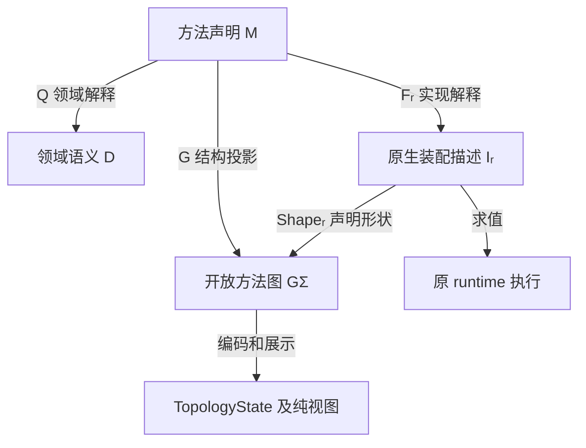
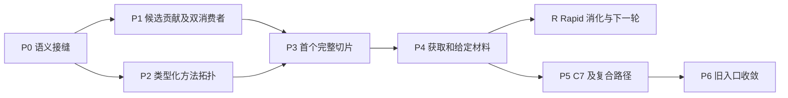

# 信息检索架构：语义、方法、结构与实现

> 架构与实现计划稿 · 2026-09-24。范围：来源组织、信息发现、材料获取、agentic search、标准化入库及信息流／方法拓扑。下文保留原设计与迁移计划；当前实测状态见本节。

**当前开发入口（2026-09-27）：** [§13 Agent 宏胞腔开发框架](#13-agent-宏胞腔开发框架)把本文与 [Agent 宏架构](AGENT_MACRO_ARCHITECTURE.md)接成具体实现方案；子 Agent 的 M 系列工作包、独占写面和阶段依赖统一维护在[分发计划](INFORMATION_RETRIEVAL_IMPLEMENTATION_DISPATCH_PLAN.md)。本轮状态为 `PLANNED`，尚未开展 M 系列代码实现或运行验证。下方 2026-09-26 记录及旧 P/R 工作包保留各自历史归属。

## 当前实现与实测边界（2026-09-26）

香港项目已有版本化检索绑定、计划预览、手动启动、Celery 执行和运行读回。绑定中的总纲、派生词表、来源路线与检索式规定方法和范围；本轮候选只从 MRW 注册的 `source.web.search` 返回值产生。绑定中的历史来源 URL 可以保留为项目观察资料及拓扑引用，但不能自动注入新轮候选，也不能冒充本轮搜索命中。预览不执行网络检索；启动后的 `source.discovery.plan` 与 `source.web.search` 由正式执行单元调用，后续评审、URL 获取、正文抽取和证据判断依次记录。

香港历史轮次 `pr_cc66409af44549a4a9504e4d300b24c7` 持久化了 1 次实际搜索 attempt、3 份正文材料，结果为 `partial` 且正式图谱数为 0；其 3 份材料的判断为 `NO_CLAIM`。该轮次曾受“绑定来源自动进入候选”的实现影响，不能拿它证明纯系统发现路径。撤销注入后，通过正式入口新启动的供水路线轮次 `pr_29f885f90d7d4b62b171a393eb5b99fe` 产生 2 次 `source.web.search` attempt 和 5 个系统候选，但 5 个候选均被安全门判为目标域名解析到不可路由地址，未取得材料，结果为 `partial`、正式图谱数为 0。排障用人工 DNS/URL 探针不属于检索结果；worker 容器中的临时域名映射已撤销。当前主机和 worker 容器对这些候选域名均解析为 `198.18.*`，安全门据此拒绝访问；不能通过人工映射把这种环境现象记作产品成功。

因此目前已证实的是正式入口可运行、系统搜索候选和 attempt 可读回、历史轮次正文可读回、证据不足与来源访问失败能保留为不同缺口；尚未证实纯系统发现轮次取得正文后形成合格正式图谱包与报告引用的完整闭环。只有来源网络恢复且新轮次通过正式证据校验、拓扑写入和读回后，才能宣布该闭环完成。

## 1. 分层依据：从共同问题出发

信息检索的共同问题是：**给定信息目标和已有材料，选择有确定边界的方法，在来源与实现条件下执行，交付语义明确的结果。**

`source → ingest → data` 保留为一个业务方向，却不作为全部架构的分层轴。source 描述来源关系，ingest 是过程，data 是对象或结果；三者并不处在同一抽象层次。handler、adapter、channel 也不能顺次排列成更多业务阶段。

本方案区分四个定义层次，把实际执行放在解释端：

| 层次 | 核心问题 | 形式承载 | 工程落点 |
|---|---|---|---|
| 信息结构 | 有哪些对象，身份和关系如何确定？ | 类型化集合、关联几何、模式实例 | 来源、通道、候选、材料及关系拓扑 |
| 领域语义 | 允许什么信息变换，承诺什么？ | 语义接口和操作范畴 `D` | 类型、操作合同、效果和失败边界 |
| 流程构造 | 如何将操作组织成可选择的采集流程？ | 流程表达范畴 `M`、索引族、结构投影 `G` | 固定路径、自适应流程、交接与执行依赖视图 |
| 实现解释 | 流程由什么具体表示和组件承载？ | 支持域上的实现函子 `Fᵣ` | codec、adapter、handler、原生贡献和装配 |
| 执行解释端 | 本次实际发生什么？ | 原 runtime 对装配的求值 | AgentCore、collect、C7 的执行与回执 |

这些层次不是五个串行服务。一次搜索同时具有信息结构、操作语义、方法构造和具体实现；一个模块也可以承载多个角色。字段与目录结构在语义边界确定后选择。

本文沿用原索引和符号 `M`，其中“方法表达式”只指**可执行的采集流程表达式**。分析方法另规定对象、事件、历史、局域及判断方式，由项目绑定的信息拓扑承载；它提出观察目标和解释位置，不能由采集步骤反推。采集流程的操作、交接及执行依赖视图可以从 `M` 派生，分析方法拓扑则保持自身的项目权威。两者通过问题、侧面、来源和结果解释的版本化引用相接。核心原则是：**采集流程由流程表达式的执行解释产生；其结构视图由同一表达式投影。**

## 2. 信息结构：集合层及关联几何

### 2.1 用关系定义结构

首先区分三类关系：指称与访问关系、内容与来源关系、方法与实现关系。它们可以使用共同的关联结构承载，却具有不同含义：来源引用不是控制依赖，可访问不是已取得，存在实现不是已执行。

设 `S` 为关系模式。实例将每种对象映到集合，将单值结构引用映到函数，并满足额外约束：

$$
X:\mathcal S\longrightarrow\mathbf{Set},\qquad X\models\Phi.
$$

多值、多元关系通过关系元素与端点集合表达，不能冒充单值函数：

$$
E\xleftarrow{\;\mathrm{owner}\;}H\xrightarrow{\;\mathrm{target}\;}E,
\qquad \mathrm{role}:H\to R.
$$

`E` 为元素集合，关系本身也可作为元素；`H` 为端点出现集合，`owner` 指向关系元素，`target` 指向参与者，`role` 标明参与角色。顺序仅在需要顺序的端点族上定义。类型、基数、作用域和版本条件归入约束族 `Φ`，不声称所有条件由普通函子自动保证。

例如，一个交接关系包含上游输出端口和下游输入端口；同一搜索操作在方法中出现两次，产生两个出现位置，共同引用同一个操作定义。在固定模式下，保持引用的实例映射构成实例范畴；它说明合法的结构映射，不自动说明可执行性或材料真实性。

### 2.2 “几何”的准确范围

这里使用有限、有类型的关联几何：邻接、方向、角色、边界、顺序、嵌套及引用。它服务于信息流和方法结构，不以距离、连续空间或额外拓扑不变量作为实现前提。

现有 `information_topology` 已提供 `Element`、`Endpoint`、`BoundRef`、`ProfileSpec`、纯视图和映射预览。应扩展这些对象的具体语义，不新建另一套图存储。

来源图与方法图使用不同 profile，通过身份引用连接。方法图描述可能的获取过程，来源图可以记录某次执行取得的快照；两者不能互相代替。只包含显示信息的视图可以有损，但不得作为完整方法结构的验收依据。

### 2.3 source、channel、pool 的位置

| 概念 | 抽象身份 | 关键区分 |
|---|---|---|
| Source | 信息来源及可追溯身份 | 不等于 provider 或 handler |
| Resource / Locator | 资源及定位方式 | URL 不保证内容稳定或已取得正文 |
| Channel | 访问来源的方式及配置关系 | 不独占查询、下载或写入语义 |
| Pool | 有类型的成员关系或筛选视图 | 成员资格不自动赋予执行权限 |
| Candidate | 发现阶段的线索和已知信息 | 不冒充已获取材料 |
| Material / Snapshot | 已接受内容及其版本、来源 | 不自动成为规范数据或合格证据 |
| Data | 特定规范化与写入合同的结果 | 不抹去原材料或来源 |

`given` 与“需要主动采集”描述输入的可用性，不适合作为 Source 的互斥本体分类。同一来源可以同时提供 URL、上传文件和历史快照。给定字节免去下载，但仍需接受和格式处理；给定 URL 仍需获取。

因此来源目录、候选池、URL 池和材料库可以共享成员关系机制，同时保留不同成员类型、生命周期和 owner。是否共用物理表由现有存储边界决定。

### 2.4 Rapid 在统一信息拓扑中的对象与身份

Rapid 的分析总纲及其派生 `域.json` 是项目绑定语义，不是全局节点／边类型枚举。全局信息拓扑只规定元素身份、关系端点与角色、来源和版本引用、提案与正式记录的结构约束；项目决定视角、章节、候选节点／关系类型及来源路线。依据[采集架构改写稿](</Users/wangyiliang/Documents/Codex/2026-09-20/zhen/outputs/MRW信息采集架构_上下文与高阶表示_改写稿_2026-09-24.md>)第 1、2、6、7 节及[Rapid 轻薄切片](</Users/wangyiliang/Desktop/科学/项目/05-案例、原型与验证/信息调查流程函子化改造_2026-09-20/2026-09-20-第一阶段轻薄实现_Rapid信息网络与再生产二阶层.md>)，接入保留以下七种工作对象的区别：

| Rapid 对象 | 统一层中的身份与 owner | 不能合并成什么 |
|---|---|---|
| `AnalysisTopology` | 项目总纲的版本引用及其派生词表／信息拓扑 profile | 执行依赖图或全局香港词表 |
| `QueryTask` | 带侧面、分析位置、来源路线和版本的计划查询 | 已执行的检索尝试 |
| `SearchAttempt` | 正式执行单元的逐次调用、返回位置、失败与停止记录 | 历史计划或候选命中 |
| `CandidateOccurrence` | 轮次、分面、原候选 ID 组合的出现身份；查询／attempt 是多值 provenance | URL、材料或合格证据 |
| `CandidateNetwork` | 从上述身份、快照及链接派生的只读投影 | 第二份候选事实库 |
| `FacetDigest` | 本轮候选引用下的轻归纳、分类、拓扑定位和覆盖缺口提案 | 正式判断或项目总纲修订 |
| `ExpansionFrontier` | 回指 digest、缺口、候选根据和分析位置的下一跳／查询草案 | 已执行查询或自动采纳的结论 |

`Snapshot` 另有内容版本与来源身份；同 URL 不证明同一内容，同一候选经多次查询命中也不必复制 occurrence。历史 Rapid 的 `round / facet / original_candidate_id` 不得静默重算成当前 MRW 的 run／query／URL 哈希候选 ID；迁移需保存显式身份映射及不能对应的记录。香港已迁入的 57 个 `retrieval/rapid` 状态和原始来源文件按旧版本读回；它们不变成新轮次的 attempt，也不成为新运行候选的自动输入。

## 3. 领域语义：什么变换有意义

### 3.1 类型表达信息承诺

语义类型描述可交接的信息及保证，不是恰好相同的 JSON 字段。查询、候选包、资源引用、给定内容、材料快照、可规范化材料和规范数据引用是初始类型族中的成员，允许按实际需要扩展。

同一语义类型在不同路径中引用同一 canonical 定义及版本。具体序列化由 codec 解释；相似字段不构成类型相等。来源资格、基数和消费方式需要进入相应接口合同。

类型与集合层在值的解释处相接：一个接口的值由符合其合同的内容以及可在相关信息实例中解析的引用组成。类型身份正确不代表引用当前有效；对应 owner 的版本／作用域检查仍需执行。这样，操作消费的是信息结构中的合法值，而不是与来源关系脱离的字典。

领域范畴 `D` 的对象是语义边界接口。一个接口是有限的类型化端口族，包含必要的顺序、基数及使用约束；它作为一个整体对象参与复合。箭头是领域操作及其有序复合，具有前后条件、效果、失败和来源承诺。

以下仅列成功交接，失败和部分结果另由合同规定：

$$
\begin{aligned}
\mathrm{discover}&:\mathrm{QueryIntent}\to\mathrm{CandidateBundle},\\
\mathrm{acquire}&:\mathrm{ResourceRef}\to\mathrm{MaterialSnapshot},\\
\mathrm{accept}&:\mathrm{GivenContent}\to\mathrm{MaterialSnapshot},\\
\mathrm{prepare}&:\mathrm{MaterialSnapshot}\to\mathrm{IngestReadyMaterial},\\
\mathrm{normalize}&:\mathrm{IngestReadyMaterial}\to\mathrm{NormalizedRecord},\\
\mathrm{commit}&:\mathrm{NormalizedRecord}\to\mathrm{CanonicalDataRef}.
\end{aligned}
$$

候选评估、批量选择、解析和去重可以成为其他操作。拆分依据是独立交接、替换或效果边界，不要求每个名称对应一个服务。`prepare` 可以精化为 PDF 解析、OCR 等子方法；已经满足条件的材料也须通过明确验证接入。

`ingest` 是材料到规范数据的子方法。一个入口若同时下载和入库，就承载更大的复合方法，不能用同一个入口名字消除获取与写入的语义差别。

### 3.2 合同与等式

两个 `A → B` 操作不因此相等。不同 provider 可以实现同一搜索合同，却返回不同候选。类型统一使交接合法，不能证明结果等价、质量一致或实现可无条件替换。

基础组合遵守恒等和有序结合：

$$
h\circ(g\circ f)=(h\circ g)\circ f,
\qquad \mathrm{id}_B\circ f=f=f\circ\mathrm{id}_A.
$$

结合律只改变括号，不交换动作顺序。其他等式须附观察边界及实际见证。合同中的前提可以由类型保证、显式验证操作保证，或作为执行时可失败检查保留；不能因签名匹配就假定成立。

本层不建立全局状态单子或统一轨迹计算。既有合同继续表达效果与失败，既有 runtime 继续拥有执行状态。

## 4. 方法构造：从操作到索引路径

### 4.1 操作、方法与出现位置

操作定义规定变换；方法定义规定组合；出现位置规定方法内的一次操作使用。它们必须具有不同身份。

方法范畴 `M` 的对象是语义边界接口，箭头是操作出现位置及合法组合构成的方法表达式。初期采用顺序组合、显式 wiring 和合同化宏；多端口接口整体匹配。默认值、选择、复制、合并或丢弃在需要时作为显式操作，不隐含在普通复合中。

多端口本身不要求引入幺半结构。若后续确需并行组合，才定义对应张量、效果兼容条件与保持规律；不从“图上没有数据边”推导可以并发。

领域解释将方法映到其信息变换：

$$
Q:\mathcal M\to\mathcal D,
\qquad Q(q\circ p)=Q(q)\circ Q(p).
$$

`Q` 忘掉显示名称、局部位置标识等构造细节，保留语义和有意义的顺序。认定一个复合方法实现某个更粗领域操作，需要精化见证；仅端点相同不够。没有见证的不同复合保持不同箭头。

这些解释只定义在已支持的构造上。Agent 循环先作为有外部合同的宏操作，不要求建立任意递归的通用语义。

### 4.2 显式可索引路径族

设 `I` 为版本化的方法索引集：

$$
\rho:I\longrightarrow\operatorname{Mor}(\mathcal M),
\qquad \rho(i):A_i\to B_i.
$$

入口先选完整方法，再填参和绑定实现。索引目录从方法声明派生，不维护第二份步骤表。`M` 允许合法组合，而 `I` 指定可直接选择的已发布方法；不是所有组合都自动进入选择目录。

| 初始路径成员 | 输入 → 输出 | 方法特征 |
|---|---|---|
| 固定候选检索 | 查询意图 → 候选包 | 已确定搜索方式，不入库 |
| 自适应候选检索 | 查询意图 → 候选包 | Agent 在允许动作范围内调整搜索 |
| 指定资源获取 | 资源引用 → 材料快照 | 选择合适通道和获取实现 |
| 给定材料接收 | 给定内容 → 材料快照 | 接受内容，保留来源 |
| 材料标准化入库 | 合格材料 → 规范数据引用 | 复用 C7 规范化与写入 |
| 检索并入库 | 查询意图 → 规范数据引用集合 | 检索、选择、获取、入库的复合 |
| 已有数据检索 | 存储查询 → 已有数据结果 | 保留既有数据库检索语义 |

选择策略依据输入、目标输出、可用实现与允许效果，作用于适用集：

$$
I_{\mathrm{eligible}}(x,c)
=\{i\in I\mid\mathrm{accepts}_i(x)\land\mathrm{supports}_i(c)
\land\mathrm{allowed}_i(c)\}.
$$

策略返回索引身份及版本，或者明确无适用／歧义结果。新增路径不自动改变默认选择策略。指定路径的入口可绕过策略，指定 handler 的入口可以限制绑定，但仍需满足方法合同。

### 4.3 统一交接

连接引用具体端口出现位置和共同语义类型，不依赖字段同名：

$$
\mathrm{out}(u,p)\xrightarrow{\;b\;}\mathrm{in}(v,q),
\qquad \mathrm{type}(u,p)=\mathrm{type}(v,q).
$$

端口可以异名；同类型仍须满足基数、顺序、资格和消费方式。首期复合采用完整中间接口匹配，部分输入由显式投影、默认值或选择操作处理。一对多不自动获得复制权限，多对一不自动获得合并语义。

字段重命名和序列化在表示边界处理。候选变材料、摘要变正文、旧类型变新类型等语义变化必须显式成为操作。共同端口类型使不同路径的局部操作可交接，并不抹去路径各自的控制逻辑。

### 4.4 agentic search

Agentic search 是索引族中的自适应方法，复用固定方法的搜索、候选组织和交接合同。变化的是控制策略，而不是另建信息类型。

Agent 宏本身是一个胞腔结构。注册在边界上的概念规定层作用于整个胞腔，关联对象与身份、组成关系、开放表达与上下文、skill 的方法与局部成果、tool／设施的效果与权威、交接组合及生命周期。信息拓扑规格是其中表达结构与关系的一个环节；skill 正文、tool spec、会话及设施合同分别提供其他规定，继续由原 owner 持有权威。该层按实际情境引用这些声明，不要求每次输入填写一份总规格。数据库、工作流程和系统消费者统一属于系统运行层，原生 Core 寄宿于胞腔内部。

Tool／skill spec 在整体架构中承担基本 Agent–System（A–S）交互的虚边化：tool spec 规定可调用操作及其输入／输出、效果、权限、失败和原执行器绑定，skill 内容组织适用情境、方法、工具使用与局部成果要求。经实际注册、挂载和执行支持，这些交互成为 Core 可直接使用的原生能力；系统操作与事实 owner 保持在原接线中，宏侧无需追加交接。Rapid 的读写工具化属于这一通用机制。

概念边界可由虚边或实边实现，分类须注明具体关系与观察层次。已挂载的 skill/tool 经边界规定后由 Core 正常使用，属于无需额外宏接口的虚边；用户自由表达与 Agent 的语义关系也可为虚边，同时前端传输仍是实边。系统调用 Agent 请求、Agent 向下游直接交付的接口是实边，可复用现有 API/binding。若消费合同及其权限、效果、失败和结果含义已由 tool 与原执行器完整承载，宏侧可用虚边接合，工具到设施的真实调用继续存在。“双向 MCP”表达同一胞腔向内供给能力、向外交接成果的关系，采用协议的部分按实际支持接线；胞腔主要通过规定、原生装配和必要接口中介调控运行。

Agent 宏的直接对话入口只规定“用户提交了表达”及必要的来源、会话关联，保留自由表述，不要求用户先提供查询字段、任务种类或目标成果类型。Agent 在原 Core 内结合表达、允许的上下文和适用 skill 形成具体工作参数；这些参数属于执行中的解释，不替代原始输入。概念规定层关联这些工作与数据库、拓扑记录服务和工作流程的调用合同，虚边直接沿原生路径落实，实边由对应交接接口落实。方法图展示宏及允许的能力结构，执行轨迹记录实际动作；虚边不表示没有运行或副作用，注册元数据也不证明原生接线已完成。

宏观 I/O、skills/tools 中介环境与 Codex 接入以[Agent 宏观架构](AGENT_MACRO_ARCHITECTURE.md)为准。撰写或修改 skill 可以在其适用的输入情境中规定处理方法、设施使用和成果要求，进而局部细化或扩展宏的行为；这些规定不成为所有用户表达的入口限制。需要交给程序或工作流程的成果，在真实交接处满足对应合同。实现沿用既有 `CodexAppServerCore` 挂载路径及 MRW `AgentCore` 能力装配；当前 Codex provider 的工具限制和原生 Agent loop 接线缺口按该文档声明。

既有 LLM 环节按该文档 §8.1 纳入胞腔关系：方法与局部成果进入实际 skill 内容，材料进入允许的上下文，系统工作请求绑定胞腔入口，设施及消费沿原 tool／执行器接合。方法和实现拓扑保留在现有声明／投影模块，引用胞腔与能力身份；单次模型工作及多步 Agent 工作各保留自己的执行合同。总体化允许不同能力环境和会话实例，不要求所有环节共享一个上下文，也不将底层模型 provider 改成递归 Agent 入口。

当前 `source.web.search` 返回 URL、标题、摘要等候选，不获取全文、不直接入库。候选评审形成 ingest payload 也不代表已经执行 ingest。独立搜索以候选包结束；检索入库方法显式衔接评审／选择、获取和 C7。

未来若支持新的自适应策略，可增加方法或宏实现；若引入一般反馈构造，则需另行定义反馈语义及其保持规律，不能把任意图环认作合法循环。

### 4.5 Rapid 作为项目参数化的检索—再生产循环

Rapid 的方法、skills/tools、上下文组织和原生循环作为胞腔内 AgentCore 的虚边能力尽量整体保留，胞腔通过概念规定和必要交接组织其与系统的关系。本项采集原本要求结构化成果，入库直接承接最后一步：按[宏架构 §8.2](AGENT_MACRO_ARCHITECTURE.md)优先将读取、写入和读回注册为原生 tool，使 Core 侧采用虚边；也可由最终结构化结果经实边交给原 writer。项目分析拓扑提出关注对象和问题位置，来源路线与查询约束形成可复用的 `SearchFacet`；一次请求与该侧面相容时实例化 `QueryTask`。原 Rapid 的分面在系统交接表示中分别关联搜索侧面、候选 occurrence 的分面引用和 `FacetDigest`，原方法内容继续复用。市场、政策等标签是侧面值，不决定流程种类或正式证据资格。

下面表示一轮中材料与成果的可观察有序关系。各箭头由原生工作形成，不要求拆成外部调度节点：

$$
\mathrm{AnalysisTopology}_p
\xrightarrow{\mathrm{instantiate\ facet}}\mathrm{QueryTask}_p
\xrightarrow{\mathrm{discover/acquire}}\mathrm{CandidateNetwork}_p
\xrightarrow{\mathrm{digest}}\mathrm{FacetDigest}_p
\xrightarrow{\mathrm{next}}\mathrm{ExpansionFrontier}_p
\longrightarrow\mathrm{QueryTask}'_p.
$$

`discover/acquire` 的实际工具调用、快照和失败由执行 owner 记录；`CandidateNetwork` 是只读投影；`digest` 与 `next` 是保留输入引用、输出上限和顺序的提案操作，不因写成箭头便成为确定性函数或已证明的函子。交付为 `FacetDigest` 的系统表示须保留轻归纳、分类提案、分析拓扑位置、覆盖／失败边界和 `claim_ceiling=expansion_proposal`；每条后继查询回指促成它的候选或无候选的失败／覆盖记录、缺口及侧面理由。能够由原生成果及调用记录确定的对应关系由交接侧派生，缺失的领域内容显式保留为缺口。同一会话、授权和预算内的后续探索由原生 AgentCore 决定并执行；真实调用产生对应 attempt，查询草案仍是提案。对外新建 run 或调用独立工作流时才使用相应正式入口。

流程目录引用 Rapid 宏胞腔及其原生工作环境。搜索方法、可用工具、停止／预算规则和目标交付保持相应内容、端点、效果与权限；项目侧面和本次问题构成输入情境。方法／实现拓扑可以在原模块表达这些关系与局部成果，引用同一胞腔身份，不反向调度 Core 的每次动作。外层只组合已有合同支持的宏调用，内部轮次保留在原生运行时；不同环境实例的行为关系仍按实际合同说明。

Rapid 本轮消化要求形成支持可追踪下一跳的结构化成果；本项采集入库的成功完成还包括对应 writer 的保存确认与必要读回。预算耗尽、来源失败、写入失败或停止条件各保留真实状态。候选进入材料、证据和判断的后续流程需独立经过正文定位、来源角色、证明对象、关系端点与版本检查。两条路线可以共享已取得的快照和身份引用，已保存的 `FacetDigest` 仍保持提案身份。

## 5. 采集流程结构投影：结构构造与自然性

### 5.1 从关联集合构造开放方法图

不能直接把“采集流程到 TopologyState”叫作函子：流程在 `M` 中是箭头，而 TopologyState 是一个表示对象，需要先定义可组合的目标结构。此处投影的是操作出现位置和执行依赖，不是 Rapid 分析总纲中对象、事件、历史与局域的关系图；后者由项目自己的 profile 和事实来源解释。

定义开放方法图范畴 `GΣ`：对象为类型化边界接口；箭头为带输入输出边界的有限关联图，内部包含操作出现位置、wiring、控制依赖与合同化宏。仅局部结构 ID 按重命名取商。

图的复合沿明确匹配的中间接口连接，内部 ID 先分离，并保持控制作用域。使用可由支持的方法构造生成的图，确保该图族对复合封闭；不宣称任意合法 TopologyState 都属于其中。恒等为边界直通，结合律在保持边界和语义标签的图同构下成立。

于是有结构投影：

$$
G:\mathcal M\longrightarrow\mathcal G_\Sigma,
\qquad G(q\circ p)=G(q)\circ G(p).
$$

集合层提供元素与关联，方法层赋予组合意义。TopologyState 是每个开放方法图的序列化／持久表示，不取得执行权。

### 5.2 图等价保留什么

局部出现位置 ID 可以重命名，但必须保持出现次数及对应关系。边界身份、操作语义身份及版本、外部 BoundRef 不可随意改名。运行 invocation/attempt ID 不属于方法图的结构身份。

结构比较还须保持端口类型、角色、顺序、数据／控制依赖、分支作用域、宏边界，以及相应的效果、失败、权限、停止合同引用。只比较边界或节点数量不够。

实现内部存在多步精化时，可投影成父操作，但必须声明精化边界并保留可追溯展开。真正改变语义的步骤不能作为“适配细节”静默隐藏。

## 6. 实现函子与执行边界

### 6.1 实现解释的定义域

实现环境 `r` 可能只支持部分方法。取其实际支持、包含恒等且对所用组合封闭的子范畴 `Mᵣ`；仅若干单独可运行操作的列表，还不是子范畴。

实现范畴 `Iᵣ` 的对象是语义接口的具体表示；箭头是具有语义引用、可由原装配 combinator 组合的组件／程序描述，不是所有 Python 函数。

$$
F_r:\mathcal M_r\longrightarrow\mathcal I_r.
$$

`Fᵣ` 解释接口表示、操作实现及方法组合。codec 对应表示，handler 对应具体执行内核，binding 对应实现选择，native contribution lowering／assembly 对应装配解释。单纯查找 handler 只完成其中一部分。

$$
F_r(\mathrm{id}_A)=\mathrm{id}_{F_r(A)},
\qquad F_r(q\circ p)=F_r(q)\circ F_r(p).
$$

等式采用明确的装配结构等价，不要求生成字节完全相同，也不要求网络结果确定。尚未支持复合的部分先称为绑定映射，不能提前声称实现了函子。

### 6.2 核心一致性关系

从带注解的装配描述提取声明形状：

$$
\mathrm{Shape}_r:\mathcal I_r\to\mathcal G_\Sigma.
$$

同一方法直接投影拓扑，与先实现再提取声明形状应一致：

$$
\mathrm{Shape}_r\circ F_r\cong G|_{\mathcal M_r}.
$$

若边界表示需重命名，定义边界同构族；对每个方法要求自然性：

$$
\eta_A:G(A)\xrightarrow{\cong}\mathrm{Shape}_r(F_r(A)),
$$

$$
\mathrm{Shape}_r(F_r(p))\circ\eta_A
=\eta_B\circ G(p),\qquad p:A\to B.
$$

两边采用同一个保留语义标签的观察边界。简化 UI 图可以另作有损投影，但不能用它证明本式。采用完全一致的 canonical 边界时，`η` 可以取恒等。

这个条件检查两条解释路线的结构相容性。它不从代码执行反推形状，也不证明 handler 真正遵守合同；实际输入输出、失败、权限和效果需要原消费者的行为见证。

领域解释与实现解释还须通过合同遵守关系连接：

$$
F_r(p)\models Q(p).
$$

这里的满足关系表示：在合同前提和规定观察下，实现的允许行为满足领域方法的输出、来源、失败与效果承诺。它是待提供见证的实现义务，不是由结构自然性推出的定理。原子操作由内核及消费者测试见证，复合方法还需检查前后条件交接和实际控制组合。首个切片分别验证“结构一致”与“行为遵守”，不互相替代。



### 6.3 具体实现角色

| 角色 | 职责 | 边界 |
|---|---|---|
| Handler | 执行具体调用或既有复合入口 | 真实效果必须与合同一致 |
| Adapter | 转换协议／表示或承担显式兼容操作 | 不能暗中增加领域变换 |
| Provider | 提供本地或外部能力 | 作为依赖参加绑定 |
| Resolver / Binding | 从配置及支持关系解析实现 | 不拥有方法或领域语义 |
| Contribution rule | 派生合同、注册、程序、拓扑与装配 | 复用原贡献编译入口 |
| Runtime | 调用、恢复、停止和记录效果 | 保留现有执行 owner |

现有 adapter 若兼有获取与写入，先以准确的复合合同接入，再按真实替换需求拆分。不能只改名就宣称其是纯表示转换。

### 6.4 Rapid 的上下文限制与外部 Agent 接点

项目绑定、一次轮次、Agent loop 是不同的执行上下文；项目总纲中的“局域”是分析对象，不能与这些工具作用域混为一谈。项目路线和词表可按声明限制到轮次；某 provider loop 私有的内建搜索仅在该 loop 有绑定，不能因为外层拿到材料就获得该工具的全局调用权。执行前还须重读凭证、通道、预算和网络可达状态，静态绑定不证明即时可派发。

Rapid 可把 MRW `source.web.search`、现有获取／正文读取能力或一个外部 Agent 暴露的完整检索接口绑定到相应语义箭头。只返回 URL／摘要的调用止于候选；交付带来源全文的调用才进入快照后段；综合报告保留其实际阅读材料引用。外部 Agent 的内部循环、重试及模型内建搜索由提供方负责，MRW 只记录可观察的请求、结果、来源、停止和失败，不虚构可单独调度的内部步骤。项目绑定的历史来源 URL 是观察资料，不自动成为本轮 `source.web.search` 的命中。

多个 Rapid 分面或轮次重叠时，候选网络可以并列读取其来源与内容引用；只有明确覆盖、重叠身份、版本和相容比较，才能把“同一事实的局部表示”按采集架构第 7 节的下降条件整合。不同来源互相矛盾的内容仍各自保存；`FacetDigest` 对它们的综合是带来源的提案操作，通常不是层的粘合。当前工程先校验引用和版本，不宣称已实现高阶层下降或从形式相容性推出事实真实性。

## 7. 运转逻辑由分层直接导出

以“搜索某主题并交付候选”为例：

1. 查询值进入 canonical 输入类型，目标输出约束为候选包。
2. 选择策略在路径索引中选固定或自适应方法及版本；来源配置提供适用性和绑定条件。
3. 方法声明确定操作、出现位置和交接；`Q` 给出语义承诺，`G` 给出方法拓扑。
4. 在支持域内由 `Fᵣ` 获得对应实现装配，检查其声明形状与直接拓扑一致。
5. 原 runtime 执行。固定路径调用搜索服务，自适应路径由 AgentCore 控制动作；二者复用同一搜索语义。
6. 结果经共同候选合同交付；来源、分支失败和停止情况由本次执行产生，不由静态图推测。

若目标为检索并入库，选择另一已索引复合方法，其内部显式包含选择、获取、准备和 C7。若输入为文件，选择接受路径；若为 URL，选择获取路径；若已有合格快照，选择材料入库路径。

以上区别来自类型、方法和解释的定义，不来自不断追加的 `source_mode` 特判，也不要求每次重新逐步拼流程。

Rapid 实例以完整宏胞腔接入：关联原项目总纲、词表、来源路线及上下文，在既有 Core 中挂载原方法与工具；使用现有预览入口时只观察版本和预算。启动后由原生 Agent 根据材料和实际工具反馈组织检索、消化及继续／停止判断，同一会话的内部轮次保持原循环。候选、digest、frontier 与查询提案按本项采集的结构化合同产生，真实调用与来源保持可追踪。Core 通过原生读写 tool 取得资料并完成入库，或由采集最后一步的实边完成交付；取得保存确认与必要读回后才报告本项采集入库成功。外部新建 run 或独立 workflow 保留启动、权限和预算合同。正式成图继续使用资格校验与拓扑 writer，Rapid 提案保留自己的身份和上限。

## 8. 初始迁移基线与差距

以下保留初始设计时的代码基线与迁移目标，其中候选合同、贡献规则及方法流等已有后续实现，准确批次记录见[分发计划 §8](INFORMATION_RETRIEVAL_IMPLEMENTATION_DISPATCH_PLAN.md#8-主线执行记录)。新胞腔开发使用 §13 的接缝与 M 系列状态，不据本表重派已完成的 R 包。

| 当前事实 | 差距 | 处理方式 |
|---|---|---|
| source_library 有 ChannelRecord、SourceItemRecord，handler 按 provider/kind 注册 | 来源、配置和实现选择部分混合 | 保留 owner，区分来源关系与实现支持关系 |
| collect_runtime 有 request/result/adapter，部分 adapter 会写入 | 统一接口下仍有不同语义粒度 | 准确标注复合效果，不把 CollectResult 当纯候选 |
| search_sources 返回字典，Agent 私下组织候选 | 交接语义未共享 | 提炼共同候选合同与 typed service |
| AgentCore 已有模型控制循环 | 容易形成旁路 | 注册为方法，保留原循环 owner |
| method check 依赖端口同名和 type 字符串相等 | 无法表达显式 wiring 与真正共享类型 | 加语义类型引用、出现位置和端口绑定 |
| method profile 明确只描述、不执行 | 描述图不是程序 | 保留 v1，新增版本化派生方法流 profile |
| C3/C8 已有 native contribution 派生链 | 未贯通所有检索路径 | 复用规则机制，补项目检索 lowering |
| C7 有 snapshot、规范化与显式 writer/projector | 二进制准备、接受与写入需区分 | 统一材料入口，保留原写入边界 |
| GET /search 读取已有数据 | 与外部搜索同名不同义 | 保留其语义，不改成外部候选搜索 |
| 香港 57 个 `retrieval/rapid` 历史状态及原始来源 bundle | 已能按旧 profile 读回，历史 occurrence／attempt 与新轮次身份不同 | 保留原始身份和字节；建立显式身份映射，不重放历史记录 |
| `project_retrieval` 版本绑定、预览、Celery run、`source.web.search`、读回 | 已有项目参数化的实际搜索入口，但当前 run 以查询／URL 哈希生成候选 ID，且没有独立的 `FacetDigest`／`ExpansionFrontier` 产物 | 在现有项目服务和拓扑写面补 occurrence、消化提案和下一轮引用链，不另建 Rapid 搜索器 |

已发现有界问题：`method_element()` 为 `composes_after` 填写 position，而对应 profile 未设置 `ordered=True`，非空组合可能被通用校验拒绝。纳入 P2；本文不声称已修复。

可复用对象包括 `ObjectType`、`OperationContract/Ref`、`PayloadCodec`、操作目录及 `ProgramSpec`。根 `functorial-kit.json`、`registries/`、`sketches.json` 已管理部分相关接口和见证；沿原派生／校验流程接入，不建第二登记体系。

C3 是装配先例，不是通用检索生产入口：缺少 `element_payloads` 时会返回 `FIXTURE_CLOSURE_REQUIRED`。C7 canonical writer 仍需显式 closure；当前 native catalog 也不等于已自动支持全部 C7 子阶段。这些缺口须由实际消费者接线解决。

当前香港正式入口已观察到系统搜索候选和 attempt，但最新轮次因候选域名解析到不可路由地址而未取得材料；较早取得正文的轮次又未通过正式关系判断。上述状态只证明局部接点，不能宣称 Rapid 的两轮消化闭环或正式成图闭环。准确运行身份和限制见文首实测边界。

## 9. 开发接入：语义只写一次

领域作者提供类型意义、操作合同、方法分解、特殊内核及必要见证。每项事实有唯一权威位置；“一份声明”指同一组 canonical 定义及引用，不要求一个巨型文件。

贡献规则从这些定义派生类型／操作目录、codec 和失败引用、路径索引、原生程序／装配，以及方法拓扑与结构检查输入。新增方法复用操作，新 provider 复用合同，新材料形态增加真实需要的类型或解析操作。

原可编辑描述图仍由原 owner 管理；可执行方法的派生图标明定义及版本，不允许改图直接改执行。未来需要可视化编辑时，应回写方法声明后重新派生，本期不另建编辑器。

方法定义可在既有装配阶段派生。请求只选路、填参和调用，不要求运行时重新生成全部目录，不新增通用 runtime、scheduler 或 DAG 平台。

Rapid 使用这条开发接缝接合原生核心与系统设施；方法及循环保持在胞腔内，外侧负责原有服务和成果入库：

| 权威声明与现成入口 | 接入动作及唯一写面 |
|---|---|
| 项目《分析总纲》、派生 `域.json`、来源池和关键词池；`project_retrieval/hk_loader.py` 是香港实例装载器 | `project_retrieval/mode.py` 固定项目观察、侧面／路线、查询和预算版本；总纲变化显式刷新绑定，旧轮仍按固定版本解释。通用合同不内置香港词表 |
| 原 Rapid 方法／skills／上下文与既有 Codex Core 接入；`agent_core/project_tools.py` 的 `source.web.search`；`project_retrieval/execution.py` 的既有 Celery run | 原 Rapid 核心作为虚边能力挂载；搜索工具及有界计划保持各自现成入口，不由 Celery run 替代 Agent 内部循环。实际调用生成候选并保留 query、attempt、snapshot 与 occurrence，历史记录只作引用 |
| `information_topology/modules/retrieval.py` 的项目 profile 与拓扑 writer | 将结构化采集合同与原查询／writer／读回入口接合，优先暴露为 Core 原生数据 tool；最后一步也可经实边直接交付。取得保存确认与必要读回后才完成采集入库；digest、分类／关系提案、缺口与 frontier 保持 `expansion_proposal` 上限，原 57 个状态不覆盖 |
| 现有正文读取与 `project_retrieval/formalization.py` | Rapid 消化读取候选及实际正文／快照，产出有根据的提案；正式化是另一个受证据口径 2 校验的交接，formalizer 不直接写拓扑 |
| 运营入口、`GET /runs/{id}` 和统一图谱 realizer | 读取同一运行记录与项目拓扑，分别展示候选网络、缺口／下一跳及已核正式图；视图不能反写总纲或凭展示完成推断资格 |

后端项目检索 `SkillSpec` 继续包装绑定、预览、启动及读回入口；Rapid 的原生方法 skill、上下文和循环另按其原有内容挂入 Core，二者的角色保持清楚。新增侧面复用项目声明，新增搜索 provider 才增加对应上下文中的局部表示。若现有贡献规则不能派生必要的成果 codec、注册或投影，由集成 owner 在一个真实产物上扩展规则并接通原 writer，再复用同形接线；数据库表示适配不重写 Rapid 的方法与轮次控制。

## 10. 实现工作包

本节 P0–P6 与 R 是检索迁移的原始设计分解，用于追溯语义与覆盖要求。后续 R0–R6 实现记录及当前 M 系列接续均以[分发计划](INFORMATION_RETRIEVAL_IMPLEMENTATION_DISPATCH_PLAN.md)为执行入口。

### 10.1 顺序及并行边界



P0 确定接口后，P1 候选内核与 P2 纯拓扑可以并行。公共贡献规则由一个 owner 用首例打通后再迁移同形案例。集成 owner 统一维护共享消费者和清单，不让各包各造注册／投影机制。

### P0：固定语义与首个接缝

- **目标和输入：** 根据 search/web.py、Agent 工具行为及既有类型合同，明确候选搜索边界。
- **输出：** 拟定 `CandidateSearchRequest → CandidateBundle` 的 canonical 类型与操作、固定／Agent 方法边界、候选评审交接。
- **独占写面：** 候选语义声明，建议置于 `successor_runtime/capabilities/retrieval_candidate_native.py`；路径为计划新增。已有类型可复用则引用。
- **验证与完成：** 一个真实既有结果、一个失败和一个部分结果均能明确解释；合同不依赖 Agent 私有字典或带写入语义的 CollectResult。P1 的消费者见证验收此接缝。

### P1：候选原生贡献和双消费者

- **目标：** 固定调用与 Agent `source.web.search` 使用同一 typed service、合同和错误解释。
- **权威输入：** search_sources 内核、现有 Agent 候选组织行为、NativeContributionRule 及 C3/C8 装配模式。
- **独占写面：** 建议新增 `services/search/candidate_search.py`，候选贡献规则／装配、原 project_tools 与 `discovery/adapters.py`。首个固定消费者明确为 `DefaultDiscoveryAdapter.search`，其搜索调用改用共同服务；不改 GET /search 的含义。
- **输出：** 一次声明派生合同、codec、目录和绑定；两个原消费者实际引用它。内部固定方法输出完整 CandidateBundle，再投影到原 discovery 的 list envelope；Agent 投影到 `CoreToolResult.structured_content`。评审／handoff 消费完整候选合同，不从可能丢失诊断的旧 list 反向重建。旧 envelope 的兼容投影及其观察损失明确记录。
- **验证与完成：** 保留原合并／排序、provider 诊断和失败分类；搜索不触发 ingest／项目数据写入。运行第 11 节候选测试，新增双消费者交接见证。不同 provider 不按结果文本相等验收。

### P2：方法拓扑及纯结构规则

- **目标：** 表达操作定义、出现位置、显式 wiring 与 Agent 宏，保持组合结构。
- **权威输入：** 既有 topology contracts/profiles/method/mapping 和 P0 类型引用。
- **独占写面：** 建议新增 `information_topology/modules/method_flow.py` profile、纯投影及检查；修复 method 顺序约束时明确版本处理，不静默重解释旧快照。不得改搜索内核或 Agent 执行器。
- **输出：** 方法声明到开放图／TopologyState 的投影和完整图等价观察。
- **验证与完成：** 异名同类型可显式连，同名异类型拒绝；重复操作保留两次出现；未声明循环拒绝；恒等和三段结合保持。运行现有 topology 测试并补新 profile 测试。

### P3：贯通第一个完整切片

- **目标：** 固定搜索与 Agent 搜索贯通索引、共享候选操作、拓扑、原生装配和共同评审交接。
- **独占写面：** 公共方法贡献规则、派生路径目录的原消费者、组合验证；集成 owner 持有，P1/P2 不各造副本。
- **输出：** 共同候选操作和固定程序先通过原生贡献生成 `G` 与 `Shape ∘ F`；两类原入口的候选进入共同 handoff 消费者。AgentCore 经工具 adapter 消费同一搜索合同，动态循环仍由原 AgentCore 持有，不能声称已由现有 Program AST 编译。
- **Agent 宏的实现接缝：** 宏胞腔的声明关联完整概念规定层、具体关系的虚／实边实现、系统运行层及内部 Core 绑定，并派生目录、装配和方法投影。概念层引用信息拓扑规格、skill 内容、tool spec、上下文及原交接／生命周期合同，各事实继续由原 owner 声明。已挂载且由原生执行保持规定的能力使用虚边；系统请求或直接消费使用现有实接口，只有实际接线缺口才补 adapter。消费已由 tool 完整承载时可省去额外宏接口，但保持身份、效果、权限、失败与结果含义。这些局部规定不预设用户输入的业务 schema 或全局固定成果类型。`CodexAppServerCore` 提供既有 Codex 模型接入，MRW `AgentCore` 保留项目工具循环及兼容能力；目标原生 Agent 的工具调用／续接仍须沿 Codex Core 路径补齐。以一个实际 skill 贯通能力供给与系统交接，确认虚边的原生承载及必要实边，补齐受影响的错误、取消与权限见证后，将受支持部分纳入对应 `Mᵣ`。provider 挂载与完整宏胞腔执行分别报告。
- **验证与完成：** 结构等价；遗漏步骤、错序和错误合同版本反例失败；原 AgentCore 入口可执行受控工具调用；候选评审不冒充 ingest 已完成。新增候选／拓扑贯通测试，并跑受影响 native catalog 装配回归。

本包通过后才批量展开后续路径；通过指共同切片通过，不是 P1/P2 各自单测通过。

### P4：获取和给定材料

- **目标：** URL／channel 获取、给定字节与已有快照在材料边界交接。
- **权威输入：** source_library、resource_pool、fetch ports、resolver 和 C7 RawSnapshot。
- **独占写面：** 对应方法声明、必要获取／接受内核和已有 adapter 接线，复用 P3 规则。
- **验证与完成：** URL 与内容不同型，给定字节不下载，获取不默认写规范数据；二进制经真实解析后成为合格材料；来源和快照身份保留。按修改消费者补材料交接测试。

具体来源实现可在材料接缝确定后并行迁移。现有复合 collect adapter 允许先以准确合同接入，不强制一次拆完。

### P5：C7 与检索入库复合路径

- **目标：** 材料路径进入既有 C7，并区分只检索与检索入库。
- **独占写面：** 检索到 ingest 的交接、复合方法声明、原 c7_assembly 消费者；canonical writer/projector 继续由原 owner 提供。
- **验证与完成：** 两种检索都先经既有 `source.candidate.review` 评审／批准，形成 source-library 或 URL-pool payload，再实际调用独立 ingest 入口；不能跳过已有 gate。候选经获取和准备变成合格材料后，由 run owner 提供精确的 `C7CanonicalWriteClosure` 等原要求进入 writer，未覆盖的 C7 子阶段须补真实绑定。实际写入可读回并保留来源；部分写入、规范化失败和投影失败仍可区分。执行受影响 C7 原测试及一次原入口写入／读回，不用 fixture 装配成功冒充业务完成。

### P6：收敛旧入口与检验扩展性

- **目标：** Agent search、指定 handler、search API/provider、source pool 入口都指向明确方法或实现角色。
- **独占写面：** 兼容路由、原清单／sketch、相关消费者和文档；保留入口语义及必要版本。
- **验证与完成：** 新方法仅声明组合及索引，新 provider 仅提供合同实现和绑定，无需手写第二拓扑或 registry。删除旧重复逻辑前验证原消费者；未迁移项保留具体身份、owner 和缺口，不计作完成。

### R：在现有工作包上闭合 Rapid 再生产

- **依赖与目标：** 原 Rapid 方法、skills/tools、上下文及循环以胞腔内虚边能力保留；P0/P1 候选合同、P2 关系表示和 P3/P4 工具／快照交接只约束相应系统接缝，不作为重写内部逻辑的依据，也不等待 P5 正式证据／C7 资格。先贯通原 Rapid 挂载与一个香港分面的真实成果入库，在原生运行中观察候选、消化和下一轮根据，再用不同词表的小实例核对项目参数化。
- **权威输入与输出：** 输入为固定版本的项目总纲／词表、路线与本轮真实候选／快照；输出为引用闭合的 `FacetDigest` 和 `ExpansionFrontier`，上限 `expansion_proposal`。每条查询草案包含促成它的 digest、gap、候选或无候选的失败／覆盖记录、分析位置、建议来源／语言及旧查询不足的理由。原 Rapid `分面.json`／`报告.md` 仍由原目录持有；导入适配器只保留身份与来源映射。
- **独占写面：** Core 挂载与原内容引用由宏接入 owner 维护，仅作必要适配；`project_retrieval` 的原 owner 承接对应成果的写入／读回，保留运行记录身份而不调度 Agent 内部轮次；`information_topology.modules.retrieval` 持有项目 profile 的提案类型与关系，图谱 realizer 只读。贡献规则的 codec、注册与投影由原集成 owner 统一派生。历史 57 状态保持原身份和版本，不能当新轮重放。
- **完成条件：** 原方法与循环实际由 Core 承载，结构化采集通过已挂载读写 tool 的虚边或最后一步实边连续到原 writer；查询结果、保存确认及必要读回实际返回。生成成功而写入失败时，本项采集入库保持未完成；恢复由原循环和 writer 局部处理，不默认重跑整个 Rapid。两轮中第二轮的每条实际查询能回指第一轮的 digest／gap 与可用候选或无候选的失败／覆盖根据；同 URL 不吞并不同 occurrence，未命中／来源访问失败／预算停止可读回；修改项目词表不修改通用代码。候选网与正式证据各自可读，提案不能穿过证据口径 2 的校验门。P5 另验证正式材料和图谱写入，不以 R 的通过代替。

## 11. 验证计划

以下保留 P/R 设计的实施命令和验收目标，当前 M 系列以分发计划中的包命令及资源约束为准。本次未运行这些业务测试。本节命令起点为仓库根；本地 Python 命令先进入 main/backend。缺少既有解释器时使用项目原 Docker 测试入口，不临时安装替代依赖。涉及新测试的文件名在实现时固定并纳入原测试清单。

现有候选／Agent 行为入口：

```sh
cd main/backend
PYTHONPATH=../../src .venv311/bin/python -m pytest tests/unit/test_agent_core_unittest.py -k 'source_web_search or candidate_review or ingest_url' -q
```

现有拓扑入口：

```sh
cd main/backend
PYTHONPATH=../../src .venv311/bin/python -m pytest tests/unit/test_information_topology_core.py tests/unit/test_information_topology_report_method.py tests/unit/test_information_topology_retrieval.py tests/unit/test_information_topology_native_adapters.py tests/integration/test_information_topology_api.py -q
```

贡献／装配回归入口：

```sh
cd main/backend
PYTHONPATH=../../src .venv311/bin/python -m pytest tests/successor_runtime/test_c3_native_catalog.py tests/successor_runtime/test_c8_native_catalog.py tests/successor_runtime/test_i1_c1_c3_assembly.py -q
```

旧测试不足以证明新设计。需要新增的核心见证为：

| 约束 | 验证内容 |
|---|---|
| 同类型交接 | 两个消费者引用同一合同，结果能进入共同消费者；不是两份相同字符串 |
| 显式 wiring | 异名绑定、错类型、缺输入、错误基数／消费方式 |
| 组合保持 | 恒等和三段结合；依赖错序反例 |
| 结构自然性 | 直接拓扑与装配声明形状一致；漏步、错版本、宏边界损坏反例 |
| 行为边界 | 搜索无写入；部分结果与整体失败可区分 |
| 自适应语义 | 允许动作、真实调用与停止情况分别可观察 |
| 材料／入库 | 给定内容不下载，URL 不冒充正文，C7 写入后可读回 |
| 扩展局部性 | 原贡献入口接入新方法／provider，旧语义与选择默认值保持 |

Rapid 接入还需下列原消费者见证；结构校验、模型生成成功和图页可见不能代替两轮运行：

| 观察边界 | 必须核对的结果 |
|---|---|
| 原生核心与采集入库耦合 | Rapid 原方法、上下文与循环保留；结构化采集经原生读写 tool 或最后一步实边完成查询、保存和必要读回；写入失败归原 owner，并使本项交付保持未完成，不默认重跑整个 Agent |
| 旧数据与新轮身份 | 57 个历史状态按精确 profile 读回；旧 attempt 不重放；候选 occurrence 的轮次／分面／原 ID 与查询、attempt 多值来源引用分离；同 URL 不自动合并 |
| 一阶获取 | 新候选只来自正式搜索返回；URL、正文、快照和 Document 各有身份，访问失败保留原始诊断；预览不产生 attempt |
| 再生产二阶 | digest 对每项归纳／分类／拓扑定位保留候选根据；不可分类者和词表扩展建议仍为提案；缺口不能被无根据的查询填平 |
| 下一轮交接 | 两轮中每条第二轮查询回指首轮 digest、gap、可用候选或无候选的失败／覆盖记录与侧面版本；草案和真实执行分别读回，预算或来源失败形成停止记录 |
| 权威和局部性 | loop 私有搜索能力不被提升为全局绑定；图谱投影只读；候选／digest 不自动变为正式材料、判断或证据 |
| 正式化独立验收 | 仅在显式进入正式化分支并满足证据口径 2 后写入合格图谱；拒绝、`NO_CLAIM` 和版本冲突保留，不计作 Rapid 提案失败也不冒充正式成功 |

现有模式、装载、执行和 profile 的回归入口在仓库根可直接运行：

```sh
docker compose -f main/ops/docker-compose.yml --profile test run --rm --build --entrypoint python backend-test \
  -m pytest -q \
  tests/unit/test_project_retrieval_mode.py \
  tests/unit/test_project_retrieval_hk_loader.py \
  tests/unit/test_project_retrieval_execution.py \
  tests/unit/test_information_topology_retrieval.py
```

这组现有测试不包含尚未实现的 digest／frontier 两轮行为；R 切片实现时把对应测试加到同一入口并在可访问真实来源的 Docker 环境做一次有界入口运行。当前主机与 worker 对部分公网域名解析为不可路由地址，该环境失败须单列，不能靠人工注入 URL 或改写 DNS 结果制造通过。

结构测试只需有限小方法，不建通用测试平台。kit 登记、同步和适用 gates 仍由原工具执行，局部测试不替代它们。集成测试并发按数据库、端口、缓存及写入资源决定，不能按文件数决定。

P4/P5 的精确测试选择随实际改动消费者固定，届时写入同一交付记录；本稿不虚构尚未确定的测试名。本次文档工作不重启已结束发布阶段、不生成业务 receipt。

## 12. 扩展规则与成本判断

| 扩展层 | 可以增加什么 | 必须承担的义务 |
|---|---|---|
| 信息结构 | 类型、关系、profile | 身份、作用域、版本解析，模式变化显式迁移 |
| 领域语义 | 新类型／操作 | 效果、失败、来源承诺，不偷换旧类型 |
| 方法 | 新组合、索引、宏 | 交接与控制语义、实现支持域，选择策略变更显式化 |
| 实现 | provider、handler、codec | 表示对应、组合、失败传播及行为见证 |
| 拓扑 | 新视图或结构表达 | 引用和观察损失明确，不取得事实写权限 |

扩展、精化和有损转换不同：新 provider 是实现扩展，PDF 解析可能是准备方法精化，正文缩成摘要是有损操作。不能一律称为适配。

预期收益是方法可以直接选择、相同交接只定义一次、拓扑与装配不再分别手写、开发者集中编写新语义和特殊内核。主要成本是清理候选／材料／数据边界、补贡献投影规则、准确标注历史复合入口。

不预设运行或开发必然提速。首个切片记录手写机械接线、消费者复用、结构漂移错误和共同验收成本，再判断后续迁移收益；生成物数量和公式数量不是收益指标。

完成标准是：**一个新方法能够用已有类型和操作表达，经同一贡献源得到可索引定义、方法拓扑和原 runtime 装配；结果能够交给其他方法的同类型端口，同时保持来源、效果和失败含义。** 搜索、给定材料、来源获取与标准化入库都在其中占据确定位置。

## 13. Agent 宏胞腔开发框架

### 13.1 本次实现的整体与接入范围

本节将[宏架构](AGENT_MACRO_ARCHITECTURE.md)的语义构造落实到已有 MRW 与 Codex 接缝。胞腔由三组相互关联的内容组成：边界上的概念规定、供 Core 使用的原生能力环境、与系统运行层之间的实际接线。规定引用各领域 owner；环境使相关 skill 方法及 tool 操作可用；接线使用户表达、Agent 行动、系统效果及反馈共同构成一次工作。信息拓扑是概念规定的一环，并提供该整体的结构观察。

在具体项目、会话及能力环境下，A–S 关系具有确定的参与者、权限、效果和成果意义。Tool／skill spec 将其中的基本交互组织成原生能力；挂载和原执行器落实这些规定后，该关系在宏观察下成为虚边。前端传输、外部系统发起请求以及直接消费者交接仍按各自接口承载。一个关系的不同表示通过显式绑定关联，同一工具在多次调用中具有不同 occurrence；这就是当前实现需要保持的结构。相同接口名称不建立行为等价，方法图也不取得内部循环的调度权。

第一批实现覆盖：开放消息进入胞腔、一个真实原生读取工具、skill 正文挂载、原生读写／读回、一个既有单次 LLM 工作接入、Rapid 结构化采集与入库、既有外部入口和结构投影。已有检索迁移与[信息拓扑 P04/P07A/P07B](../../../development/latest-dev-docs/development-plans/CURRENT_DEV/2026-09-24-information-topology/information-topology-framework-and-work-packages.v1.md)提供候选、材料及历史格式接缝。历史 57 个状态属于原导入／导出合同；本批次的新运行与其身份分开。

### 13.2 当前能力、缺口与代码承载

下表是 2026-09-27 当前工作树的开发定位；“拟新增”表示设计写面。具体符号导出与文件独占权由 M 系列包维护，表中逻辑角色不要求各建一个模块或服务。

| 构成与唯一职责 | 已有承载 | 本批开发动作与支持边界 |
| --- | --- | --- |
| Codex 模型与原生 Agent 的调用边界 | `services/llm/codex_app_server.py::CodexAppServerCore`、`codex_cli.py` | 当前 provider 在 `thread/start` 指令中禁用 tools；保留既有模型调用合同，沿同一 Core 增加明确选择的原生 Agent 接入。先核对实际协议支持，再固定挂载方式 |
| 现有 MRW 工具合同及执行 | `services/agent_core/contracts.py::{CoreToolSpec,CoreToolResult,AgentCoreRequest}`、`registry.py`、`core.py` | 复用工具含义、权限与原 handler。MRW 循环保持自己的兼容身份；原生路径的模型回合继续由 Codex 持有 |
| Skill 内容与运行时入口 | `services/skill_runtime.py::SkillSpec`、`project_retrieval/skill.py`；原方法正文 | 当前 `SkillSpec` 声明 handler 等元数据；补实际正文、版本和工具依赖的引用与挂载，项目入口 skill 和原 Rapid 方法分别关联 |
| 胞腔语义声明与原生装配 | `CapabilityCellSpec`、`CellBinding`、`c6_native_contribution.py`、`retrieval_flow_native.py` | 引用已有类型与合同；通过拟新增 `agent_macro_native.py` 表达当前缺少的内容／环境关联并复用贡献规则。旧规格中的冻结、adoption 字段不作为普通开发必填流程 |
| 数据读写与真实成果 | `project_retrieval/service.py`、`information_topology/service.py`、原 ingest／C7 writer | 工具委托原服务；补 digest／frontier 提案的合同和原 writer 接缝。持久层 owner 负责事务、版本、冲突及读回 |
| 原生方法与系统工作接合 | 原 Rapid skill／上下文、`project_retrieval/execution.py` 与 `formalization.py` | 原执行模块提供已有系统操作；拟新增 `project_retrieval/rapid_macro.py` 只承担原生工作入口与成果关联，不复刻原生循环 |
| 外部请求、消息及消费者 | `api/agent_chat.py` 的 `/agent-chat/turn/stream`、项目检索 API、`AgentChatPage.tsx` | 增量接入开放消息、会话关联、真实状态和产物引用。独立 `CodexAgentPage.tsx` 的 `/codex/` iframe 不构成 MRW 工具桥；业务消费者只接受符合其合同的成果 |
| 派生目录和结构视图 | `contributions/project_catalog.py`、retrieval native catalog、`information_topology/modules/method_flow.py` | 同一 native 定义派生引用和可观察关系；共享目录、注册文件及公共消费者由集成 owner 单点修改 |

`CapabilityCellSpec` 和 C6 是可复用接点，现有 C6 的 fixture／`LOCAL_ONLY` 装配不能证明原生 Codex 已挂载。当前没有必要把整个通用宏填入旧冻结规格；M1 在现有贡献协议内表达必需关系，M8 在真实消费者处接线。

本轮只读勘察在仓库及 P07A 已知来源根内尚未定位原 Rapid 方法 skill 正文或完整可挂载实现。现存 `project_retrieval/skill.py` 是项目模式、预览、启动和读回入口；`information_topology` 的 state digest 是状态哈希，均不能代替 Rapid 的方法正文或 `FacetDigest`。M2 保留原方法源定位任务，缺口只阻断其正文挂载与原样保留验收，不阻断公共规则及数据接缝开发。

### 13.3 先确定的跨包接口

接口按当前必须传递的事实定义。以下名称描述逻辑合同；M1 固定胞腔声明及跨包引用形状，M3/M4 分别提供原生绑定和设施适配，具体类型与导出归属以分发计划为准。已存在的类型直接引用，不再复制字段、词表或失败枚举。

| 交接 | 必须传递与保持的内容 | 定义与消费责任 |
| --- | --- | --- |
| 胞腔定义 → 原生装配 | 定义身份／版本，概念规定的 owner 引用，skill 正文引用，tool／设施 binding，明确的 Core 调用路径 | M1 定义；M3 挂载；M8 目录与装配。六类概念职责可交叉引用同一原声明 |
| Skill 内容 → Core 环境 | 可读取的正文及版本、适用情境、方法与成果要求、工具引用、项目上下文来源 | M1 定义内容引用类型；M2 提供正文／来源事实与必要适配；M3 按协议挂载。普通首例 M2a 与 Rapid 原文 M2b 的依赖分开；适用情境不是对所有用户输入运行的总分类器 |
| 系统设施 → 原生 tool | 引用 `CoreToolSpec` 或原权威操作合同、实际 handler、输入／结果转换、权限／效果范围、失败与读回含义 | M4 编写设施接缝；M3 只负责协议承载；共享装配归 M8 |
| 外部调用 → 原生 Core | 原始自由消息、原会话／项目身份、允许的上下文引用、所选胞腔及显式续接 | M7 维护页面／client；M8 单点接入后端 API 与共享会话；M3 接入原生 thread／turn。工作参数由 Agent 或显式系统调用产生，用户原话完整保留 |
| 原生调用 → 结果消费者 | 原回答、产物引用、停止／失败／等待信息、原 tool call 与系统结果关联 | M3 保留事件；M8 接原会话／API，M7 呈现真实观察；M6 按采集合同交付结构化成果 |
| 数据提交 → 保存与读回 | 项目范围、数据类型／版本、来源及 occurrence 引用、原 writer 所需版本／幂等条件、实际保存身份与读回 | M4 持有数据合同；M6 调用，不能自行构造“已保存”结果或修改写入资格 |
| 胞腔定义 → 方法拓扑 | 同一胞腔身份、公开端点、允许能力关系及其观察边界、真实实现引用 | M1 定义，M8 派生；静态结构不展开 Codex 的动态决策，也不产生运行事实 |

项目身份、调用者身份与授权上下文来自可信的外部入口和原会话。模型生成的工具参数不能覆盖这些身份，也不能从 tool spec 中的权限要求推导已经获权。与原工具合同相同的转换由规则派生；新的业务意义或不可推导字段由其领域 owner 明确提供。

### 13.4 原生 Core 接入与双向中介的实现次序

1. **核对实际宿主支持。** M0 定位所用 Codex binary／app-server 协议及现有配置，确认 skill 加载、工具供给、tool result 回送、审批、续接、停止、取消的支持域。缺口落实到具体操作和接口，不用一个“MCP 支持”标签代替。当前代码中的禁用工具指令属于模型 provider 路径。
2. **分开调用语义。** 模型 provider 继续服务既有 `get_chat_model()` 消费者；原生 Agent 调用显式选择胞腔 binding。当前 `agent_chat.py` 将 `codex_cli` 选为 `JsonCoreProvider`，`NativeToolCallingCoreProvider` 也不是 Codex 原生 loop；模型选择与执行路径选择须分开。两者可复用同一 Core 的连接设施，但 thread 复用必须区分环境、项目、权限及生命周期，不能沿用仅按工作目录／model 的键去复用不同能力环境。
3. **贯通最小原生交互。** 先加载一个真实 skill 内容引用及一个既有只读操作，让 Codex 原生发起工具请求，经原 handler 返回 observation，再由同一原生运行给出结果。协议适配器负责收送消息和委托效果；工具选择与后续模型回合由 Core 负责。
4. **复用首例接缝。** 首例证明原生挂载、实际调用和反馈关联后，M4/M5/M6 复用相同规则接入其所需能力。Tool 输入／结果 schema 和 skill 局部成果要求同时生效，自由对话仍可只返回普通回答。
5. **闭合两向入口。** 系统发起胞腔调用与 Core 使用系统工具具有不同的调用方向，各自接到原入口。若实际宿主通过 MCP 承载工具，只增加必要的协议适配；服务数量和进程分割由真实连接与生命周期需要决定。

本批次不依赖“每个能力都已实现全部生命周期操作”。缺少当前工作确实需要的续接或停止能力时，只阻断该工作及其后继；能力存在但未实现时由 M3 补齐，不悄悄转到 MRW 循环。原宿主无法表达的必要机制应报告具体支持缺口，由主线决定其有界接入方式。

### 13.5 Rapid 的数据接线与完成条件

Rapid 的方法内容、上下文组织、工具使用与继续／停止判断由原生 Agent 环境承载。M2 定位并引用权威原文，M6 将其与项目声明接合。固定查询的 `project_retrieval/execution.py::execute_retrieval_run` 可供已有工作使用，但它只证明自身的搜索／获取／正式化流程，不能作为原 Rapid 自适应循环的替代实现。

| 能力与数据方向 | 接入方式 | 保持的语义 |
| --- | --- | --- |
| 读取项目观察、词表、路线和上次结果 | 引用固定版本的 project retrieval mode；读取原 run／拓扑记录 | 版本与 project scope 可关联；历史结果不自动进入本轮候选 |
| 搜索与材料取得 | 复用 `source.web.search`、真实 URL／快照与材料入口 | `CandidateBundle` 只承诺候选；正文来自实际取得的内容，失败与未命中分开 |
| 形成 digest／frontier | Skill 在适用的采集工作中要求结构化成果 | 引用实际候选、材料、gap 和分析位置；无法归类与扩张建议保留为提案 |
| 提交采集成果 | 优先使用原生数据写入 tool，委托原拓扑／项目服务 | `expansion_proposal` 上限、类型／版本、来源与冲突由原 owner 校验 |
| 确认与继续 | 通过 tool 取得保存结果，必要时按保存身份读回 | 保存失败则采集入库未完成；只有实际可读的上一轮结果才能支撑有该依赖的下一轮 |
| 正式材料／证据消费 | 显式接入原 formalization／ingest／C7 路径 | 资格与证据口径由原 owner 判断；提案持久化不自动升级为正式证据 |

M4 先为一个真实产物补齐合同、版本和 writer 路径，M6 直接复用。当前通用拓扑 repository 已提供存储接缝，新增领域含义优先通过受支持的 profile 和原服务表达；只有真实存储需求不能表达时才新增表或迁移。历史 profile 按原版本解释，不静默扩写旧数据。

首次提交的最小关联链是：本轮查询／attempt 与候选 occurrence → digest／gap → frontier 草案 → 原 writer 保存身份 → 读回版本。第二轮的真实查询另有执行身份并引用其依据。写入工具若返回 accepted／waiting，只能报告已受理或等待；写入冲突返回原生循环，按原 writer 合同重读或修复。原操作已发生但结果未知时先按原身份读回，不能盲目重发或重跑全部采集。

最终结构化成果经实边直接交给原 writer 仍是可选实现。每一实际工作明确采用哪一条写入路径，完成条件相同，不要求 tool 写入后再由最终回答触发一次重复保存。

### 13.6 既有 LLM 环节的迁移规则

迁移从原调用者需要的业务工作开始：找到方法／prompt 权威来源、允许上下文、现有结果消费者和已有失败处理，再构造相应的胞腔关系。M5 先选一个有界单次工作贯通；其后同形工作只增加语义内容、特殊内核及见证，复用已建立的原生规则。遇到多阶段、异步或新增效果时保留真实差异，不统一包成一个无类型的通用 prompt handler。

单次模型工作的消费者可以继续要求严格结构化结果，开放用户对话仍保持自身合同。底层 `get_chat_model()`、`workflow.llm_call` 与会调用模型的工具之间必须检查调用方向，避免“模型 provider → 胞腔 → 同一模型工具 → 胞腔”的递归接入。原 provider 故障、JSON 解析、局部纠错、fallback 与写入上限按原工作合同迁移；若需改变其中任何行为，显式列出变化及受影响消费者。

LLM 环节清单、顺序和独占文件在 M 分发计划维护。批量迁移只依赖其实际需要的首例和能力；Rapid 入库不等待所有 LLM 环节迁移完毕，正式 C7 交付也有自己的真实依赖。

### 13.7 验证、阶段输出与故障归属

开发依赖、验收依赖和测试资源依赖分开登记。确定的共同类型足以启动局部实现；真实挂载首例用于允许依赖该接缝的复用；最终外部入口、原生调用、数据效果与持久读回收敛后才能建立整条路径证据。具体命令、已有／拟新增测试和 M0–M8 的可执行前沿见[分发计划](INFORMATION_RETRIEVAL_IMPLEMENTATION_DISPATCH_PLAN.md)，本节不另维护一套调度表。

| 观察层次 | 本批次必须取得的证据 | 失败修复 owner |
| --- | --- | --- |
| 声明与派生 | 原生定义、能力引用、目录、装配和方法投影一致；派生过程不执行工具 | M1 规则；M8 共享目录及同步 |
| 原生挂载 | Skill 正文真正可读；工具真的由 Codex 发起并收到原执行器结果 | M3；若宿主不支持则回 M0 的具名能力缺口 |
| 权限与生命周期 | 项目隔离、权限拒绝、原状态／失败／取消保持；不同环境不串用会话 | M3 宿主接合；M4 原设施权限；M8 后端入口身份与会话接线 |
| 局部业务兼容 | 原单次 LLM 工作的输入／结果、fallback 及副作用保持 | M5；共用规则问题回 M1/M3 |
| 采集入库 | 结构化成果、实际写入和必要读回闭合；冲突／等待不计完成 | M4 数据合同与 writer；M6 方法和成果关联 |
| 实际用户链 | 既有前端／API → 原生 Core → 原系统工具 → 持久读回，并观察两轮 Rapid 的真实依据 | M7 前端；M6 Rapid；M8 后端入口与集中集成 |

Mock 或 fixture 可以定位局部行为，原生宿主、真实数据库和用户入口分别保留自己的验证范围。共用 PostgreSQL、Redis、provider 额度、Codex 会话／配置目录及前端服务端口均属于测试资源；文件不同不代表运行可并行。原子写入／冲突验证使用任务专属资源，由集成 owner 分配。无依赖包继续推进，网络不可达、缺少原方法源或缺少原生协议能力各自只阻断对应依赖。

## 附录 A：实现接点

下列路径相对仓库根，均为当前已有接点；上文标为“建议新增”的文件不在此冒充现存能力。

| 路径 | 职责 |
|---|---|
| `main/backend/app/services/source_library/types.py` | ChannelRecord、SourceItemRecord |
| `main/backend/app/services/source_library/handler_registry.py` | provider/kind 注册 |
| `main/backend/app/services/source_library/item_resolver.py` | 来源／URL 解析 |
| `main/backend/app/composition/collect_runtime.py` | 采集实现装配 |
| `main/backend/app/services/collect_runtime/contracts.py` | 既有 request/result/adapter |
| `main/backend/app/services/collect_runtime/adapters/search_market.py` | 包含写入的采集实现 |
| `main/backend/app/services/search/web.py` | search_sources |
| `main/backend/app/services/discovery/adapters.py` | 固定消费者 DefaultDiscoveryAdapter.search |
| `main/backend/app/services/agent_core/project_tools.py` | 搜索、候选评审和 ingest 交接 |
| `main/backend/app/services/agent_core/core.py` | Agent 控制循环 |
| `main/backend/app/services/information_topology/contracts.py` | 关联结构和 codec |
| `main/backend/app/services/information_topology/profiles.py` | 校验、纯视图和 patch |
| `main/backend/app/services/information_topology/modules/method.py` | 描述型方法与组合检查 |
| `main/backend/app/services/information_topology/modules/retrieval.py` | 词表驱动 profile |
| `main/backend/app/services/information_topology/mapping.py` | 映射及观察边界 |
| `main/backend/app/services/information_topology/adapters/native.py` | 只读版本化原生投影 |
| `main/backend/app/successor_runtime/research/object_types.py` | ObjectType |
| `main/backend/app/successor_runtime/language/object_contracts.py` | 操作合同及引用 |
| `main/backend/app/successor_runtime/language/program.py` | ProgramSpec |
| `main/backend/app/successor_runtime/capabilities/codecs.py` | PayloadCodec |
| `main/backend/app/successor_runtime/capabilities/c3_native_contribution.py` | 贡献与原生装配规则 |
| `main/backend/app/successor_runtime/capabilities/c8_native_contribution.py` | 共享类型及派生贡献先例 |
| `main/backend/app/successor_runtime/capabilities/ingest_c7_movements.py` | 材料与规范化动作 |
| `main/backend/app/successor_runtime/assembly/c7_assembly.py` | C7 writer/projector 装配 |
| `functorial-kit.json`、`registries/`、`sketches.json` | kit 范围、登记及见证 |

## 附录 B：数学语言边界

集合值实例参照 Spivak 的 [Functorial Data Migration](https://arxiv.org/abs/1009.1166)；函子和自然变换采用 Riehl 的 [Category Theory in Context](https://emilyriehl.github.io/files/context.pdf) 中的通常定义。本文的方法索引、开放图支持域及 MRW 装配关系是设计构造，不是由文献直接推出的实现定理。

集合表示具体元素，模式限制关系，范畴描述可组合变换，函子保持跨表示结构，自然性检查解释路线的相容性。搜索质量、来源可信度、运行成功和权限有效性不由这些形式自动推出。
