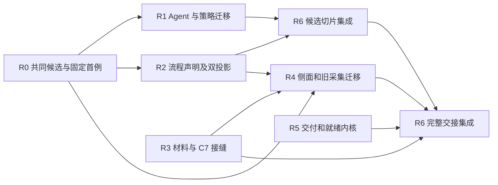
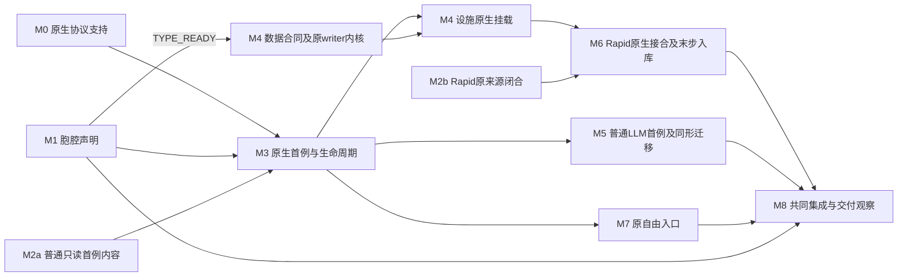

# MRW Agent 宏胞腔与信息采集开发分发计划

> 2026-10-02 后续目标修订：用户决定下线旧 Agent Core，仅保留当前 Codex Core 与 Codex WebUI。具体退役范围、共享依赖和验证见 [清简方案 Q2/Q4](/Users/wangyiliang/market-research-workflow/docs/development/MRW实现清简方案.md)。本修订取代下文长期保留旧 Core、默认 `agent_core_v3` 和旧聊天页的目标；M3 原生接入、M7 前端、M8 共享工具/session/注册的归属继续使用。本文仍维护实际分派和执行记录；新目标尚未实施，§14 的历史结果及未验证项保留原义。

2026-09-27 分发快照（历史）：规划 owner：Astra；集成与调度 owner：主线。**当时 M 系列状态：`WAVE_A_DISPATCHED / IMPLEMENTATION_IN_PROGRESS / NATIVE_MACRO_UNVERIFIED`。** M0、M1、M2、M4、M5 已派发；M3 等待 M0/M1/M2a 最小结果，M6 等待 Rapid 来源与 M3/M4 首例。此处为派发时状态，后续实际结果见 §14。

当前执行入口为本文 **§9–14 的 M0–M8**，语义输入为 [Agent 宏观架构](AGENT_MACRO_ARCHITECTURE.md)和[信息检索架构](INFORMATION_RETRIEVAL_FRAMEWORK_DESIGN.md)（其 §13 为细节开发框架）。本文唯一维护分派、文件归属、依赖和执行状态；架构文档解释语义，不再派一套同义任务。

**§1–8 保留 2026-09-26 的 R0–R6 计划与历史执行记录。** 旧 P/R 编号均为参考或已执行上游，不作为当前待派包。旧 `LOCAL_IMPLEMENTATION_AND_GATES_PASS / END_TO_END_DELIVERY_UNVERIFIED` 和 319 passed 只指 §8 的原运行及输入；不证明 M 系列原生挂载、宏执行、Rapid 保存读回或本轮任何测试通过。旧段落中的“当前”“本轮”“待新增”按其日期解释。

项目 19 号流程规则与 06 顶部已验收并停止的 Stage 4–6 状态继续生效。后续实际开发采用直接修复与相关验证，不逐修冻结，不重启发布阶段。信息拓扑 P01–P10、R0–R6 的现存能力优先复用；精确受影响缺口才进入 M 包。

## 历史规划前言：R0–R6（2026-09-26，保留原义）

日期：2026-09-26。框架规划模型：Astra。历史状态：`LOCAL_IMPLEMENTATION_AND_GATES_PASS / END_TO_END_DELIVERY_UNVERIFIED`。

Agent 宏胞腔接入状态（2026-09-27）：架构已修订，内外双向绑定与运行尚未实现；上方批次状态仅对应文末已有迁移证据。

本文把[采集架构原稿](</Users/wangyiliang/Documents/Codex/2026-09-20/zhen/outputs/MRW信息采集架构_上下文与高阶表示_改写稿_2026-09-24.md>)第 1–10 节落实为开发包，细化[现有实现设计](INFORMATION_RETRIEVAL_FRAMEWORK_DESIGN.md)的代码接缝。它是本轮唯一分发入口；执行者把实际状态追加到本文末尾，不另建逐包合同或冻结链。流程规则仍以项目 19 号文档为准。06 当前入口是本地 Stage 4–6 已验收并停止，本轮不重启这些阶段。

本次规划只读核对了当前代码、测试和脏改动，没有执行业务测试、采集、模型调用或数据库写入。原稿的 16 passed、信息拓扑 P01–P10 的旧 PASS、设计文档中的香港运行记录均保留原归属，不是本轮执行证据。

后续 Agent 宏接入遵循 [Agent 宏观架构](AGENT_MACRO_ARCHITECTURE.md)（2026-09-27 修订）：**宏本身就是胞腔结构**，边界注册的完整概念规定层作用于整个胞腔，关联对象／身份／关系、开放表达／上下文、skill 方法／局部成果、tool 效果／权威、交接组合及生命周期。信息拓扑规格只是其中一个环节；其余规定引用各自的原权威声明。数据库、工作流程和消费者统一属于系统运行层，原 Core 寄宿于内部。

Tool／skill spec 的通用接入目标包含基本 Agent–System（A–S）交互的虚边化。工作包应从现有系统操作及其 authority 出发：tool spec 关联操作、输入／输出、效果、权限、失败与原执行器；skill 内容组织适用方法、工具使用与成果要求；实际挂载使 Core 可沿原生路径使用。完成依据是原操作、反馈和必要读回实际接通，注册文本本身不计完成。Rapid 读写是这一机制的具体实例，复用同一接缝。

实现时区分具体关系的虚边与实边：已挂载的 skill/tool 沿原生路径直接使用，用户自由表达的语义关系保持开放，宏侧无需追加接口；前端传输、系统调用 Agent 和下游直接消费则保留实际接口。消费合同若已由 tool 与原执行器完整承载，也可在宏边界表现为虚边，实际设施调用继续保留权限、效果、失败与结果含义。“双向 MCP”表达内向供给与外向交接，可按支持范围使用原生接线或协议；不统一加一层宏代理。

先关联当前案例所需的概念规定与既有 Core／运行层承载，定位已支持的虚边及必要实边，再用一个实际 skill 贯通局部规定和系统交接。skill 内容、方法与成果要求能够局部细化或扩展胞腔行为，用户原始表达始终保留；仅对缺失的真实接口补齐适配。此修订是后续接入方向，不覆盖文末已有实现与验证记录，也不表示 Agent 宏胞腔已经接通。

后续原 LLM 环节的接入按宏架构 §8.1：先贯通一个有界业务工作从原调用者、方法／上下文、Core 到原成果消费者的路径，再复用已明确接缝；系统请求胞腔与 Core 使用系统工具分别接线。方法／实现拓扑保留原声明与投影 owner，引用胞腔身份。原生 skill 正文及 Codex 工具挂载缺口仍须实际补齐；仅新增 tool 名或替换底层模型 provider 不计为接入完成。此项尚未派发实现，不纳入下面已有批次的通过记录。

Rapid 接入以宏架构 §8.2 为准：核心方法、skills/tools、上下文和决策循环作为胞腔内 AgentCore 的虚边能力尽量整体保留。本项采集本来要求结构化成果，最后一步直接耦合入库；优先将读取、写入与读回注册为原生 tool，使 Core 侧沿虚边使用，也可复用最终交付实边。开发聚焦原生挂载、结构化采集合同与原数据接口的实际接线。R2 表达整体关系，R6 接合工具／成果消费者，入库 owner 保持校验、权限、资格、写入和读回；这些职责不取得内部轮次调度权。保存确认与必要读回是本项采集入库的完成条件，生成或异步受理均不代替完成；失败沿原循环与 writer 局部处理，不默认重跑整个 Rapid。先贯通原 Rapid 的一次结构化采集及真实读写，无需拆解全部内部环节，也不以其他 LLM 环节全量迁移为前置。

## 1. 目标与真实基线

目标是使候选发现、材料交接、搜索侧面、复合采集和异步交付共享各自的语义定义，并由现有贡献机制派生其目录、装配和结构视图。运行继续由 Discovery、AgentCore、Source Library、collect、Celery 和 C7 的原入口承担。

| 当前代码证据 | 本轮必须解决的接缝 | 不应重复建设的部分 |
| --- | --- | --- |
| `services/discovery/adapters.py::DefaultDiscoveryAdapter.search` 直接返回 `search_sources(**kwargs)`；`search/web.py::search_sources` 返回 list，若干 provider 异常被吞成空列表 | typed 候选交接；在实际 provider 分支记录失败/空结果观察，不能从最终空列表猜失败 | 保留搜索 provider 内核、排序与 fallback 的既有合同；`GET /search` 仍查已有数据 |
| `agent_core/project_tools.py::_source_web_search_handler` 自行做查询矩阵、trust、归并、diagnostics、evidence-hit/run 投影 | 共同发现服务承载已确认的共同语义；矩阵是显式策略；旧 wire 保持兼容 | AgentCore 循环、trust 判定和搜索 evidence 合同已有 owner |
| `search/smart.py` 同日跳过；仅非空结果更新时间；`discovery/deep_search.py` 做查询扩展，终点仍为候选 | 分别表达历史效果与扩展策略，复用共同发现服务 | 不把二者改成相同流程或正文获取 |
| `information_topology/modules/method.py` 明示描述用途，按同名端口和 type 字符串做检查；`composes_after` 带 position 而 profile 未声明 ordered | 新增版本化的可执行流程结构投影，引用真实 typed endpoints | 信息拓扑 P01–P10 已完成；不重做存储、API、导入迁移、通用图 UI、写作大纲和既有 profile |
| `c3_native_contribution.py`、`c8_native_contribution.py` 和 `contributions/project_catalog.py` 已贯通 native rule/catalog；Program AST 已有 identity/then/traverse/decide 等节点 | 用一次真实候选操作建立检索贡献规则，再复用其可支持形状 | 不另建 DSL、runtime、通用 scheduler 或第二 catalog |
| `ingest/frontdoor_ingress.py` 组装 envelope；raw import 的新增走 writer，已有记录仍直接更新；C7 movement 有 RawSnapshot 与验证链，C7.2 要求精确 closure | 真实材料→准备→规范化→原 writer 的交接；每条迁移路径说明实际 writer | envelope、纯 movement、legacy Document 写入、C7 canonical 写入不能互相冒充 |
| `ingest/market_web.py` 和 `ingest/social.py::collect_policy_regulation` 重复搜索/获取/frontdoor；policy 仍传入 search_sources 不接受的 `keywords` | 侧面、交付规范、获取/留存政策分离；修复调用缺陷；消除迁移后的重复代码 | market/policy 是历史别名与默认侧面，不变成封闭流程种类 |
| `source_library/runner.py`、`terminal_output.py` 已保留 crawler accepted、terminal、unknown；`api/agent_batch.py::_job_progress_from_snapshots` 仍按 Celery success/failure 聚合 | 保留 worker 状态，另从实际 provider/readback/产物解释目标交付，并用于后继就绪判断 | 不重复“修复”已实现的 crawler pending 保持，不新增状态事实库 |
| `collect_runtime/runtime.py::_run_successor_collect` 仅覆盖带项目的特定自动批次，缺 gateway 返回 unknown；`composition/collect_runtime.py` 没有注册该 gateway | 准确表示支持域；若本轮完整路径依赖 C3，必须提供真实 gateway | 不能用测试注入证明生产接线，不能验证失败后静默回落 legacy |
| 新增且未跟踪的 `project_retrieval/` 已有绑定、预览、Celery run、候选评审、URL ingest、formalization 和读回 | 作为原消费者做兼容回归，消费明确候选/材料结果 | Rapid digest/frontier 两轮开发仍按现有 R 切片，不以本轮名义重写香港绑定、57 个历史状态或自动注入历史 URL |

`.cursor/rules` 本次检查不存在。已查阅 backend 文档索引、摄取和统一采集文档；较早文档中的四种信息侧重是历史实现描述，不覆盖原稿的开放侧面模型。

## 2. 固定的语义、身份和权威

1. 资源定位、候选出现、内容快照、来源、规范化候选、持久记录具有不同身份。资源去重保留全部 query/branch/facet 发现关系；不能把同 URL 当同内容，也不能把相似文本当同来源。
2. 候选只承诺本次发现的线索；正文必须来自实际获取或接收。候选报告、材料报告、综合报告按真实产物区分。搜索结果中的 evidence-hit 是检索观察投影，不自动成为合格领域证据。
3. 搜索侧面定义关注对象、来源范围、查询表达和适用约束；目标规范、搜索策略、获取子流程与批量政策另行引用。添加第三种侧面不得新增 `kind=market|policy|...` 分支。
4. 允许有序复合和重括号；不允许从无数据边推导可交换/并发。资源、写入范围、provider 配额、失败/取消政策共同决定兼容性。
5. 描述/目录/纯投影没有事实写权限。context scope 的限制与瞬时凭证/配额可用性分开。只暴露整体接口的外部 Agent 以宏绑定，其内部动作不凭推测展开。通用对话保持开放；按适用 skill 形成的局部成果要求和实际设施调用保留精确合同，不能将工具入参 schema 套在用户原话上。
6. 评审批准→ingest payload→独立执行入口→实际材料/验证→writer→读回按真实 gate 执行。C7 写入仍由 run owner 提供 `C7CanonicalWriteClosure`，不是从 candidate ID 或 descriptor digest 合成权限。
7. 受理、worker 返回、provider 终态、产物交付、规范写入、领域合格性分别观察。缺观察为 unknown；cancelled、failed、waiting、not_attempted 不计成功。
8. 修改是扩展、精化或显式有损兼容投影。旧 list 无法表达的诊断损失明确保留在 typed 结果，不能从旧 list 逆向重建完整报告；旧历史空结果不补造跳过原因。

## 3. Canonical 接缝与实现框架

以下符号是本轮目标接口，尚未存在的文件标为“新增”。原生类型能引用则不另造同义类型。R0/R2/R3/R5 分别是各自接缝的唯一语义 owner；集成 owner 统一维护跨包消费者和全局 catalog。

| 接缝 / 建议承载 | 输入、输出与必须保留的观察 | 权威与允许派生 |
| --- | --- | --- |
| `CandidateSearchRequest → CandidateBundle`；新增 `services/search/candidate_contracts.py`、`candidate_search.py` | query/topic、显式 keywords/策略、language/provider/limit/time/offset、project/source/facet 引用；候选、逐分支观察、原始排名/来源、停止原因；单次发现与 matrix 调用策略分离 | R0 定义候选合同与单次发现；R1 迁移 matrix/增量/扩展。旧 discovery list 和 Agent wire 是有向投影。Typed 服务不依赖 CoreToolResult 或 session |
| `SearchFacet + CompatibleRequest → Query`；新增 `services/search/facets.py` | facet/version、对象引用、来源范围、查询、请求约束；冲突显式失败；交付规范单独参数 | R4 所有；默认 market/policy 值与第三个测试实例同形。香港绑定仍归 project_retrieval，只用显式转换引用 |
| `RetrievalFlowDefinition` 与 native contribution；新增 `successor_runtime/capabilities/retrieval_flow_native.py` | 操作 identity/version、输入输出 ObjectType、位置、显式 wiring、effects/failures、允许局部 binding、原执行入口 | R2 所有；复用 NativeContributionRule / ProgramSpec；从同一 definition 派生目录、纯结构和对应装配，不复制 steps 表 |
| `ResourceRef | GivenContent | RawSnapshot → PreparedMaterial`；新增 `services/ingest/material_input.py` | URL 是待取定位；given 是已有内容；RawSnapshot 引用既有 C7 类型；准备输出保留原字节 digest、格式、解析后文本与派生关系 | R3 所有；准备成功后才能进入 UTF-8 normalized envelope；未支持二进制明确拒绝，不根据 format 字符串声称已解析 |
| `PreparedMaterial + TargetSpec + SourceContext → frontdoor payload`；新增 `services/ingest/material_ingress.py` | 一处派生 document_candidate / terminal_context / extraction_plan 的确定字段；真正语义选择由 target/source 提供 | R3 先在 raw import 的一个真实分支打通，再供 R4 和集成消费者复用；纯 builder 无网络/DB effect |
| `owner observations + expected delivery → DeliveryObservation`；新增 `services/collect_runtime/delivery.py` | executor/provider ref、artifact refs、目标交付种类、逐项 fulfillment、failed/waiting/unknown/cancelled/not_attempted | R5 所有，纯只读投影；不改写原 worker/provider 记录。后继就绪消费该值，legacy status 是兼容投影 |
| `DeliveryObservation + declared dependencies/resources → ready frontier` | 上游真实交付、binding availability、资源 read/write/capacity、顺序和取消规则 | R5 在原 collect/Celery consumer 内解释；不新增 scheduler。未知共享资源保守串行；provider key 不能靠 channel 名猜独立性 |

候选错误的最低诚实范围：provider 内核已观察到的超时、配置缺失、限流和异常按其真实分支返回；未能观察到的旧 provider 内部原因记 `unknown`。不能把“建议原因列表”提升为本次已发生的失败。R0 保持 legacy list wrapper，并为 typed 路径保留实际 branch observations。

材料 writer 的最低诚实范围：legacy frontdoor writer 产出 legacy 持久引用；C7.2 产出 successor canonical 引用；只有存在显式对应关系才转换。raw import 更新已有 Document 的路径不得因为共用 payload builder 就被登记为 C7 写入完成。

## 4. 开发顺序与并行矩阵

包号使用 R0–R6，以区别信息拓扑旧 P01–P10。R6 是集成职责，持续存在，不是新审批阶段。

| 包 | 目标 / 模型建议 | 开发依赖 | 独占写面摘要 | 可并行 |
| --- | --- | --- | --- | --- |
| R0 | typed 候选与首个固定消费者；较强推理 owner | 无 | search candidate 合同/服务、web.py、discovery/adapters.py、候选 native 源和专属测试 | 与 R3 的独立材料内核、R5 的既有终态内核；R2 在类型交接后启动 |
| R1 | Agent、smart/deep 复用候选；GLM Flash / Luna | R0 首个实际 consumer 通过；R0 释放文件 | project_tools.py 候选区、smart.py、deep_search.py、Agent 搜索/评审测试 | 与 R2、R3、R5；不得同时写 project_tools.py |
| R2 | 同一流程声明的目录、装配和纯结构；较强推理 owner；已定纯投影可交 Luna | R0 canonical 类型确定；最终集成用 R0 native 首例 | retrieval_flow_native.py、新增 method_flow.py、专属 flow 见证 | 与 R1/R3/R5；不改旧 topology 内核 |
| R3 | 材料共同输入/准备/frontdoor 与 C7 真实交接；较强推理 owner | 材料部分独立；复合方法接入依赖 R2 首例 | material_input/ingress、raw_import、必要 C7 handoff 和 assembly 修改、专属材料测试 | 与 R0/R1/R2/R5；C7/ingest 脏文件须先认领 |
| R4 | 侧面参数化和 market/policy 迁移；GLM Flash / Luna，公共政策未定则交较强 owner | R0 + R3 的真实材料 consumer；贡献声明接 R2 | facets.py、新增共同 search-and-ingest 内核、market_web.py、social.py 的 policy 函数、两个 search adapter、对应测试 | 与 R5；R3 释放 material builder 后只读消费 |
| R5 | 交付观察、provider readback、资源兼容及原调度接入；较强 owner；既定纯投影可交 Luna | 观察内核独立；最终资源/交付接入依赖 R2/R3/R4 的声明 | delivery.py、collect_runtime/runtime.py、必要 Source Library terminal/runner 接缝、api/agent_batch.py、对应测试 | 与 R0–R4 的无冲突内核；runtime/composition 交接串行 |
| R6 | 同步、首个切片、跨包读回、收敛与记录；主线集成 owner | 分阶段消费已完成包 | catalog/registries/sketches、composition、共享消费者、集成测试、本文记录 | 只读审查可并行；sync、共享构建/数据库验证串行 |



R3 的材料语义/准备内核和 R5 的纯观察可在首波启动；依赖 R2 的 lowering 与最终原调度接线延后，不能将整包依赖误读成所有代码都须等待。R0 在 `DefaultDiscoveryAdapter.search` 真实首例打通前，不派发多个作者各写 candidate codec/registration。R3 同理先打通一个 raw input→原 frontdoor consumer，再展开 R4 的同形 payload 迁移。

每个子 Agent 默认禁止再次 spawn。需要拆出小包时，主线在本矩阵上分配具体文件和已定接口，不让子 Agent 再接一个完整架构目标。

## 5. 可直接下发的工作包

各包 cwd 均为 `/Users/wangyiliang/market-research-workflow`；Python 验证使用第 7 节的统一入口。每包回传 `结果 / 改动文件 / 验证命令与原退出码 / 风险及 blocked_by`。所有作者必须保留其他 Agent 与用户改动，不 reset、stash 或批量格式化脏树。

### R0 — 共同候选合同及首个原消费者

- **目标：** 从原稿 §1.2、§3、§9.2 提炼候选与发现关系；一次 typed 调用贯通现有 Discovery.search，建立可复用规则。
- **权威输入/现成接口：** `search_sources` 的真实参数/返回/异常；`DefaultDiscoveryAdapter.search`；Agent 当前 normalize/merge/trust 字段；`ObjectType`、`PayloadCodec`、`NativeContributionRule`。原 provider 配置次序与 experimental provider 不进 auto 的规则保持。
- **输出：** 第 3 节候选类型；单次 typed discover；legacy list 投影；新增 `successor_runtime/capabilities/retrieval_candidate_native.py`（候选原生声明，不在每个消费者复写 codec）；provider 内核的实际观察通道；首个非默认合法声明通过相同 consumer。
- **独占写面：** `services/search/{candidate_contracts,candidate_search}.py`、`search/web.py`、`discovery/adapters.py`、候选 native 文件；新增 `tests/unit/test_retrieval_candidate_contract.py`、`test_retrieval_candidate_consumers.py`。不改 Agent/collect/图谱。
- **验证：** `bk_test tests/unit/test_search_web_provider_adapters_unittest.py tests/unit/test_source_candidate_trust_unittest.py tests/core_business/test_discovery_core_contract.py tests/unit/test_retrieval_candidate_contract.py tests/unit/test_retrieval_candidate_consumers.py`。
- **完成：** 原固定入口实际返回兼容 list；typed 调用保留可观察失败/partial/provenance；空结果不伪称无证据；没有 fetch/ingest/项目写入；独立 oracle 验证原有排序与去重。首次必要 catalog inclusion 交 R6 完成后才宣布 native 首例闭合。

### R1 — Agent 与已有搜索策略的同形迁移

- **目标：** 原 Agent 工具与固定消费者共用候选结果；增量和查询扩展分别消费 discover。
- **权威输入/现成接口：** R0 导出类型、服务、codec 和失败；`_source_web_search_handler`、`_source_candidate_review_handler`；现有 matrix/evidence contracts；`smart_search`、`deep_search`。
- **输出：** source.web.search.v1 的兼容投影；矩阵查询/归并/trust 的显式策略；typed smart/deep 结果与原外部 envelope；共同候选到评审输入的纯转换。评审仍写 session，ingest 另行调用。
- **独占写面：** `agent_core/project_tools.py` 的候选搜索/归一化/评审接缝、`search/smart.py`、`discovery/deep_search.py`、`tests/unit/test_agent_core_unittest.py` 相关段、新增 `test_retrieval_search_strategies.py`。移出的共同 helpers 由 R0 明确交接到 candidate_search 后再使用，禁止反向 import Agent 私有 helpers。
- **验证：** `bk_test tests/unit/test_agent_core_unittest.py -k 'source_web_search or source_candidate_review'`；`bk_test tests/unit/test_retrieval_search_strategies.py tests/unit/test_project_retrieval_execution.py`。
- **完成：** 原 AgentCore 工具执行链消费相同 typed 服务；matrix 部分失败保留；增量同日跳过与真实空结果分开、非空才更新时间；deep 仍仅候选；旧 review/approval/URL-pool payload 行为保持。原 list API 无法表达的损失有显式说明，不改全局 Agent loop。

### R2 — 流程贡献与结构表示

- **目标：** 一份原生流程声明派生可选方法索引、原装配和可检查结构；先支持当前需要的 identity、ordered composition、显式 wiring 和有合同宏。
- **权威输入/现成接口：** R0 类型与 native 对象；ProgramSpec/OperationContract；C3/C8 native rule；现有 `TopologyState`/`BoundRef`/ProfileSpec。原稿 §4、§6、§9.3 与已有设计 §5–6 规定观察边界。
- **输出：** 新增 `retrieval_flow_native.py` 和 `information_topology/modules/method_flow.py`；纯结构投影保留端口 identity/version、出现次数、顺序、控制/宏边界和 effects/failures 引用；固定流程装配消费同一 typed handle。Agent 宏按[宏观架构](AGENT_MACRO_ARCHITECTURE.md)声明完整概念规定层的权威引用、具体关系及观察层次上的虚／实边、系统运行层设施关系和内部 Core 绑定，由同一声明形成装配与结构投影。信息拓扑规格是概念层的一环；虚边映射到已挂载能力及原执行器，实边定位现有调用／消费接口，只补当前案例真实缺失的接线。若现有规则仅能表达 macro 标签，须由规则 owner 补齐必要承载，不能计作完整胞腔实现。未支持的内部动态 AST 不展开。
- **独占写面：** 上述新增文件、新增 `tests/unit/test_retrieval_flow_native.py`、`test_retrieval_method_flow.py`；既有 `modules/method.py`、通用 topology 存储/接口/前端只读。旧 method order 问题如影响新路径，由 R6 另作精确版本修复，不重开 P01–P10。
- **验证：** `bk_test tests/unit/test_retrieval_flow_native.py tests/unit/test_retrieval_method_flow.py tests/unit/test_information_topology_report_method.py tests/successor_runtime/test_c3_native_catalog.py tests/successor_runtime/test_c8_native_catalog.py`。
- **完成：** 异名同类型端口可连，同名异类型拒绝；恒等和三段重括号、错序/漏步/错版本反例有独立见证；非默认 flow 由同规则进入原 consumer；structure equality 和 handler 行为分别验证。不能只输出一张图就宣布原 runtime 可运行。

### R3 — 材料入口、共同 payload 及 C7 交接

- **目标：** given/URL/snapshot 从各自起点复用必要后段，打通一条真实材料写入和读回；保留各 writer 权威。
- **权威输入/现成接口：** `RawSnapshot`、capture/normalize/verify movement；resource_pool fetch port；frontdoor builders/postprocessor；raw import；`C7CanonicalWriteClosure` 与 projector closure。R2 可支持声明接入后复用其规则。
- **输出：** material_input/ingress；给定文本首例；URL 获取引用原 resolver/fetch；明确二进制准备支持域；C7 交接由原 run owner 注入 scope、binding、candidate、event payloads、write port 与 connection。不能补造这些值。
- **独占写面：** 新增 material 文件；`ingest/raw_import.py`、`frontdoor_ingress.py` 的必要接缝；`successor_runtime/assembly/c7_assembly.py` 的必要绑定；新增 `tests/unit/test_retrieval_material_handoff.py`。`content_extraction.py`、`postprocess_frontdoor.py` 已脏，默认只读，确需改动由 R6 协调具体补丁归属。
- **验证：** `bk_test tests/unit/test_retrieval_material_handoff.py tests/unit/test_raw_import_structuring_unittest.py tests/unit/test_ingest_frontdoor_context_unittest.py tests/successor_runtime/test_c7_movement_decision_parity.py tests/successor_runtime/test_c7_movement_failure_reverse.py`。真实 C7 writer/readback 按第 7 节专属数据库执行已有 `test_c7_canonical_write_projector_postgres.py`。
- **完成：** given 不下载；URL 不作为正文；有效 snapshot 不重抓；准备失败不进入 writer；纯 payload 无写入；正负 C7 closure 边界保持；规范化拒绝、write unknown、projection failure 各自保留。legacy 新增与更新路径都准确标注，不能宣称全部 legacy 已迁为 successor。

### R4 — 搜索侧面与历史采集收敛

- **目标：** 用统一 search-and-ingest 构造承载 market/policy 默认入口，移除重复候选/材料/payload 决策；新侧面按声明接入。
- **权威输入/现成接口：** R0 discover、R3 material/frontdoor 首例、原稿 §6.2/§9.2；现有两条 collect 的真实特殊行为。
- **输出：** `search/facets.py`、新增 `ingest/search_and_ingest.py` 共同内核；旧 market/policy wrapper 显式传入默认 facet、target、acquisition/retention policy；一个技术侧面的非默认 consumer 见证；搜索调用的 unsupported keywords 缺陷修复。
- **固定政策：** 新统一入口要求 project_key 来自原项目 context；全文目标缺正文只能补抓/等待/失败；纯候选目标不选含写入构造。policy 的历史 `project_key=None` 行为采用明确 legacy compatibility 标记，默认新路径不继承此弱化；资源池留存是独立显式 effect，不能塞入纯 builder。兼容差异逐项写入本包回传，不以名称分支承载。
- **独占写面：** 上述两个新文件、`ingest/market_web.py`、`ingest/social.py` 中 policy 函数及所需 import、`collect_runtime/adapters/search_market.py`、`search_policy.py`；新增 `test_retrieval_search_facets.py`。不要修改 social 的 Reddit/其他平台语义。
- **验证：** `bk_test tests/unit/test_retrieval_search_facets.py tests/unit/test_source_library_market_adapter_unittest.py tests/unit/test_source_library_policy_adapter_unittest.py tests/unit/test_ingest_source_search_contract_unittest.py`。
- **完成：** market/policy 原入口能用共同后段；第三侧面仅增加数据声明；同资源多侧面发现关系保留；目标规范可独立变化；重复 payload 块和迁移分支实际移除。首个共同构造的未定语义交较强 owner，稳定后的 wrapper/实例迁移才算 Flash 包。

### R5 — 交付观察与原调度的就绪判断

- **目标：** 把 worker/crawler/材料/writer 的实际观察解释为同一交付判定；原调度只解锁已交付且资源兼容的后继。
- **权威输入/现成接口：** collect request/result；Source Library terminal_output 和 typed crawler readback；agent_batch snapshot/progress；C3 resource policy、effect gateway；R2 flow effects 与 R3/R4 的目标交付。
- **输出：** delivery.py 纯观察与资源兼容内核；原 API 保留 executor 进度并补交付观察；原 collect 调用同一判定。actual provider job ID 与 terminal readback 关联；unknown write 先读回再决定是否重试。
- **独占写面：** delivery.py、collect_runtime/runtime.py、api/agent_batch.py；Source Library runner/terminal_output 仅必要的共同观察接缝；新增 `test_retrieval_delivery.py` 与已有相关 batch/terminal 测试。composition 由 R6 写，不并改。未改 source mode 最终 owner。
- **验证：** `bk_test tests/unit/test_retrieval_delivery.py tests/unit/test_collect_runtime_auto_batch_unittest.py tests/unit/test_collect_runtime_source_library_adapter_unittest.py tests/unit/test_source_library_terminal_output_unittest.py tests/unit/test_agent_batch_api_unittest.py tests/unit/test_agent_batch_loop_unittest.py`。
- **完成：** worker success+provider waiting 不交付材料；failed/cancelled/not_attempted 保留输入身份；成功项与等待项可共存；共享 provider capacity 或同写范围拒绝并发，独立资源可继续；无 gateway 保留 unknown 且不 fallback。真实 C3 gateway 如仍未实现，明确 `blocked_by=C3_EFFECT_GATEWAY`，只阻断依赖它的 successor 自动批次，不扩大成全框架 blocked。

### R6 — 集成与交付

- **目标：** 统一公共接线、分阶段验证完整消费者，确保完成度没有由局部测试虚增。
- **权威输入/现成接口：** R0–R5 的真实改动和回传；当前有效项目 catalog；project_retrieval 预览/启动/读回；既有 contribution CLI 与 gate。
- **独占写面：** `contributions/project_catalog.py`、必要 `src/mrw_functorial_kit/contributions/` 桥接；由工具更新的 registries/sketches；`composition/collect_runtime.py`；跨包必须修改的共享消费者；本文件执行记录。frontend 仅当新增可见交付字段确需显示时修改 `ProjectRetrievalPanel.tsx` 与 `lib/api/domains/project-retrieval.ts`，不得转成图谱 UI 重构。
- **串行集成点：** 先 R0 native 首例；再 R0/R1/R2 候选完整切片；随后 R3/R4/R5 的混合输入/异步/写入读回。每个点直接修复、最小复验，不形成用户逐步审批。
- **验证：** 第 7 节 catalog check/gates；已有 `test_project_retrieval_{mode,execution,formalization}.py`；若改 frontend 则一次 `npm run build` 和受影响既有合同测试；至少一条正式入口→实际执行 owner→持久读回的本地有界链，记录真实 run/task/provider/artifact 引用。
- **完成：** 每项本轮目标有实际 consumer 与见证；未完成项有精确 owner、数量和 blocked_by；已迁移旧逻辑确实删除；没有重写历史数据、重启 Stage 4–6、外部发布或把离线 fixture 当 live 结果。仅有 UI 可见、HTTP accepted 或 native compile 不算业务完成。

## 6. 写入冲突、模型路线与资源约束

当前已发现相关 tracked dirty：`collect_runtime/runtime.py`、`ingest/content_extraction.py`、`ingest/postprocess_frontdoor.py`、`source_library/adapters/url_pool.py`、`c7_assembly.py`。project_retrieval 服务、模型、API、迁移和前端多为 untracked。其他约 300 项工作树变化不是全局 blocker；下发前只读重查各包实际 write set，将其当前字节与 diff 交给 owner 保留。

| 写面 / 资源端口 | 独占 owner 与调度规则 |
| --- | --- |
| `project_tools.py`、`test_agent_core_unittest.py` | R1 全文件单写；R3/R5 对相关工具的请求由 R6 等 R1 释放后合入 |
| `web.py`、candidate contracts/service、`discovery/adapters.py` | R0 先写；R1 只消费，不擅自补同名 helper；公共规则缺口回 R0 |
| material builders、raw import、C7 assembly | R3 单写；R4 使用导出接口；C7 现有脏改动不得覆盖 |
| collect runtime / agent_batch / terminal_output | R5 单写；R4 不改注册和调度；composition 由 R6 在 R5 交接后合入 |
| catalog、registries、sketches | R6 单写/工具派生；其他包提交 native 对象和引用，不直接同步全局文件 |
| topology 旧内核/存储/API、Rapid 绑定和历史状态 | 已有 owner；本轮默认只读。新增 method_flow 是新 profile，不修改旧实例解释 |
| Docker image/build cache、挂载源码、pytest cache | R6 一次准备；测试期间所读源码必须稳定；各 worker 使用 `-p no:cacheprovider`，构建不并发 |
| PostgreSQL 与固定测试 DB 名 | R6 指定任务专属 server；C7 测试会 DROP/CREATE 固定 DB，必须独占，不能仅改 schema 后并跑 |
| Redis/Celery queue、端口、provider 配额、外部数据写入 | R6 指定明确任务范围；共享开发服务不随意重启；live 链串行并读回；provider 限流只阻断依赖分支 |
| frontend node_modules/.tsbuildinfo/dist/Playwright 服务 | R6 集中 typecheck/build/E2E；不同 spec 文件不表示可安全并发 |

路由采用当前 `spawn_agent` 暴露的模型。规划固定 Astra；未定公共语义、C7 权威与跨包审查用主线或可用较强模型。契约确定后的 R1、R4 wrapper/侧面实例、R2/R5 的已定纯投影优先 `glm-5.3-flash-zhipu-glm-en`；若当前内置 spawn 未列出 GLM，不提交未支持 model 参数，使用已暴露的 Luna 并如实记路线。当前 DeepSeek Flash 角色只读且限定仓库探索，可用于文件/符号定位，不能安排其写实现、复杂归纳或验收。不能因 thread 工具列出 GLM 就偷偷创建用户聊天代替开发子 Agent。

Flash 作者只实现已明确的语义选择、内核和见证，机械 codec/注册/接线复用规则。复杂度超出合同就将具体缺口交 owner，不能重复造 adapter。主线在实际回传记录模型、包数、首次共同验收耗时和失败次数；未提供 token/调用成本写 `unavailable`，不能记零或宣称加速倍数。

## 7. 共用验证入口与完成证据

规划已静态核对 Docker test 定义与本地 Python 路径：`main/backend/.venv311/bin/python` 和 `/Users/wangyiliang/.local/bin/python3.11` 均返回 Python 3.11.14。尚未探测 pytest/依赖导入或运行测试。Docker 优先；R6 先确认现有 test image 的依赖与挂载，必要时只构建一次。`Dockerfile.test` 的 ENTRYPOINT 已是 pytest，必须显式覆盖，不能在默认入口后再拼一遍 `python -m pytest`。

下面命令在仓库根执行。unit/core-contract 使用 `--no-deps`，避免为离线测试自动启动共享 DB/ES/Redis；若某测试真正需要 DB，转入专属测试资源，不能凭缺依赖 Skip 算通过。

```bash
cd /Users/wangyiliang/market-research-workflow
docker compose -f main/ops/docker-compose.yml --profile test build backend-test

bk_test() {
  docker compose -f main/ops/docker-compose.yml --profile test run --rm --no-deps \
    --entrypoint python \
    -e PYTHONPATH=/app:/opt/functorial-kit:/opt/mrw/src \
    -v /Users/wangyiliang/Desktop/functorial-kit/python:/opt/functorial-kit:ro \
    -v /Users/wangyiliang/market-research-workflow/src:/opt/mrw/src:ro \
    backend-test -m pytest -p no:cacheprovider -q -rs "$@"
}
```

若现有 Docker 环境确实不可用或无法满足已知依赖，R6 固定一次本地替代命令，所有包复用，不各自安装：

```bash
cd /Users/wangyiliang/market-research-workflow/main/backend
bk_test() {
  PYTHONPATH=/Users/wangyiliang/Desktop/functorial-kit/python:/Users/wangyiliang/market-research-workflow/src:/Users/wangyiliang/market-research-workflow/main/backend \
  PYTHONDONTWRITEBYTECODE=1 \
  /Users/wangyiliang/.local/bin/python3.11 -m pytest -p no:cacheprovider -q -rs "$@"
}
```

第 5 节的专属测试名在规划时是待新增见证；实现阶段已建立本轮需要的候选、流程、材料、delivery、facet 与 project-retrieval 测试。实际运行范围和结果只以 §8 记录为准；未运行的 live/provider/专属数据库路径仍不能算覆盖。测试使用原语义、独立期望和必要反例，不复制实现输出当 oracle。

贡献集成在根目录由 R6 执行现有正式入口：

```bash
cd /Users/wangyiliang/market-research-workflow
main/backend/.venv311/bin/python scripts/dev.py sync
main/backend/.venv311/bin/python scripts/dev.py check
main/backend/.venv311/bin/python scripts/dev.py gates
```

sync 是共享写操作，所有贡献输入稳定后才执行；check/gates 的失败应按本轮变化与既有问题分类，不能手改生成物或基线豁免。首例 sync/check 可先行；全局 gates 在 coherent batch 集中执行，相关失败修复后只重验受影响范围，无可靠选择能力时运行一次原完整扫描。

C7 已有 `tests/successor_runtime/test_c7_canonical_write_projector_postgres.py` 读取 `SUCCESSOR_TEST_DATABASE_URL`，会在该 server 上强制重建固定的 `mrw_c7_canonical_write_projector_test`。R6 必须先配置一个本任务专属 PostgreSQL server 并确认无其他占用；不可直接使用共享开发 DATABASE_URL。随后在同一测试入口传入该变量运行此文件；任何 skip 单列，不能视为写入/读回见证。测试结束保留结果并只清理本任务资源。

正式本地链最小观察集：入口 project/plan/run 身份→实际搜索 attempt→候选→review→独立 ingest→正文/快照→精确 writer 输出→对应存储 readback。要求 canonical C7 时另核 closure 和 projector；要求正式图谱时再经过 project_retrieval formalization/拓扑 writer。候选交付完成可以成立，材料网络失败仍记材料缺口。当前设计文档提到的不可路由 DNS 是历史环境观察，执行前先做一次有界核对；同条件失败不反复跑整链、不改 DNS 或注入人工 URL 制造成功。

原稿混合输入验收按真实资源分步执行：已有 snapshot、given 正文、搜索候选、带来源全文与 waiting crawler 引用分别从有效起点接续；没有具体外部全文 provider 时，只能证明已支持接口的离线合同，外部 provider live 项记 `not_run`，不虚构新供应商集成。

## 8. 主线执行记录

| 日期 / 包 | 实际状态 | 模型与写面 | 验证 / 耗时 / 失败 | 剩余缺口 |
| --- | --- | --- | --- | --- |
| 2026-09-26 / R0 | typed CandidateSearchRequest/CandidateBundle、Discovery 首例、native declaration 和 provider branch failure observations 完成 | `gpt-6-sol` / high；search candidate contracts/service、`web.py`、Discovery adapter、专属 native 源 | R0 20 passed；候选/流程/侧面基础切片 22 passed；AST 与 scoped whitespace checks 通过 | typed compatibility projection 保留；未证明 live provider 或持久业务链 |
| 2026-09-26 / R1 | AgentCore、smart/deep consumers 迁移，保留旧 list/wire 投影与候选终点 owner | `gpt-6-luna` / medium；`project_tools.py`、`smart.py`、`deep_search.py` 及相关消费者 | AgentCore candidate tests 6 passed；search-strategy tests 3 passed；R1 指定单测 10 passed；语法/空白检查通过 | 旧 `GET /search` 和候选评审终点语义保留；无 live provider evidence |
| 2026-09-26 / R2 | Retrieval flow native definition、catalog projection、method topology projection 与边界失败传播完成 | `gpt-6-sol` / high；flow native/method flow 专属文件与见证；R6 owns shared catalog | information_topology 切片 39 passed；候选/流程/侧面基础切片 22 passed；R2 AST/py_compile 与 whitespace checks 通过 | 投影不证明 runtime dynamic flows 全覆盖；仅支持当前声明形状 |
| 2026-09-26 / R3 | 材料输入/准备、given frontdoor 首例及 migration-scope `project_retrieval` compatibility repairs 完成 | `gpt-6-sol` / high；material/raw-import seam 与既有 topology/project-retrieval dirty migration surfaces | 材料/C7 movement focused slice 73 passed；project_retrieval mode/formalization/hk_loader/execution 45 passed；information_topology 39 passed | 没有本任务专属 PostgreSQL server，未运行会重建固定 schema 的 C7 writer/readback 测试；该项仍未验证 |
| 2026-09-26 / R4 | facet 与 shared search-and-ingest 内核、market/policy consumers 迁移完成 | `gpt-6-sol` / high 负责未定共用语义；`gpt-6-luna` / medium 负责 policy wrapper；R6 修复 typed-discover fixture | 候选/流程/侧面基础切片 22 passed；专项 source/policy assertions、AST 与 whitespace checks 通过 | projectless policy 仅走显式 legacy compatibility；provider network 和持久化留存未做 live 验证 |
| 2026-09-26 / R5 | canonical delivery observation 关联 dispatch/readback ID；retry、cancel、events、progress、API phase 与 conservative scheduling 接入 | `gpt-6-luna` / low 负责纯观察内核；`gpt-6-sol` / high 负责 `runtime.py`、`agent_batch.py` integration | R5 首轮 71 passed、3 个旧 fixture ID 不匹配；同步真实 ID 后 3 个定向复验通过；R5 其余行为测试包含在最终 gates；AST/whitespace checks 通过 | writer/material readback 与 provider capacity、read/write scope 未具备证明，`delivery_ready` 保持 false/unknown，未知 sibling resources 保持串行 |
| 2026-09-26 / R6 registration | candidate/flow/semantics native declarations 纳入正式项目 catalog；从权威模块复用两个 failure families 与 topology state codec，registry 由工具派生 | 主线 + `deepseek-flash` / low 的窄注册闭环与 schema gate 修复；只改 retrieval native bridge/catalog、权威声明引用与专属测试；JSON 为生成物 | native catalog focused 3 passed；`sync` clean/idempotent，`check` clean；schema/API focused 20 passed；最终 `scripts/dev.py gates`：319 passed | 注册完整且门禁通过；没有新增运行时 authority 或 delivery evidence |
| 2026-09-26 / migration-scope dirty tree | 用户确认本来就是迁移开发，信息拓扑与 project_retrieval 等现有 dirty/untracked changes 纳入实际迁移范围；未清理、reset 或覆盖其他 dirty 内容 | R3/R6 按实际依赖核对 `main/backend/app/services/information_topology/`、`project_retrieval/`、API/model/migration/frontend surfaces；保留所有非冲突写面 | information_topology 39 passed；project_retrieval 45 passed；最终 global gates 319 passed | 尚无正式本地用户入口→worker/provider→writer→persistent readback 的端到端证据；live provider 和 C7 PostgreSQL readback 均未运行 |
| 2026-09-26 / R6 final | coherent local implementation batch 完成；此前一次门禁为 317 passed / 2 failed，修复后最终全局门禁通过 | Root integration owner；只集中改真实 gate 命中、共享 registration 与本分发文档 | 最终 `main/backend/.venv311/bin/python scripts/dev.py gates`：319 passed in 14.39s；此前及 owner 运行的 `sync/check` 均 clean、无 hand-edited registry JSON；scoped `git diff --check` 通过 | 外部 provider、C7 专属 PostgreSQL writer/readback、真实持久用户操作链及交付 ready 仍未验证；不宣称端到端或发布完成 |

模型路由说明：GLM Flash 未在本轮可调用模型目录中暴露；常规消费者与机械实现优先使用 Luna，窄门禁/注册任务实际路由 DeepSeek Flash，未定语义、跨文件实现和架构判断交给 Sol。Astra 负责本框架与串并行计划。没有把不可用的 GLM Flash 标记为实际执行模型。

本表记录实现与本地验证，不把子包 PASS、结构投影、worker/provider terminality 等同于正式用户链或领域交付完成。所有现有 tracked/untracked dirty files 均保留；未生成 successor、未清理文件、未运行 live provider，也未复用共享数据库执行破坏性 C7 fixture。

## 9. 当前 M 系列：宏胞腔的开发框架与接缝

### 9.1 本轮语义基准

宏本身是胞腔。边界关联对象/身份、开放表达/成果、skill 方法、tool/设施效果与权限、组合、生命周期六方面的原权威规定；信息拓扑规格只承担其中的结构关系。实现优先引用 `CapabilityCellSpec`、`CellBinding`、`FlowOperation` 和原工具/存储合同，不能为了六项职责再建六份配置或复制一套权限词表。旧 capability spec 的 adoption/冻结证据字段不成为本轮必填流程，缺失历史证明不能伪造。

Tool/skill spec 是基本 Agent–System 交互虚边化的实际机制：skill 正文规定方法和局部成果，tool spec 规定原系统操作，真实挂载和原 executor 使 Core 可以直接使用。代码中多一个 metadata entry、提示中写了工具名、MCP-compatible 目录可见，都不等于这一关系已生效。虚边只省去多余宏代理交接，实际 DB/network、权限、失败、读回仍存在。

通用入口保留自由表达；模型解释出的查询/任务参数保留原话引用，不替换原话。Skill 可以要求局部结构化成果，域外输入仍正常对话。底层 `CodexAppServerCore` 提供原生接入锚点，MRW `AgentCore`/`SkillSpec` 是原项目能力与兼容执行接点；二者不能靠类名或 provider 标记混同。Codex 原生路径不支持工具时，返回具名缺口，不偷偷调用 MRW JSON tool loop 完成同一任务。

Rapid 保留已找到的原方法、skill 内容、上下文与可确认的原运行机制。现有 `execute_retrieval_run` 是有界工具计划，创建 Agent session 不证明已有 Rapid 自主循环。M2 先列明实际原文和实际 executor；本轮仓库及 P07A 已知根 `/Users/wangyiliang/Desktop/科学/信息搜索框架` 的有界勘察未定位原 Rapid skill 正文或完整 loop，保留 `SOURCE_NOT_LOCATED:rapid_method_or_runner`，不从历史候选或固定计划反推原 loop 已存在。目标接合沿原生 Core 展开，不把 digest/frontier 的业务顺序机械拆成外部调度节点。

对 Rapid 采集，结构化成果生成与最后一步入库属于同项工作；优先读取/提交/读回 tools，或按已有消费者采用一次最终实边交接。两条路径择一，不能双写。保存失败、异步受理和 unknown 保持未交付，原 writer/qualification/idempotency 保持；已保存 proposal 仍非正式证据。纯回答没有保存要求时，不强建持久化阶段。

### 9.2 2026-09-27 静态代码观察

以下是当前文件可见的支持范围，不是运行证据。主线派发前核对对应脏 diff，不能据此覆盖其他修改。

| 当前接口 | 可确认事实 | 本次接缝 / owner |
| --- | --- | --- |
| `llm/codex_app_server.py::CodexAppServerCore.invoke/_ensure_thread_id/_isolated_codex_config` | 已有 app-server 生命周期与 thread；返回 content/endpoint/process/duration；thread 为 read-only、ephemeral、approvalPolicy=never，指令禁止工具；隔离配置关闭 apps/plugins 等，空 MCP 配置 | M0 明确本机协议支持，M3 扩展显式 native-agent 环境；保留 model-only 的当前合同 |
| `_thread_key=(workdir, model)` 和同一 Core 的 thread 状态 | 现有身份未包含项目、用户、能力环境或 skill 内容；有 process/idle reaper/home cleanup | M3 在 native-agent 支持域维护正确 thread/env 关联；模型-only 缓存不自动复用为宏会话 |
| `skill_runtime.py::SkillSpec/register_skill/invoke_skill` | handler、角色/权限/approval/产物/concurrency 存在；没有通用 skill 正文字段 | M2 引用实际内容；M4 投影真实设施合同；共享 registry 由 M8 修改，不强迫把自然语言正文塞入 SkillSpec |
| `agent_core/project_tools.py` | 原工具与 `skill.<id>` 装配；metadata load 不等于 Codex 原生 skill mount | M3/M4 建立原执行器到原生环境的真实接线；M8 单点处理共享 consumers |
| `retrieval_flow_native.py::FlowOperation/FlowOperationBinding/RetrievalFlowBinding.run` | 支持 typed 单端口线性调用；macro 必须有 entrypoint_ref；run 逐 occurrence 调 invoke，不自动解析宏或暂停/失败短路 | M1 首个实际组合需要时补对应有界解释；独立宏不以通用 flow 修复为前置 |
| `project_retrieval/{mode,skill,service,execution,formalization}.py` | 项目版本绑定、预览/启动/读回、固定搜索/评审/入库/正式化接缝已有 owner；formalization 是独立资格路径 | M4 只补提案数据合同和原存储适配；M6 消费 tools 与原方法，不接管内部循环或正式资格 |
| `information_topology/service.py::read_topology/apply_batch` 与 `modules/retrieval.py::DomainVocabulary` | 原结构查询、版本化批量写入、项目词表 profile 可复用 | M4 对提案类型作必要版本扩展；M4 独占 profile 扩展；M8 合入共享 service/catalog 变更；不复制表或改历史 57 个状态 |
| `keyword_generation.py`、`llm/chains.py`、`extraction/extract.py` | 真实工作仍直用 get_chat_model，且解析、语言、回退各有业务语义 | M5 用关键词真实首例确定规则，其余按同形/新形分类依次迁移 |
| `workflow_graph/executors/llm_call.py` | 已有 `workflow.llm_call` skill 及原 workflow consumer | M5 后继系统调用案例；不能把通用 prompt handler 当所有业务方法的单一语义 |
| `api/agent_chat.py::AgentChatTurnRequest`、`AgentChatPage.tsx` | message 已是自由字符串；页面调用 `/agent-chat/turn/stream`；后端 provider 选择后调用 AgentCore.run，codex_cli 使用 JsonCoreProvider；前端 model/reasoning_effort 尚未在该请求类型声明 | M7 维护页面/transport，M8 独占该 API 与共享 runtime/session 接线；显式 native binding 与 model 选择分开 |
| `CodexAgentPage.tsx` | `/codex/` iframe 与认证是独立宿主传输 | 不证明已连到本次宏胞腔；M7 默认不改该页，M0 也不从该页的可用性推断 app-server tool 挂载 |

原稿的两个开发接入引用分别是本项目 [FRAMEWORK_DESIGN](INFORMATION_RETRIEVAL_FRAMEWORK_DESIGN.md) 和 [信息拓扑分发计划](../../../development/latest-dev-docs/development-plans/CURRENT_DEV/2026-09-24-information-topology/information-topology-framework-and-work-packages.v1.md)。后者 §5 P07B 的 2026-09-26 接续定位及 §7 的 P01–P10 结构接入交付是本批上游：复用 P04 profile 和 P07A/P07B 原来源、历史格式导入/导出往返能力，不重新派发原十包。历史 57 个状态和旧 attempt 只提供原身份/格式参照，不重放成新 Rapid 执行。

### 9.3 共用接口的最小承载与权威

下列名称均为**拟议实现名称**；M1/M3 可使用现有等价原生类型。它们表达真实接缝，不是六份新配置、统一状态库或一个所有入口必须提交的 DTO。

| 拟议语义接口 | 单一 owner | 必须承载 / 保持 |
| --- | --- | --- |
| `MacroCellDefinition` | M1 | 胞腔 identity/version、各概念职责的原声明引用、skill/tool/设施环境、Core 寄宿和具体关系观察边界；引用 CapabilityCellSpec/CellBinding 可表达的部分；旧规格的强制冻结/adoption/exact-binding 字段不能硬填或伪造，新增必要声明走原贡献规则 |
| `SkillContentRef` | M1 持类型与导出；M2 持正文／来源事实 | 权威正文路径/来源、内容身份、适用情境和局部成果引用；区分源正文、部署载体和实际采用；不声称现有 SkillSpec 有 version |
| `NativeCoreBinding` | M3 | 明确 model-only/native-agent 支持域；原 thread/turn、项目/调用者及能力环境关联；挂载、事件、permission/approval、continuation/stop 的实际协议支持 |
| `FacilityBinding` | M4 | 原操作+精确输入输出合同+真实 handler/executor+scope/permission 来源+失败/readback；注册/codec/projection 由一个规则派生 |
| `MacroObservation` | M1 定义，M3 产生宿主观察 | 开放回答、paused/stopped/failed、部分产物和原 receipt 引用；answered 不等于交付满足；不能生成替代 receipt |
| `RapidProposal` 及保存观察 | M4 | occurrence/facet/query/attempt/snapshot/digest/gap/frontier 的来源闭合、版本与 proposal 上限；沿原 apply_batch/writer/readback，不能改变事实 owner |
| 普通 LLM 工作输入/局部成果 | M5 | 原参数、prompt/config、解析/失败/回退、原消费者；只改变业务工作 binding，不把 get_chat_model 改成递归宏入口 |
| Rapid 原方法接合 | M6 | 消费 M2 内容和 M3/M4 能力，原生连续运行与采集最后一步交付；不重新定义 proposal，不拥有通用 scheduler |

类型可用只表示可以开始独立实现；首例可用要求声明→真实原消费者→真实反馈贯通；集成收敛要求共享目录/消费者与验证输入一致。这三者不互相代替。

## 10. M 系列依赖、阶段和独占写面

### 10.1 包矩阵

路径均相对仓库根；`B=` `main/backend/app/`，`T=` `main/backend/tests/`，`F=` `main/frontend-modern/`。新增路径是建议落点，不声称当前存在；实际派发使用此表与 §11 的范围，禁止扩展为目录全权重写。

| 包 / owner | 首要交付 | 独占写面 | 类型依赖 T | 首例依赖 F / 集成依赖 I | 路由 |
| --- | --- | --- | --- | --- | --- |
| M0 / 原生协议核对 | 支持/不支持/未观察矩阵与最小验证脚本合同 | 默认只读；结果交 M8 写本文；未来必要的单次 probe 仅 `main/backend/scripts/check_agent_macro_native.py`（拟新增） | 无 | 无；仅能力证据，不部署或跑领域任务 | Astra/主线；有界符号盘点可 DeepSeek Flash |
| M1 / 胞腔声明与贡献规则 | 单一声明+原 binding+有界结构投影 | 新增 `B/successor_runtime/capabilities/agent_macro_native.py`；必要时 `retrieval_flow_native.py`/`information_topology/modules/method_flow.py` 的精确组合变更；专属测试 | 架构；M0 的已确定协议形状供 binding 细化 | native 运行首例 F=M3；catalog I=M8 | Astra/主线，复杂局部实现或审查 Sol |
| M2 / 权威 skill 内容 | M2a 普通只读首例 skill；M2b 原 Rapid 内容/方法来源映射 | 新增 `main/backend/skills/agent-macro-pilot/SKILL.md`、`main/backend/skills/rapid/SKILL.md`（如确需项目部署载体）；不改外部原文或 M5 的工作 skill | 无；内容引用可先于具体 binding | M2a内容供M3首例；M2b来源闭合供M6；Rapid源缺失不阻断M2a/M3 | 明确内容接合 Luna；语义分歧主线 |
| M3 / Codex 原生承载 | 一个读取 tool 与 skill 的真实原生调用/反馈、生命周期 | `B/services/llm/codex_app_server.py`；必要 `codex_cli.py` 接缝；新增局部 `codex_macro_binding.py`；原 codex 测试及专属测试 | T=M1 最小引用 + M0协议 + M2a首例正文 | 首例只用一个已有只读 handler；M4其他工具挂载等待本首例；I=M8 | 较强 owner；纯确定字段映射可 Luna |
| M4 / 设施与提案数据 owner | 精确 read/write/readback tools，提案合同与存储首例 | 新增 `B/services/agent_core/macro_tools.py`、`B/services/project_retrieval/proposals.py`；必要 `information_topology/modules/retrieval.py`；专属测试 | T=M1引用；原数据合同可提前准备 | 原 handler/writer 独立首例；native 挂载 F=M3；shared service/registry I=M8 | 未定数据/权限规则主线/Sol，定型 adapter Luna |
| M5 / 普通 LLM 工作迁移 | 关键词首例及后继迁移规则 | `B/services/keyword_generation.py`；新增 `B/services/llm/macro_work.py`、`main/backend/skills/keyword-generation/SKILL.md`；后继包按 §11 M5 扩展 | T=M1；先分析原输入/消费者 | 首例 F=M3 的同 Core 可用绑定（可无工具）；规则使用等待关键词原消费者贯通；I=M8 | Luna；新成果形状判断主线/Sol |
| M6 / Rapid 接合 | 原方法环境+原生循环+采集最后一步保存读回 | 新增 `B/services/project_retrieval/rapid_macro.py`；专属 Rapid 测试；不写 M4 proposal/profile | T=M1/M4，M2b原来源闭合 | F=M3原生工具首例、M4保存读回首例；I=M8共享项目service入口 | Luna 执行明确接合，复杂 review Sol |
| M7 / 外部入口和呈现 | 原自由消息入口到 native binding；真实状态可读 | `F/src/pages/AgentChatPage.tsx`、其既有 API client；必要专属 UI 测试；共享后端 API/runtime/session 由 M8 单写；不改 iframe 聊天宿主 | T=M1/M3确定的外边界 | 可先做原 transport 适配；运行 F=M3，Rapid显示 F=M6；共享项目API/service I=M8 | Luna |
| M8 / 主线集成 | 唯一目录/共享接线、结果收敛、原入口验收 | project catalog/native catalog、SkillRuntime/project_tools、project_retrieval skill/service/API、agent_chat API 与共享 agent_runtime/session consumer、生成物、本文；必要共享类型/设置/模型改动集中合入 | 汇集 T | 分波 I，不等待全部包才开始消费已闭合首例 | 主线；复杂复核 Sol |

当前可调用模型名：Astra=`gpt-6-astra`；复杂局部设计/审查=`gpt-5.6-sol` / `high`；已定实现=`gpt-6-luna` / `medium`。GLM Flash/GLM 未在本轮 spawn 目录暴露，后续若可调用再按用户偏好使用；当前明确实现由 Luna 承接。DeepSeek Flash 使用固定 `deepseek-flash` 只读角色，仅做有界代码定位，不承担实现、证据聚合或复杂审查。

### 10.2 实际开发波次

| 波次 | 可并行开发 | 本波串行点 | 退出观察 |
| --- | --- | --- | --- |
| A：有界定位与权威内容 | M0协议；M1声明；M2a普通首例内容与M2b原文定位；M1类型可用后M4读取/数据合同；M5原业务输入/消费者盘点 | 同一协议语义由 M0/M3 单一 owner 判定，M1 不另猜 | 三类接口已定部分可用；不要求先建完整框架 |
| B：最小真实原生首例 | M3一个读取 tool+M2a局部 skill（不等待M2b）；M4原 writer 离线/隔离存储内核；M5普通无工具业务内核；M7纯传输适配 | M3 独占 app-server/thread/home；M8接入一个原只读handler；未闭合前不批量挂载 | 一个自由输入真实经过 Core、实际 skill/tool、原结果反馈；无 native→MRW 静默替代 |
| C：规则使用展开 | M4同形设施挂载；M5关键词消费者迁移；M7外部入口 | M4新效果/权限需先闭合本形状首例；同一个 project_tools/SkillRuntime 写入由 M8串行 | 原消费者和对应真实反馈保持；元数据可见不算通过 |
| D：Rapid交付及普通LLM后继 | M2b来源闭合后M6 Rapid；M5已符合规则的分类/摘要等后继；M7可见结果 | M6只消费M4提案类型，M8项目service/API单写；DB/live/Codex资源按端口串行 | 采集保存+读回；proposal ceiling和来源闭合；普通工作自身消费者通过 |
| E：共同收敛 | 无冲突只读审查与必要局部补修 | M8 sync/check/gates、共享构建、专属DB及原生用户链集中运行 | 逐项区分声明、挂载、执行、观察、保存读回、领域交付 |



图只表示开发依赖，**不表示 Agent 内部工具执行顺序**。开发者可并行写无冲突内核；业务运行仍按原 Core 的工具选择、实际结果、权限与资源推进。没有依赖边不证明运行能并发，原生 thread 本身是否允许并发 turn 由 M0/M3 证实后使用。

## 11. M0–M8 可复制任务包

### 共用下发前缀

把下面前缀与对应包正文一起发送。它是未来开发的任务文本，本轮尚未下发这些实现。

> cwd=/Users/wangyiliang/market-research-workflow。你不是独自在代码库，保留用户和其他 Agent 的全部改动，不 reset/stash/清理脏树，不递归 spawn。只修改本包独占写面；共享文件变更交 M8。先读本计划当前 M 系列及本包引用的架构段，不重读全部历史，不重派旧 P/R 包。复用 functorial 基础和已有贡献规则，人工定义语义/特殊内核/见证，工具派生机械注册。验证用 §12 的统一命令和任务资源；本轮文档规划阶段所有验证均只列计划，后续实施时才运行。回传：结果、实际改动文件、准确命令/原退出码/输入范围、风险、blocked_by、已删除的重复接线；声明/挂载/执行/读回/交付分别报告。GLM 未暴露则明确用 Luna，DeepSeek Flash 只做只读探索，不调用未列出模型或另开用户聊天。

### M0 — 既有 Codex Core 的原生协议支持核对

- **目标/权威输入：** 宏架构 §7–8；`CodexAppServerCore`、隔离 config 和现有 fake websocket 测试；以当前安装的 app-server CLI/schema/实现为协议证据。核对 skill 内容装载、tool/MCP 挂载、approval请求/回应、continuation/thread恢复、stop/interrupt 与事件结果，不搜索全产品能力。
- **输出：** 支持矩阵逐项标 `supported / unsupported / not_observed`，附字段/方法及版本来源；首例候选为 `project_retrieval.current` 的真实只读 handler。没有项目绑定时用已有项目只读工具，不能 mock 结果宣称 native 执行。
- **写面/依赖：** 默认只读，回传由 M8 写 §14；确需可重复的原生有界 probe 时，未来只新增 `main/backend/scripts/check_agent_macro_native.py`，不创建调度器。该脚本只验证能力挂载与生命周期，不启动采集/写入。
- **验证命令：** `rg -n 'thread/start|turn/start|approvalPolicy|baseInstructions|mcp_servers|_isolated_codex_config' main/backend/app/services/llm/codex_app_server.py`（现有静态）；`command -v codex`、`codex --version`、`codex app-server --help`（未来只读环境核对）。后续导出 schema 的准确参数取 help，不预填未知 RPC/CLI 名。旧 model-only 回归为 `m_test tests/unit/test_codex_cli_llm_fallback_unittest.py`（现有）；probe 的未来示意命令见 §12，不作为现存入口。
- **完成/失败 owner：** 六项能力与不可用项都有精确来源、解除条件及 M3 所需输入；M0 不以“注册工具成功”宣布使用成功。协议不支持则 `NATIVE_PROTOCOL_UNSUPPORTED:<feature>` 归 M3/主线选择支持域，独立 M2/M4/M5准备继续。
- **路由：** Astra/主线做支持判断；DeepSeek Flash 仅可分配当前文件/符号的只读定位。

> M0 任务正文：有界核对当前 CodexAppServerCore 与本机 app-server 的原生 skills/tools/approval/continuation/stop 支持，给出实际字段、版本和限制。保留 model-only 路径与原native目标的区别。你不实现领域任务、不改全局 Codex 配置、不消费正式线程、不创建备用 MRW loop。所有未知项明确写 not_observed，回传一个可交给 M3 的首例挂载合同。

### M1 — 胞腔声明、关联与贡献

- **目标/输入：** 宏架构 §2、§4–5、§9；现有 `CapabilityCellSpec`、`CellBinding`、FlowOperation/Binding、native contribution rule。定义完整胞腔的最小承载，不能把一个 FlowOccurrence、Invocation DTO 或 CellBinding 当完整宏。
- **输出：** 关联各原 owner 的定义，开放表达/输出观察、skill/tool/设施引用、Core能力支持域与具体关系的虚/实观察；单一贡献向目录、结构和实际装配派生。相同 macro 多次出现保留 invocation/occurrence identity。
- **独占写面：** 新增 `agent_macro_native.py`；专属拟新增 `T/unit/test_agent_macro_native.py`。只有首个真实组合需要时，才精确扩展 `retrieval_flow_native.py` / `method_flow.py`，并接已有 flow 测试；不自动修复一般多步/递归执行器。需要改 CapabilityCellSpec/CellBinding 本体时给 M8 精确扩展提案，保留其既有消费者。
- **依赖：** 定义准备无 M0 live 前置；协议相关 binding 必须消费 M0。首例装配 F=M3，目录 I=M8。
- **验证：** `m_test tests/unit/test_agent_macro_native.py tests/unit/test_retrieval_flow_native.py tests/unit/test_retrieval_method_flow.py`（第一个拟新增，其余现有）。验证 inert compile、非默认环境、重复 occurrence、声明不能增权；仅有真实多步组合时增加 fail/pause 后继不执行的针对性见证。
- **完成/失败 owner：** declaration/catalog/binding 引用一致且至少一个真实原消费者；型别通过不冒充行为通过。共同规则缺口归 M1，不让各工具重复补投影；native协议缺口归M3。
- **路由：** 架构 Astra/主线，复杂实现或 review Sol，固定纯投影可 Luna。

> M1 任务正文：复用现有胞腔/FlowOperation/native贡献接点，承载宏作为胞腔的完整关系与原 owner 引用。不要复制六份配置或新建运行平台。先实现当前首例所需的最小声明和有向派生，独占 agent_macro_native 与必要精确 flow 变更；运行能力留给 M3。共享catalog/类型修改交M8。只有真实组合需要时补对应失败/暂停解释，不按宏名字升级整个flow引擎。

### M2 — Skill 正文与 Rapid 原内容接合

- **目标/输入：** 宏架构 §3、§8.2 与检索框架 §4.5/R；当前项目绑定/`hk_loader.py` 所指材料、现有 Rapid 来源引用。先区分原方法文本、历史 `分面.json/报告.md`、项目总纲/词表、可执行 loop 与部署载体。
- **输出：** 同一 owner 的两个独立交付面：M2a 根据一个已有只读业务方法撰写/引用普通首例 skill，明确是新接入内容，含适用情境、工具引用、局部成果与域外行为；M2b 给出 Rapid 来源→保留内容→部署引用映射，只有找到原文才提供对应部署内容。M1的SkillContentRef记录内容变化而非只记录handler ID；本包不合成“原 Rapid loop”。
- **独占写面：** 拟新增 `main/backend/skills/agent-macro-pilot/SKILL.md` 和必要 `main/backend/skills/rapid/SKILL.md`。现有原文只读；路径/权限未明确的来源停止该来源分支并回传确切缺文件，不搜索全盘或读取凭据。M5的 keyword skill由M5独占；拟新增 `T/unit/test_agent_macro_skill_content.py` 由 M2 独占。
- **依赖：** M2a 内容可独立供 M3，实际 native 采用由 M3 观察；M2b 原来源闭合是 M6 对应方法保持的前置。M2b 的 SOURCE_NOT_LOCATED 不阻断 M2a/M3。
- **验证：** `rg -n 'source_snapshot|source_revision|source_root|source_path' main/backend/app/services/project_retrieval/{mode,hk_loader}.py`（现有）；未来 `m_test tests/unit/test_agent_macro_skill_content.py`（拟新增）核查正文引用/版本与字段投影，实际采用由M3/M8用户链观察，静态字符串不得算采用。
- **完成/失败 owner：** 引用/正文真实可定位，局部成果与工具需求清楚；域外输入不强制模板；缺源标 `SOURCE_NOT_LOCATED:rapid/<path/role>` 归 M2/主线来源决定，只阻断对应保持声明。
- **路由：** Luna 进行明确内容接合；源语义无法对应由主线裁定。

> M2 任务正文：先盘点可明确定位的 Rapid 原文、项目材料和实际执行入口，保持各自身份；不要假设现有候选run就是原完整loop。先独立交付M2a普通只读首例正文及版本引用，供M3启动；M2b原Rapid来源缺失单独报告，不用新首例正文证明Rapid已保留。只写本包项目内skill载体，外部原文不改。缺来源列清要补的具体角色/文件；实际装载与执行证据由M3取得，正文可读不算skill已采用。

### M3 — 原生挂载与生命周期首例

- **目标/输入：** M0准确协议，M1引用和M2a普通首例正文；既有 CodexAppServerCore/隔离HOME/thread生命周期。沿现有Core增加显式 native-agent 绑定，保留 model-only 禁工具默认。
- **输出：** 实际 skill 挂载、一个原读取 tool 的 spec→原executor→observation 回流；正确 thread/turn/call 关联；能力正文/工具绑定版本、project/scope/权限与执行路径纳入环境身份；原生权限/approval/continuation/stop适配。明确原生会话与 MRW session 的引用方向，不复用仅(workdir,model)缓存造成项目/环境串话。
- **独占写面：** codex_app_server.py、必要 codex_cli.py、拟新增 codex_macro_binding.py；现有 codex fallback测试，拟新增 `test_codex_native_macro_binding.py`。M8合入共享 settings/failure家族；不修改用户全局 `~/.codex/config.toml`，只管理任务/Core自有隔离HOME。
- **依赖：** T=M0/M1/M2a，不等待M2b Rapid原文。首例使用M8提供的一个原只读handler，不等待M4完整工具集。一个真实案例闭合前，M4/M6不另写原生挂载机制。
- **验证：** `m_test tests/unit/test_codex_cli_llm_fallback_unittest.py tests/unit/test_codex_native_macro_binding.py`（后者拟新增）；未来专属probe执行§12命令。观测真实tool调用和同turn反馈、无权限拒绝、pause/stop的已发生效果、thread不串项目、断连/超时不重放未知写；mock只验证适配协议，另记录真实probe。
- **完成/失败 owner：** 至少一个实际原生工具+skill首例；当前协议不能表达的语义不宣称支持。native路径失败不得落到Codex CLI文本provider或MRW AgentCore loop。M3拥有挂载/宿主问题，原工具业务失败归M4/原owner。
- **路由：** 主线/Sol承担协议与生命周期，明确字段转换可Luna。

> M3 任务正文：在既有 CodexAppServerCore 接入路径建立明确 native-agent 环境，先贯通一个只读原工具和M2a普通局部skill，保存真实thread/turn/call与反馈身份。保留model-only旧合同及隔离HOME清理边界，不改全局配置。权限、approval、继续和停止只映射协议实际支持；不要写第二Agent循环或静默备用路线。未定公共规则由你单点补齐，首例通过后让M4/M6复用。

### M4 — 原设施 tools、提案合同与保存读回

- **目标/输入：** 原项目查询/拓扑read/apply_batch、ProjectRetrievalService、C7/ingest原writer；M1概念引用与M3挂载接口。先选 project retrieval current/read、拓扑 read、proposal save/readback 的实际必要范围，按真实业务请求扩展。
- **输出：** 精确FacilityBinding及原handler投影；Rapid proposal纯合同、source/occurrence/version/claim_ceiling校验；通过原项目拓扑owner保存与读回。工具参数由Core准备，认证身份/权限由原上下文供给，不能接受模型自填 permissions 当授权。
- **独占写面：** 拟新增 `agent_core/macro_tools.py`、`project_retrieval/proposals.py`；必要 `information_topology/modules/retrieval.py` 的版本化提案profile；拟新增 `test_agent_macro_facilities.py`、`test_project_retrieval_proposals.py`。共享 `project_tools.py`、`skill_runtime.py`、项目service/API/模型迁移只交M8合入。M6不得修改proposal合同。
- **依赖：** T=M1 类型可用后即可开发 data/kernel，不等待 M3；native tool挂载验收 F=M3；新效果形状先一个真实原writer案例，再展开同形工具。formalization和C7闭包是独立消费合同，不以proposal通过替代。
- **验证：** `m_test tests/unit/test_agent_macro_facilities.py tests/unit/test_project_retrieval_proposals.py tests/unit/test_project_retrieval_mode.py tests/unit/test_project_retrieval_formalization.py tests/unit/test_information_topology_retrieval.py`（前两项拟新增）。隔离持久验证复用现有 `tests/integration/test_information_topology_repository.py` 的环境要求，由M8统一执行；按新增writer接缝补拟新增 `tests/integration/test_agent_macro_proposal_readback.py`。
- **完成/失败 owner：** 原查询回流、越项目拒绝、版本冲突、重复提交、partial/unknown和readback身份均保持；保存proposal不改正式资格。M4拥有数据/投影/权限接缝；数据库不可用为资源缺口，不能伪造保存回执。
- **路由：** 定型adapter用Luna；提案语义/权限新形状主线或Sol。

> M4 任务正文：把当前需要的系统读取、提案保存及读回接入原生tool，工具准确引用原服务/执行器/权限/资格。你独占proposal合同与数据适配，M6仅消费。先用一个真实存储consumer打通，再复用同形规则；共享registry和project service修改交M8。不得新建事实库、重复权限配置或用candidate/formalization状态字段直接升级证据。工具实际保存与读回前不记交付完成。

### M5 — 单次 LLM 工作首例与后继迁移

- **目标/输入：** 宏架构 §8.1；keyword_generation原业务方法、config_loader、模型调用、语言/解析/回退及原列表消费者。首例绑定业务工作到同一Core，不能把provider层整体改为再次调用Agent。
- **输出/独占写面：** keyword_generation.py、拟新增 `llm/macro_work.py`、`main/backend/skills/keyword-generation/SKILL.md`、拟新增 `test_llm_macro_work.py`。按原语义处理无LLM回退、双语、返回list或combined结构、关键词清洗/原存储副作用；不把所有工作改成关键词输出。
- **依赖：** 原方法盘点/解析内核可独立；T=M1，F=M3可调用绑定。首个关键词原consumer贯通后才派同形使用包；缺 native tool不阻断无需工具的内容/消费者准备，但不能称已完成完整native宏。
- **验证：** `m_test tests/unit/test_llm_macro_work.py tests/unit/test_keyword_memory_unittest.py tests/integration/test_keywords_api_contract_unittest.py`（首项拟新增；已有API测试环境依赖由M8确认）。复杂提取后继分别用真实解析模型和consumer测试，不拿关键词测试当全覆盖。
- **完成/失败 owner：** 原调用者输入和输出/失败保持，skill内容和Core实际关联；fallback仍明确是fallback。共享skill装配与 workflow入口由M8合入；递归或工具自调回同工作为M5缺陷。
- **路由：** Luna写已定工作adapter；新语义/返回形状由主线/Sol定界。

后继是 **M5 内明确的规则使用子包**，由主线按文件分别派发，不递归把全目标交给新agent。`llm/macro_work.py` 公共规则始终由 M5 首例 owner 单写；同形子包只写本表的业务文件及专属见证，规则缺口回 M5 补一个原消费者，不各造 adapter。

| 后继范围 | 独占候选文件 | 启用条件 / 必须保留 | 原消费者和见证 |
| --- | --- | --- | --- |
| M5-K 其他关键词工作 | `services/keyword_generation.py` 与 `T/unit/test_llm_macro_work.py`，M5同一owner串行；现有keyword测试变更也归该owner | 首例同类输入/输出已支持；中文/双语/subreddit/combined差异明确参数化 | 原搜索/社交关键词consumer；定向新增独立期望 |
| M5-C 分类与摘要 | `services/llm/chains.py`、拟新增 `T/unit/test_llm_macro_chains.py` | 关键词首例规则已闭合；PolicyClassification schema 与摘要字符串是各自成果合同，不能套关键词codec | 原chain消费者；拟新增 `test_llm_macro_chains.py` |
| M5-E 结构化提取 | `services/extraction/extract.py`、拟新增 `T/unit/test_llm_macro_extraction.py` | typed structured-output/fallback、ER/Policy/Market各自解析与失败适配已定；缺规则先M1/M5 owner补一例 | 原extraction callers；拟新增 `test_llm_macro_extraction.py` |
| M5-W 系统workflow调用 | `services/workflow_graph/executors/llm_call.py`、拟新增 `T/unit/test_workflow_llm_macro_binding.py` | 原node权限/预算/stop与宏外边界映射已定；不能把调用tool注册回自身造成递归 | 原LLMCallExecutor与`workflow.llm_call`；拟新增 `test_workflow_llm_macro_binding.py` |
| M5-F 正式化模型工作 | `services/project_retrieval/formalization.py`、现有 `T/unit/test_project_retrieval_formalization.py` 的本包见证 | 保留 `formalize_document` 原输入、校验、`NO_CLAIM`、一次有界纠错及资格 consumer；M5 公共规则覆盖对应成果/纠错形状后启动，否则 `LLM_WORK_RULE_GAP:formalization` | 原 formalization consumer；不作为 Rapid proposal 完成前置，M6不接管正式化 |
| 暂不计模型迁移 | writing/llm_action_service.py、llm_report_generator.py | `real_model_path=False` 的模板/规则只作为已有消费能力；有真实模型新需求才另定方法 | 不因名称含LLM就记作模型运行 |

各后继包沿用本节 M5 任务正文，并附对应表行及下列命令；cwd 与 `m_test` 定义见 §12。K/C/E/W 命令包含拟新增测试，文件由相应包建立后才能运行；F 使用现有测试并补本包行为见证。

```bash
# M5-K：首项拟新增
m_test tests/unit/test_llm_macro_work.py tests/unit/test_keyword_memory_unittest.py
# M5-C：拟新增
m_test tests/unit/test_llm_macro_chains.py
# M5-E：拟新增
m_test tests/unit/test_llm_macro_extraction.py
# M5-W：拟新增
m_test tests/unit/test_workflow_llm_macro_binding.py
# M5-F：现有入口
m_test tests/unit/test_project_retrieval_formalization.py
```

> M5 任务正文：从真实关键词工作做一个输入到原消费者的胞腔接合，保持原语言/参数/解析/回退/存储效果。只在业务工作入口绑定Core，不改底层get_chat_model、不新增循环、不递归调用同一tool。首例闭合后按M5-K/C/E/W/F已确认形状迁移；不同成果保留自己的schema和consumer。catalog、SkillRuntime及workflow共享接线交M8，回传规则仍不能表达的具体差异。

### M6 — Rapid 原生工作与采集末步入库

- **目标/输入：** M2实际原方法/来源，M3原生skill/tool/continuation，M4 proposal/read/write/readback；宏架构§8.2、检索框架§4.5/R。原生Core持有内部决策、轮次和停止。
- **输出/独占写面：** 拟新增 `project_retrieval/rapid_macro.py` 与 `test_rapid_native_macro.py`；关联原方法与项目绑定，把本项成果经选定tool或实交接交原writer，依据实际读回解释完成。M4已有proposal/profile只读；M8负责service/skill/API注册。
- **依赖：** T=M1/M4，M2b原来源闭合；F=M3实际原生工具首例和M4实际保存读回首例；M2b来源须闭合。原文/runner缺失时保持精确`SOURCE_NOT_LOCATED:rapid_method_or_runner`，不能由固定execute_retrieval_run补成宣称原Rapid整体保存的证据。
- **验证：** `m_test tests/unit/test_rapid_native_macro.py tests/unit/test_project_retrieval_execution.py tests/unit/test_project_retrieval_mode.py`（首项拟新增）；未来M8运行真实有界用户链。两轮观察第二轮query引用首轮digest/gap/候选或失败覆盖根据；实际attempt由真实执行产生；记录保存失败后的局部续接，不重跑整个Rapid。
- **完成/失败 owner：** 原内容与可确认运行保持，内部轮次无外部逐轮代理；每个需入库成果有writer确认和readback，保存proposal保持提案；异步受理/unknown未交付。内容问题归M2，native问题M3，数据/权限M4，接合与完成解释M6。
- **路由：** Luna执行已定接合，复杂原生/领域兼容性review用Sol。

> M6 任务正文：消费M2原Rapid内容及M3原生环境，让已有方法尽量整体运行；不要把每轮拆成外部scheduler节点，也不要重写proposal合同。采集最后一步通过M4原生读写tool或一次已有实边交接入库并读回，失败按原Core/writer局部恢复。固定项目检索可作为工具和兼容入口，不冒充原生自主loop。仅写rapid_macro与专属见证，共享服务注册交M8。

### M7 — 原自由消息入口与结果呈现

- **目标/输入：** 既有 AgentChatTurnRequest/message、agent_chat API、AgentChatPage transport；M1开放外壳与M3实际原生事件/续接。主路径复用现有页面和请求，而非另开一个macro聊天产品。
- **输出/独占写面：** AgentChatPage.tsx 与该页实际使用API client的必要变化；拟新增 `F/tests/e2e/agent-macro-native.spec.ts`。后端 agent_chat.py、共享 agent_runtime/session consumer 及拟新增 `T/integration/test_agent_macro_entry.py` 由 M8 独占，M7 提交精确消费要求。保留MRW兼容入口的明确身份；CodexAgentPage iframe不自动切换或冒称同一会话。
- **依赖：** T=M1/M3外边界可先实现；model/reasoning_effort 是否受支持由 M3/M8 明确接线，不把 UI 模型选择当 executor 选择；F=M3原生可用，Rapid特定成果呈现F=M6；权限和项目上下文由原认证/service供给。
- **验证：** `m_test tests/integration/test_agent_chat_api_unittest.py tests/integration/test_agent_sessions_api_unittest.py tests/integration/test_agent_macro_entry.py`（末项拟新增）；`cd main/frontend-modern && npm run build`（现有）；未来专属API/端口下 `FRONTEND_E2E_PORT=4196 npx playwright test tests/e2e/agent-macro-native.spec.ts --workers=1 --reporter=line`（spec拟新增；端口使用前由M8确认）。
- **验证执行归属：** 上述后端集成、共享 build 和 E2E 由 M8 在一致输入与已分配资源上集中运行；M7 提供 UI 见证及消费要求，复用实际结果，避免同时写构建产物或占用同一端口。
- **完成/失败 owner：** 自由message及原始会话不被intent gate替换；paused/stopped/failed/answered与delivery分开；approval/continue只提交已绑定原请求；传输断开不等于原生取消成功。后端native失败不能自动换MRW loop。前端消费／呈现失败归M7，后端入口接线归M8，宿主语义归M3。
- **路由：** Luna；跨协议/权限决策回主线。

> M7 任务正文：沿现有agent-chat消息/API/页面接入已确定的native宏binding，保留自由表达和原会话关联，只补真实transport/状态缺口。不要新造聊天UI、通用事件平台或意图必填表单。按实际支持呈现批准、继续、停止与交付状态，不把生成/accepted画成保存完成。只写本包页面/client及UI见证，后端API/runtime/session和集成见证交M8单点修改。

### M8 — 单点集成、派发与证据收敛

- **目标/输入：** M0–M7实际回传与原贡献/运行/存储入口；宏架构六种证据状态和本计划依赖/资源矩阵。每项失败隔离到真实owner，非依赖工作继续。
- **独占写面：** `retrieval_native_catalog.py`、`contributions/project_catalog.py`、对应 native contribution桥接与工具派生registries/sketches；`services/skill_runtime.py`、`agent_core/project_tools.py`；`project_retrieval/{service,skill}.py` 与 `api/project_retrieval.py`；`api/agent_chat.py`、共享 agent_runtime/session consumer 与拟新增 `T/integration/test_agent_macro_entry.py`；必需shared settings/failures/schema/model/migration修改；本文§14。其他包交精确native对象/handler引用，不各自手改共享文件。
- **冲突重点：** M4设施tool、M5关键词/工作skill、M6Rapid注册都需要SkillRuntime/project_tools，只有M8写；关键词变化不能直接占有runtime registry。M4 proposal与M6Rapid都需要项目service/API，由M8一次合入。M1结构与M3实际binding须同源，不能再写一份entrypoint表。M7 页面消费要求经 M8 的 agent_chat 接线与 M3 codex 装配交接，按真实符号，不在两处判断native可用性。
- **验证/资源：** §12统一解释器与原gates，§13隔离HOME/thread、DB、队列、端口和provider预算。未来集成只运行受影响已有测试与必要新增见证；不得以文档状态触发构建。两种真实链分别验收：普通自由对话+局部skill/读取工具；Rapid结构化采集+保存读回。普通LLM迁移按其原consumer独立验收。
- **完成/失败 owner：** 未定公共规则先一个owner和原consumer；每个被派包有实际结果或精确blocked_by；native、存储与领域完成分开报告。最终记录模型、派发/完成数、首个共同验收耗时及失败，缺token/调用成本写unavailable。所有本轮测试结果以新日志为准，旧319 passed只保留在§8。
- **路由：** 主线；独立复杂审查可Sol；DeepSeek Flash仅有界只读探索。GLM仍未暴露时Luna是真实实现路线，不能写成GLM执行。

> M8 任务正文：按M0–M7类型/首例/集成依赖派发和接续，单点维护SkillRuntime、project_tools、项目service/API、catalog及派生物。保留全部原脏改动，不重派旧P/R。公共规则失败先修权威来源，无依赖工作继续；原生挂载不成立不得降级冒充。集中运行实际需要的原检查/用户链，分别记录声明、装配、执行、结果、保存读回与领域交付；无真实证据不标PASS。

## 12. M 系列验证命令目录（本轮未执行）

所有命令都是未来实施入口；本轮不创建任何测试或probe文件。拟新增文件仅是工作包输出，存在性检查须排除它们；已有路径存在不证明依赖可导入或测试可通过。

离线backend测试复用旧§7 Docker入口，由M8在实施开始时核定一次并保存实际命令。若需要本地解释器，以下函数固定 cwd/依赖；作者不得各自探索环境或安装依赖。当前已只读确认 `.venv311/bin/python` 存在且可执行；未探测依赖导入。沿用项目既有 venv，环境选择和测试是否会写共享状态先由M8确认。Dockerfile.test 已有 pytest ENTRYPOINT，复用 §7 的 `--entrypoint python` 再传 `-m pytest`，或默认入口只传测试参数，不能重复拼接。

```bash
cd /Users/wangyiliang/market-research-workflow/main/backend
m_test() {
  PYTHONPATH=/Users/wangyiliang/Desktop/functorial-kit/python:/Users/wangyiliang/market-research-workflow/src:/Users/wangyiliang/market-research-workflow/main/backend \
  PYTHONDONTWRITEBYTECODE=1 \
  /Users/wangyiliang/market-research-workflow/main/backend/.venv311/bin/python -m pytest -p no:cacheprovider -q -rs "$@"
}
```

静态文档检查不需要 pytest。贡献声明真正修改、所有依赖稳定时，由M8在根目录使用旧§7已存在的 `scripts/dev.py sync/check/gates`；不为本文更新执行。保留现有required检查，不手写JSON生成物，不因历史R批通过省略受影响门禁。

M0/M3若确需一个可重现的原生probe，拟新增脚本合同限定为：传入任务拥有的独立工作目录/输出路径；使用Core自身隔离HOME；核对真实原生skill/tool/approval/continuation/stop支持；不执行检索或写业务数据。未来示意调用（脚本及参数须由M0/M3实现后才有效）：

```bash
cd /Users/wangyiliang/market-research-workflow
main/backend/.venv311/bin/python main/backend/scripts/check_agent_macro_native.py \
  --workdir /tmp/mrw-agent-macro-probe-owned \
  --output /tmp/mrw-agent-macro-probe-owned/native-observation.json
```

这不是现存CLI，也不是本轮已运行命令。没有实际脚本时只能报告planned；不能复制该命令后把命令存在当协议证据。不得用此probe创建长期调度、拉取全局skill目录、复制全局凭据或消费用户正式thread。共享live预算由M8一次限定，protocol能力观察与领域任务运行分开。

持久验证复用原owner的测试/接口。提案保存走专属PostgreSQL的原topology写面和readback；正式C7仅在需求实际经过该writer时执行旧§7精确closure+固定测试DB检查，不要求所有Rapid提案先过正式证据/C7。前端E2E必须显式连接M8的隔离API，mock页面只证明展示合同，不能当真实写入链。

需独立观察的最小行为：自由输入域外正常回答；skill正文实际可读和采用；一个原读取工具call/result回流；未授权调用拒绝；暂停/停止/超时保留已发生效果；同macro重复occurrence不吞并；proposal来源与版本冲突处理；生成完成但保存失败仍未交付；保存成功可按原身份读回；Rapid下一轮实际调用回指上一轮根据。每一项只在相关包和真实consumer上验证，不建全宿主全能力测试平台。

## 13. M 系列资源冲突与精确 blocker

### 13.1 资源端口

| 端口 | 读写/冲突判断 | owner及安排 |
| --- | --- | --- |
| app-server process、native thread/turn、Core内 `_thread_id/_thread_key` | 同thread的turn、continue/stop是可变状态；不能因两个test文件就并跑；model-only与native环境不同 | M3定义，M8分配；独立实例仅在隔离充分且provider额度允许时并行 |
| Core隔离HOME、auth copy、token sink、janitor/reaper | 测试fixture可能创建/清理HOME；不能并清同前缀目录或修改全局配置；不得重命名/覆盖系统HOME/CODEX_HOME变量 | M3独占自有生命周期，M8串行live；只管理已核归属对象 |
| Codex provider/account额度、原生approval | 同账户额度共享；一个probe的工具成功不授权后续写任务；approval由原host/executor处理 | M8限定调用预算；持续限流保留产物，只恢复受影响包 |
| project_key、topology ref/version、proposal idempotency key | 同项目同对象写入、migration、profile解释变更有冲突；只读依赖稳定版本才可并发 | M4数据owner；M8分配专属数据库/项目，不沿用香港正式数据做破坏性fixture |
| C7固定数据库与writer/readback | 已有测试会强制重建固定DB；schema名称不同不够隔离 | M8专属server并串行；未使用C7的M5/纯proposal不等待 |
| Celery/Redis队列、project run与provider job | worker结束不等于native turn或采集交付完成；重试未知effect前先readback | 原workflow owner；M8协调，不关闭用户服务或重放旧run |
| `SkillRuntime/project_tools`、项目service/API、catalog/registries | 共享文件单写；register/import不得自动执行业务；sync读取所有有效输入 | M8集中合入，M4/M5/M6只给精确变更 |
| frontend build产物、E2E端口4196/隔离API | .tsbuildinfo/dist/测试截图目录及服务端口可冲突；拟定端口不是已占用声明 | M8先查占用再分配，build/E2E集中；M7只写前端源码 |

### 13.2 缺口身份与解除条件

以下状态均为规划时的静态缺口，未作本轮live探测；实施时在§14逐项更新，不笼统升级全局BLOCKED。

| blocked_by / 当前状态 | 影响包 | owner / 解除条件 |
| --- | --- | --- |
| `NATIVE_TOOL_MOUNT_UNVERIFIED` | M3首例、M4原生挂载、M6运行、M7 native用户链 | M0提供实际支持、M3经当前Core真正挂载并取得原tool反馈；M2正文/M4数据内核/M5内容准备继续 |
| `NATIVE_LIFECYCLE_UNVERIFIED:<feature>` | 依赖approval/continue/stop的具体动作 | M3映射真实协议及原执行owner；不支持则明确限缩该动作，不能伪造可取消/可续接 |
| `SOURCE_NOT_LOCATED:rapid_method_or_runner` | M2b/M6原文挂载、原样保留及旧runner复用；不阻断M2a/M3/M4 | 仓库及P07A已知根的有界勘察未定位；M2在授权范围补齐实际来源，不用固定candidate run或历史57状态代替 |
| `SKILL_CONTENT_NOT_MOUNTED` | 局部skill采用、Rapid/M5已迁移宣称 | M2/M5提供实际正文和引用，M3证明Core读取/采用；metadata search/load不能解除 |
| `PROPOSAL_WRITE_READBACK_UNVERIFIED` | M4/M6采集入库完成 | M4+M8通过原权限/资格/版本写入并实际读回；只收到accepted时仍等待 |
| `SHARED_PROJECT_SERVICE_HANDOFF` | M4/M6/M7共享消费者集成 | M8持有service/skill/API精确写面并合入；不阻断独立内核 |
| `LLM_WORK_RULE_GAP:<result-shape>` | M5对应后继迁移 | M1/M5用一个原消费者补必要成果/失败形状，其他已支持工作继续 |
| `ISOLATED_RUNTIME_RESOURCE_MISSING:<db/home/port>` | 需要该资源的验证 | M8提供任务专属资源；不能复用共享环境破坏性写；mock测试不能解除live读回缺口 |
| `LIVE_SOURCE_ACCESS_UNVERIFIED` | Rapid真实来源获取 | 原来源owner给本次实际网络/安全门观察；保留来源失败，不能改DNS或人工候选制造成功 |

源码支持、原生协议支持、设施可达、权限成立、运行成功、保存读回、领域交付是不同条件。某项不适用就记not_applicable并说明实际合同；未运行是not_run，不计PASS。完整原生能力如确实不受当前宿主支持，主线报告该能力缺口和可选支持域，不悄悄换执行核心。

## 14. M 系列规划与未来执行记录

| 日期 / 包 | 实际状态 | 文件/模型 | 检查与证据 | 待解除项 |
| --- | --- | --- | --- | --- |
| 2026-09-27 / M0–M2 | `COMPLETED_LOCAL / NATIVE_LIVE_UNOBSERVED` | M0 DeepSeek Flash；M1/M2 Luna；协议核对、胞腔声明、skill正文与Rapid来源有界勘察已回收 | M1 focused `16 passed`；M2结构检查通过；M0 schema生成成功；未启动live provider | `SOURCE_NOT_LOCATED:rapid_method_or_runner`仍阻断M6原样保留验收 |
| 2026-09-27 / M3 | `COMPLETED_LOCAL / NATIVE_PROVIDER_NOT_OBSERVED` | Sol；`codex_app_server.py`、`codex_macro_binding.py`及专属测试 | 专属 `4 passed`；fallback `32 passed`；effect focused `11 passed, 3 deselected`；py_compile/diff-check通过 | live provider采用、并发隔离和跨进程resume未观察；approval明确not_supported |
| 2026-09-27 / M4–M5 | `COMPLETED_LOCAL / PROPOSAL_READBACK_UNVERIFIED` | M4 Sol；M5 Luna；设施/提案内核与关键词工作合同 | M4聚合 `41 passed`；M5 `2 passed`；本轮聚合测试见下行 | PostgreSQL真实写入读回、Rapid原runner与正式资格仍未闭合 |
| 2026-09-28 / M6 | `COMPLETED_COMPATIBILITY_PATH / ORIGINAL_RAPID_SOURCE_BLOCKED` | Luna；`rapid_macro.py` 来源闭合 proposal/digest/frontier、已保存 frontier→固定 executor 第二轮；M8 接入 service/skill/API 和精确 tool schema | M6/M8 focused `33 passed, 3 warnings`；第二轮 query 回指首轮 digest/gap，实际 attempt 由原 executor 返回 | `SOURCE_NOT_LOCATED:rapid_method_or_runner` 仍阻断“恢复原 Rapid 方法/runner”宣称；compatibility continuation 不冒充原自主 loop |
| 2026-09-28 / M7 | `COMPLETED_TRANSPORT / LIVE_NATIVE_UNOBSERVED` | Luna；AgentChatPage 显式 `runtime_variant`，默认仍为空并由后端落 `agent_core_v3` | owner 报告 Rapid Native POST focused Playwright 用例通过；M8 后端入口 focused 见证通过 | 未运行浏览器→真实 provider/tool/DB 用户链，页面 transport 通过不建立领域交付 |
| 2026-09-28 / M8 | `COMPLETED_OFFLINE / PARTIAL_NATIVE_LIVE` | Sol；四个 FacilityBinding、精确 SkillSpec schema、project service/skill/API continuation、agent_chat 两个显式 native 分支 | focused `33 passed, 3 warnings`；相关 API/执行回归 `43 passed, 14 warnings`；py_compile 与 scoped diff-check 通过 | M1生产 MacroCellDefinition 实例缺失；tool/skill 身份已离线结构化投影但 provider live 未观察；PostgreSQL proposal 写回和领域 delivery 未运行，`delivery_ready=false` |

本轮首次共同验收耗时、失败次数及调用/token总量未形成可比日志，记 unknown/unavailable，不记零；没有新实现验收。

后续每包追加实际模型、写面、执行状态、命令/退出码、资源和缺口；历史§8保持原义。局部包完成不自动升级整组完成，旧test PASS不回填M系列。登记成本用现成日志，缺失值为unavailable；不增加作者填表、审批或benchmark平台。
